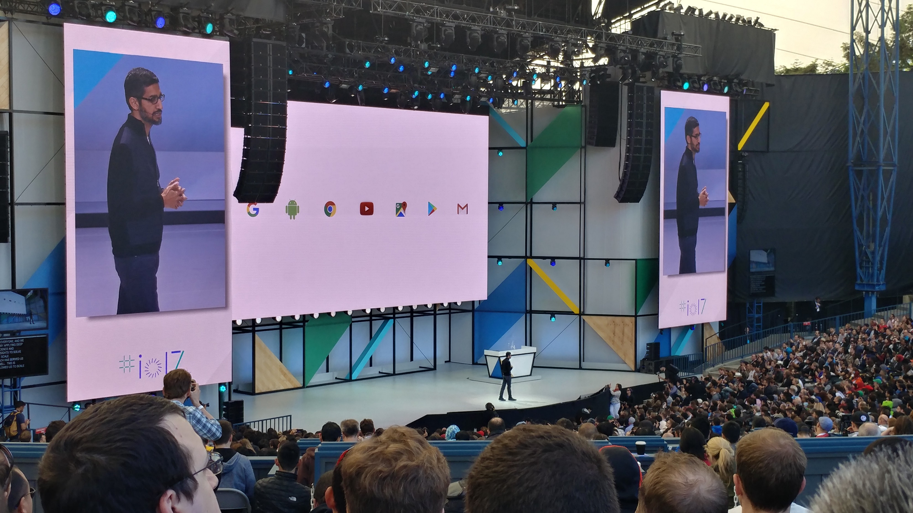
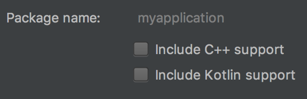

# On Kotlin: A Reply From Management
## Kotlin has Become a First-Class Language At Google I/O 2017

As I was flying back from [Google I/O](https://events.google.com/io/) 2017, I prepared a list of items to present to the team. The items included "[feature - componentization,](https://developer.android.com/topic/instant-apps/index.html)" updated toolsets, [life-like animation](https://developer.android.com/preview/features/spring-animation.html), "content first" Android TV, and new build telemetry [measurement points](https://www.youtube.com/watch?v=Qfo5fdoXrTU). However, there was that - one - item I wrote down. It had two question marks.

> Kotlin? Should we adopt?

I've attended Google I/O's since 2012. I've sat through, in person, approximately one hundred plus sessions. While past years are fading in my memory, I/O 2017 progressed into something different. It was memorable in a way that had real substance. Yes, Google is moving from [mobile to AI-first](https://www.recode.net/2017/5/19/15666704/google-lens-key-example-ai-first-computer-vision) with implications of a tectonic shift for Android development.

---

When the unexpected [announcement](https://blog.jetbrains.com/kotlin/2017/05/kotlin-on-android-now-official/) of official support for the [Kotlin programming language](http://kotlinlang.org/) was revealed at the keynote, engineers appeared elated. They clapped and cheered. This included many of our engineers. I smiled and took in the experience.

> As managers, we must be curious. Continue to ask questions until there is understanding.

A few new sessions appeared out from the I/O scheduling veil. They focused on the Kotlin language. As a technical engineering manager, I decided to attend these newly sprouted sessions because I was curious about the endorphin rush.

Watching our engineers in the chat channels and the smiling faces, Kotlin appeared to be a big deal.

At the start of Google I/O, I knew about the existence of Kotlin, but my technical understanding was sparse. Speaking to engineers in prior meetings, my mental model of Kotlin was of a young language with potential. It was expressive. It recently made asynchronous programming easy, iterated upon by the maintainers [Jetbrains](https://www.jetbrains.com/). Oh yes, it also liberated code from the boilerplate.

> Management should be aware of code quality. What is yours like?

Indeed, fewer code lines, the better for maintenance and quality.

With the Kotlin announcement being so dramatic, I thought the wave would calm during the conference duration. It wasn't to be.

---

At I/O, the sessions were tweaked. Lectures included guest speakers from contributors outside of Google. This was new to everyone who attended previous years. [Principal Google engineers](https://dev.to/solidi/what-is-a-principal-engineer-anyway-55n0) introduced the guests on the stage, and [like magic](https://www.youtube.com/watch?v=X1RVYt2QKQE), they swapped speakers, taking the audience to someplace different.

Sessions were related to Kotlin. One of those sessions was "*Life is Great, and Everything Will Be Ok, Kotlin is Here.*" This was one of those hosted sessions. Two staff engineers would run it from Square and Pinterest, [Jake Wharton](https://twitter.com/JakeWharton) and [Christina Lee](https://twitter.com/RunChristinaRun).

I let the engineers know on the chat channels that this one was important and, if possible, to reserve a seat. My gut said it was going to be great.

---

Listening carefully to our developers, there is an unspoken love for Jake and Christina. After many one-on-ones, team meetings, and discussing their work with the engineers, I've watched videos to understand that love and admiration. These are community leaders.

They, too, are now the faces of Kotlin.

> As managers, actively listening is key. Acting on that listening leads to engineering happiness.

Please watch the session in its entirety. It's worth the time.

The session was split into two halves. Jake started. He explained how to convert Java code to Kotlin, building an example where I became lost in the details.

I was so lost to a point in which ten minutes of squinting, trying to look over others' heads, my eyes watered to focus. I had inadvertently rubbed them to regain focus but with fingers that had sunscreen on them.

My eyes began to sting, and my vision became blurry. I was fidgeting all over the place as Jake continued to smash through examples.

The Java code disappeared just like that. If only I could see it.

A few of our engineers were in the session, one right next to me. As the engineer was smiling and nodding to Jake's examples, I was having an anxiety attack. The thought of becoming permanently blinded by I/O branded sunscreen.

It could have been the overload of Kotlin.

But I stayed because I wanted to hear Christina and her portion of the presentation.

---

The session had a rockstar aura to it. People were waiting in line to the last minute. This was Jake and Christina, so I was determined to stay even if I could not see.

So, with Jake completing his half and my anxiety wearing off, I wondered what Christina would present. Perhaps more examples? A live demo of the conversion of an Android app to Kotlin?

No. Christina dived into a topic so fundamentally different and profound.

> As managers, we should always be interested in optionality. Ask for the options from engineers.

Christina's message was one that hit very hard on how to evangelize. You, management, and the team. Three points. In a sense, how to better the development life of the engineer in every organization.

The topic discussed the developer's experience. With an engineer on our team sitting to the right of me, there was a sense of unease as we sat together in the tent. I was the manager.

I kept looking center-left.

I wondered if there were other managers or stakeholders present? Was I the only one? Will they, the engineers, identify and beat the crap out of me? Dragging me out of the tent?

I had sunscreen to blind them, a brilliant thought at the time.

But Christina's topic was unexpected. After debating with engineers I had come to appreciate the stance in the way that Kotlin was presented.

It took courage.

> Management focuses on business value and user experience. Explain the what and why. Let engineers focus on the how.

When the session closed, I became compelled to say something as an [engineering manager](https://dev.to/solidi/what-is-an-engineering-manager-anyway-4and). I was ready to march up to the microphone and ask.

> How does the developer community push Google to make Android Studio's new project setup to default as Kotlin?

Let's remember Google is  fixing [the wrongs](http://tools.android.com/tech-docs/jackandjill) that they have caused with Android, and now Java 8 is here. Java is the default, and Google is standing behind the language.

Christina ended at the forty-minute mark, and there was no time for Q&A.

I repeated that question to the engineer sitting next to me. He looked at me, ashamed that I was, in fact, his manager. He had no answer for me. We walked out, management beating avoided.

> Management should encourage plans from engineers. Then select one. Be brave and accountable for that plan and a focal point of its execution.

---

My compulsion of asking the unanswered question and Christina's focus had driven share my experience. Outside of business dealing and internal communication, I rarely do write.

I have never seen anything quite like it in the years of developing software - somewhere in the middle managing engineering teams. I can't remember a meeting, one-on-one, stakeholder meeting that had the same gravity. I've experienced a lot of things over the years in business. I've employed the usual management tactics of suppressing and letting it "[soak](https://www.amazon.com/gp/aw/d/1484221575)." Other times I'd just let it go.

I'm still learning.

But this was just an odd feeling as if I wronged every team that I've led. Did I wrong the team that asked about Kotlin?

---

The question - to default include Kotlin support - should be asked. I believe it is a question to be answered. *It could be the definitive answer for Kotlin adoption.*

Remember, Google chose Java because developers know the language. Just think of all those Java examples that Google would need to update.

Now that Christina had equipped engineers with fundamentals, and Google had green-lit Kotlin, how does the application of those fundamentals translate?

> More adoption?

If the answer is yes, the implication has more questions than answers. The fundamental problem is always the following. What is the problem you are trying to solve? Is it the right problem? Why? Yeah, boilerplate is a problem, but what else?

From what I heard, the main driver of Kotlin is developer happiness. Google even drops words like *enjoyable* and *fun* in their decision to make it official. Hell, even the method keywords in Kotlin are `fun`.

> Management must balance happiness. Engineers do in fact build things well when they are happy.

Kotlin makes developers happy. This is not a lie. Truly every engineer I spoke to who had experience with Kotlin is happy. My latest conversation about this happiness was with an Android engineer working on medical devices. He was happy, and he wasn't looking back at Java.

Can management become happy too?

---

During the presentation, Christina discussed why Kotlin is a clear choice. One slide discussed the [billion-dollar mistake](https://en.wikipedia.org/wiki/Tony_Hoare) of Java. Kotlin solves the problem by making nullability explicitly declared.

But then again, the interoperability of Kotlin is one hundred percent with Java. So is this barrier safe until Java goes away? Does [NPE](https://docs.oracle.com/javase/7/docs/api/java/lang/NullPointerException.html) become a decaying problem? From one [trillion](https://twitter.com/JakeWharton/status/863083342215950336) to one billion to a million-dollar mistake?

> Management should encourage consistency. Make sure to communicate and promote that consistency.

As a technical engineering manager, the powerful concept ranges of *explicit-implicit* and *consistent-inconsistent* steers codebases in either a lifetime of development or a one that is abandoned. [Philosophical choices](https://levelup.gitconnected.com/in-software-philosophy-is-delegation-c786dd3a16cf) on these spectrums do matter.

Kotlin is here. I hope not another rewrite.

In the case of NPE's, Java makes the null implicitly included. Big problem. I've seen many teams make the null usage vague; therefore, defensive programming and NPE's are common because they do not address the extreme implicit-inconsistent delta. Some methods return nulls, and others do not. Some parameters take nulls, and others are annotated; others are not. Some go as far as a null object pattern, some not. Some mixing of [optionals](https://twitter.com/JakeWharton/status/863791182094241792) in there, and well... you get the point.

Too many code reviews discuss null inconsistency, but solutions are deferred.

Christina brought up the opposite problem. She described the concept of typed nullability and how the community uses `null`. Could this be another pitfall as an inconsistent pattern may emerge to actually using null? Remember, Kotlin gives us nullability because it's tied to interoperability until Java goes away.

> Management should promote the formation of style. Own the style and improve it.

Nullability concerns will not be the case for [idiomatic Kotlin](https://www.reddit.com/r/androiddev/comments/6chi91/demand_for_a_kotlin_community_style_guide/), but what is idiomatic Kotlin anyway? If the above is an indicator, Kotlin may be so expressive that it will introduce even more inconsistency among the community and in teams.

Hey, but this one last library we can't get rid of is still in... Java.

When the constraints of a previous language are lifted and the exhaustion of boilerplate removed, are there any unexpected outcomes due to expressiveness?

---

Christina recommends using tooling on hard problems. I agree with this. Tools must do their job well. Otherwise, they are complained about until they are fixed. Google is proving this well with Gradle.

And lately, Java.

I actively encourage the engineers to focus on the interesting and fun stuff and let the other tooling do the job. It's not all about operations, features, and execution, but business requires it.

It's also about experimentation and innovation. With time in management, I have proven to myself that execution is valiant, but that engineering creativity is king, driving esults through the fog of development.

> Just like engineers, management should be [lazy and impatient](http://wiki.c2.com/?LazinessImpatienceHubris). But in the way they think.

However, since the Kotlin tooling, IDE, and language are well integrated, could we be heading in a direction where we are developing a [voodoo](https://en.wikipedia.org/wiki/Voodoo_programming) culture? If a generation of engineers grow on Kotlin, are we doing a disservice about how they grow? In which they are educated about the engineering rigors?

In my brief review of the Kotlin language, there is blazing fast support that promotes code completion. In a way that is fundamentally different from writing the standard stores and loops. The compiler does, in-fact, hide and flex the mundane.

There are magical wires that are optimized.

The argument is that engineers should only optimize the "hard" parts. The "efficiency-must" parts. This is a solid argument. But with the many coding exercises I've been in… Google included the ask, "What is the time/complexity of this code? Can you do better?". In Kotlin code, what is the answer? "*shrugs*, depends. I don't know." That could be an acceptable answer.

Is it acceptable? "Okay, let's switch back to Java [style] for a second to answer..."

This is a tough one. Maybe I cannot see it. Maybe I've read [*Programming Pearls*](https://www.amazon.com/Programming-Pearls-2nd-Jon-Bentley/dp/0201657880) and [*Code Complete*](http://www.stevemcconnell.com/cc.htm) too many times. I have been brainwashed that engineers who fail at these questions are worthy of management.

Sh*t.

---

Christina said engineers can develop apps that are stable for their users. Using Kotlin and its tooling will help avoid crashes "a lot," and the users will be happier.

In a sense, this one is a tough sell to management. Regardless of the tooling or language, it takes a village to launch stable products. It takes a consistent style, and it takes a pipeline, and that engineers own the quality.

Did I mention that engineers should own the quality?

> Management should encourage a set of core engineering values, and invest time in that on-boarding.

It's tough to do quality well. To launch products consistently. To launch them quickly.

Now try it with standing up a testing culture on top, and it's close to impossible, but still plausible.

Adding new languages and tooling to the mix is up there, but maybe not as hard as a testing culture.

Do you have a testing culture?

I agree that Kotlin may help catch things sooner, but in a sense, what is the cost of that "catch sooner," and how much sooner?

Whether it's Java or Kotlin, your code reviews, pair programming, linting, unit tests, integration tests, and end-to-end tests should check items as far upstream as possible.

Kotlin may decrease risk, but again at what cost?

---

Christina's presentation is one that challenges everyone to the maximum. I believe Kotlin deserves attention and everyone should share it broadly.

I, too, like to challenge engineers to the maximum with what we have. But in a meaningful way that is doable. This is why this session resonated.

With all this being said, I want to revisit the original question.

> Kotlin? Should we adopt?

It is clear what we should do... as managers. If brave enough, work on the [koans](https://kotlinlang.org/docs/tutorials/koans.html) to understand the developer's experience. Listen to the engineers on the benefits of Kotlin.

Listen to their wants and ask for plans.

One last thing is that we need to challenge our advocates. Adoption is not all on the community or the engineers or the teams — advocates share the burden.

> Managers have partners internal and external. Push hard on them and the Google developer advocates.

Remember, the team are the doers.

To me, official Kotlin language support is now owned by Google. We must pressure them, and the developer advocates on answers as to what we should do.

Hiring managers are constrained with parameters that are difficult to avoid. Couple that with the demand for talented engineers, and it's a tough problem to solve.

It's also an unexpected problem. It's a dual-track high-level language competition.

Rare. Google never disappoints.

> Advancing Kotlin adoption is a brilliant example of a live A/B test on the community.

Was that too cruel to state?

It's the truth. Both languages have their strengths, and there will be no clear victor for years to come.

---

Google will set a course for Kotlin, and invest heavily in winning Java legal [battles](https://www.theverge.com/2016/5/26/11754002/oracle-google-verdict-copyright-infringement-ruling-api-fair-use) battles, the only sure bet is that a course is unclear.

A Kotlin selection for production apps is the same as using [!!](https://kotlinlang.org/docs/reference/null-safety.html). It is a risk. Perhaps calculated, if knowing the costs. However, we should encourage engineers to debate and set the tone of the future... of Android development.

> Management usually holds the stick in the middle. Instead, encourage management to support and raise both ends.

Of course, we will use Kotlin eventually. Who doesn't want to be happy?

---

## Social Post

A #management reaction to #kotlin as a primary language in #android.

Thanks to Hazem Saleh

[medium](https://medium.com/@solidi/on-kotlin-a-reply-from-management-8f9220544c1d)
[linkedin](https://www.linkedin.com/pulse/kotlin-reply-from-management-douglas-w-arcuri/)

#softwaredevelopment #code #softwareengineering #software #google
