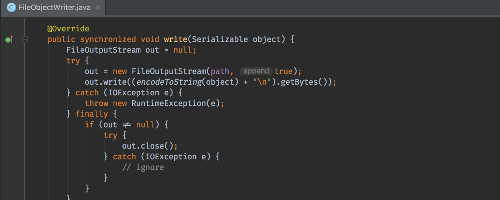

# Some insights into IntelliJ's Serial Code Transformations
## Questioning Editor Enhancements and Their Consequences

## Introduction

As I was chatting on [Workplace](https://www.facebook.com/workplace) with our SVP of Engineering about his new [post](http://www.pavley.com/2017/05/27/javascript-swift-and-kotlin-oh-my/) on [Kotlin](http://kotlinlang.org/), our conversation shifted from his trials as a young engineer to how terrifyingly awesome the recently integrated development environment (IDE) experience has become. With thirty plus years under his belt, he had seen many IDE environments from visual to textual and back again.

The IDE has been and still is the extension of the developer's hands. The IDE and its tooling are what make developers productive. From the individual to the collective, IDEs can cradle and support extensive team efforts. One of the many great examples is what transpired over at [Uber](https://eng.uber.com/android-monorepo/). The IDE played a crucial role in that success.

While there are many environments to choose from, my focus will revolve around JetBrains' [IntelliJ](https://www.jetbrains.com/idea/). I decided IntelliJ because there is an exciting improvement trend unfolding that I'd like to explore in its user interface. We will discuss three additions added to IntelliJ 2016.2, 2016.3, and 2018.1. There could be more to come in the version series.

We will review these user interface improvements with the perceived pros of readability, proper labeling, and discoverability. We will also review the cons of visual noise, code quality consequences, and non-deterministic code.

I'll label these additions as *serial code transformations* (SECTAs). Before we focus on the transformations, let's explore IntelliJ's historical origin and its tooling strengths.

### A Brief History Of IntelliJ

IntelliJ's strength has been supporting Java. Since IntelliJ's inception in the new Millenium and the rise of Java, IntelliJ had entered to compete in the IDE space against [NetBeans](https://netbeans.org/) and J[JBuilder](https://en.wikipedia.org/wiki/JBuilder).

The story of JBuilder is [long](https://news.ycombinator.com/item?id=9712267). However, in the end, it has been swallowed by [Eclipse](https://eclipse.org/). As Eclipse took over JBuilder, NetBeans began jockeying as the preferred IDE for Java.

Over the years, significant domains controlled by Java rose. These domains brought about power popularity struggles. One such major case was when JetBrains paired with Google, and then Android development transitioned from [Eclipse to IntelliJ](https://developer.android.com/studio/tools/sdk/eclipse-adt.html). There are many reasons why this happened. Gradle support was absent.

With IntelliJ's rise, NetBeans' popularity waned with the transition from Sun to Oracle. With problems such as NetBeans' [parent](http://www.zdnet.com/article/oracle-abandons-netbeans-to-apache/) abandoning it, the future of NetBeans now lies in Apache's hands.

NetBeans still holds a slice of Java server-side development. IntelliJ is now the popular go-to for most Java, Scala, Groovy, and Kotlin ideation. A new chunk of engagement had been from Android and Java server-side development in its ultimate edition. JetBrains has also started down the route of supporting [iOS development](https://www.jetbrains.com/objc/).

With IntelliJ pulling ahead above all IDEs in the space, JetBrains continues to improve. IntelliJ's implementation of innovative code completion, build system plugin integrations, code and flow control analysis, and other major integration points like version control and testing make it difficult to find a developer who hasn't used it. Most of them praise the software.

### IntelliJ's North Star

Historically, IntelliJ has had a very public north star. IntelliJ's authors want engineers to "[develop with pleasure](https://intellij-support.jetbrains.com/hc/en-us/community/posts/206875505-Develop-with-Pleasure)." This pleasure had a lot to do with their development of refactoring tooling since its inception. Without question, the tooling has been improved (mercifully) in the past ten years.

Their terrifyingly advanced hotkeys are also proper to that pleasure. Hotkeys are highly welcomed addition to the incremental intelligent code completion, now dubbed "deep intelligence."

One of my earlier experiences with IntelliJ's pleasure was in the refactoring tooling. I witnessed those like [Robert Martin](https://sites.google.com/site/unclebobconsultingllc/) (Uncle Bob), and his blazingly fast refactors in such videos as the [bowling game kata](http://butunclebob.com/ArticleS.UncleBob.TheBowlingGameKata). The IDE was practically doing all the work. Extracting, rearranging, and abstracting, all with keyed shortcuts. Developers that memorize these shortcuts refactor with pleasure.

As with all tools in the IDE, the refactoring tooling changes code that we commit for the better with engineering principles in mind. Couple that with excellent lint tooling, code analysis, and now flow control gives you the power to modify code intelligently and quickly.

In the past few iterations of IntelliJ, JetBrains had introduced new under-the-radar improvements to increase pleasure further. JetBrains has labeled them under their "User Interface" improvements section, but I'll mark these as *serial code transformations*.

What are SECTAs? Let's review some examples next.

### Our First SECTA

One of the more recent code reviews on our team was using booleans as parameters in methods.

Of course, we know that adding a boolean parameter to a method could be considered a [code smell](https://en.wikipedia.org/wiki/Code_smell). It signals that this method may have two distinct options, and thus violates the [SRP](https://en.wikipedia.org/wiki/Single_responsibility_principle) rule.

It can be challenging to understand the usage of a primitive boolean type. As the boolean pass-through method calls, the developer has to dig to see the signature and the parameter name to understand the usage at a distance. In many cases, this breaks mental concentration.

The decision to disallow a boolean parameter could be dogmatic if the codebase already has other methods using a similar pattern. Also, it depends on usage. A technique that uses a boolean without splitting the absolute two paths way could be acceptable.

Let's say we agreed to add the boolean. How do we fix the developer visibility through the method calls? The answer is that we do not. IntelliJ solves this problem with a SECTA.

Our first SECTA is called a [parameter hint](https://blog.jetbrains.com/idea/2016/09/intellij-idea-2016-3-eap-faster-git-log-parameter-hints-and-more/). IntelliJ adds visibly labeled metadata that doesn't exist in code. However, it appears to be an inline code.

As a visual example, notice the gray non-monospaced label "append" next to `true` below. The below screenshot is a parameter hint.

IntelliJ now ships with parameter hints turned on by default, so developers can become familiar with the style. They are continuing to improve it with the expansion of recommendations to other parts of the code and filtering of hints where restraint is required.

### Our Second SECTA

Some time ago, Uncle Bob took on the quest to define [a final programming language](https://cleancoders.com/episode/clean-code-episode-0/show). In his exploration, he discovered many thought-provoking ideas and concepts. When he described what the ideal language's attributes should be, he questioned if there could be a better way to declare inequality than `!=`.

An example was introduced at the Intro To Kotlin session during Google I/O 2017. Enter [code ligatures](https://blog.jetbrains.com/idea/2016/09/intellij-idea-2016-3-eap-sf-fira-code-and-debugger-improvements/), also known as font ligatures.

[Hadi Hariri](https://twitter.com/hhariri), the host of the I/O session, had introduced code ligatures at previous Kotlin demos. He had now done so at a major developer conference.

Code ligatures have been around for [a few years](https://medium.com/larsenwork-andreas-larsen/ligatures-coding-fonts-5375ab47ef8e), with many IDEs supporting them in some way. Many require the use of plugins. However, none have adopted the ligature to the point of mass popularity, and few have direct support for them. This trend is changing, and it's coming to an IDE near you.

Code ligatures are different and radical - this new tool transforms code while the developer types the code.

At the moment, code ligatures are off by default in IntelliJ. However, I believe that IntelliJ is about to change this at scale to become more popular. Hadi is on a mission to do this.

Code ligatures are shocking to those who have developed for some time. See the example below.

As an example, the code ligature changes `!=` into `≠`. There are many other replacement examples. The goal of code ligature is readability. To see more examples, see FiraCode. IntelliJ has implemented [FiraCode](https://github.com/tonsky/FiraCode) as the preferred font ligature.

When Hadi demoed the code ligature above, I was in the audience. I looked over at one of the engineers, and I mouthed, "WHAT?" There was an audible shock wave throughout the session when it first appeared on the screen.

Hadi did not use a Unicode trick or a shortcut to a new symbol. IntelliJ performed the glyph exchange automatically.

### Our Third SECTA

Annotations are statements that serve metadata to improve or describe the behavior of co-located code. They were introduced widely in programming languages within the last twenty years. The most famous is the Java annotation and the C# attribute.

Since the annotation's inception, JetBrains realized its benefits and applied them to IntelliJ. They also introduced exciting ideas. For example, they realized problems using `null` when interacting with class libraries. Since these libraries are uneditable, they proposed improving such libraries by implementing ideas like [the external annotation system](https://intellij-support.jetbrains.com/hc/en-us/community/posts/206229799-Proposal-External-Nullable-NotNull-annotations-for-third-party-classes).

While there is a continuing debate about the effectiveness of the annotation in these languages, it has been extensively iterated upon by JetBrains.

For example, annotations help call out and reduce the amount of Java NullPointer exceptions in code. IntelliJ also introduced a static analysis tool that infers nullity. This tool scans code in an ad hoc matter. Then it annotates areas of the code where `null` concerns were present. These annotations became a part of a project's source control.

However, IntelliJ improved this concept by taking the next step with an automatic inline inference of nullity. Instead of running the tool and committing the annotations in code, it is now dynamic and happening in real-time.

As seen above, the `@NotNull` the annotation does not exist in code. It appears with an IDE option turned on. As a developer types code, these annotations appear. Nullity checking is now constantly vigilant about changing code.

These are beautiful automatic orchestrations of code analysis. The appearance of the annotation is fascinating.

While the automatic appearance of the annotation could be helpful and perhaps may reduce issues with our code, it is not apart of the source code.

Like magic, if the option is unchecked, all of the generated annotations go away as well.

Now that we have a good understanding of these transformations let's analyze the pros and cons.

### The Pros Of SECTAs

The pros of SECTAs are straightforward and clear.

#### Method parameter and operator readability
The developer can lean on the IDE to see the intent of the parameters and operator statements. This feature is also enabled for boolean parameters, since they are not, as values, self-describing.

#### Improves stability of the software
Since inferred annotations like `@NotNull` and `@Nullable` are being analyzed and continuously added, the software may become stable over time by avoiding poor choices of `null` parameter usage.

#### Method discoverability
Parameter hints can help with method discovery. The recommendations provide natural discovery on how to use the method.

#### Potential for something wonderful
What is so remarkable about SECTAs is that there is a possibility to build upon them visually. Serially transforming the code along with the developer's work helps with readability. I will discuss more of its tremendous potential in the final section.

### The Cons Of SECTAs

SECTAs can have very impactful cons. Let's discuss them.

#### Visual noise and clutter
Having parameter hints throughout the code makes concentration difficult for authors who already have a mental model of the areas of code that they are currently working in. It may visually clutter the workspace and make development less pleasurable.

For those developers trained to read the usual character combinations for equality, assignment, indirection, and other operators, the use of the code ligatures could be initially awkward. Some will continue to prefer the traditional usage.

#### Code quality consequences
One could argue that the use of parameter hints is a route to [bike-shedding](https://en.wiktionary.org/wiki/bikeshedding). But we no longer debate about the architecture or the use of a boolean as we once did. The readability of the boolean is no longer a concern. The IDE handles the transformation. It makes a possibly poor design decision expressive and precise.

#### Non-deterministic code concerns
By their nature, SECTAs are virtual and depend on the IDE software version. SECTAs are difficult for version control, as it can not capture the IDE environment context effectively. The code that was once the truth in the environment may not read the same with an IDE upgrade. When the IDE is upgraded or changed, there could be consequences to shifting or missing implementation of the transformations.

For code ligatures, IDEs are beginning to transform operational symbols. These symbols also do not exist in code. They are glyph transformations to make code expressive based on a font. Even if the font is changing the character, it's changing the truth of the code.

A recent mistake on non-deterministic tooling was discovered with Gradle's variant versions. It has been suggested by the community [not to use variant versions](http://blog.danlew.net/2015/09/09/dont-use-dynamic-versions-for-your-dependencies/).

## The Future

When we see and use SECTAs, we should question and explore them. Watch closely for new transformations. I'm sure more will appear over the next versions of IntelliJ.

It's worth mentioning that these SECTAs are, in fact, serial. I named them such because the textual code is by nature, serially imperative. We expect to read from top to bottom and expect something to happen as we read.

With the cons in mind, are serial code transformations a slippery slope to something more insidious?

I'm not sure. In many ways, we are moving into the world of "mixed reality" in our code editors. Metadata is laid over text to help us navigate and read transformative and expressive code that may not have been on its own or because of a language limitation.

What's more, it's not breakpoints, breadcrumbing, or [code folding](https://medium.com/@andrey_cheptsov/making-java-code-easier-to-read-without-changing-it-adeebd5c36de) that we should question. We should examine direct assistance on the visual readability and understandability of what we write in real-time.

We may be okay with serial code transformations if IDEs standardize.

If the IDE authors continually add transformations, do the nuances between languages begin to disappear? It's way too early to say, but it would be highly exciting and fun if the tooling could make language dialect boundaries blend. Layering SECTAs could prove very powerful.

However, to balance the excitement, these code transformations may not allow us to identify the code we have committed. Maybe there could be a way to make the transformations deterministic. An answer to this question could be a significant discovery in our field.

Should we allow these tools to add to or transform what is actually in the code? Maybe. In many ways, tools do this visually (and in fact, some languages are visual). But it's something profound to layer visually over serially textual code that we all love to write.

More fundamentally, if the IDE continues to iterate on these SECTAs, does our language selection matter less? This premise is an exciting and thought-provoking question, and I'm curious to see where it shakes out over the next few years. Hopefully, IntelliJ can take that step to help [every single developer](https://dev.to/solidi/what-is-a-software-engineer-anyway-3fb2) to express their creative desire to make code work well.

---

## Social Post

How the integrated development environment (IDE) is shaping the work of engineers.
Alt title: Is mixed reality in our code editors safe? (2017)

- Serial code transformation is powerful and dangerous
- Parameter hints add sugar to the editing experience
- Code ligatures are adding signaling not captured in code
- Automatic inference of null may have consequence
- Look out for more SECTAs in the future to assist engineers

Thanks to Hazem Saleh and Danny Preussler. 

https://medium.com/free-code-camp/intellijs-serial-code-transformations-775fe7aa517c

#softwaredevelopment #code #softwareengineering #learning #ide #productivity
