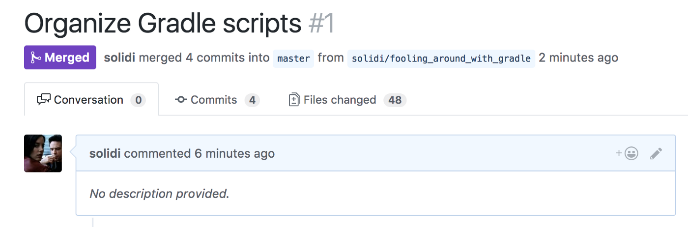
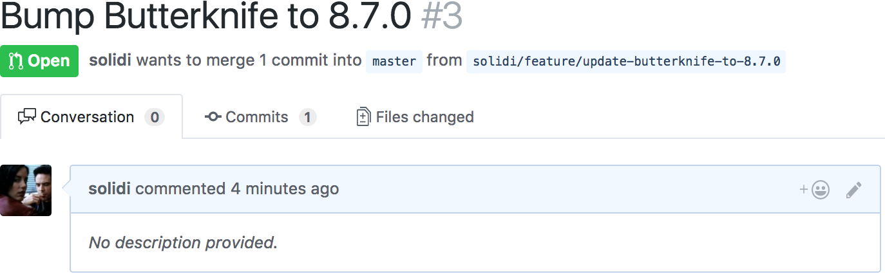
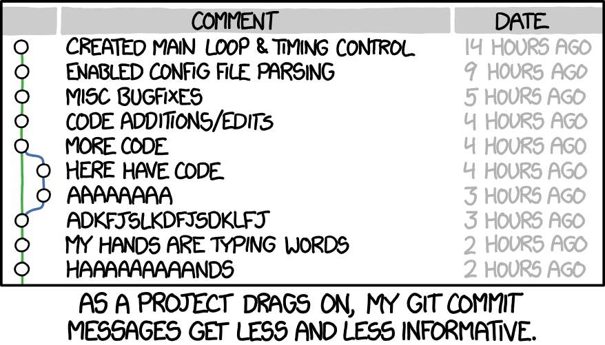
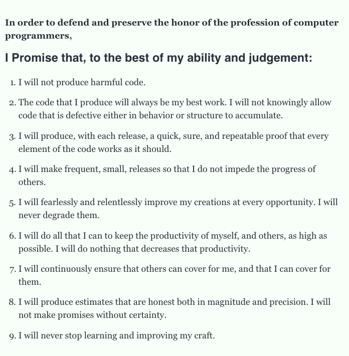

# No Description Provided
## Explaining Context by Identifying a Code Review Template

Some months ago, one of my colleagues suggested a book. Out of curiosity, I read [Sapiens: A Brief History Of Human Kind](https://www.amazon.com/Sapiens-Humankind-Yuval-Noah-Harari/dp/0062316095).

It was a fascinating read with many points to consider. With themes interweaving throughout the chapters, one article continued to bubble up that was thought provocative but easy to understand.

[Yuval](http://www.ynharari.com/) described that for humans in large groups to cooperate; they must create orderly patterns that are understood and valued. As illustrated, a *mythical glue*.

I questioned, is there [such a glue](https://medium.com/hackernoon/software-is-unlike-construction-c0284ee4b723) that applies to our engineering profession? Do we, as engineering professionals, have a mythical bond we value?

## Everything In A Pull Request

Without question, the [pull request](https://help.github.com/articles/about-pull-requests/), or code review, has become the lifeline of every development team who interact and contribute. Pull requests are where the team culture resides in some way. In a sense, this is how the team communicates and makes decisions.

As Yuval described free-market systems, money, and other valued constructs, we as engineering professionals believe in pull requests. We all understand what code review is and what values it provides.

Or do we?

With travels to many other code reviews, something is not quite right. There are no descriptions that cleanly point out the *intent* of the change. For those that describe the difference, they appear messy and inconsistent.

The value, the glue, is diluted and does not bind well. What's the cost of a pull request when the problem is not described?

The most crucial aspect of software engineering is to describe the intent of the change. We must explain *why*, as professionals.

Since our craft is global, earshot conversations will not do. Tribal team knowledge will not suffice either. The description must be *textual* as a record.

So, what is the solution?

## Call For A Unified Pull Request Template

The community has toiled with pull requests for some time. There have been numerous [posts](https://medium.com/google-developer-experts/a-comprehensive-introduction-to-perform-an-efficient-android-code-review-75975ccaa20a) in the community to do them better.

Some of the best examples provide preferred [templates](https://github.com/blog/2111-issue-and-pull-request-templates) that guide the contributor to answer specific questions. Templates are an excellent way to understand a description of the change.

However, the community has not found an answer to forge descriptive pull requests. Many professional teams often skip descriptions missing out on great opportunities to strengthen their glue.

## An Example

At a familiar cadence, engineering teams have to update external dependencies. The mode in-which these updates occur is shrouded in mystery.

 Google "*Butterknife*." This library is a view dependency injection SDK for Android. However, why the bump? What are we trying to solve?

.](images/03-04.png) 

Okay, now we understand. The team understands the *opportunities* to improve.

The description identifies the problem, the solution, and why. The template highlights testing, code coverage, measurement changes, and other [unique ways](https://medium.com/square-corner-blog/surfacing-hidden-change-to-pull-requests-6a371266e479) to automate and communicate concrete change.

The definition of a unified template must start with a *problem* and *solution*. It would behoove a team to realize how to communicate change through a template and [kindly decline](https://www.jeffgeerling.com/blog/2016/why-i-close-prs-oss-project-maintainer-notes) those pull requests that do not present them.

The template gives gravity to a slam-dunk atomic merge commit message in a continuous integration and delivery system as a bonus.

## Commits May Be Overkill

Commits lack value if subject titles and descriptions are unclear.

Indeed, there have been numerous posts written about these problems over the years. The most straightforward solution to non-descriptive commits is to follow the [50/72](https://stackoverflow.com/questions/2290016/git-commit-messages-50-72-formatting) rule. This rule encourages subject and body messaging delivered in a specific way.

However, most engineers do not follow 50/72. Some engineers think it's okay to place periods at the end of subject titles. Their commits contain ticket numbers, and for some seasoned engineers, these commits lie outright without malicious intent. Commit messages are almost too hard to get right. Writing the code was easier.

There is a philosophical argument that questions the value of the commit, even if written cleanly. Should we care for the steps, or should we care only for the pull request merge, as long as it is well-shaped and not overbearing for anyone to understand?

One would argue that in most professional engineering teams, the pull request's merge commit is the essential description, not the small iterations that came to form it. The reasoning is simple. We are not machines that can accurately remember more than seven commits at any one time, [plus or minus two](https://en.wikipedia.org/wiki/The_Magical_Number_Seven,_Plus_or_Minus_Two). There are those teams that also squash and rebase, so the commits were trivial.

There is no right answer to this difficulty. The only real constant is the pull request template, the opportunity described and recorded in a version control system.

## A Value Is A Description

Pull requests take time just as much as writing clean code that follows consistent patterns. The code is covered with tests. We value the pull requests because they serve cross-pollination in engineering teams and protect user experiences valued to business, agency, etc.

Engineers are required to solve difficult problems. The first step is to write what the problem is, why, and how we went about solving it. Sometimes in stages throughout chained pull requests.

> There are two hard things in computer science: cache invalidation, naming things, and off-by-one errors.
> - [Unknown](https://twitter.com/codinghorror/status/506010907021828096?lang=en)

*Naming* things is hard. However, *describing* things is harder and rife with errors. As professionals, we must define the intent of change with *context* to the best of our ability.

> The most correct code is that which is not written but the most correct description is one that is.

If we do not make our best attempt to describe the change, the context is lost. This lack of practice does a disservice to future contributors and business partners, agencies, and others.

So how do we embody and capture the value of context description, so other engineering professionals understand?

## Extending Uncle Bob's Programmer's Oath

Conversations are happening in our community about our engineering profession as an organized body. We should look no further than [Uncle Bob](https://sites.google.com/site/unclebobconsultingllc/) sending these smoke signals.

For some time now, he has urged for us as engineers, or *programmers*, to embody a set of concrete principles; otherwise, government agencies will do it for us.

Uncle Bob's argument consists of comparisons to other professional groups. One such example describes just how patients died from lack of sterilization in the medical profession; a swath of people will be at risk as software eats the world. Unknown to medical professionals is as unknown to the engineering professionals until it's too late.

To correct these problems, the medical professionals organized and formed guidelines adhered to like sterilization techniques. These medical professionals were able to hand the agencies their mottos, and hence they made their own rules. So too is what Uncle Bob is asking from us.

He will be proven correct, and it will happen in our lifetime. However, the question is, are we ready to take this on as an organized group of professionals? To answer this dilemma, Uncle Bob created the [Programmer's Oath](http://blog.cleancoder.com/uncle-bob/2015/11/18/TheProgrammersOath.html).

There are solid points above in the oath. Uncle Bob has created a strong glue for us. However, he missed a fundamental rule, and I wish to offer an extension.

> 10. I will communicate to the best of my ability the intent of change with as much context as possible.

The point with rule number ten is to enforce all other rules in the oath. We are writers that communicate to the best of our written abilities.

---

The mystical glue that binds us as [software engineers](https://dev.to/solidi/what-is-a-software-engineer-anyway-3fb2) is many. One such bond is that we value the pull request. Let's do our part to describe the context of the *problem* and *solution* in detail so that others can contribute promptly and protect our users. It starts with thinking and explaining "what" the problem is. Then we must describe the solution with the new *opportunities* at hand. Ultimately communicating the intent of change should be adhered to by all engineering professionals.

---

## Social Post

A call for a unified pull-request template.
Alt Title: Explaining the context of change with a pull request template (2017)

- #Teams get information about code change in pull-requests.
- Leaning on a #template to make the why easy to understand.
- The value is in the #description.
- Extending Uncle Bob's oath to #share context widely.

Thanks to Hazem Saleh, Mariusz Skierski, and Dan Leonardis. 

https://medium.com/hackernoon/no-description-provided-8d9e0f3a3abb

#softwaredevelopment #expertimenting #career #learning #career #productivity
