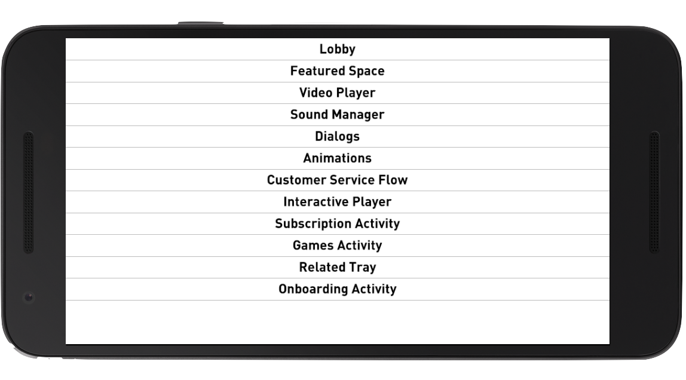

# The Springboard Pattern
## How to build new features in isolation
#programming, #beginners, #tutorial, #productivity

A FEW YEARS AGO at an agile demo, a stakeholder made a special appearance. The team was closing in on a minimum viable product. The demonstration focused on sound effects and animations, revealing a configurable animation board. Each media experience was easy to launch in an isolated configuration. And the animation board did not depend on the extensive system. The intention was to tie-in animations of which the stakeholder agreed with.

While the team demoed, the stakeholder asked if we could evaluate the animation board for experimentation. With this feedback, the group noted the ***unrealized*** value and wrote down what to explore. Of course, this wasn’t the first time the team used the technique. They made similar discoveries in [future demos](https://dev.to/solidi/how-to-crush-your-next-team-demo-2bb5) The team learned that feature containment provided product value in their demos.

---

For software engineers, naming things is hard. Harder still is how to communicate clearly. And in the story above, there isn't a vocabulary to describe their effort. There is no description for the iterative containment orchestration in ***software engineering***.

So I propose a definition to describe the unique execution with its benefits and drawbacks. Developing and demoing in containment is an example of what I call the **springboard pattern**.

## What is the Springboard Pattern?

The springboard pattern is a ***visual design*** pattern. Mobile operating systems that constrain viewing areas have used the pattern widely. The app launcher is an example.

Our introductory animation board fits this model. The animation board is a screen launcher and each animation is a section with its specific configuration.

When applied to software development, the springboard pattern acts as a guardrail. Features are isolated areas that are ***demonstrable*** on the platform. There are many benefits to engineering and product. The spring board pattern is a way to execute features incrementally.

The springboard pattern keeps dependencies in check and develops features in a cycle centered around ***product demonstrations***. Here are the rules an engineer must follow while iterating.

The feature:

1. Launches from a board that includes other features
1. Can spring up with minimum setup
1. Can launch on its own and in any order
1. Defines its own state
1. Resists larger system coupling and dependencies

If we follow these rules of feature development, magic happens. Benefits include the promotion of modularity, testability, and build-time. Additional improvements include [product ideation](https://dev.to/solidi/what-is-a-product-manager-anyway-3pc4) and unrealized engineering efficiency. Let’s discuss these next.

## Promotes Modularity

The springboard pattern enables development of features in isolation from one another. In each design segment, the team must do their best to create a solution in ***containment***.

Dependencies will always be present, but the layers separate the feature for demonstration cleanly. The feature should be modularized and independent. As the iterations continue and demos succeed, the springboard items integrate into the extensive system. As this occurs, the team resists coupling and ensures the feature code cohesion is high. From start to finish, each item should have a weak measure of ***connascence***.

During the cycle, pattern violation can diminish the return of the modularization. Therefore, the team must make ***prudent and deliberate*** decisions by leaning on tools of layering, wrapping, and flow of control using dependency inversion.

## Supports Testability and Build Time

The development of a demonstrable item from the springboard demands testability. The unit tests will serve as documentation of the module.

The concept of the springboard pattern promotes testability. Its dependencies should be highly configurable. Each feature should have available configurations for its ***dependency injections***. Thus the pattern supports ease of testing and mocking of the component.

By using the springboard pattern, build time is reduced, and the complexity of the codebase is normalized with each feature. Incoming features are ***flagged,*** conditionally built by the toolset. Features that are rejected at demos are removed.

Finally, a natural phenomenon of the springboard pattern reveals ***diagnostic test tooling*** of that feature. The springboard develops tools that take on a life of their own, serving to test parts of the system.

## Product Ideation and Engineer Efficiency

Opportunities happen when products are deconstructed into independent pieces. In the case of the introduction example, there appeared to be an unrealized product value in the use of an animation board.

Stakeholders refer to the features of their products as cohesive constructs and use vocabulary to describe them. Wouldn’t it be powerful to find the part without friction immediately? The springboard gives us a ***learning library*** and allows for ***cross-pollination*** between engineers and gives us a tool to locate each feature.

As an additional benefit, the engineer’s work is ***always available*** for demonstration at a moment’s notice. An isolated solution offsets the typical cost of the time to prepare for the demo (you are giving time for the engineers to prep, yes?).

Mileage may vary depending on the domain and the reception from stakeholders. In the most pragmatic terms, products must predict less and experiment more. Having the features deconstructed and isolated may indicate a different outcome or a reconfiguration of that product value.

## Framework Support

The springboard pattern provides benefits that coincide with features of the framework. For this essay, I’ll discuss Android concerning the use of a springboard. Your framework may vary.

In the Android ecosystem, Google has launched [Instant-Play Apps](https://developer.android.com/topic/instant-apps/index.html). To support the concept, Google introduced ***feature modules***. As we can see from above, everything that is demonstrable should be isolated. As development continues, insulate each feature from significant dependencies and optimize them for every feature. The product team will want to launch these features separately or together.

Another example of Android is the concept of isolated ***activities***. Each activity launches in isolation, taking what it needs to provide an experience. If features are built-in isolated activities, reconfiguration of the pieces of an application is possible.

Finally, with the latest versions of Android, its tooling has improved. Independent modules allow for building abilities, which reduce build time. Setups that use a ***flavored*** code organization improve the developer's experience, especially if the product dimensions are extensive.

Before we conclude, there are drawbacks to consider.

## Drawbacks

There are drawbacks to developing a springboard. The team will have to make decisions to steer clear of over-engineering.

The springboard approach may:

1. **Violate YAGNI** — “[You ain’t gonna need it](https://martinfowler.com/bliki/Yagni.html).” The team should build what they need, and not a single line more.
1. **Accelerate decisions** — deferring architectural choices is an excellent strategy to keep complexity manageable. Operating this way will encourage code decisions.
1. **Increase complexity** — additional logic to support layering and modularization may increase development time.

However, keep in mind that the cost paid will certainly provide a cost-benefit for code that is consistent and adaptable. ***Adaptability*** adds to the code complexity.

## Spring into Action

Developing for isolation and modularity is a practice all engineers should strive for. However, there hasn't been a pragmatic approach to these concepts and a way to describe the pattern. Now there is.

The ***springboard pattern*** gives us a language to our intentions in software execution. When adhering to this pattern, we manage ***complexity*** and increase ***optionality***. Be aware of the cost of drawbacks.

The springboard pattern takes effort and drive, but the benefits are incredible to the team cohesion and product impact. Implement the idea today!

---

## Social Post

How to organize new #software #features in #isolation? Use the springboard pattern.
Alt title: How to organize and build features in isolation? (2017)

- develop features on a cycle centered around product demonstrations 
- keep dependencies in check
- guardrail to develop features in isolated pieces that are easily demonstrable on the platform
- manage complexity and increase optionality
- operationally execute both iteratively and incrementally

Thanks to Shawn Carrillo, Alex Hart, and Hazem Saleh, and Konrad Stanik. 

[medium](https://medium.com/hackernoon/the-springboard-pattern-340e00379404)
[linkedin](https://www.linkedin.com/pulse/springboard-pattern-douglas-w-arcuri/)
[dev.to](https://dev.to/solidi/the-springboard-pattern-3o04)
[twitter mention](https://twitter.com/CodeNewbies/status/1686907485846642688)
[twitter mention 2](https://twitter.com/ThePracticalDev/status/1687196893036658689)

#softwaredevelopment #code #softwareengineering #learning #demos #productivity
