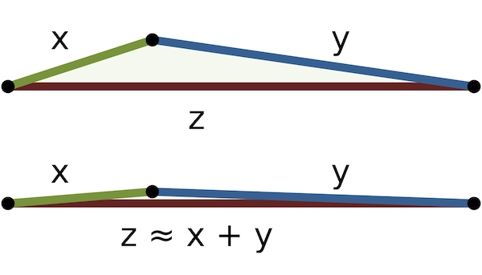
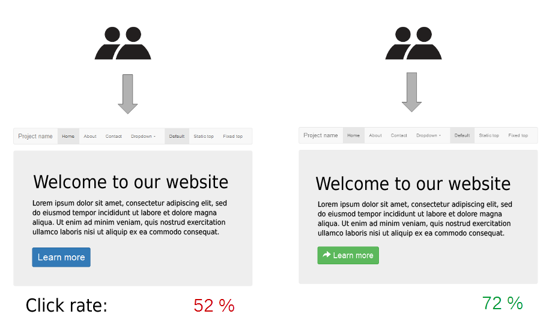
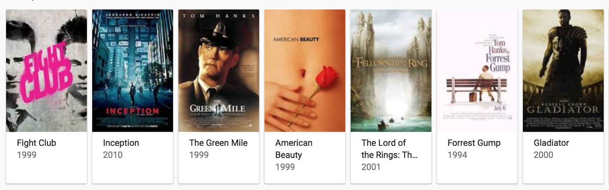
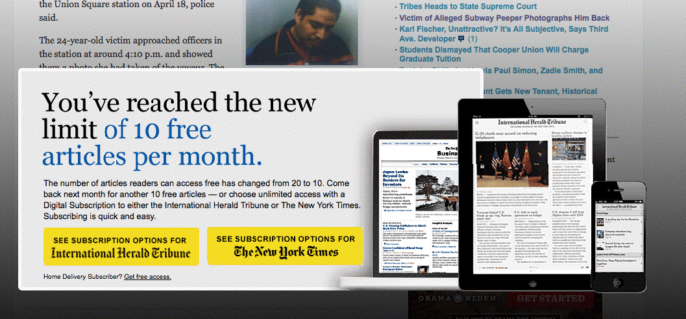
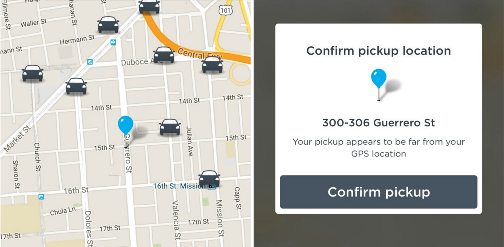

# Deception: Degenerate A/B Testing
## Questionable A/B Tests Using Dark Patterns

Picture a normal triangle in your head. Now picture a triangle without its area. Can you? In mathematics, a **degenerate triangle** is defined as follows:

> A degenerate triangle is formed by three collinear points. It doesn’t look like a triangle, it looks like a line segment.

It’s as if the three angles of the triangle are flattened. In theory, the triangle exists, but all that remains are overlapping linear lines.

While this post is not about mathematics, it will attempt to classify certain A/B testing methodology as *degenerate* using patterns that approach a line of user deception, also known as *dark patterns*. Then, we will review questionable large scale tests in the tech industry. Finally, we will conclude by giving recommendations on avoiding this deception by making clear statements to our users.

Before we begin, let’s discuss what A/B testing is.

## What Is A/B Testing?

A/B testing is loosely based on statistical mathematics and theoretical *psychological* experimentation. There is a control “A” and a variation “B.” An author of a test sends these two types to a controlled percentage of users for a variation of time in the product under test. The percentage and groups of users can be controlled by *targeting*.

Once the A/B test is completed, the data is collected and analyzed. The analysis allows the team to [steer the product in a direction](https://dev.to/solidi/what-is-a-product-manager-anyway-3pc4) based on the results. These data points are inferred by the team, driving performance indicators such as *customer retention* and *growth*, *call to action*, *revenue*, *conversion*, or to find new indicators.

Traditionally A/B testing acts on user experience, visual design, or other routes of modification of the targeted system to reduce user *friction* and maximize *engagement*. Most tests are on the *surface* where the colors, layouts, or navigation flow/behavior are altered.

[A/B testing](https://hbr.org/2017/06/a-refresher-on-ab-testing) has gained a particular *perception*. Consultancies have formed businesses around the discipline, just how they formed around search engine optimization (SEO). SEO was popular in the 2000s. A/B testing is now popular in the 2010s. While SEO was beholden to secret algorithms that can immediately change from direct control of companies like Google, A/B test logic is owned wholly by the authors who execute them to meet goals for their product and stakeholders.

Data collection and tooling has increased dramatically over the past few years. The authors of A/B tests may have the power to walk a fine line on a code of ethics. Let’s explore this next by defining high-level dark patterns, with the first classification leverages urgent platform tools.

## Pattern 1: Act-On Platform Tooling Urgency

Those that have used Android or iOS applications know well what a notification badge is. Notification badges are visual indicators on the app icon that cue the user to important events. This is usually a brightly colored circle with a number associated with the notifications waiting.

### Example

Imagine if we push a badge with a deceptive count to represent subjective or vague notification activity. Even when the user is logged out, they may receive badges without user activity. The badge is engagement lore.

It happened to a group of users. The users repeatedly engaged with the application to understand what was happening in an app. They engaged many additional times since the notifications were loosely linked to the indicator.

### Motto: “Urgent Notification”

On mobile platforms, that notification badge is one of many routes to execute an interesting A/B test. The platform-tools will vary, but each platform has high-level indicators for engagement that users are comfortable and knowledgeable with. The users are wired to respond and engage.

Next, we will fake things.

## Pattern 2: Fake Platform Until We Build It

Of course, there are many parts of a digital product that haven’t been built intelligently yet. However, we want to increase engagement in some way.

### Example

Recently, a group of users navigated a site looking to watch a particular movie genre. As the users typed in the search result, they were steered to partial matches.

The users engaged further with similar content.

### Motto: “Canned Search Results”

Developing the final polished product is something we can fake in many ways, including search results. Instead of investing heavily in the perfect feature act, we assemble the results into simple categories based on previous research.

Now, let’s test with scarcity.

## Pattern 3: Make Platform Things Scarce

Manipulating critical numbers such as item stock, content number, and ratings are well known to consumer marketing. While these tricks may work temporarily, they may backfire. However, we do have the power to adjust numbers to isolate temporarily and to understand the further dynamics of engagement.

### Example

Recently a group of users had been shopping on a website—the users seen quite a lot of different setups for commerce sites.

Let’s say that one of those items that the user absolutely needed was in stock, but only “one left.” Of course, the user acted quickly and purchased in a timely matter.

The next day the user returned to the site to research another similar purchase—sixteen items were available.

### Motto: “Everything Is The Last Item”

It does not have to stop at the number of items and can be stretched to whatever the product desires. Use the platform limitations specifics to the product advantage. Low space, stock, rating, and a lot of things are adjustable. If your team owns a video platform, “expiring” content is subjective. Finally, anything as a number can be rounded.

Next, let’s test by giving away.

## Pattern 4: Give Platform Expectedly or Unexpectedly

Sometimes if we give or take away major items of the platform, it may manipulate the engagement.

### Example

A group of users was recently on an application that offered paid content behind a paywall. This app was freemium in nature.

Access became “unlocked,” and a group of users could view more content for free without the paid subscription. Then time passed, and it was gone.

Some users wanted more, as they saw what they could have. They engaged.

### Motto: “Curious Engagement Through Shock”

Opening the gates in an A/B test could be a potential opportunity to engage users. The process here is to select known identities to engage them further.

Additionally, moving or closing things unexpectedly may cause more engagement and increase return. If services that are relied on are missing, those users will return more frequently until it re-establishes.

Finally, we can hide things.

## Pattern 5: Platform Information Hiding

One final example is the creative use of information. Here, we conduct an A/B test that manipulates information relevant to the users at the proper time and context. We either shift the information upstream or manipulate it so that it is diluted. We reduce the *friction* of information to obtain a result. Sometimes lack of information is that friction.

### Example

An example is a service that relies on the live location of the available liveries in the area — maybe those parked or on break, increasing that information to the user may deliver more engagement.

### Group: “Shift, Adjust and Filter Information”

We will try to adjust information or direct the user into some desired action by either giving or taking information away at measured points. Taking it a step further in tests, information manipulation can be targeted to identified groups of users.

This wraps up the pattern examples. **Urgency**, **faking**, **scarcity**, **giving**, **hiding** are subjectively divisive. Are they unethical?

## Degenerate Tests May Be Unethical Tests

In mathematics, a degenerate triangle exists in the overarching term of degeneracy cases:

> A **degenerate** case is a limiting case in which an element of a class of objects is qualitatively different from the rest of the class and hence belongs to another, usually simpler, class. **Degeneracy** is the condition of being a **degenerate** case.

The degenerate triangle is deceptive, and so maybe the patterns defined above. All tests are doable without the user understanding it had happened nor platforms catching authors in the act. These A/B tests may be in a degenerate class of the typical e-commerce standard tricks such as *urgency*, *scarcity*, and *human fallacy*. These techniques are, in most cases, harmless but act on *deception*. The question posed here is when the human is unknowingly participating, is it ethical to run these tests?

The question may have already been answered because large technology companies have published their results.

## A/B/Code/Deception Testing

Some years ago, both Facebook and OkCupid deceived their users by running controversial A/B tests surrounding content engagement and companion matching. Then, they posted the results to the public. Many opponents suggested that manipulating emotions and incorrectly matching incompatible date companions was wrong. This started a very long chain of responses from the [community](https://techcrunch.com/2014/06/29/ethics-in-a-data-driven-world/).

.](images/05-09.png)

One excellent research paper focused on this test fallout. You can read it [here](https://journals.sagepub.com/doi/pdf/10.1177/1747016116680664). Raquel Benbunan-Fitch dubbed these as A/B/C/D testing, where she states:

> This is a deep form of testing, which I propose to call **Code/Deception** or **C/D** experimentation to distinguish it from the surface level testing associated with A/B testing.

Are the tests ethical? It’s inconclusive as the debate rages on. However, let me suggest ways in which we can state our testing code of conduct.

## Ethics May Start By Saying We Are

While most of the industry is attempting to figure out how to roll out and scale A/B testing to their advantage, I’d like to define how we can avoid these types of C/D tests. Here are a few ideas that are centered around communicating the use of live user testing.

1. **Clearly specifying an A/B testing section in a Terms of Service.**
1. **Publish an ethical statement and guiding principles of A/B testing.**
1. **Visually indicating an A/B test is being performed with an opt-out.**

The messaging would be up to the team or company to decide, but it must be simple to the user. The boundaries of testing must be clear.

For item three, many test evangelists would agree that this behavior would highly disrupt the results, and the test would not be valid. The test author does not expect the user to feel that they are in a test “A” or “B” mode. The author wants the user to act as normal to measure correctly.

While that might be true, we would still want to give the option at a more appropriate time, perhaps in user preferences or sign-up. We want to satisfy the user's concern and, at the same time, measure, and sample to help improve the *product's value*.

This is because we intend to do just that.

---

In the future, state and government agencies may step in by defining C/D testing limitations as public knowledge increases and problematic tests are uncovered. Companies may be caught performing highly degenerate tests that none of us could fathom.

Many may ask, what would be the consequence of being deceptive? At this time, there are **no examples** of crossing a line. We have the power to ask whether to professionally *associate* with the authoring team that *knowingly* deploys these increasingly questionable tests or *opt-out* of purchasing in, as a customer, being aware of these deceptive practices.

.](images/05-10.png)

As always, time will tell how this shakes out. Data, tooling and their alignment will continue to increase testing power. Public awareness will engage by asking hard questions. If there is one lasting advice, try not to deceive… too much.

---

*If you are interested in more information on the subject of dark patterns, check out [https://darkpatterns.org/](https://darkpatterns.org/).*

---

## Social Post

Every dark #pattern is the brutal end of blindly following #A/B #tests.
Alt title: 5 dark patterns of A/B testing (2017)

- What is A/B testing?
- Five dark patterns that are questionable in A/B testing.
- More on A/B/Code/Deception testing.
- Being ethical with tests by clearly communicating expectations.

Thanks to Hazem Saleh and Dan Leonardis.

[medium](https://medium.com/hackernoon/deception-degenerate-a-b-testing-ecce6635000e)
[linkedin](https://www.linkedin.com/pulse/deception-degenerate-ab-testing-douglas-w-arcuri/)

#engagement #learning #testing #analytics #ethics #softwaredevelopment

### Posted

1. hackernews
1. r/programming
1. r/softwarengineering
1. r/ProductManagement
