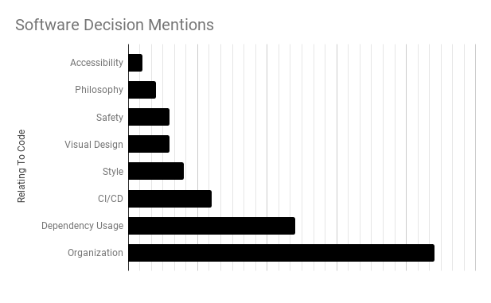
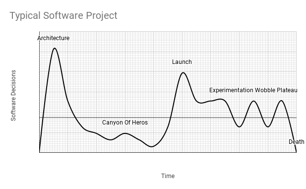
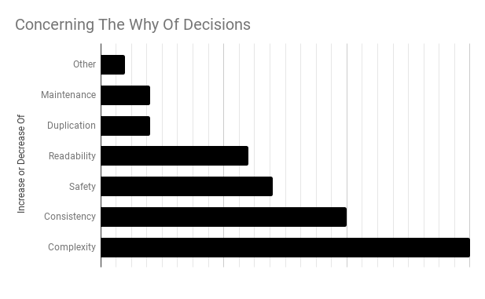

# The Decision Hypothesis
## The Mythical Man-Month Hinted At Software Decision Documents Decades Ago


Some weeks ago, I completed my third re-read of the [*Mythical Man-Month* (MM-M)](https://www.pearson.com/us/higher-education/program/Brooks-Mythical-Man-Month-The-Essays-on-Software-Engineering-Anniversary-Edition-2nd-Edition/PGM172844.html) by Frederick P. Brooks, Jr.

MM-M is a dramatic piece of authoring in software development. I consider it a constitution that contains delightful discoveries. Anyone who practices [software development](https://medium.com/hackernoon/software-is-unlike-construction-c0284ee4b723) should read MM-M. And reading once is not enough! Pleasure and wisdom will come from reading numerous times. The work highlights forty-five-year-old observations that hold true to this day.

This essay will describe findings in MM-M that describe how we document the *why of software development decisions.* It will analyze a technique my team practiced to document software decisions, providing graphs along the way.

# Chapter 10: The Documentary Hypothesis

In MM-M, Fred postulates scholarly labor and its practical application in four short pages.

> Amid a wash of paper, a small number of documents become the critical pivots around which every project's team revolves...

Fred goes on to describe in three sections the required documents for a *computer product, university department,* and documents of a *software project*.

He concludes with the topic of **why**.

> First, writing the decisions down is essential... Second, the documents will communicate the decisions to others... Finally,... documents give... a database and checklist.

From the quotes, Fred presents the practice of developer documentation. He targets documents such as schedule and requirements, but how does this apply to a software code?

## DECISIONS.md

Some years ago, there was a decision in my team to document the **why** of team decisions. We created a document, called `decisions.md`, to provide rich detail to code architecture, dependencies, and style in a way that explains their reasoning.

Our guiding principle was documentation is code. And if we had to document, do it in the version control system or as close to the software workspace as possible.

Our guiding principle was that the **documentation is code**. If we had to document, *do it in the version control system* or as close to the software workspace as possible.

Then we found a post; [every project should have a decision making file](https://akazlou.com/posts-output/2015-11-09-every-project-should-have-decisions/) by [Aliaksandr Kazlou](https://medium.com/u/93bb84d49d5c). The post introduced the concept of a version-controlled `DECISIONS.md`. It's a brilliant write up, and I suspect the author is a fan of MM-M.



So, we followed Aliaksandr's idea and adopted `DECISIONS.md` in our way. I'll share a short section of ours below.

```
# DECISIONS.md

...
## Logging
As a platform team, we have decided to utilize Timber [https://github.com/JakeWharton/timber] for all logging calls within the application. Our gain is the removal of an overbearing Log wrapper we had to maintain. We wanted to get rid of its complexity.
Some other reasons for utilization of Timber are as follows:
* Automatic tagging.
* Easy extensibility.
* Better usability in unit testing.
...
```

Once adopted, we had problems with timeliness of `DECISIONS.md` since it required constant maintenance. We also observed two truths. First, software development decisions are relentless and persistent. They can vary in intensity but are always present. Two, we have trouble having developers keeping `DECISIONS.md` timely.

## Julius Wellhausen's Work was Lost to Many Hands

This composition was inspired by observations between the team, MM-M, the projects launched and maintained. Ultimately, I decided to write because of a lunch I had with a senior developer. The lunch brought it all together for me.



We debated about pull requests in our monolithic repo that went awry with inconsistent annotations and framework bloat. No team decision was made on the consistent use of nullability in preparation of our code language migration. Of course, sharing the technical details are not necessary, and these issues were the flavor of the week.

As we ate, developers were contributing to the code on an idealistic development philosophy. And no philosophy is wrong if it shares a direction. Freds *Fragmentary Hypothesis* is in full effect when it comes to code contribution, as each contributor adds alittle to its whole.

Sure enough, our lunch concluded, and we made decisions on the framework usage. When we returned, we started a discussion with the team, debated with data, and updated the `DECISIONS.md` document. If we hadn’t, the integrity of the code will degrade over time by violating its conceptual integrity.

## Fred Concluded with Self Documentation

In MM-M, Fred had difficulty grappling with separate documentation. He supported its value but pondered why developers fail to document. In the end, he stated:

> Most documentation fails in giving too little overview. The trees are described, the bark and leaves are commented, but there is no map of the forest. To write a useful prose description, stand way back and come in slowly-.

Fred paints a contrast to spoken language. He said:

> English, or any other human language, is not naturally a precision instrument for such definitions. Therefore the manual writer must strain himself and his language to achieve the precision needed.

But Fred found value in explaining meaning. He said:

> With English prose one can show structural principles, delineate structure in stages or levels, and give examples. One can readily mark exceptions and emphasize contrasts. Most importantly, one can explain ***why***.

![Developers do not like to document. Mundane external processes hurt developer happiness. [ 1 ]](images/07-04.png)

Fred writes a chapter on marrying documentation to code. He said:

> Yet our practice in programming documentation violates our own teaching. We typically attempt to maintain a machine-readable form of a program and an independent set of human-readable documentation, consisting of prose and flow charts.

> The results in fact confirm our teachings about the folly of separate files. Program documentation is notoriously poor, and its maintenance is worse. Changes made in the program do not promptly, accurately, and invariably appear in the paper.

> The solution, I think, is to merge the files, to incorporate the documentation in the source program. This is at once a powerful incentive toward proper maintenance, and an insurance that the documentation will always be handy to the program user. Such programs are called ***self-documenting***.

Mr. Brooks was close to a solution, but he did not accomplish the follow through with code as documentation. Fred found that human language and machine language repel each other, just as if two magnets are forced together at the same pole. Force is required to keep the connection as they move closer.

Fifty years later, *tests are the documentation on specification*. However, they, too, cannot explain why code exists as it does. There is a high value to documenting *why* the system survives. Therefore, documentation has its place in the workspace.

## Code Cannot Explain the Why to Humans

Every software project has decisions which demand constant attention. The recommendation is to *document* the significant software development branches continuously, carefully, in one place. My suggestion is to try a technique like `DECISIONS.md`.

This practice serves the team by encouraging debate and focusing the resolution to a transparent file revision. The process is an imperfect electronic arbiter, serving as knowledge to onboarding engineers.



Code has a daft ability to communicate software decisions and their origins. Team knowledge, hallway conversations, relationship dynamics change, and fade. Version control systems change, and history is broken. All that remains are the contributors that crafted pieces together over short periods.

> The decision hypothesis:

> Amid constant software decisions, those of complexity and consistency become the critical pivots around which a software system survives. The decision document is a key to its revelation.

---

## References

[ 1 ] Daniel Graziotin, Fabian Fagerholm, Xiaofeng Wang, and Pekka Abrahamsson. [On the Unhappiness of Software Developers.](https://arxiv.org/pdf/1703.04993.pdf)

## Author's Notes

In MM-M, Chapter 10: The Documentary Hypothesis is focused on the manager actor. Creative liberty was taken to refocus the conversation on the software team and their documents by combining thoughts on Chapter 6: Passing The Word and Chapter 15: The Other Face.

Fred's "The Documentary Hypothesis" discusses documents such as budget, organization charts, and schedule. Too many software engineering teams, these documents are considered taboo to distribute directly to them. However, these documents are **data and decisions** that partially or wholly control the variable inputs of all software projects - time, scope, developers, and quality.

> [From Chapter 3: The Surgical Team] … Mills's concept in transformation of programming "from private art to public practice" and making all the computer runs visible to all team members and identifying all programs and **data as team property**, not private property.

Since software development teams are always under constraint, there are parallels drawn to code consistency, complexity, and why the organization constructed things the way they did. We should question why certain documents that drive software projects are hidden, possibly to have the team debate and encourage the variables differently so that better software could flourish. However, this was not the goal of my initial contemplation. Thanks to [Hazem Saleh](https://medium.com/u/d8a8e3247b67?source=post_page-----aa512e0113----------------------) for pointing this out and the summation that many books could be written on this fascinating exploration.

Finally, thanks to [James Shvarts](https://medium.com/u/4e5a0d0c55e?source=post_page-----aa512e0113----------------------) for the inspiration. One thing that will never fade is overpriced sandwich shops.

---

## Social Post

How do #software #engineering teams document #decisions?

An in-depth look at how a #team met the challenge of documenting decisions by being inspired by Fred Brooks book, The Mythical Man-Month. Design documents, decisions, and the "why" are discussed in fascinating insight.

Thanks to James Shvarts and Hazem Saleh

[medium](https://medium.com/hackernoon/the-decision-hypothesis-aa512e0113)
[linkedin](https://www.linkedin.com/pulse/decision-hypothesis-douglas-w-arcuri/)

#softwaredevelopment #code #softwareengineering #learning #documents #productivity

### Posted

1. r/programming
1. r/softwareengineering
1. hackernews
