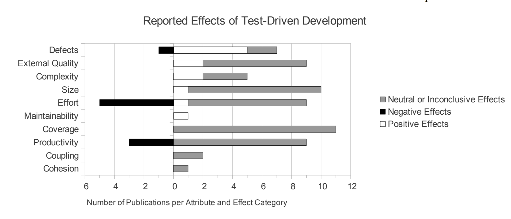
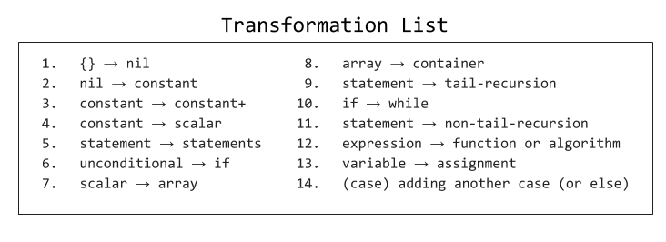
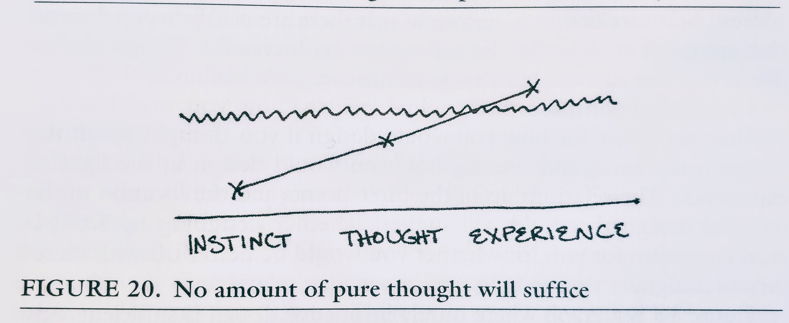

# Observations on the testing culture of Test Driven Development


*This post is not a primer on Test Driven Development. It contains my observations of re-starting the discipline and the problem of unit testing craft.*

Kent Beck, a software engineering leader, is the modern-day inventor of test-driven development (TDD). Kent co-wrote JUnit, a widely used testing framework, with Erich Gamma.

In his book, [*XP Explained*](https://www.pearson.com/us/higher-education/program/Beck-Extreme-Programming-Explained-Embrace-Change-2nd-Edition/PGM155384.html) (second edition), Kent describes that at the intersection of **values** and **practices**, form **principles**. When we iterate from the concept and plugin what we believe, we develop a formula.

```
[KISS, Quality, YAGNI, ...] + [Testing, Specs, ...] == [TDD, ...]
```

I have a respect for Kent's life work not only because of his software creations but also his continued exploration of **trust**, **courage**, **feedback**, **simplicity**, and **vulnerability**. All attributes are paramount to the invention of Extreme Programming (XP).

TDD is a **principle** and a **discipline** that is followed by the XP community. The field has been present for decades.

In this essay, I will describe my opinion of where TDD stands in its adoption. Following, we will explore intriguing personal observations as we perform TDD. Finally, we will conclude by postulating why TDD resists standard practice.

## TDD, Studies, and Professionalism

Decades since its invention, the practice of TDD remains debated in the development community.

The first question an inquisitive developer would ask is “What percentage of software professionals use TDD today?” If you asked Robert Martin (Uncle Bob), a friend of Kent Beck, the answer would be one hundred percent. Uncle Bob believes that it is infeasible to consider being a professional if test-driven development is not practiced. [1]

Uncle Bob has been the focus of the discipline, and it is natural to discuss him as a part of this write-up. Uncle Bob has defended TDD and has championed the discipline’s boundaries.

To follow up with the next question, “the definition of **practice** is the deliberate use of — but it does not specify the amount or percentage of, right?” My subjective estimation is that a majority of [software engineers](https://dev.to/solidi/what-is-a-software-engineer-anyway-3fb2) do not pratice TDD.

The reality of the situation is that we **do not know**, since the practice percentage has not been studied. The only concrete measurement we have is a collection of companies gathered at [WeDoTDD](http://www.wedotdd.com/). WeDoTDD tracks these companies. Interviews are conducted with those who practice TDD, but that list is small. also incomplete as other software shops are practicing TDD — but not at full capacity.

If we don’t know how many are practicing, the next question is, “how effective is TDD based on measured benefits?”

Studies conducted that prove TDD’s effectiveness. Write-ups include well-recognized reports from [Microsoft](https://collaboration.csc.ncsu.edu/laurie/Papers/Unit_testing_cameraReady.pdf), [IBM](http://citeseerx.ist.psu.edu/viewdoc/download?doi=10.1.1.567.3740&rep=rep1&type=pdf), North Carolina University, and the [University of Helsinki](https://helda.helsinki.fi//bitstream/handle/10138/42741/2014_01_swqd_author_version.pdf?sequence=2).



These reports prove that defect density in software is reduced by 40% to 60%. In exchange, increased effort and execution time rose to 15% to 35%. These numbers are published in books and the DevOps community.

With these questions answered, the final question is, "what should I expect as I start to perform TDD?" You are in luck because I have formulated my observations of TDD. Let’s review them next.

## 1. TDD Commands an Approach

As we practice TDD, we begin to experience the phenomena of "calling the shot." In simple terms, the short acts of creating tests will challenge the developer. They will say aloud, "I think this will pass” and "I do not think this will pass” or "I’m not sure, let me think after I try this approach."

The developer’s IDE (integrated developer environment) becomes a rubber duck of conversation. At a minimum, TDD shops should be humming with this type of conversion.

> Think, then speak up about your immediate next move(s).

This reinforcement is key to communication, not only to predict your next action but also to reinforce the concepts of writing **straightforward** code to make a unit test pass. Of course, if the developer becomes silent, they are wandering off the loop and must come back on the path.

## 2. TDD Commands Muscle Memory

As a developer cycles through TDD, they will experience fatigue by battling through high friction and awkward flow. The fatigue is expected as we pratice. The developer will find shortcuts to improve the cycle because the goal is to reduce awkwardness and to enhance muscle memory.

Muscle memory is the key to practicing fluidly. TDD demands it because of execution repetition.

> Print out a shortcut cheat sheet. Learn as many shortcuts in your IDE to make your cycles efficient. Then, keep searching for more.

The developer will become an expert of shortcuts in a matter of a few sittings, including building and running the test rig. With practice, creating new artifacts, highlighting text, and navigating the IDE will become natural. With pratice, we unlock all of the refactor shortcuts such as extraction, renaming, generation, pulling up, reformatting, and pushing down code.

## 3. Forward Thinking

Each time a developer practices TDD, they draw a mental map on what is to be solved. In a traditional coding approach, this is not always true, as the solution is exploratory. The developer has a goal. To get to that goal, unit tests are neglected in the process.

In TDD, the start and end of the session is ritualized. First, think, and list. Test your options. List more. Then start, do, and then think. Check off. Repeat. Finally, think, and stop.

> Maintain your test list well. Check off items as you go. Never drive without one.

The list may take time to formulate and is not in the cycle. However, it should be prepared before the revolutions start. If you don’t have one, getting to where you want will be difficult. Always have a map.

```kotlin
// A Test List
// "" -> does not validate
// "a" -> does not validate
// "aa" -> validates
// "racecar" -> validates
// "Racecar" -> validates
// print the validation
// have a blueberry ale
```

The practice will be smooth with a **test list**, as described by Kent Beck. The test list directs solving each cycle. Once the test list is solved, the cycle stops with a failing test.

## 4. Communicate with Others

As the above test list is filled out, later steps become blocked because the commitment of work is not clear. If a generated  test list which has guesses about the missing requirement(s), the suggestion is to stop right there.

Practicing without TDD will generate complexity. TDD performed without a list can produce the same result.

> Speak up if the test list has gaps.

In TDD, understanding what to build based on the owner’s requirement(s) is the goal. If context is unclear, the test list will start to break down. That breakdown will require a conversation. And direct conversions can turn into a feedback loop of trust and respect.

## 5. Creates Iterative Architecture

Initially suggested in the first edition of the XP book, Kent proposed that tests drive architecture. However, there have been stories about how sprint teams crash into walls.

Tests that drive architecture is unwise. Uncle Bob had agreed with other experts that architecture driven by tests is “horse sh*t.” [1] Some map is required, but not too far from the test lists that are being worked on in the field.

Kent identified this caveat in the book, [*TDD By Example*](https://www.safaribooksonline.com/library/view/test-driven-development/0321146530/). Concurrency and security are the two significant areas where TDD cannot apply. The developer must design concurrency into the system design separately.

> Create a map of organization. Have a vision that directs a few steps ahead. Make sure to steer with the team.

TDD cannot handle the **organization** of the system. Iterative architecture and TDD orchestration is challenging in practice and demands trust among all team members, pair programming, and reliable code review. Short iterative design sessions are required if we practice TDD.

## 6. Test Frailty and Degenerative Implementation

Unit tests have a intriguing property about them, and TDD exposes that property. They cannot prove correctness. E.W. Dijkstra had labored over this and discussed the possibility of mathematical proofs in our profession to resolve the gap.

For example, the below solves all tests around a hypothetical palindrome that the business required. It was developed with TDD.

```kotlin
// Not an imperfect palindrome.
@Test
fun `Given "", then it does not validate`() {
    "".validate().shouldBeFalse()
}
@Test
fun `Given "a", then it does not validate`() {
    "a".validate().shouldBeFalse()
}
@Test
fun `Given "aa", then it validates`() {
    "aa".validate().shouldBeTrue()
}
@Test
fun `Given "abba", then it validates`() {
    "abba".validate().shouldBeTrue()
}
@Test
fun `Given "racecar", then it validates`() {
    "racecar".validate().shouldBeTrue()
}
@Test
fun `Given "Racecar", then it validates`() {
    "Racecar".validate().shouldBeTrue()
}
```

Indeed, these tests have holes. Unit tests are frail, even for the most trivial tasks. We cannot prove correctness because if we had to, the needed inputs would be unimaginable.

```kotlin
// Too generic of a solve based on tests provided
fun String.validate() = if (isEmpty() || length == 1) false else toLowerCase() == toLowerCase().reversed()
// Is the best implementation and solves all tests
fun String.validate() = length > 1
```

`length > 1` is called a **degenerative implementation**. It is enough implementation to solve the problem, but tells us nothing about the problem we are trying to solve.

When does a developer stop writing the tests? The answer is when the **business is satisfied**, not when the code author is!

> Be aware that the unit tests are fallible. Understand their strengths and weaknesses. [Property-based testing](https://hypothesis.readthedocs.io/en/latest/) and [mutation testing](http://pitest.org/) may help tie up this gap.

TDD has benefits, and avoids us building the sandcastles we do not need. The practice is a **constraint**, allowing us to go faster, further, and with safety.

No matter how frail unit tests are, they are a core necessity. They transform **fear** into **courage**. Tests allow us to refactor code mercifully. Tests guide and **document**, adding value to a project so others can contribute effectively.

## 7. Reveals an Assertion Completion Feedback Loop

Take a step back further. For the next two points, we will visit strange re-occurrences. For the first occurrence, let’s take a quick look at FizzBuzz. Here is our test list.

```kotlin
// Print numbers 9 to 15. [OK]
// For numbers divisible by 3, print Fizz instead of the number.
// ...
```

We are a few steps in. We now have a failing test.

```kotlin
@Test
fun `Given numbers, replace those divisible by 3 with "Fizz"`() {
    val machine = FizzBuzz()
    assertEquals(machine.print(), "?")
}

class FizzBuzz {
    fun print(): String {
        var output = ""
        for (i in 9..15) {
            output += if (i % 3 == 0) {
                "Fizz "
            } else "${i} "
        }
        return output.trim()
    }
}

Expected <Fizz 10 11 Fizz 13 14 Fizz>, actual <?>.
```

Naturally, if we duplicate the expected assertion data to `assertEqualsIt`, the test passes.

> As we query the test rig, failing unit tests may correctly answer their own assertions. We will this voodoo testing.

Sometimes failing tests will [reveal a correct result](https://blog.plover.com/math/divisibility-by-19.html) for tests to pass. Perhaps we can call these **voodoo tests**. Your mileage may vary based on test etiquette, but I have seen this happen numerous times.

## 8. TDD Reveals The Transformation Priority Premise

In TDD, there are situations where we are entangled by the implementation. At some point, the testing code becomes a bottleneck to move forward — an **impasse** forms. The developer has to back out by removing a portion of the tests to advance.

Uncle Bob has experienced these impasses in his career, realizing making a test pass prefers an order to avoid an impasse. He discovered **as the tests become specific, the code becomes generic.**



Uncle Bob created the [Transformation Priority Premise](https://8thlight.com/blog/uncle-bob/2013/05/27/TheTransformationPriorityPremise.html). The list defines an order of refactoring to achieve passing tests. One should prefer a transformation that will resist an impasse.

TPP or **Uncle Bob’s Test Calculus**, is an intriguing and exciting observation. Use his list as a guide to keeping the code as simple as possible.

> Print out the [TPP](http://blog.cleancoder.com/uncle-bob/2013/05/27/TheTransformationPriorityPremise.html) list and place it at your desk. Refer to it as you drive to avoid impasses. Embrace an order of simplicity.

Before we conclude, I’d like to answer a question, "what percentage of software professionals use TDD today?" My answer: is "I think the group is small." I'll explore this answer with reasons why.

## Has TDD Taken Off?

Unfortunately, it hasn’t. The percentage of developer practice is low [at 8%](https://www.techrepublic.com/article/test-driven-development-talked/). Here are the author’s observations as to why.

### Reason 1: No Exposure to Real Testing Culture

A majority of software developers have not experienced a **testing culture**.

The definition of a testing culture is a place where developers are deliberately practicing testing. They are mentoring those who are not skilled. Each pairing and in every pull request is a feedback loop on building an individual's confidence, supported by engineering leadership. In this culture, managers believe in testing. When deadlines and times get tough, the test discipline is not dropped — it is strengthened.

Those that have lived a testing culture, are lucky. They apply the experience to future projects, educating others.


## Reason 2: Unclear Educational Resources

Authors have written books on the subject, such as [*xUnit Patterns*](http://xunitpatterns.com/) and [*Effective Unit Testing*](https://www.manning.com/books/effective-unit-testing), but hardly convince teams to test.

When it comes to examples, open source projects are hit or miss with useful unit suites. In these unfamiliar projects, having tests is critical. But disappointment is inevitable–tests are not maintained.

## Reason 3: Not Taught in Universities

My observation of candidates fresh out of university reveal little to no education in testing rigor. Every developer I know has learned testing afterward, with many enlightened through a testing culture experience.

## Reason 4: A Career of High Test Passion Required

It takes passion to test well. To understand the TDD and its benefits requires an extensive period of time.

Developers want things working, achieving what Kent Beck said: "First make it work, then make it right." I empathize that to get things working is a tough battle.

Testing is hard to do well, so let’s conclude on that thought.

## Conclusion

Kent’s proposal in XP included a simple formulation of **instinct**, **thought**, and **experience**. These three levels are stepping stones to execution quality measured by a **threshold**.

The threshold for clean test execution is high, in that it eclipses a baseline of experience. Those that practice were trained in a supportive testing culture.



Software is challenging to build and organize. Testing takes it to a whole new level of enlightenment.

Early on, I had an **instinct** that testing is essential, but my test culture **experience** came later. It took years of **thought**, but without that experience of test culture, I would not have emerged above that threshold.

I believe that many developers cannot see the real benefit of test culture due to a lack of specific **experience**.

> TDD discipline has struggled to take off due in part to the learning curve of testing. TDD requires a headspace that is unique as it is challenging.

TDD demands **thought** and **experience**. The practice is not easy and is a acquired skill. The practice commands the developer’s throughput, continuously and relentlessly. We are all **vulnerable** in the process.

```kotlin
@Test
fun `Given software, when we build, then we expect tests`() {
    build(software) shoudHave tests
}
```

However, TDD is an intriguing discipline and **is a tool to lean on**. Its **phenomena** should be studied in detail. If anything else, the discipline strengthens both the developer and the collective group.

---

*Inspiration for this post was due in part by [Danny Preussler](https://medium.com/u/1331e67af4e1). As I re-explore the discipline, he has started running comprehensive Android TDD workshops. [Check out his recent deck here](https://speakerdeck.com/dpreussler/tdd-on-android-mobos-2018).*

[1] [Jim Coplien and Bob Martin Debate TDD](https://www.youtube.com/watch?v=KtHQGs3zFAM)

---

## Social Post

Personal observations of practing TDD stands and where it stands.

Alt: What is TDD and why it hasn't developed critical mass? (2018)

- Review studies of TDD effectivness
- Explores the steps of TDD
- Examens the observations of what happens in TDD
- Why TDD hasn't taken off in adoption

Thanks to Hazem Saleh and Danny Preussler

[medium](https://medium.com/free-code-camp/8-observations-on-test-driven-development-a9b5144f868)
[linkedin](https://www.linkedin.com/pulse/8-observations-test-driven-development-douglas-w-arcuri/)

#softwaredevelopment #code #softwareengineering #software #career #learning #testing #productivity

