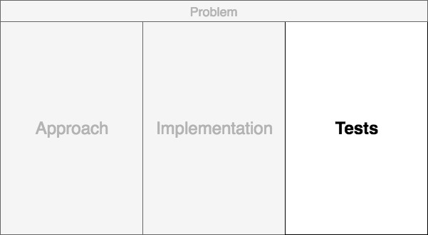

## How to Organize Your Thoughts on the Whiteboard and Crush Your Technical Interview
## On Organizational Skills and the Applied Science of Gluing Lots of Things Together in the Xraft of Software ngineering

 did not include O for Organization.](images/09-01.jpeg)

Some weeks ago, a bright individual reposted on Hacker News a well-thought out and succinct post about the most important skill in software development. In this essay, John D. Cook pointed out a quote from the article Organizational Skills Beat Algorithmic Wizardry, by James Hague. Both authors tackle the software engineering subject of organization as a skill. They contrast this to the mastery of computer science tested in interviews, taught in academia, or touted in blog posts. Their contemplation got me pondering about how our craft could be improved.

Thinking deeply about both authors’ messages, I ran through my own experiences over time. I empathize with those who experience technical interviews that are not classically trained. My last experience was disorganized.

My last completed professional project was a three year old system that dealt with code complexity, and a never-ending rolling line of products. We fought bravely to organize the growing mess. Both thoughts had a common thread, as they were small and large exercises in organization. They revolved around feelings of anxiety, vulnerability, stress, and happy moments. I (we) cared deeply about outcomes.

This motivated me to write a follow-up. Why not answer questions posed? So I kicked the idea back and forth and hung on one question. John asked:

> ...how do you present a clever bit of organization?

Thinking about the question, I looked away from the screen and saw my whiteboard standing before me. My head swirled around the posts. Tough technical interviews? Organization? Managing state? Collapsing weight? Code complexity? Perhaps the technical interview whiteboard exercise could prove a salient point of software engineering all along.

So I solved some problems at the whiteboard, nervously, all by myself.

Rarely at a whiteboard does anyone perform well. You have to show a masterful thought process and hold a lot in your head. You have to communicate, but how do you communicate while ignoring the screaming voice in your head that says “hurry up!” while moving around enthusiastically?

## A Better Approach

At technical companies, there are whiteboard technical interviews. You are placed in a room with a whiteboard with an individual who represents the company. He or she asks a question and we are invited to solve the problem. Then it’s usually up to the interviewee to drive the problem to a solution.

This is where my head starts to spin out of control by way of anxiety and disorganization. Trumpets begin to play in my head and my thought process becomes mangled. Time speeds up. My vision narrows and I become lightheaded.

Maybe there is a way to slow down, pace, and walk through a process with organization. Something I’ve never actually seen before while interviewing candidates over my years, but maybe it can help ease the nerves and make it an enjoyable experience. First, look at the board, and cut it up into three sections.

The three sections will be organized for temporary space to work toward solving the problem.

### Step 1: The Problem

Make sure to write down the problem in a complete sentence up top. This will get you feeling the marker and will help you overcome the initial hit of the rush of “how do I solve this?”

Once you have the question written down, look at it for a moment and start to think about questions. Draw the lines with ample space. Don’t worry about the pause, let the interviewer know that you are thinking about questions to ask.

### Step 2: Assumptions

Think about some generic questions. Like, what programming language do you prefer? Move to the right side of the board. No questions coming? The problem may contain concepts you don’t know. Ask what they are. Then, start tackling the problem questions. The first ones to ask are what is an example of the parameter input and output. Ask if the data is presorted.

Clarifying assumptions can simplify the problem. As you ask each question, you should write each answer pair in the assumptions area. When you receive answers, get a second colored marker to highlight the answer. Bringing your own markers may help.

We can only hold so many items in our head, so lean heavily on the board to capture all the knowledge. Writing the questions and answers out will slow down your approach so it is digestible.

### Step 3: The Approach

Once you have a good number of questions on the right side of the board, physically move over to the left. This is where we will start to discuss an approach to solve our problem..

Here, very rough pseudocode, steps, and visualizations occur. Let your interviewer know that this is not your implementation, but a place where you are organizing your thoughts on the strategy and approach, loosely on data structures and abstract data types. Draw out the solution like it's a picture.

The left box will demonstrate something very interesting in that it should reveal holes in our questions. As you write and think out your approach, stop your thought process if a question is not answered. Walk back to the right section, and write out the question and try to receive the answer.

At the absolute minimum, this will happen a few times as you recognize the average cases, best cases, and worst cases. It depends on the strategy, the limits and the constraints. Request relaxation on approach such as “For this example, can I use a small set of data?” “Can I assume the input array is sorted?” Input validation is also another question generator.

### Step 4: code implementation

Once enough assumptions and approach material are generated, this means that you are now ready to write through your implementation with confidence. You will be supported by both sides. Highlight and point to each step as you write the code. Carefully step through the approach, listed to your left. As you write your implementation, go back and forth double-checking the assumptions.

Even if you struggle with the solution, you are a wizard of organization.

Of course, there is a possibility of finding something in the act. Walk back to the left and revive the approach, break it down or ask for assistance. New questions pop up. Go to the right. Go back and forth from left to right to center until you succeed. You will.

Be the master of organization. If you hit a wall or find something that is just not right, remember that the sides will guide you.

### Bonus Step 5: Test

If you have completed the exercise with code you think is working, take the first step to discuss how it should be tested. Use the assumptions section as a place to write clean test code, if you should choose to do so.

By now, it is likely safe to remove all the questions from this area. Erase the questions and attempt to write unit tests. In the end, you’ll be okay because you organized with confidence.

## To sum up

There you go. That was a few minutes of pure organization without much theory. It leans on a few simple concepts.

**Sectioning** — slicing up the problem in pieces from start to finish.
**Scaffolding** — the concept of temporary architecture, a supporting structure as we build around us.
**Gating** — we should not proceed forward with the next step until we are confident about addressing the problem. Actively engage with “Did I miss any assumptions?” or “Does my approach have holes?” before proceeding.
**State** — organization is handled visually to maintain the weighing the complexity of the problem. Avoid using an eraser if you can.

## Conclusion

Let's finish by examining important quotes by John Cook.

> You can’t appreciate a feat of organization until you experience the disorganization.

I agree. This applies to projects with code, people, and those technical whiteboard experiences. But to take a step back and answer the problem with a process of organization is a feat of engineering. I’ve learned that:

> The key to engineering is potential organization. A large kinetic energy comes from the act of organizing astutely and continuously over time. I’ve learned that:

Never underestimate this phenomenon. John said:

> Only if the disorganized mess is your responsibility, something that means more to you than a case study, can you wrap your head around it and appreciate improvements.

We all have a story about the whiteboard – and we all have the stories of defeat. So, I found a way to improve and task my engineering mind at the same time. The result is what you have read.

Computer program is applied science, a **pattern language** and a **craft**. I’ve written a few posts about organization linking organization to system complexity. This is why I appreciated John Cook’s and James Hague’s thoughts on software organization.

Walk through the steps, and you’ll do great. Good luck in your next interview!

*If you find yourself in this [situation](
https://www.youtube.com/watch?v=XKu_SEDAykw), ask for a larger whiteboard!*

---

## Social Post

[medium](https://medium.com/free-code-camp/how-to-organize-your-thoughts-on-the-whiteboard-and-crush-your-technical-interview-b668de4e6941)
