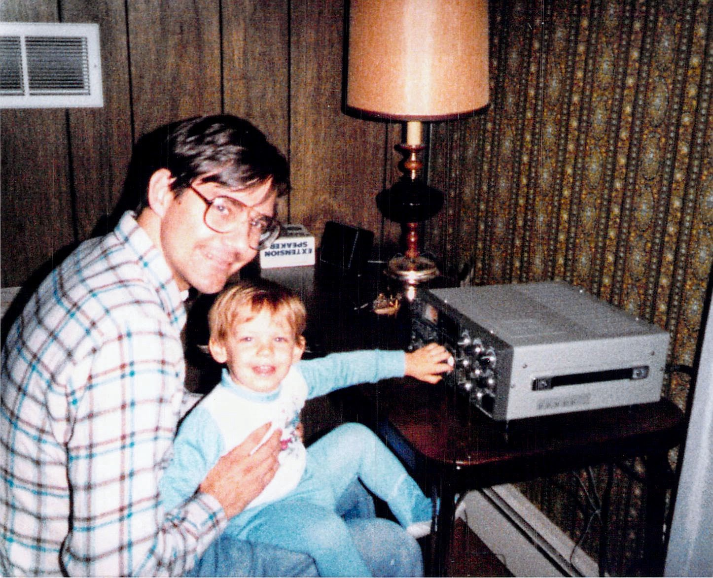
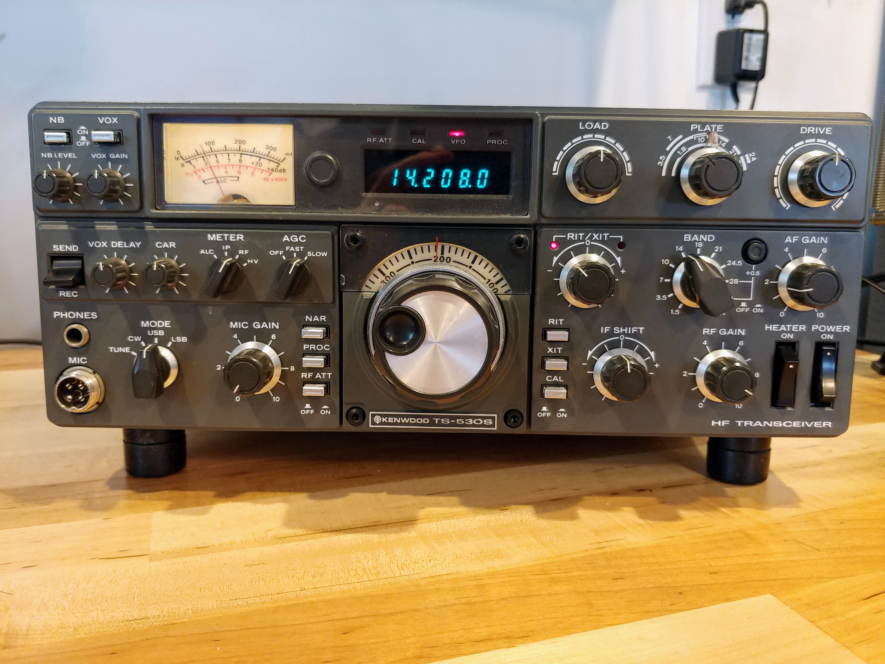
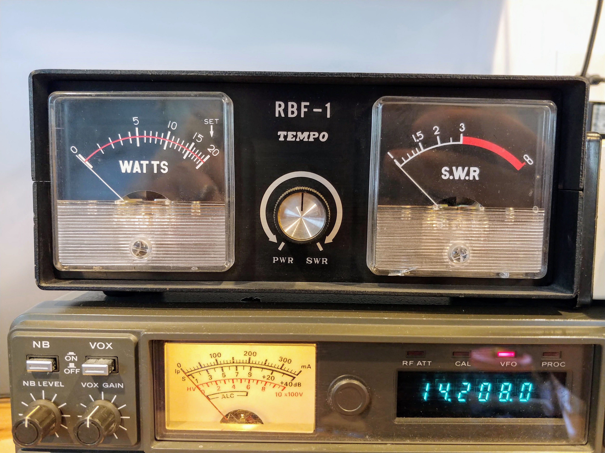
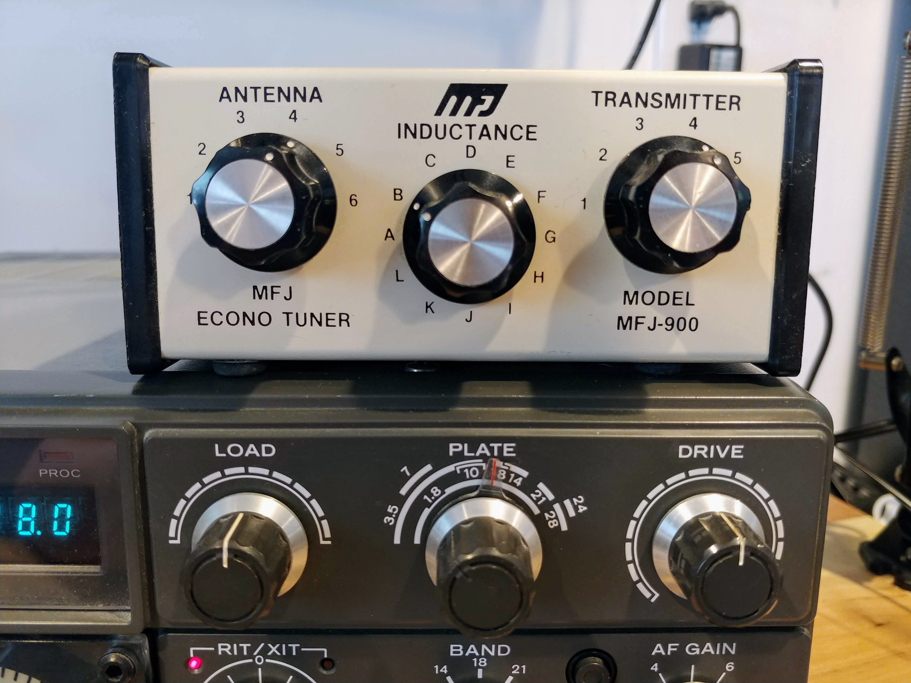
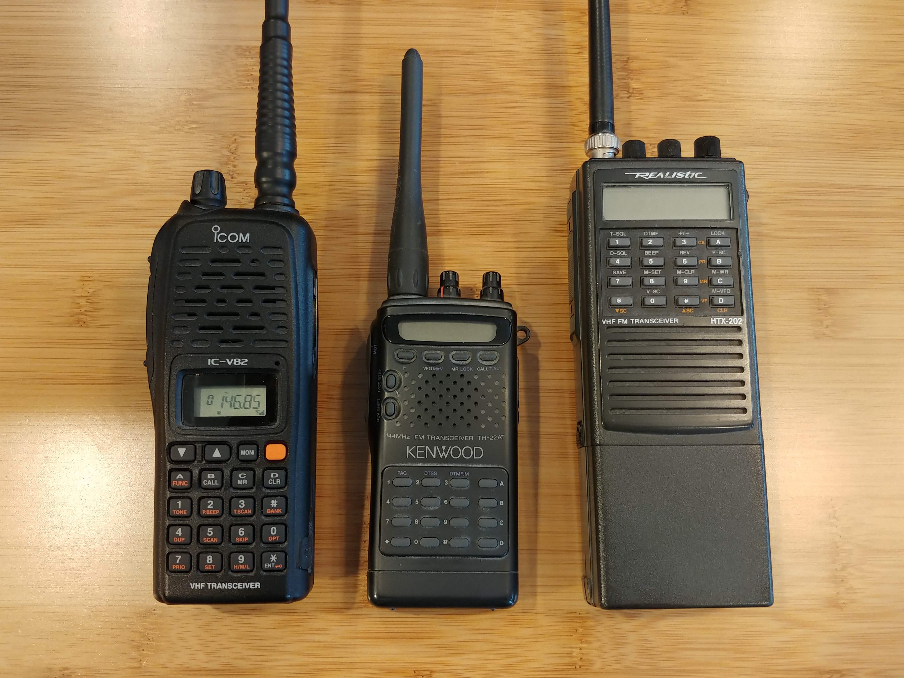
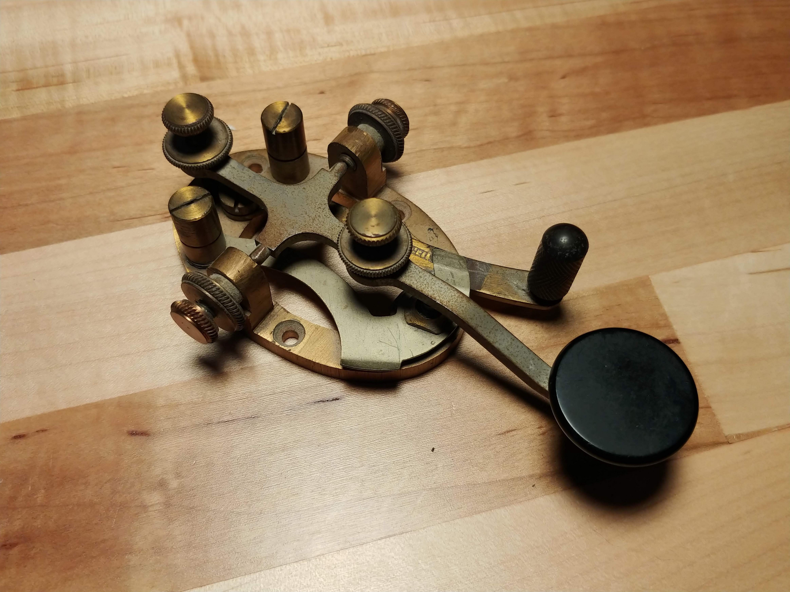
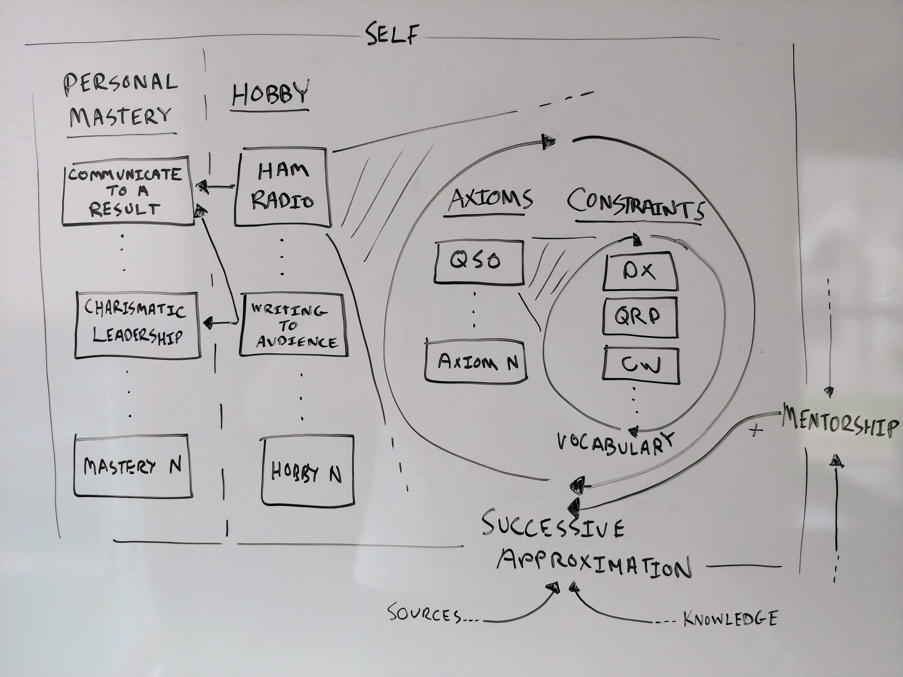
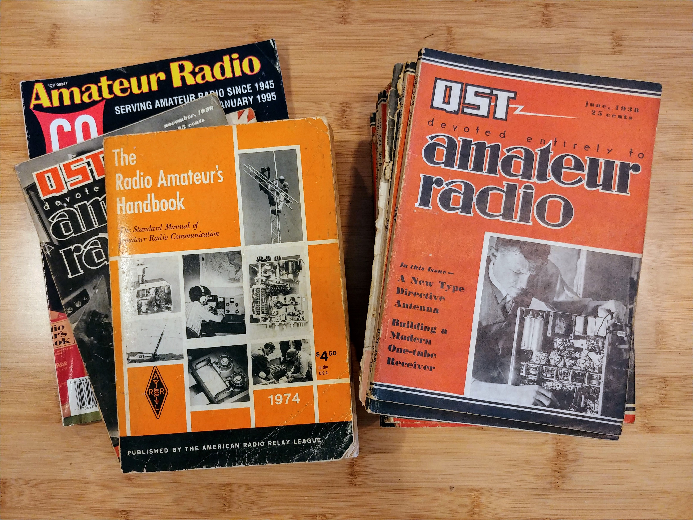
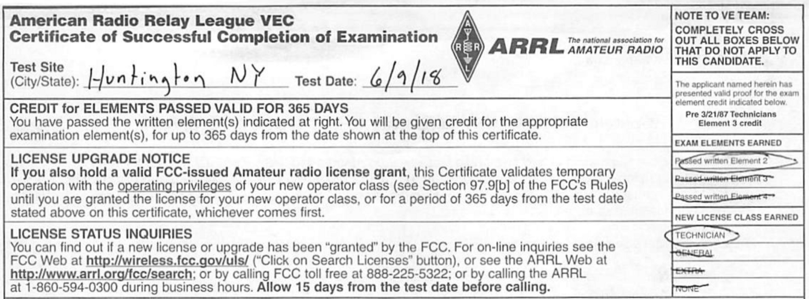

# CQ: Personal Mastery Through Hobbies
## What My Father Taught Me About Communication In Amateur Radio

Software engineering is my passion and profession. My focus is to improve the craft and build great teams. But from time to time, I explore the skill of learning by leveraging ***engineering thinking***. My goal is to find ways to improve communication, mentorship, and leadership. One way to discover techniques is through hobbies. What follows is my personal view on ***how*** hobbies lead to self-improvement.

For me, it is a great moment to communicate a logical deduction since I started a new hobby of amateur radio. The ***"why"*** is challenging to place in words, but what I can say is that it gives access to a ***specific and distinct*** communication style. It requires ***technical effort*** to reach people without multi-billion dollar infrastructure. Like many hobbies, amateur radio contains a rich ***vocabulary*** of understanding.

## Ham Radio

Amateur radio, or "ham radio," is our attempt to communicate without financial interest over the radio waves. The Federal Communications Commission (FCC) regulates the service in the United States, and the International Telecommunication Union (ITU) oversees the FCC worldwide. It licenses operators through an incentive examination system. Once licensed in three levels, we are free to transmit with certain restrictions. When we communicate, we identify ourselves by call signs.

We select modulations like voice, continuous wave (International Morse Code), data packets, or video. We transmit and receive for fun. Contests are run to build contacts from all over the world. But on occasion, the hobby transforms to support the resolution of an emergency or a long-running disaster. And the world has seen many natural and human-made disasters where "hams" have stepped up to help facilitate communication.

Amateur radio is intense with history, electronics, applied theory, bizarre phenomenon, and some ridiculous maths when touching the edges of the hobby. Innovative technologies originate out of Ham Radio. From the latest on cloaking with fractal antennas to that mobile phone in your pocket, they all are inventions of the hobby.

## Personal Mastery and Their Axioms

Now that we know what amateur radio is, I want to pose a short formula. The key is personal mastery through a deduction of how these axioms improve ourselves and our proficiency in things.

First, we start with ***personal mastery***. Personal mastery is the attempt to execute a vision of yourself in the future. It has to start with ***discipline*** from within to see through your goal. It is a series of practices of principles laid out and applied through the journey of reaching those goals. That is personal mastery. It is a quest to seek the truth of a matter, like in a hobby.

Next, as we seek those truths, let's examine what an ***axiom*** is. An axiom is a shorthand for a kernel of fact, a poster sign. It is a spoken reduction of events and their goals that are self-evident. Personal mastery and their axioms feed on one another. And the axioms contain ***vocabularies*** that allow us to understand skill and culture.

But how do personal mastery and axioms interrelate with one another? The relation would be by ***successive approximation***. The ability to course-correct our skill and zone in on the axioms so that we check, apply, correct, and repeat. It is a relative comparison of what we can do better.

With personal mastery, their axioms, and successive approximation, one attempts to achieve the goal. The goal requires the examination of successive approximation saddled around ***constraints***. Constraints are merely challenges to our axioms and limit validation on how we can achieve maximum personal mastery.

But this is where it gets even more enjoyable. No one achieves full mastery because there is no such thing as independent personal mastery. Personal ability ultimately is a shared experience of ***interdependence through mentorship***. And this is the point. Hobbies are repeating cycles of this formula.

> Hobbies are explorations of personal mastery. They are the axioms divided by their constraints. They are amplified by successive approximation and accelerated by mentorship.

## Example of the Application

Now that we have the formula, let's move forward with an example as we explore my thought process. Let us focus squarely on the hobby of amateur radio.

As I am learning the techniques out in the wild, I am trying to find my first axiom. And as of a few weeks ago, I concluded.

> Communicate to any other operator clear enough so that they understand and can respond (QSO).

Easy enough. From here, we have an axiom for our mastery. The maxim will reveal vocabulary as we go. But how does one communicate clear enough? Clarity is where personal ability comes into play. We must experiment. We must successively approximate to level up at our hobby relative to the last failure. After that exploration, here is a refined axiom of the hobby.

> DX (Communicate a far distance) to another operator to QSO.

As we look at this axiom, we find that there are constraints. These types of restrictions capture and challenge us to personal mastery. These constraints pull us into ways in-which make us uncomfortable. **Time**, **money**, or **mental effort** are scales of being uncomfortable. Another strict examination, maybe. More time in research. More money to apply. ***Vulnerability*** in front of someone who knows an answer. But these challenges are there to make us better.

> With as little power as you can (QRP), DX to another operator to QSO.

One way to achieve this is by using the International Morse Code. International Morse Code, also known as CW (continuous wave), is a technique of using little power to travel very long distances. It is also a challenge for most to understand and then respond in CW. It takes quite a bit of practice and discovery. And here is the final piece of the puzzle.

Hobbies are ***interdependent*** exercises of personal mastery and require communication with others to improve. My father told me a story about this key in the picture above. Back in the early 1970s, he worked at the Mobil Building in New York City for Rand McNally as a trip planner. Like most days, my father was at the desk, waiting for the next customer to draw out a road trip. An older gentleman walks in. One thing leads to another, and amateur radio is on topic. The gentleman is a high-level license holder. My father explained that he was having difficulty overcoming a crude requirement of the then license exam. The exam required a CW portion at a minimum word per minute. The gentleman gave him old Coast Guard audio tapes to help him practice. He, through his help, succeeded.

> With QRP power and with 13 wpm (words per minute), DX to another operator to QSO.

The man above in my father's story is called an "Elmer" in the hobby. In short, a ***mentor***. And hence, the cycle of personal mastery continues until a limit. The axioms continue to be tweaked and improved until there is a collective mastery.

Of course, other axioms are ***congruent*** with the primary adage. In the example above, I've only highlighted the primary driver of mastery. There are others to identify and explore.

## 73! (Best Regards)

Hobbies are paths to personal mastery. We use axioms to form vocabulary, use a successive approximation to identify the constraints. Finally, we reach out for interdependence in becoming better.

Personal mastery clarifies what is most important to us. What is most important to me ***is how to improve the result of communication*** because it is a fundamental weakness that has consequences. The radio communication metaphor was the right fit. I could not resist but to try in this essay. And I know I've failed beautifully at it.

Hobbies ignite searching for a path to the truth inside one's self. When we focus our attention on learning, it may be uncomfortable. We should look for the axioms, and educate on adjusting their constraints. Find Elmers. They will open a world of learning, which is a beautiful thing. Ponder about your hobbies and their axioms for just a moment. Are you on a path to personal mastery?

--

And thanks, Dad, for all this equipment to learn on. I got my first license even if it took way longer than you had hoped.

---

## Social Post

Learning a new #hobby and becoming better as an individual -

- Overview of Ham #Radio.
- #Hobbies are an exploration of personal mastery.
- An example of the application through successive approximation.
- Finding mentors in these hobbies.
- Hobbies are #interdependent exercises of personal mastery and require communication with others to improve.

[medium](https://medium.com/the-innovation/cq-personal-mastery-through-hobbies-f25aab2e49ad)
[linkedin](https://www.linkedin.com/pulse/cq-personal-mastery-through-hobbies-douglas-w-arcuri/)

Thanks to Hazem Saleh and Danielle Arcuri

#AmateurRadio #communication #leadership #mentorship 

### Posted

1. hackernews
1. r/amateurradio
