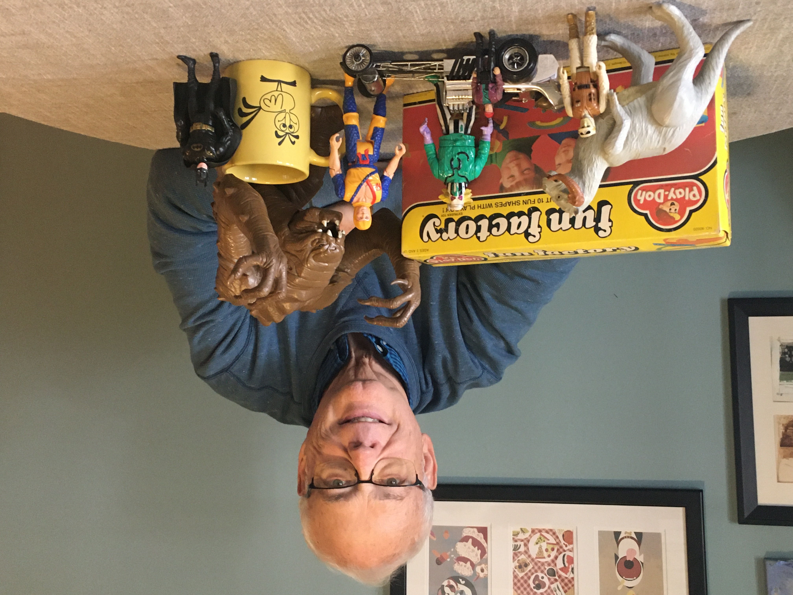
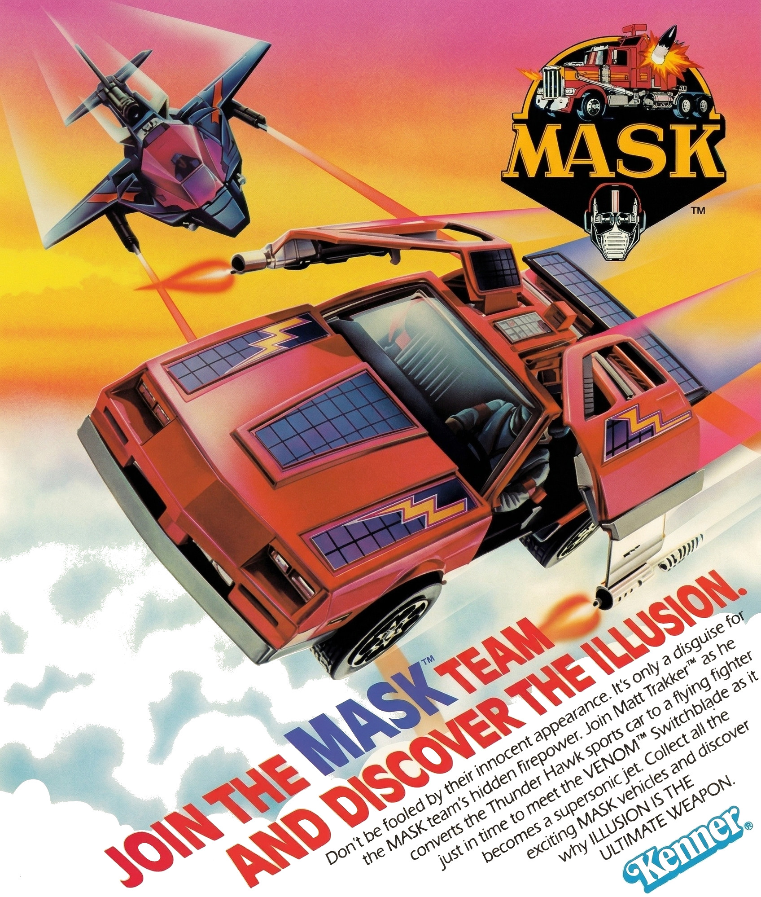
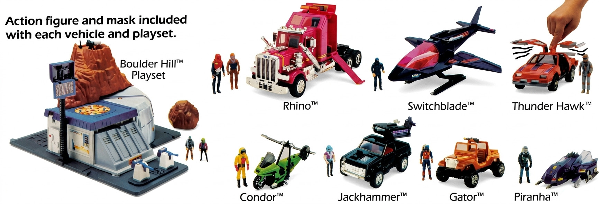
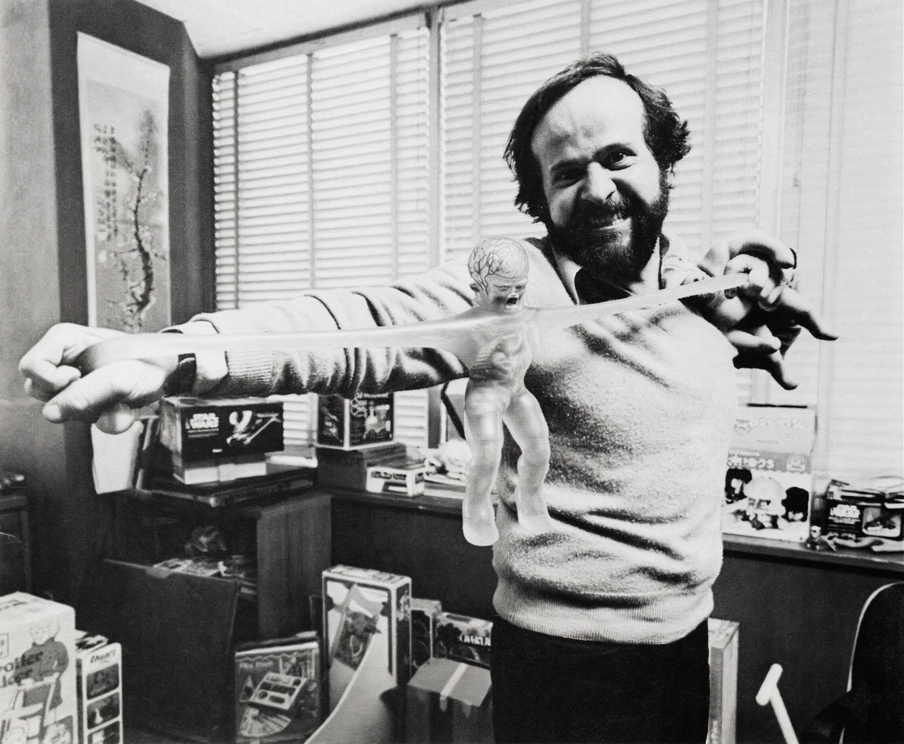
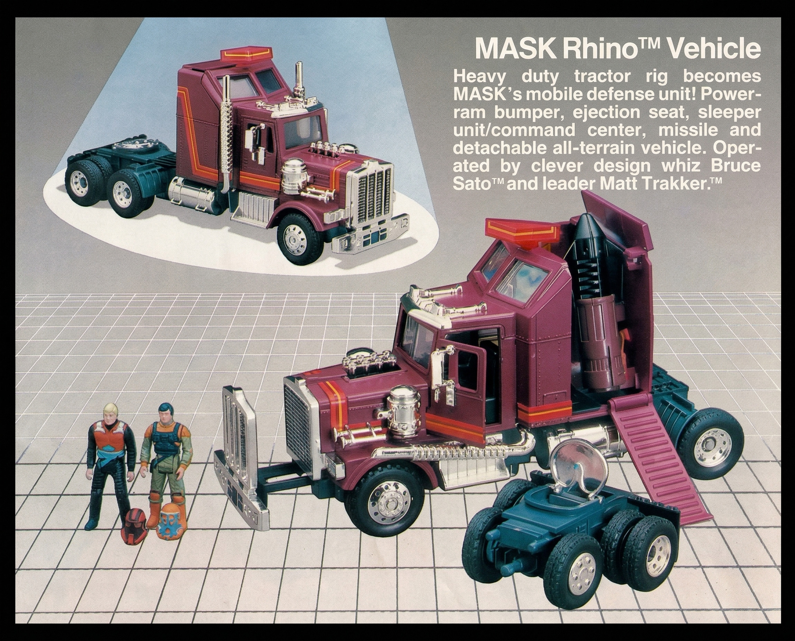
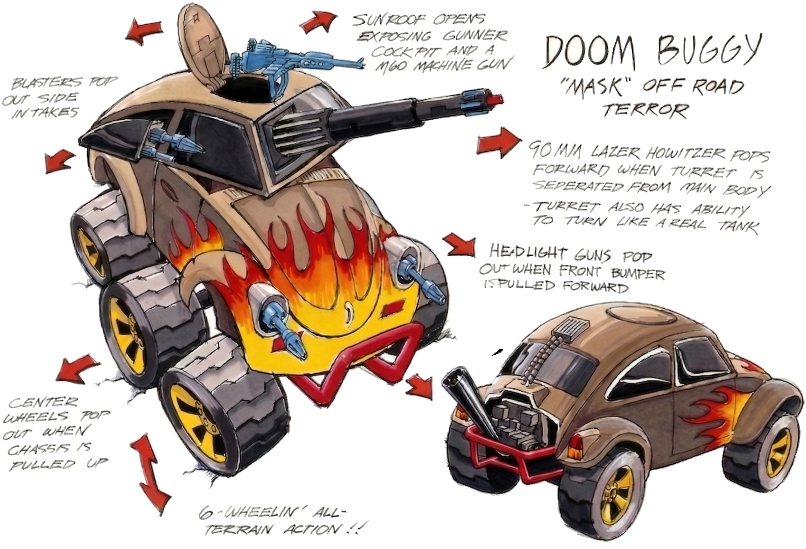
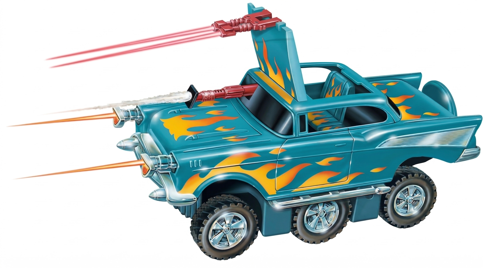
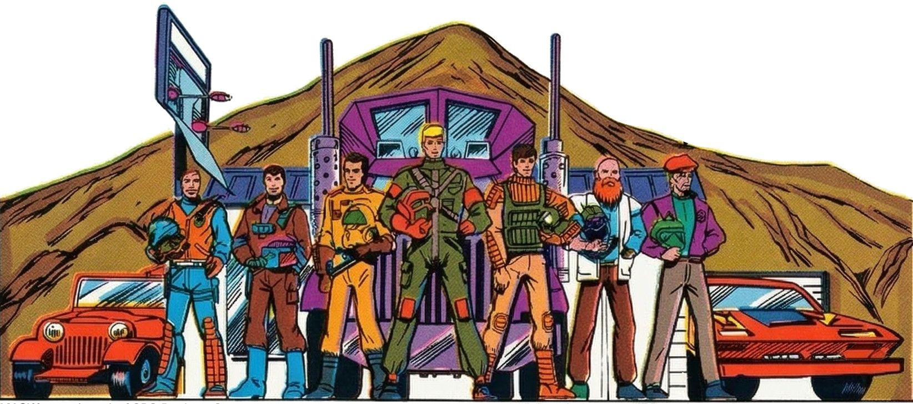
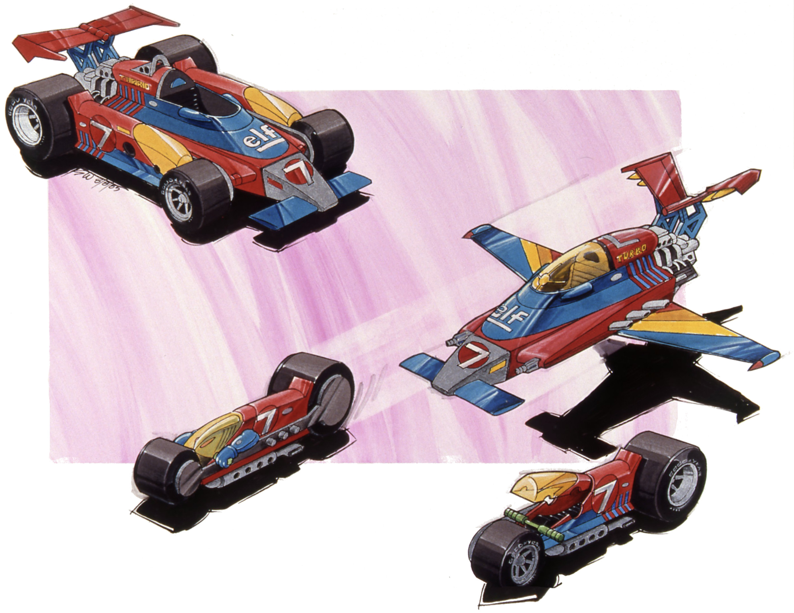
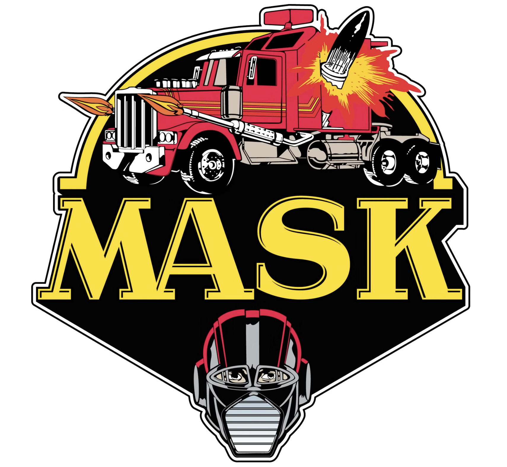

## ON TOY HISTORY
# Tom Osborne On Kenner's M.A.S.K.
## An Interview With the Director of Design at Kenner

*What follows is an interview with a veteran toy designer. Also check out this author's book, [*Undercover Toy Stories*](https://www.amazon.com/Undercover-Toy-Stories-Anthology-Inventions/dp/B0FR9RVRVH): An Anthology of Real American Inventions, [available now](https://www.amazon.com/Undercover-Toy-Stories-Anthology-Inventions/dp/B0FRB318L4).*

---

**WHILE RESEARCHING THE** toy origins of Kenner's M.A.S.K. (Mobile Assault Strike Kommand), this author reached out to numerous sources for *[We Really Do Care: Drive-By Scenes of Kenner's M.A.S.K.](https://medium.com/@solidi/we-really-do-care-drive-by-scenes-of-kenners-m-a-s-k-34b1135d291d)*

With the news of the Loyal Subjects M.A.S.K. [Wave 2](https://toyhabits.com/mask-wave-2-the-loyal-subjects-full-reveal/) toy re-release, this author's goal was to write the backstory of how the brand came to be.

With good fortune, Mr. Osborne, an artist and director of design at Kenner, was one of the sources who replied. And so, to enrich the reader's understanding of the beloved toy line, his responses follow.

---

**Doug: Let's discuss before and up to M.A.S.K. What was your role at Kenner, the disciplines you managed, and what projects did you work on?**

*Tom: I went to the University of Cincinnati, majoring in industrial design. It has a mandatory program that was in total six quarters long. I co-oped at Kenner for three quarters and started there full time January 6, 1976. I worked my way up to Director of Design.*

*[At Kenner,] I worked on all of the items in the line. I was responsible for sculpting and soft goods, accountable for the look and play of all product lines. This was in conjunction with engineers, marketing, and licenses to assure the toy were safe, hitting costing targets, delivering on schedule and most of all, fun. I worked on projects like *Star Wars*, Beetlejuice, and Chuck Norris, to name a few.*

*Kenner was run by the best in the industry. Bernie Loomis brought Mattel people [and organizational thinking] to Kenner. Bernie ran the ship for a time. And David Okada started Kenner's preliminary design there. Dave was my first boss, responsible for new ideas and evaluating outside submissions. He later appeared on the *Toys That Made Us*.*

*Bernie was a really interesting, big guy, and would literally eat off your plate in meetings. And when working with Evel Knievel on a racing paint scheme, I introduced myself as a toy designer. Evel asked "Where?" and I said "Kenner." His first response was 'Bernie is an asshole,' because at one time Kenner was in negotiations in doing Evel Knievel toys [Tom laughed].*

**Doug: And your intro into M.A.S.K. Can you recall how M.A.S.K. came to be, its origins at Kenner, and when you got involved? Is there a backstory on its origins and on who first introduced it to the group?**

*Tom: I was involved early in the development; it was the idea of Howard Bollinger, V.P. Product Concepts. He was inspired by the semis that he would see on his way to work and imagined what they might "really" could be hiding or could transform into.*

*[Anyway,] I think the original concept wasn't called M.A.S.K. It received a lukewarm reception by marketing. The individual masks were not part of the original concept but were added after sales wanted more involvement with the characters. So the masks were added and that became the name as well.¹*

**Which M.A.S.K. vehicle came first that eventually made it to production, and is there a story around how that vehicle came to be? Were there people influencing its initial designs?**

*The semi rig was the first, but just slightly ahead of the others. I think this sprang from Howard Bollinger's initial thought that the big rigs inspired a line of trucks with "secret cargo." [We developed M.A.S.K.] as a part of a sketch fantasy.*

*[Howard's idea of] M.A.S.K. filled the gap there after Star Wars - I mean it tanked, you couldn't give away the product. M.A.S.K. carried us through before others came along . . . plus there were no royalties on it.*

**Were you present at the first "demos" in front of leadership (and to whom)? If so, how did it go? And what was the hardest design challenge for M.A.S.K. that you/your reports had to overcome to hit a deadline?**

*Yes, I was there. We had "product conferences" every week when new concepts and submissions from inventors would be shown. In attendance would be the President [[Joe Mendelsohn](https://www.newspapers.com/image/101739833/)], Vice President [Dave Mauer], and all the marketing product managers. Members of the Product Concepts group would usually present and demonstrate the toy.*

*I remember during the original presentation that Howard said he looked through his back [car] window and saw a big truck. [In the demo], Howard alluded to a little kid looking out the back seat, and seeing this giant semi, and wondering what's in that thing. That was how all these vehicles were masking for what they really were.*

*After the demos, decisions would be made as to next steps, if any, including further development and/or testing with kids and moms. These presentations would be very "theatrical" in nature to hype the product. I remember the Beetlejuice presentation as particularly extravagant. Regardless, I'd bring home some of the early toys to playtest with my kids.*

**YouTubers have guessed why the "masks" changed midway through the line to have "holes/extended bases." Perhaps you can recall why the masks were redesigned?**

*There was a [federal requirement](https://www.congress.gov/bill/98th-congress/house-bill/5630) for what is deemed a small part. The slots in the helmet allow for airflow in any orientation if swallowed. This was also the case with [Kenner's] Starting Lineup football helmets.*

*Designing the masks to the safety standards was difficult, as well as the transformation of the vehicles. That aspect really challenged the engineers.*

*[At one point,] somebody said, 'Hey, these [helmets] are illegal.' [Tom laughed.] And then we noticed and it was changed. [Karl Wojahn](https://www.cincinnati.com/obituaries/pwoo0691263) [our safety officer,] was a really good guy to work with but he was a stickler on safety. Sometimes it wasn't the letter of the law but the spirit of the law.*

*But [Jim Kipling](https://www.tpwhite.com/obituaries/james-jim-kipling), he was very much a 'let them come after us kind of guy' - typical lawyer, I guess. With M.A.S.K. it all worked itself out. And safety [or lack thereof,] is valuable to collectors today. One of our prototype Boba Fett Star Wars toys, which had a safety issue with its shooting missile that was later molded in, recently sold for [1.3 million dollars](https://gizmodo.com/most-valuable-vintage-toy-record-already-broken-again-by-another-rocket-firing-boba-fett-2000488467) [Tom laughed]!*

**From the *[Racer to Racer Podcast](https://www.youtube.com/watch?v=1wMDxUyUNWE)*, you spoke about wanting to be a car designer and your time in car racing. When working on M.A.S.K., did you incorporate any car-design/racing elements into the toy line?**

*Racing has been my passion. I still want to win the Indy 500 and have been to fifty-seven races! At one point in my racing career, I shook the hand of [Ayrton Senna](https://www.theguardian.com/sport/2024/may/01/ayrton-senna-30-years-f1-uncompromising-complex-genius), a famous F1 racer who tragically died on the circuit.*

*[And to M.A.S.K.] of course, especially in selecting the cars to develop and figuring out what was a possible transformation using the styling of each vehicle to its advantage. The Indy car, the one with the side pods that separate, is a good example.*

*The Nightstalker was a favorite of the M.A.S.K. team. As you know, it is a 57 Chevy. We also did versions of the product as a VW Bug and a Porsche 911. The sales team, being older guys really loved the Chevy and the version was selected. However, kids did not relate to a car from the 50's so it didn't sell well.*

*But [the Nightstalker] was one of the coolest vehicles in my opinion as far as features went but probably should have been a Porsche. Inbetween, we did a sketch we called the "Doom Buggy," but it never saw production.*

**Back to the toy Camaro; is there a backstory to the gull-wing doors?**

*Most of the group were "car guys" and aware of every vehicle at the time. We knew of the Delorean, and that may have inspired the gull-wing doors, but they were intended to represent sudo wings on the Camaro.*

*[Later,] we were planning on building a working life-size Camaro as well, but those plans fell through.*

**Anything else you want to recall about M.A.S.K. back in the 1980s - memories, people, or an interesting story that a reader would find surprising, wild, or enjoyable?**

*[Tim](https://timeffler.com/) [Effler], my former business partner of SOEDA, is a good friend. He worked in the Kenner prelim group - and will tell you he invented all of [this], and that's okay. [Tom laughed.] [He's writing a book](https://bluemilk.shop/products/back-to-the-drawing-board-the-art-of-kenner-toy-design?variant=44625209196744) right now and I got to get these M.A.S.K. slides over to him.*

*Anyway, so many people contributed to the success of M.A.S.K., as well as all the Kenner product lines. The way the departments were set up was that Product Concepts would do the conceptual work and then "turnover" the product to my group for final design.*

*The subsequent years of products were entirely conceived and developed by [us.] So anything after the first years were thought up and developed by my group. This freed up Product Concepts to work on new designs, [like the Hurricane].*

)](images/100-08.jpeg)

*Some but not all of the designers included: [Alton Takayasu](https://all-about-mask.com/publisher.item.90/interview-de-mit-konzept-de-en-with-concept-en-designer-alton-alton-takeyasu.html), [Jan Van De Merwe](https://patents.google.com/patent/USD291816S/en), [Ron Hayes](https://www.theledger.com/story/news/2000/01/20/veteran-toymaker-trying-new-ideas/26558689007/), [Steve Wuesthoff](https://sosartcincinnati.com/sos-art-2020-exhibit/wuesthoff-stephen/), [Tyrone Keys](https://www.linkedin.com/in/tyrone-keyes-a2846b5), [Freddie Thoman](https://iccollectorsconvention.com/icccblog/2024/7/31/legendary-kenner-toy-designer-freddie-thoman-to-appear-at-iccc-2024), [Eric Simpson](https://patents.google.com/patent/USD292010S/en), [Jack Farrah](https://patents.google.com/patent/USD263610S/en), [Charlotte Eicher](https://patents.google.com/patent/USD275119S/en), and many others. It was all very much fun.*

*We were irreverent sometimes, but in the end... it was a job. I never thought that we would become a part of history - but here we are.*

**Generally, what are you most proud of contributing to at Kenner?**

*I presented stuff to the late Chuck Norris in his kitchen - there was a giant gym. And at twenty-seven years old, I presented to George Lucas, working on the *Star Wars* line of toys. Jim Swearingen [my former business partner,] believed in that toy line. Today, Jim goes to *Star Wars* [conventions], thinking he's a God. [Tom laughed.] In the end, it all worked out.*

*And, Kenner was a fantastic place to work, and I was very lucky and blessed to be there during those years of M.A.S.K., Care Bears, Strawberry Shortcake, [The Real Ghostbusters](https://www.amazon.com/Real-Ghostbusters-Visual-History-Deluxe/dp/1506749283), Beetlejuice, and all the rest.*

*Thanks for putting this together, Doug.*

---

**RACING IS KEY TO** Mr. Osborne's artistic inspiration. From what this author could find on the web, Syd Mead is at the top of Tom's list. [Syd Mead](https://en.wikipedia.org/wiki/Syd_Mead) was a prolific conceptual and futuristic vehicle artist, and if one takes a moment to look at his artwork, one can see some of that inspiration in Tom and the fusion into M.A.S.K.'s later models.

And on the Internet, the reader can find Tom interviewed by numerous car racing outlets. He has attended at least fifty-seven Indy 500 races since 1966. Racing sparked his passion, leading him to begin his career as an artist and photographer for [Grant King](https://www.gvshof.ca/inductees-2/all-inductees/21-motor-sports/59-grant-king-1999.html) while attending the University of Cincinnati, where he studied industrial design.

As Tom co-opted into the toy industry, he worked on the iconic Kenner *Star Wars* toy line alongside other recognized designers, including future business partners [Jim Swearingen](https://nkytribune.com/2025/12/our-rich-history-holiday-heritage-artistic-and-innovative-spirits-that-inspired-the-world/) and [Tim Effler](https://timeffler.com/). After Kenner, they formed a partnership called SOEDA Inc., where they [created toys](https://www.newspapers.com/image/204545012/) for brands such as Disney's Pirates of the Caribbean, helping to raise a new generation of toy designers, some of whom are working in the industry today.

Overall, Tom is a down-to-earth person who is proud of his family's [accomplishments](https://archive.is/YN1qY). And Mr. Osborne had joked on [*The Collector Car Podcast*](https://www.youtube.com/watch?v=ff-_vzZNEKg) that his one second of toy fame occurred in the *Toys That Made Us* at the twenty-seven minute, twenty-seven second mark of the *Star Wars* episode.

, which still sells today. (Source: [The Toys Who Made Us](https://www.imdb.com/title/tt7380346/), at 27:27)](images/100-11.jpeg)

During our interview, this author verified the claim and found the faces of those who later worked on M.A.S.K. - Tom was able to name everyone, and sadly reflected that these designers are now crafting at the big model shop in the sky.

Today, Mr. Osborne is an adjunct professor at The University of Cincinnati. Thank you, Tom, for all the memories. M.A.S.K. was really cool. While the brand was certainly a cash grab from Boomer parents' wallets, its ultimate illusion lives on as a lasting memory of middle-aged kids today.

---

*Some images were clarified with AI, and there may be slight deviations from the originals. And if you enjoyed this fascinating write-up, you'll find more in the author's book, [*Undercover Toy Stories*, available now](https://www.amazon.com/Undercover-Toy-Stories-Anthology-Inventions/dp/B0FR9RVRVH).*

*¹ Tom could not recall the original M.A.S.K. working title.*

---

## Social Post

Mobile Armored Strike Command, mask-wearing figures, and transforming #toy vehicles, is experiencing a #retro revival from #TheLoyalSubjects. So, I spoke to Tom Osborne, former Director of Design at #Kenner, to discuss the backstory of M.A.S.K. in the #1980s. Enjoy.

