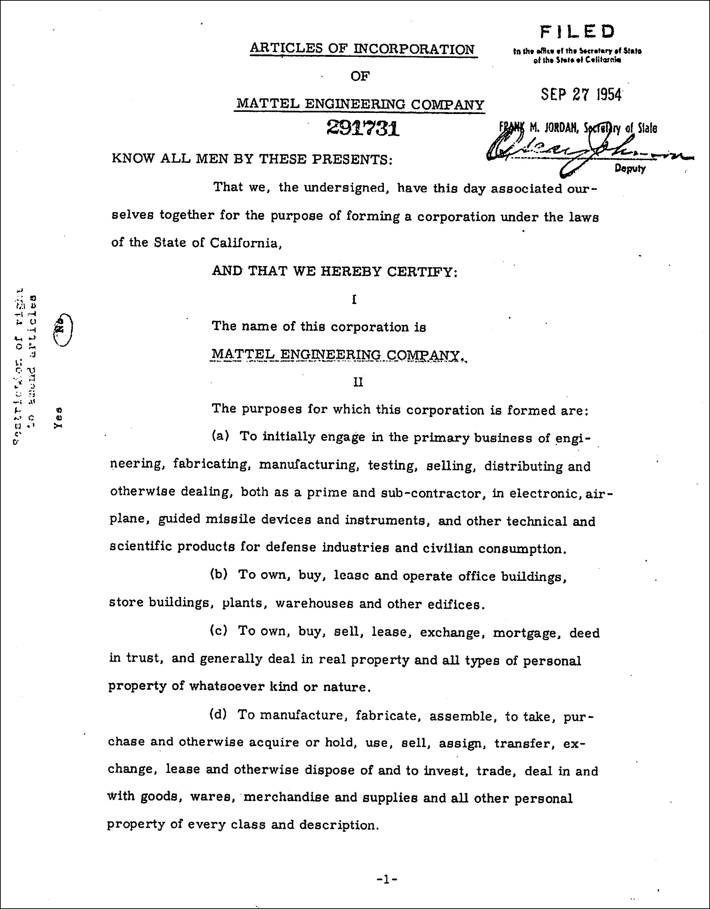
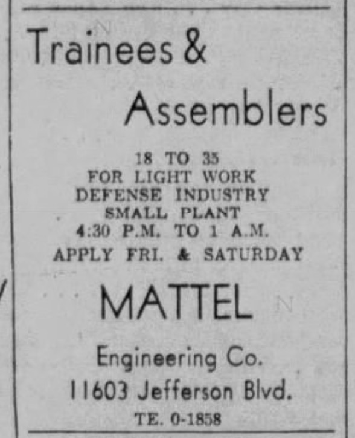
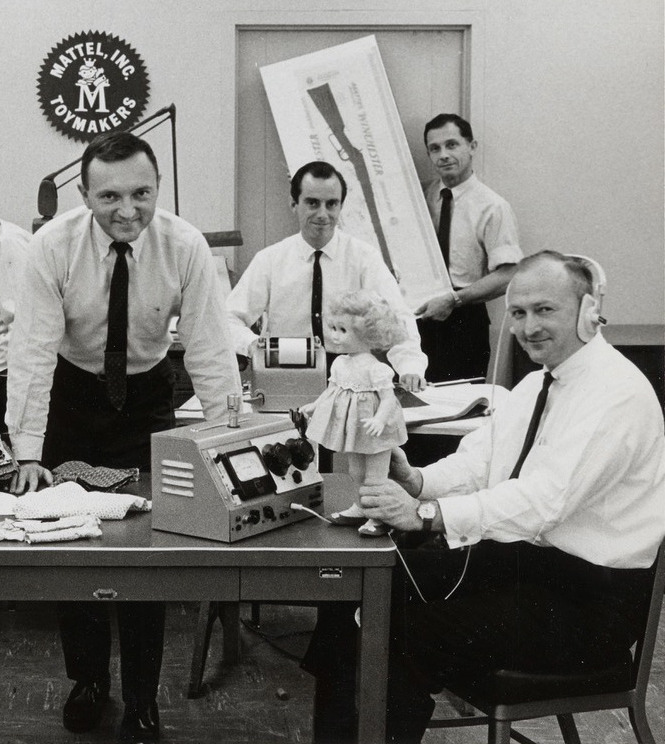
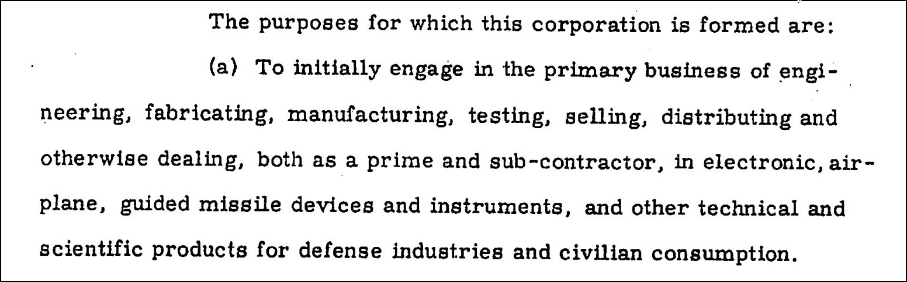
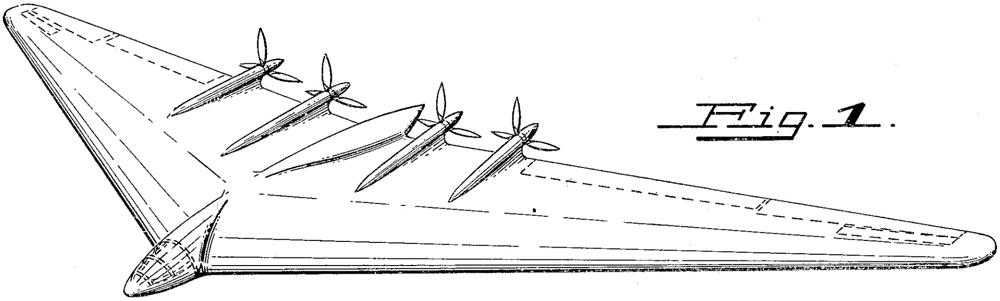
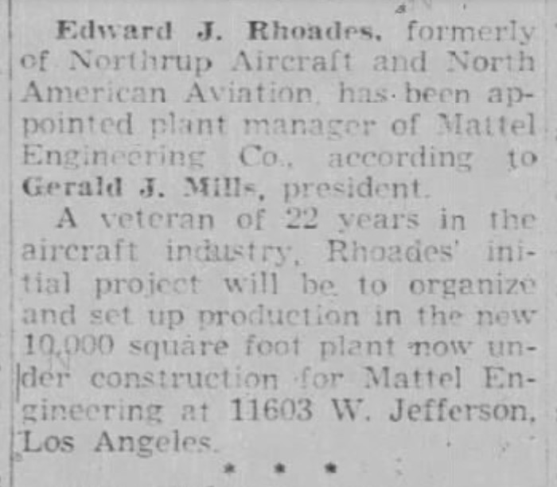

## ON TOY HISTORY
# Before Barbie: Mattel Engineering Company, Guided Missiles, and the Cold War
## The Defense Industry Origins of an American Toy Giant

 military-type toys.](images/101-01.jpeg)

---

*What follows is a critical review of the origins of an American corporation. The views expressed in this write-up do not reflect the modern version of Mattel Inc. This post offers additional backstory on their company's history in the 1950s, written using the mosaic theory of information and a range of journalistic tools.*

---

## The Mattel Myth and What's Actually True

**WRITTEN IN THE BOOK**, *Barbieland*, author Tarpley Hitt introduces Mattel's juxtaposition. She wrote, "Mattel's proximity to national security's toy makers was not just some accident of real estate, but the natural by-product of a corporation that has always invited comparisons to the defense industry."¹

*Barbieland*, published by a division of Simon & Schuster in late 2025, mentions militant corporate rumors, a first in top-tier publishing. For example, Ms. Hitt acknowledges a quote from former Pentagon spokesperson, [Gary Flood](https://www.newspapers.com/image-view/1199752822/). He said, "The M16 rifle is based on something Mattel did;"² a critical armament of America's Vietnam War.

This isn't Mattel's first Vietnam-era comparison. Tom Hayes, who created an overture titled [*Superstar: The Karen Carpenter Story*](https://www.youtube.com/watch?v=Q2Mlb82mQ58&t=502s), mixes footage of the Vietnam War bombing runs against Barbie dolls. Mr. Hayes was subsequently sued by Karen Carpenter's estate for music copyright infringement, with Mattel raising objections.

, California Secretary of State, CPRA in 2025)](images/101-02.jpeg)

While the Vietnam production rumors are myths-no evidence exists-its 1950s weapons subsidiary of Mattel Inc. is not, and remains less examined by business historians.

Clues found deep in the archives of *The Los Angeles Mirror and Vanguard* hint that its corporation built a defense industry group, Mattel Engineering Company. The outfit contained men poached from the aerospace industry, whom Ms. Hitt mentioned Mattel was surrounded by.

This author stumbled upon it while conducting research into the homicide of a high-ranking Mattel employee in 1968, Jack Edward Hartman, investigating [a connection back to the U.S. Navy](https://medium.com/@solidi/jacks-injustice-corruption-within-the-state-of-california-9725cd0476eb). The inventor was [struck down](https://medium.com/@solidi/a-tragic-american-toy-story-f0c19e58534e) in a parking lot while researching [Hot Wheels](https://medium.com/@solidi/the-ultimate-hot-wheels-legend-0e3b9e2b2d88) tech as he competed professionally against prolific toy inventor Jack Ryan.

While researching Hartman's death, this wildcard in business history appeared. MEC's basis of existence was **guided missile devices**, as stated in its articles, years after the Korean War ended.

---

## Missile Tech and the Labor That Mattered

**THE DISCOVERY OF** "guided missile devices," as written on MEC's articles of incorporation dated September 1954, is an outlier in business history. While many toy companies were compelled to perform defense work - which was a rite of patriotic passage for them - most ended production by the Korean War.

For example, the YouTube channel *Secret Galaxy* that covers toy history [said](https://www.youtube.com/watch?v=I4nRqRwvN1g&t=460s), "Like so many other companies in America, [they] were saved by the outbreak of WWII. [Milton Bradley] briefly turned over some of their machines to the production of airplane parts . . ."

Mattel Inc. was also part of war efforts when it converted half its plant to the production of tank electronics and automotive parts in 1951 to keep the company afloat. The author of *Barbie & Ruth*, Robin Gerber, published the fact.³

However, after the conclusion of the Korean War in June 1951, production shifted to the Cold War, and the United States sought to close the "Missile Gap," while smoothing electronics production. By then, toy companies focused exclusively on Baby Boomer children and their plastic wares.

The brass of Mattel Toys went in a different direction. Before Barbie's launch, Mattel began developing guided missiles, a new and defining piece of technological hardware that reshaped the battlefield. This was while *The Mickey Mouse Club* was airing on ABC television - a $500,000 bet that exclusively advertised Mattel products to children.

, circa 1962 in the Los Angeles Area / [Evening Vanguard](https://www.newspapers.com/image/701184206/), Sept 1955)](images/101-04.jpeg)

Technically, there wasn't a kinetic war at the time when the Red Scare was led by Wisconsin Senator Joe McCarthy. Buried in scanned issues of *The Los Angeles Mirror*, in September 1955, Mattel Engineering ran ads seeking men to work at their plant as they expanded.

Ruth Handler, the visionary behind Barbie, and Elliot Handler, the designer of Hot Wheels, were involved in the efforts, as evidenced by written sources, confirming their roles - managing men of Aerospace.

They hired numerous senior engineers from Northrop and North American Aviation to do their defense work, as their head guy, Gerald J. Mills, shifted from Mattel's tank production to missile tech. The strategic motivation aligned with broader U.S. Cold War defense contracting. As with the 1951 tank production work, defense revenue served to stabilize the toy business during an uncertain period.

A few contemporary newspaper articles hint at the rumors. One author, Charles Black, [wrote](https://www.newspapers.com/image-view/853585989/) in 1969, contemplating American missile systems (ABMs), "I do hope they finally give the contract to Mattel Toy Company, or some other reliable manufacturer . . ."

Deep in research, a former Northrop engineer said to this author, "But if it's true [that Mattel built missiles], was any of it . . . good?"⁴ While existing hardware attributable to MEC has never surfaced publicly, what was "good" about MEC was the human resource business advantage that a company like Hasbro could never match back then.

MEC is the unwritten gateway to advanced toy labor. Mattel Inc. had access to America's best engineers, physicists, and chemists; some of them likely joined the parent company or were known by word of mouth in the aerospace industry, helping the company rocket through the 1960s.

---

## The Jim and Jack Ryan Missile Connection

**A PIECE OF THIS HISTORY** resides in the modern place on the Internet. Ann Ryan is the daughter of the prolific engineer Jack Ryan, who partnered with Ruth Handler on Barbie. After the doll's success, Jack and Ruth's partnership soured, leading to a lawsuit over missed royalty payments and an erasure of Jack's contributions.

Ms. Ryan, a former child [toy tester](https://www.facebook.com/share/p/1TUovzUeqG/) and the early voice of Mattel's talking doll, Chatty Cathy, has [documents](https://www.facebook.com/share/r/1Dy5cYsfh3/) that could confirm the true story. She's currently organizing a book about her father, "setting the [record straight](https://www.facebook.com/share/p/1CfHS1uMnn/) on [Jack's] legacy," and will annotate letters that are of interest.

Like American exposé author Jerry Oppenheimer, who wrote *Toy Monster*, Ms. Ryan was rebuffed by Mattel in February 2020 when she requested documents regarding her late father and former Mattel employee, Jack Ryan.

Ms. Ryan stated in the letter, which can be [found on](https://www.facebook.com/photo.php?fbid=770713920936845) her podcast Facebook page, "I am writing a book about my father and I'd like to see what records Mattel has that you would be willing to share with me," and directed it to the current CEO, Ynon Kreiz.

Ann Ryan runs an internet podcast called [*Dream House*](https://www.dreamhouse-thejackryanstory.com/), which nostalgically reflects on her father, Jack Ryan, who was mired in conflicts with the Handlers. While Jack Ryan managed missile tech at Raytheon before joining Mattel, Ms. Ryan disclosed a significant new detail in a conversation recorded in October 2025.

Ms. Ryan appeared on the *Curious Collector* podcast and [said](https://podcasts.apple.com/us/podcast/a-conversation-with-ann-ryan-the-daughter-of/id1784383309?i=1000734153095), "My father went to work with his older brother Jimmy at a company that his older brother helped to found [*sic*]; that manufactured electronic parts for missiles and other applications like that."

Ms. Ryan's account is notable: prior to Jack's tenure at Raytheon, he and his brother, Jim, co-founded a company focused on missile components. Whether that enterprise had any formal relationship to Mattel Engineering Company remains unconfirmed, but the parallel is striking.

If a reader connects the facts, one could speculate that Mattel Engineering Company was in the brothers' purview, as they guided the aeromen into the "toy defense" industry. "Guided missile devices" is also stated in MEC's articles of incorporation, and to be clear, Ruth and Elliot were involved in MEC as well.

Point Mugu was the airbase Mr. Ryan visited for Raytheon, as Jack "contributed [greatly](https://www.newspapers.com/image/380841251/) to the development of the Sparrow-III missile." There, the National Bureau of Standards launched weapons-of-war initiatives, such as [Project Tinkertoy](https://www.radiomuseum.org/forum/usa_project_tinkertoy.html). The project, supported by the U.S. Navy, called for servos and electronic devices for cruise missiles. They invited contractors to participate, but it's unknown whether MEC did.

As [written in](https://www.newspapers.com/image/31914328/) *Oxnard Press-Courier* in 1957, "Project Tinkertoy involv[ed] the miniaturization of electronic components and has made possible more rapid advances in guided missile and other fields." And with the passage of time, documents decay and institutional inertia persists, making MEC a timeless entity of the obscure. Its physical location was bulldozed in the 1960s to make way for the 405 freeway.

To this author, the future of Mattel's past history rests with Ms. Ryan. Her stated goal is to accurately document her father's legacy, not to destabilize it. Her plan is to draw the right picture of invention for generations to enjoy alongside Barbie's legacy.

Ms. Ryan is continuing her journey of writing Jack's book, partnering with prolific Barbie collectors like Bradley Justice Yarbrough. Its [working title](https://x.com/Ann_P_Ryan/status/1922423028857589827) is *Dad, Barbie, and Me: An Insider's Biography*, due out in 2026.

---

## What Happened to Mattel Engineering Company

**MANY AUTHORS HAVE** reasoned with the dark side of Mattel. In fact, the premier Barbie investigator himself, Jerry Oppenheimer, reflected on the vast conspiracies written in *Toy Monster*. After he was rebuffed by Mattel in 2006, he wrote, "I began to wonder why. What, if anything, were they hiding?"⁵

Mr. Oppenheimer continued, "[Mattel] has been subject of thousands of articles. Controversies, scandals, toy announcements . . ."⁶ While Jerry documented Mattel's considerable [controversies](https://medium.com/@solidi/jack-ryan-and-ruth-handler-of-mattel-the-power-ballad-of-american-coffee-2c19994e6732), guided missile production was absent from every article, book, and searchable record in the modern era.

 in the guided missile efforts; however, the Mattel Engineering Company board of directors contained a [disparate set of people](https://www.newspapers.com/image/683921712/) with no connections to the toy industry. (Sources: The Los Angeles Times, The Los Angeles Mirror)](images/101-10.jpeg)

This author's leading theory of MEC's factual absence is the difficulty of triangulating the validity of the work. If authors "kind of" knew - which this author believes some do - publishers are reluctant to present the facts. There was fear of defamation and the wider unknown.

This isn't speculation. M.G. Lord, a prolific writer of *Forever Barbie*, was one of the first authors to tackle the Mattel mysteries of Barbie money, feminism, and copyright power. She [said in 2023](https://www.youtube.com/watch?v=hGwM-Ya_w9I&t=3872s), "I mean, I was paranoid that someone would kill me when I was doing this - when I was doing the initial reporting."

The good news is that Ms. Lord is alive and well. And with all of the players in this story long gone, Mattel Inc. has moved on. Whatever is written here is **not a reflection** of the current corporation, but rather a public extension of the company's past.

A historical correction of Mattel would raise questions - and it is advantageous for them to maintain silence. When a writer explores the institutional amnesia surrounding destructive weapons produced by a surviving toy company, a reader may ask, "What happened to MEC?"

Records in the *Board of Contract Appeals Decisions, Volume 58–2*, show that Mattel Inc. and MEC were unable to fulfill their contracts for missiles, electronics, and other materials. From this, the American government responded with "a want for timeliness," compelling Mattel Inc. and MEC to complete the promised work.

Mattel rebuffed the government, and by May 1956, MEC had wound down production, terminated contracts, and closed its facility. The reason is likely the success of the *Mickey Mouse Club*, but that wouldn't suffice legally - instead, they rested on the difficulty of "obtaining materials and skilled production personnel," in appeal, "wanted voluntary termination," and "repurchase of costs."

Statements by MEC President Gerald J. Mills and the appellant's Mattel Inc.'s Executive Vice President, Elliot Handler, were referenced in those appeals. The commanders summarized Elliot's statements as "[Mattel/MEC] is no longer interested in military work," and noted that MEC was no longer operational.

, offering Mattel a "new delivery schedule" for their contracts after closing MEC's production plant.](images/101-13.jpeg)

The legal process took years, and Mattel Inc. faced a proceeding before military commanders. Ruth and Elliot's tribunal appeal was dismissed months before Barbie's reveal in March 1959. Mattel's contract resolution remains unclear, continuing as Barbie entered stores.

Likely, Mattel never recovered the costs of the military work through its voluntary termination, achieved a dismal rating as a future contractor, and the matter rested on leniency in the corporation's and the Handlers' favor, as the tribunal's opinion citations suggested. At least five letters from the government to Mattel Inc. went unanswered in the process.

[This document](https://www.slideshare.net/slideshow/mattel-inc-military-tribunal-contract-appeal-opinion-september-1958-c673/287092370) provides the strongest evidence **against** further contemporary Mattel defense work, such as the M16. Mattel Inc. could never re-enter ordnance production because it abandoned granted work in an other-than-honorable condition. The tribunal leaders, consisting of numerous [colonels](https://tile.loc.gov/storage-services/service/ll/llmlp/67061546_CAR_1962-1963/67061546_CAR_1962-1963.pdf) who quoted Elliot's appeal, rested with, "The appellant's inactions speak louder than words."⁷

, 1962–1963).](images/101-14.jpeg)

Mattel went public and pivoted entirely to the consumer toy market, where Barbie and Hot Wheels became its defining legacy. MEC appeared as a wholly owned subsidiary of Mattel Inc., as reported by a *Moody's Industrial Manual* in 1963,⁸ retained for the real estate holdings described in its articles of incorporation.

As Robin Gerber stated in *Barbie & Ruth*, "Mattel had a brand and a mission, and that was toys."

---

**AND SO, THE MATTEL** [M16 mythos](https://www.thearmorylife.com/mattel-m16-rifle/) will now have to move aside, as history reveals a truth of how a young company survived: tanks, airframes, guided missiles, and resisting a military tribunal. MEC upheld Mattel Inc. until it found its core brand, as this author sought the corporation's history not to be liked, but to be understood.

The reader will have to decide for themselves if Jack Ryan, Ruth, and Elliot Handler once managed missile personnel and production together - a profound American twist on business history - before they went all in on Barbie.

---

*See this author's book,* [Undercover Toy Stories](https://www.amazon.com/Undercover-Toy-Stories-Anthology-Inventions/dp/B0FR9RVRVH): An Anthology of Real American Inventions, *[available now](https://www.amazon.com/Undercover-Toy-Stories-Anthology-Inventions/dp/B0FRB318L4), which contains an appendix on Mattel Engineering Company that breaks down this story.*

---

**Key Facts of This Article**

- A newly discovered public record confirmed Mattel Inc. owned a subsidiary
  called Mattel Engineering Company (MEC) whose purpose was "guided missile
  devices . . . for defense industries."

- MEC expansion occurred during the Cold War, after other toy companies
  ended defense production. MEC existed while Mickey Mouse Club aired on ABC.

- Ruth Handler, visionary behind Barbie, was directly involved with MEC.

- New public information revealed Jim and Jack Ryan, disputed Barbie inventor,
  founded a company that "manufactured electronic parts for missiles."

- MEC also developed airframes, and may explain the connections of Northrop's
  associates, like John Northrop Jr., who was later involved with Mattel Inc.

- A military tribunal in 1958 wrote an opinion that dismissed MEC and Mattel
  Inc.'s (Elliot Handler's) appeal to terminate granted defense contracts.

**Mattel Inc. Military Tribunal Contract Appeal Opinion, September 1958**

Mattel Inc., the maker of Barbie, and its subsidiary, Mattel Engineering Company, entered into military contracts from 1951 to 1956. This document describes a military tribunal appeal to abandon Mattel's remaining government contracts. www.slideshare.net

---

¹ *Barbieland (2025), p. 5.*
² *Ibid.*
³ *Barbie & Ruth (2009), p. 96.*
⁴ *Author's source. (December, 2025).*
⁵ *Toy Monster (2009), p. 269.*
⁶ *Ibid., p. 266.*
⁷ *Board of Contract Appeals Decisions, Volume 58–2 (1959), pp. 7928-33.*
⁸ *Moody's Industrial Manual, Part 2 (1963), p. 2940.*

---

## Social Post

Before #Barbie, there was "high-stakes engineering" at #Mattel Inc. An investigation into the homicide of an on-the-job employee led to the discovery of a six-page document revealing that Ruth and Elliot Handler sought to extricate their toy company from military contracting. This included the opinion of a JAG military tribunal dated September 30, 1958.

Additionally, a document has surfaced confirming that 20 years prior to Ruth Handler's nolo contendere plea to the #SEC, there were real U.S. colonels, actual Mattel military contract numbers, and details regarding their brief involvement with the military industrial complex. This shifts the narrative from a musical toy company to a high-firm entity that capitalized on Cold War defense spending, only to abandon it as the #Mickey #Mouse #Club gained popularity.

This author's industrial archeology provides the final pieces of Undercover Toy Stories Volume 1, which delves into the deepest corporate mysteries of the toy industry.

[Article](https://lnkd.in/eipNyCqT)
