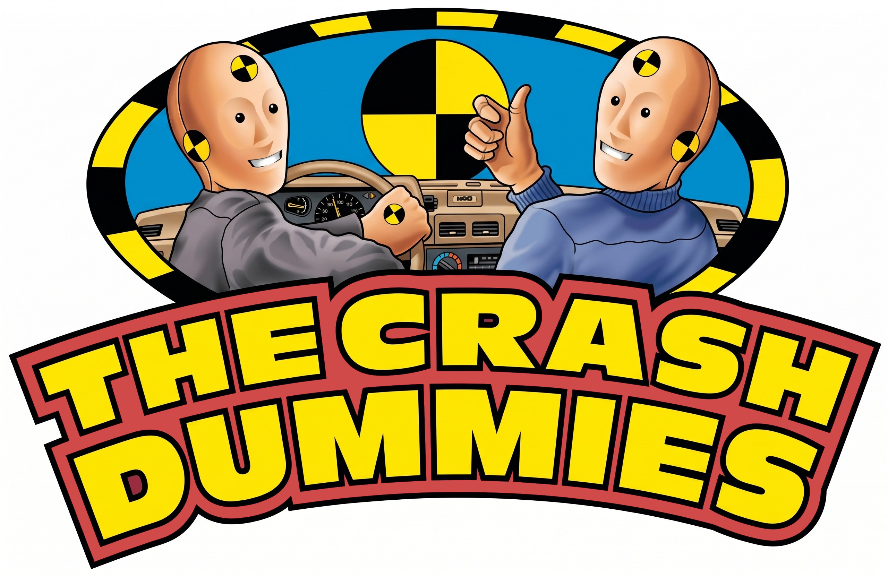
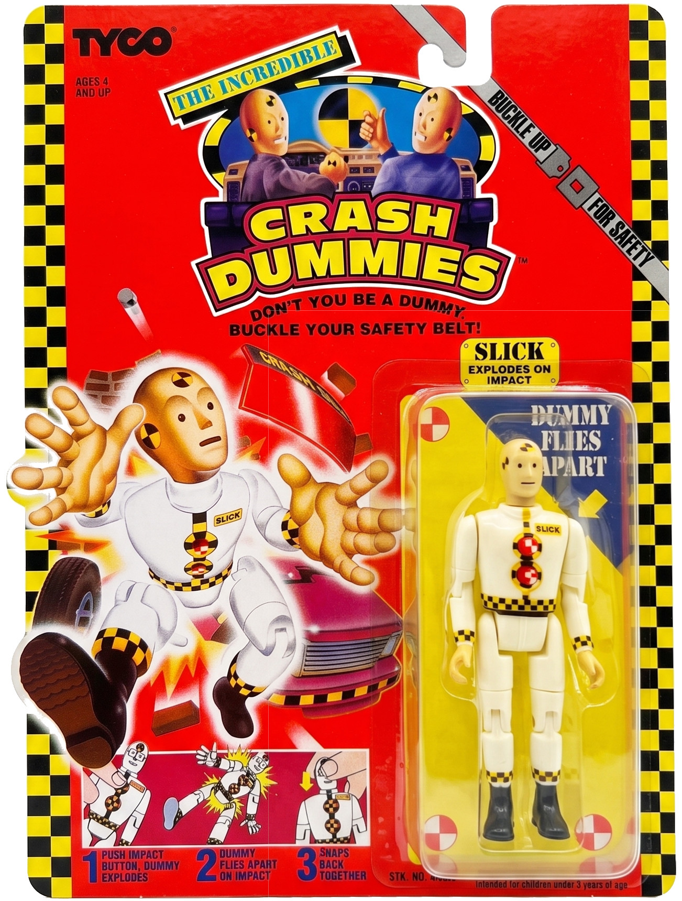

## ON TOY HISTORY
# The Incredible Crash Dummies: A Short-Lived Action Figure Line 
## Tyco Once Built Legendary Toys on a Federal PSA

---

## Tyco of Mount Laurel, Land of Vehicle Toys

**TYCO TOYS, INC. OPERATED** out of Mount Laurel, New Jersey. Its roots ran back to 1926 as Mantua Metal Products, a model-railroad maker founded by John N. Tyler, which rebranded under the Tyco banner through the 1950s.

By the late 1980s, Tyco had pivoted from HO-scale trains and slot cars into radio-controlled vehicles, preschool goods, and licensed girls' lines, ranking as the third-largest American toy company behind Mattel and Hasbro.

Richard E. Grey led the company through a public offering in 1986 and an acquisitive run that culminated in the 1989 acquisition of View-Master Ideal and the 1992 acquisition of Matchbox International. They had immense technical talent, such as engineer Neil Tilbor.

, J. Hamilton)](images/104-02.jpeg)

*The San Francisco Chronicle* wrote, "The [Tyco] stock is cheap because they've had several disappointing quarters, but the outlook for [the 90s] is bright," [said](https://www.newspapers.com/image/1226248488/) Paul Valentine, toy-industry analyst for Standard and Poors.

Into that portfolio, Tyco dropped a new boys' action line in the fall of 1991. The property was not a cartoon, a film, or a comic book. It was a federal highway-safety mascot that featured an anthropomorphic duo named Vince and Larry.

Nancy Blair of *Courier-Post*, [teased](https://www.newspapers.com/image/183185807/), "It's not 'don't do drugs,' but it's something like that, said [Tyco spokesperson] Bruce Maguire . . . Now, [Neil Tilbor will] concentrate on the launch of the action figure line, Maguire said."

Neil Tilbor, who had extensive racing and toy-car invention prowess, was vice president of Tyco's marketing and development for boys' toys. He oversaw the full production of Tyco's Crash Dummies.

---

## The Crash Dummies Unbuckled Launch

**THE CRASH TEST DUMMY CHARACTERS** were born from a 1985 campaign by the U.S. Department of Transportation's [National Highway Traffic Safety Administration](https://www.newspapers.com/image/183185807/) and the [Ad Council](https://www.adcouncil.org/), produced by the Leo Burnett agency.

The public-service spots starred two talking dummies, Vince and Larry, who crashed through windshields each week to deliver the tagline, "You could learn a lot from a dummy - buckle your safety belt," penned by Jim Ferguson.

YouTuber Zach R. [said](https://www.youtube.com/watch?v=nQdDa7gQnBo), "Both Jim Ferguson and Joel Machack, who at the time were both working for Leo Burnett's Chicago office, came up with the brilliant idea to bring crash test dummies to life." The PSAs ran for 14 years and, by the Ad Council's count, became one of the most recognized campaigns in American television history.

 of the Crash Dummies back in 1985.](images/104-03.gif)

The podcast *Ridiculous History* [said](https://omny.fm/shows/ridiculous-history/the-oddly-dark-history-of-crash-test-dummies-not-t), ". . . These life-saving creations spawned a weird cultural moment in the 90s–action figures where the head would pop up like Rockem' Sockem' Robots . . ." The toy's central loop was to break it on purpose and put it back together.

Under Neil Tilbor's marketing vision, Tyco licensed the characters, broadened the roster, and released The Crash Dummies in 1991.

The central feature was mechanical. Each action figure was built around a spring-loaded skeleton with click-in limbs, a click-in torso, and a click-in head. On impact, arms, legs, and head burst off in four directions, leaving a pile of plastic limbs that the child then reassembled for the next crash.

Part of a licensing deal between NHTSA and Tyco, the *San Francisco Chronicle* [wrote](https://www.newspapers.com/image/1226432260/), "Leisure Concepts gets between 3 percent and 6 percent of each Crash Dummies sale," and its success was admired by business legends like Mark Freedman of Surge Licensing Inc., a Long Island-based outfit famous for representing The Teenage Mutant Ninja Turtles.

Neil Tilbor, a legendary engineer turned executive, already had 15 years of experience in the business, having worked at Ideal Toy, which brushed up against [Jack Ryan](https://medium.com/@solidi/jack-ryan-and-ruth-handler-of-mattel-the-power-ballad-of-american-coffee-2c19994e6732) for a time, the inventor of Barbie and [Hot Wheels](https://medium.com/@solidi/push-play-and-put-em-away-the-hot-wheels-kid-powered-trains-and-planes-80f6c2edeb40). Neil had a part in [creating](https://patents.google.com/patent/US4247108A/en) Total Control Racing, a slotless car toy technology.

).](images/104-04.jpeg)

In the mid-1980s, Mr. Tilbor joined Tyco as an inventor and, eventually, a silent leader of an endless parade of R/C vehicles recognized by children at the time. His last project at Tyco, The Crash Dummies, was memorable to millions of boys.

Alongside Maureen G. Souza for girls marketing, "[Tilbor] oversaw Tyco's successful radio control, electric trains racing business for the past four years and served most recently as vice president of marketing," wrote *[The Times](https://www.newspapers.com/image/1199444641/)*.

The line of action figures arrived with television and retail support. Tyco placed it at the front endcap of the Toys 'R' Us action figure aisle through the 1991 and 1992 holiday season. The toy press covered the line favorably. *Playthings* and *Toy & Hobby World* flagged it as one of the best toy introductions of the time.

 from 1991 to 1994.](images/104-05.gif)

"Tyco is banking on its Incredible Crash Dummies to capture the hearts of boys and girls who love to play 'smash and crash,' . . ." [said](https://www.newspapers.com/image/168139904/) Tyco executive Neil Tilbor.

Before they went to production, the single female figure, Darlene, was cut due to poor kid testing. "'So Darlene became Daryl. He still has a strangely shaped chest,' says Neil Tilbor, the head of research and development for Tyco's boys' unit," he said to *Newsweek* in 1992. Prototype photos freely circulate on the Internet [today](https://www.videogamesage.com/forums/topic/3835-incredible-crash-dummies-collection/).

---

## Critical Reception and Media Sideswipe

**THE CRASH DUMMIES OF TYCO** had a mixed reception. Tyco expected to reach up to [$50 million dollars](https://www.newspapers.com/image/177322910/) in product sales the first year. However, the *Daily News* [wrote](https://www.newspapers.com/image/469335392/), "Some critics say kids may get the wrong message that they'll have more fun if they don't use the safety belts."

During the initial success, there was concern from the NHTSA and the Ad Council. *Articulated Points* [noted](https://www.youtube.com/watch?v=GE-kfVqRYzI&t=200s), "The big point of division . . . the three major networks, NBC, CBS, and ABC, refused to air the next series of Vince and Larry crash dummy PSAs because . . .  there was a conflict of interest."

, Richard Rosenberg)](images/104-06.jpeg)

"They felt that free air time that was being given to the public service announcement was also serving as free air time for a commercial for toys, which, as you can imagine, probably caused some problems with their other advertisers."

The *Los Angeles Times* picked up the retail drama. They [wrote](https://www.newspapers.com/image/177322910/), ". . . DOT reportedly pulled out of the deal because it feared that the safety message was getting lost. Tyco then changed the names of the crash test dummies from Vince and Larry, used by the Ad Council, to Slick and [Spin]."

*The Sun-Journal* [replied](https://www.newspapers.com/image/831506469/), "Tyco Toys said it will not withdraw [the] Incredible Crash Dummies, as requested by the Ad Council . . . Tyco maintains it includes safety pamphlets with the toys."

).](images/104-07.jpeg)

Thus, the rebrand of "The Incredible Crash Dummies" appeared. Neil's team included a Piston-Head Pro Boxer ring, a Bust-'Em Up Bronco, and a Junkbot villain set. The heroic squad - Slick, Spin, Axel, Pro-Tek, Ted, Flip, and Spare Tire - crashed on the side of safety.

The Junkbot faction, led by a grease-smeared and pea-sized red-eyed antagonist, Junkman, alongside his associates Piston Head, Jack Hammer, and Sideswipe, crashed into the Dummies for the love of mayhem.

To spice up the action, the thirty-minute computer-animated special, *The Incredible Crash Dummies*, aired on Fox in the spring of 1993, produced by Lamb & Company in Minneapolis, one of the earlier fully CGI half-hours made for American broadcast.

And Flying Edge and LJN released Incredible Crash Dummies video games for the NES, Game Boy, Super NES, and Sega Genesis in 1993 through a license from Tyco.

.](images/104-08.gif)

Tyco's own press releases reported the Crash Dummies as a top-ten boys' action brand for the holiday of 1992. Its peak retail run spanned roughly three years, 1991 through 1993, with clearance runs extending into 1994.

But the brand's extension wasn't well-received by everyone. YouTuber, *Nostalgia Nerd* [lamented](https://www.youtube.com/watch?v=x8isuytbVKY), "In '93 they became pretty obscure and had like rebranded suits which looked nothing like Crash Dummies. And then in late 93–94 they just turned into utter shit."

---

## Mechanically Special, a Racing Champion

**NEIL TILBOR LEFT TYCO** in the Spring of 1992 and followed his passions as a professional race car driver and independent consultant in toy making.

In the early 2000's, through his success in winning the SCCA Sports Car title, he attracted names like Dale Earnhardt Jr. and grew a multi-million-dollar toy racing business, working with Tyco colleague and partner Mick Hetman to develop radio-controlled cars under the Taiyo Edge R/C brand.

*Daytona Beach News-Journal* [wrote](https://www.newspapers.com/image/1229712100/), "Tilbor, formerly an executive at Ideal Toy, has built his own $20-million-a-year toy business in just four years, concentrating on the growing popularity of radio-controlled gadgetry."

, Joanna K. Olivari).](images/104-09.jpeg)

Neil's work on toy history is important, but often not discussed. The mechanical design of the Crash Dummies is a piece of industrial archaeology worth preserving. Most action figure lines of the era - G.I. Joe, [M.A.S.K.](https://www.newspapers.com/image/1229712081/), [Micro Machines](https://medium.com/@solidi/micro-machines-a-small-chronicle-ce45005eafd2) - rewarded accumulation: more figures, more vehicles, more packaging backed with storied lore. The Crash Dummies rewarded destruction and reassembly.

The skeleton tooling achieved that loop without small parts that a child would lose on a carpet. Limbs clicked into sockets that held through a crash and released cleanly. The joints were oversized, almost cartoonish, because the engineering priority was not articulation - it was reliable detachment and re-attachment, over hundreds of cycles, by a seven-year-old.

The line shares a design lineage with Kenner M.A.S.K. transformation mechanics and the spring-loaded action of TOMY's mechanical catalog - function first, sculpt second.

 to the Crash Dummies line up.](images/104-10.gif)

The property also carried a civic layer that other action lines did not. The license required the figures to buckle up. Packaging copy reinforced the PSA tagline. A boy smashing a Crash Cab into the living room wall was, in the most circuitous way imaginable, absorbing federal highway-safety messaging.

The toy line also explored fringe areas of toy-like sadomasochism. *[Keepers of Nerdom](https://www.youtube.com/watch?v=igQo9yWfCO0&t=738s)* said, "I mean, [the Crash & Bash Chair] is literally like a torture device, very, very, very strange . . . here's all this crash test equipment and we are literally just going to strap them to an ancient medieval torture device and pull them apart. I think they kind of just lost their minds . . ."

---

## A Smashing Legacy and a Crash Out

**ONCE JAMES L. BLOCK TOOK OVER** Neil's position at Tyco, the brand's decline was not dramatic; it was ordinary. By late 1993, retailers were marking figures down. The 1994 assortment shipped into a category dominated by *Power Rangers* and *Mighty Max*, and the novelty of the break-apart action did not carry over into a fourth year.
 
Tyco quietly wound the line down and redirected its action dollars to R/C vehicles and the Matchbox integration.

Tyco itself followed the Crash Dummies into history. Mattel acquired Tyco in March 1997 for roughly $755 million, absorbed the Matchbox and R/C lines, and shuttered the rest. The Vince and Larry PSAs ran until 1999, when NHTSA retired them in favor of a new campaign.

)](images/104-11.jpeg)

After a short rest, Mattel Inc. relaunched the Incredible Crash Dummies in 2004, having acquired the brand in the late 1990s. YouTuber Johnny Tbird [said](https://www.youtube.com/watch?v=fmUIMdSwBFg), "The 2003 line didn't capture the same magic [as the originals,] . . . and the slapstick destruction gimmick just felt dated. The revival fizzled out after about a year."

Mattel remains protective of the brand. In 2010, Mattel fought a third party to preserve the legacy and prevent a trademark takeover [involving](https://www.courthousenews.com/mattel-retains-rights-to-crash-dummies/) a potential Crash Dummies movie. That same year, Vince and Larry were inducted into the Smithsonian.

Now, the toys live on in collector boxes and eBay lots, where a loose figure sells for twenty dollars and a mint Crash Cab sells for hundreds. No reissue has emerged. No nostalgia wave has lifted them.

What is true is that these toys break down. *Nostalgia Nerd* continued his [grievances](https://www.youtube.com/watch?v=x8isuytbVKY), "Many of these toys . . .  fail late in their lives because they're held in by little metal clips in there, and they fail, unfortunately. So, as the toys [get] older, they [get] crappier."

The Crash Dummies remain what they were: a three-season action line built on a fourteen-year PSA, engineered around a single good idea, sold honestly, and retired on time. During this time, national seat belt usage rates [rose](https://www.youtube.com/watch?v=Jns3uSWs3d0&t=12s) from 14% in 1985 to 79% by 1997.

"If we can use the fun of playing to help children realize the need to wear safety belts, we've accomplished something positive," said Mr. Tilbor to [*The Star*](https://www.newspapers.com/image/538022043/) in April 1992.

, circa 1992.](images/104-12.gif)

Neil continued, "Wearing safety belts saves lives, and we hope our line of toys will help children and their parents understand the importance of The Incredible Crash Dummies' safety message."

After Tyco, personal issues got in the way of Mr. Tilbor's toy ascent, and, contrary to endorsing NHTSA's messaging, he was later involved in a dangerous police chase following a dispute, which led to further run-ins with the law. His last toy company, Leynian Ltd. Co., defaulted under the weight of lawsuits.

While Mr. Tilbor was later charged with panhandling, he was the man behind the Crash Dummies toys and engineered work with [Shohei Suto](https://www.fabtintoys.com/taiyo-rc/) for Tyco R/C products in the 20th century, including the Typhoon, [Fast Traxx](https://patents.google.com/patent/US5135427A/en), [Hi-Jacker](https://patents.google.com/patent/US5322469A/en), the Hammer, Eliminator, and the [Scorcher](https://patents.google.com/patent/US5429543A/en), earning Tyco hundreds of millions of dollars during its extended run.

Like Vince and Larry, Neil's team has left a lasting impression, which "directly contributed to the dreams, experiences, and wonderful memories of millions of children all across the 90s," [said](https://tycocollectors.com/who-invented-your-favorite-childhood-rc-toys/) Ozzy of tycocollectors.com.

---

*See this author's book, [Undercover Toy Stories](https://www.amazon.com/Undercover-Toy-Stories-Anthology-Inventions/dp/B0FR9RVRVH): An Anthology of Real American Inventions, [available now](https://www.amazon.com/Undercover-Toy-Stories-Anthology-Inventions/dp/B0FRB318L4), which contains other fascinating stories of American industrial archeology, reverent of its designers and engineering, telling tales as it was.*

---

---

## Social Post

"Neil Tilbor, who had extensive racing and toy-car invention prowess, was vice president of Tyco's marketing and #development for boys' toys. He oversaw the full production of Tyco’s #Crash #Dummies."

This post provides a brief overview of how Vince and Larry came to be, the Incredible Crash Dummies toys that followed, and their eventual decline and crash-out.

https://medium.com/@solidi/the-incredible-crash-dummies-a-short-lived-action-figure-line-49868b72f9a0