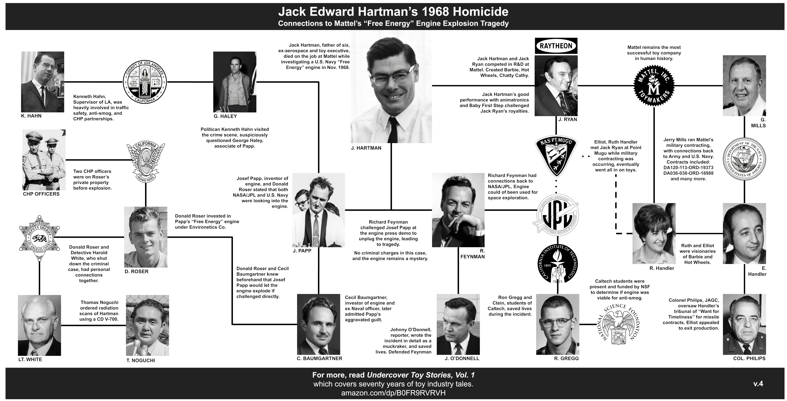
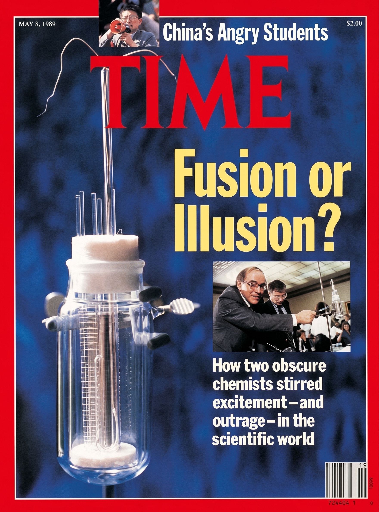
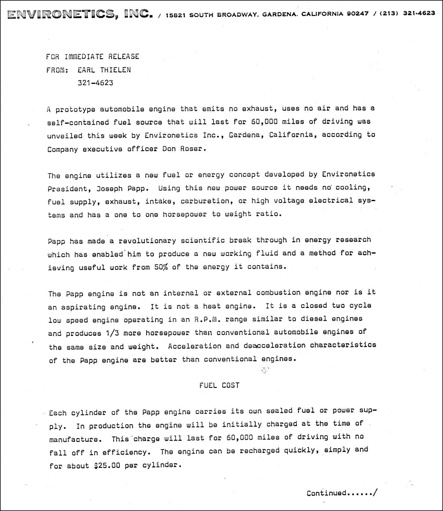
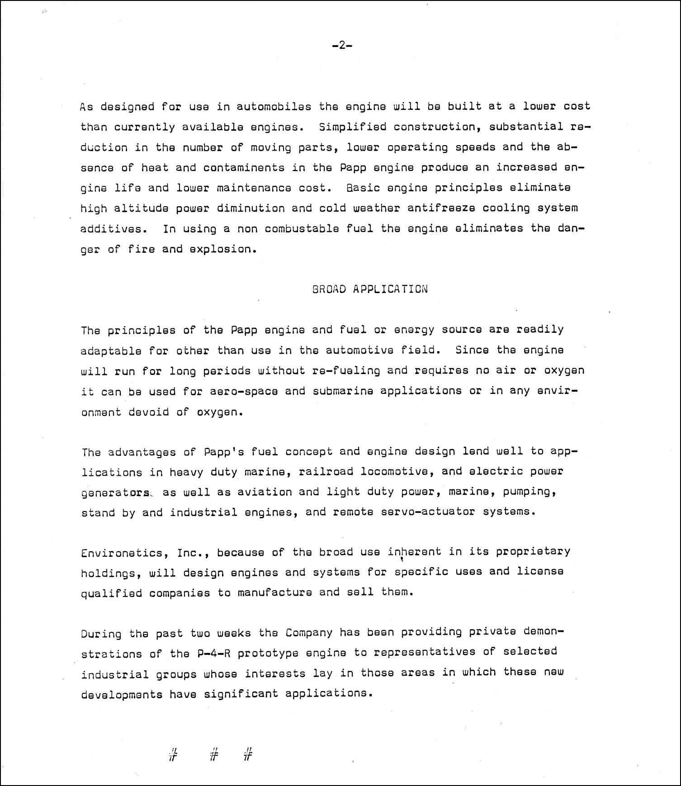
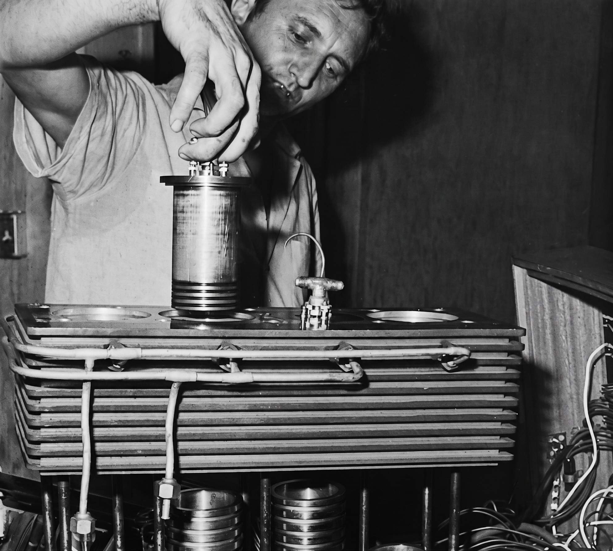
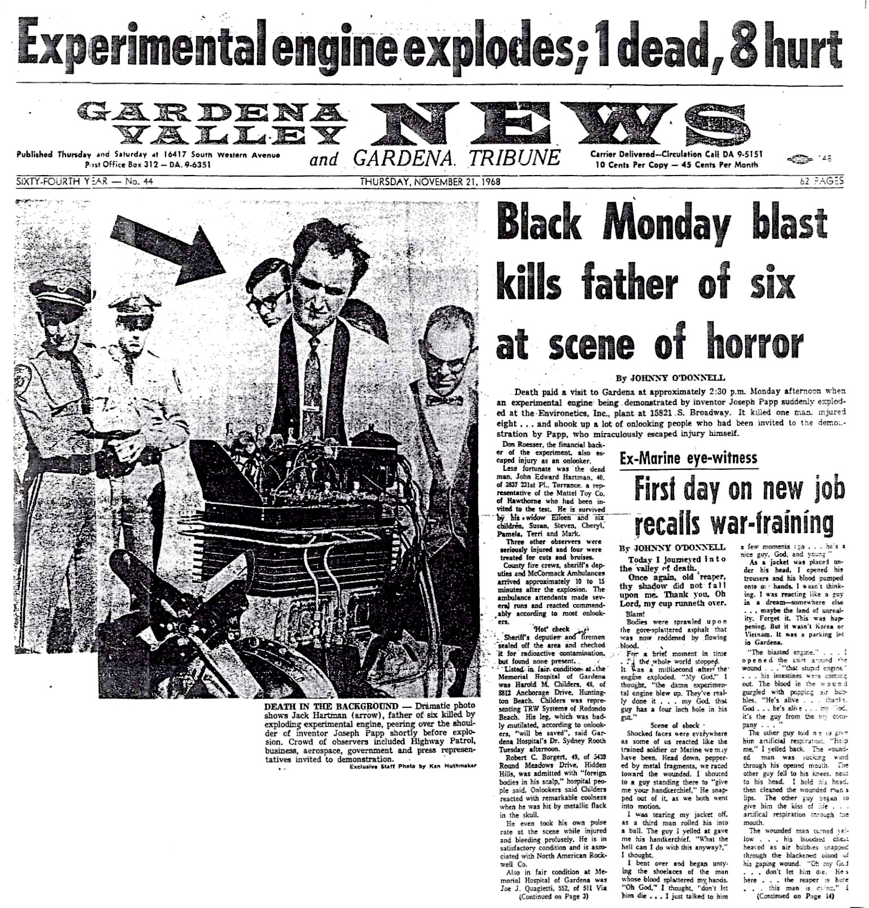

## ON SCIENCE AND INDUSTRY
# Jack Edward Hartman: The First Homicide of Free Energy
## 11 Scientists Recently Dead or Missing, Growing the Historical List
#CurrentEvents, #History, #Mattel, #Science, #Investigation

---

*This essay discusses a recent cluster of dead and missing American scientists, in contrast to ex-MIT's Eugene Mallove's 2004 murder and the 1968 homicide tied to an aerospace engineer and once Mattel's Preliminary Design VP, Jack Edward Hartman. Reader discretion is advised.*

---

## Smerconish: A List, Not a Pattern

**THREE YEARS, ELEVEN NAMES.** American scientists at top-clearance laboratories - anti-gravity propulsion, aerospace materials, plasma fusion, nuclear-weapons security, classified astrophysics - have turned up dead or vanished. The press has noticed, and the White House has commented. The group of individuals may just fit a Cold War paperback, forty years after it ended.

In June 2022, Amy Eskridge died by suicide. The *NY Post* [reported](https://www.youtube.com/watch?v=eRbKmurePrs) that Eskridge "Researched anti-gravity for her company, the Institute for Exotic Science in Alabama." Her field, anti-gravity propulsion, sits at the rim of credentialed science.

NASA's Jet Propulsion Laboratory in Pasadena lost three in three years. Michael David Hicks, a research scientist, died in July 2023; the cause was never released. Frank Maiwald mysteriously followed a year later. Then, aerospace engineer Monica Reza vanished while hiking in June 2025.

Per the *NY Post*, Reza's research drew funding through the Air Force Research Laboratory at Wright-Patterson - the Ohio base is known to be "historically associated with the Roswell [UFO] debris."

Then, two from Los Alamos National Laboratory vanished weeks apart. Anthony Chavez vanished from his home in May 2025. Melissa Casias, an assistant at the same laboratory, disappeared a month later.

Some conspiracy theorists link these cases back to "anti-gravity," "free energy," and other applied materials that would disrupt the world powers, and thus these researchers exert pressure on the powers that be, and so they are "managed."

)](images/105-02.jpeg)

In August 2025, Steven Garcia, who worked security for a producer of non-nuclear components in American-made nukes, vanished. Then the homicides began. Four months later, Cláudio Manuel Neves Valente shot and killed Nuno F. Gomes Loureiro - physicist, Director of MIT's Plasma Science and Fusion Center. Two months after that, Caltech astrophysicist Carl Grillmair was shot and killed by Freddy Snyder.

Strange events quickly followed. In February 2026, Major General William B. MacCasland, who oversaw advanced aerospace programs at Kirtland Air Force Base in New Mexico, disappeared from his home. A month later, Jason Thomas, head of chemical biology at Novartis, was found dead in a lake; the cause was unknown.

With these eleven names, the U.S. Congress applied pressure. Representative Eric Burlison (R-MO) [demanded](https://www.foxnews.com/media/rep-burlison-demands-fbi-probe-top-us-scientists-vanish-turn-dead) an FBI probe. He said, "This is too coincidental. And so we have to be investigating this. We need to have our nation's top investigators . . . looking into this matter."

Former FBI assistant director Chris Swecker stepped in and [told](https://archive.is/Dzkpe) the *Daily Mail*, "They can't have these examined in isolation and compartmentalize them as individual missing person cases." He went further, "You can say these are all suspicious . . . these are scientists who have worked in critical technology."

But the top powers in the American Federal Government cooled the room. *Newsweek* [carried](https://www.newsweek.com/trump-says-not-much-connection-between-missing-dead-experts-11901230) President Trump's comment, "Some of them that we looked at are very sad cases . . . So far, we're finding that there's not much of a connection. We'll let you know." The *NY Post*, in a follow-up [piece](https://nypost.com/2026/03/27/us-news/another-vanished-official-could-be-tied-to-missing-and-dead-us-scientists-report/), stated the same, ". . . there is no direct connection to their cases."

These clusters of persons caught the attention of conspiracy-leaning podcasters. Joe Rogan [said](https://www.youtube.com/watch?v=GNWUQYi027Q), "There are scientists that gotten whacked and/or missing, and a couple of generals as well. They're all connected somehow or another to UFO technology and anti-gravity technology, and nuclear scientists." Comedian Tim Dillon [followed](https://www.youtube.com/watch?v=CbTClgpMqak), directed at those in the industry, "Your choice was to live an interesting life, and that's why right now, you're chloroformed in the back of a car."

The YouTube sphere continued to speculate. Physicist Sabine Hossenfelder [observed](https://www.youtube.com/watch?v=WEnvorobhEE), "Over the past three years, eight people connected to high security research programs in the U.S. have disappeared or died. It's either a remarkable coincidence or something else is going on . . . What, if anything, connects these people? Not much, really."

)](images/105-03.jpeg)

And there are the mainstream skeptics, such as Michael Smerconish of CNN, who [shut down](https://www.youtube.com/watch?v=HqjuUBgxjjA) the conspiracy theorists. He said, "But I'm not seeing a connection in the way others are seeing a connection . . . It's not a pattern, it's a list."

This author can only come up with a truism to connect these tragedies. "Things" in these scientists' pasts likely led to their demise. This is nothing new, for example, with MIT writer and "free energy" defender Eugene Mallove, who also succumbed to his past. The link was his childhood home; he was connected to MIT, and like Amy Eskridge, he challenged conventional scientific wisdom.

---

## Mallove: The Driveway in Norwich, Connecticut

**EUGENE MALLOVE WAS ELITE**, trained in astrophysics from MIT. He was the science writer-in-chief for the school's news office, the founder of the magazine *Infinite Energy*, and a public defender of the disputed claim known as Cold Fusion, that "free energy" can be harnessed from a simple chemical process. Before his murder, he spoke to George Noory on Coast to Coast AM about a "free energy" engine. A month later, two men beat him to death.

The driveway where Mallove was murdered sat on a turnpike in Norwich, Connecticut, his childhood home. As he was hauling junk to the garbage, *WTNH News8* [reported](https://www.youtube.com/watch?v=V2q8nvRL2kc), "[Mozzelle] Brown was with his other cousin, Chad Schaefer . . . [They] drove by the Salem turnpike home, Schafer used to rent, and saw Mallove throwing things in a dumpster. They reportedly confronted him and then beat him . . . leaving him to die."

Mozzelle Brown and Chad Schaefer drew a metal pipe found in the garage. The *Mr. Ballen Podcast* [described](https://www.youtube.com/watch?v=S9hxBmSPN7s) the scene. "After a fight, Eugene finally fell to the ground face-first . . . [the assailants] took turns beating him literally into the ground with a metal pipe they found on the floor of the garage."

The podcast delivered the official line in one sentence. "Eugene's murder had nothing to do with Cold Fusion," but the grounding reality of a landlord-tenant dispute, prosecutors found. The robbery was a coincidence in timing, and Mr. Mallove was in the right place but at the wrong time.

As with the 11 scientists of today, Mallove's demise has many narratives. A conspiracy lane runs alongside, paved with no admissible evidence. YouTuber PeterLang777 [said](https://www.youtube.com/shorts/i1o9M8_naRQ), "Eugene Mallove was later killed in a [hand quotes] burglary at his house. The actual people behind it were the Jason Group, which is run by the MITRE Corporation, a spin-off of the MIT Lincoln Labs."

Mr. Mallove backed alternative science in the face of convention and directly confronted MIT in a public spat, claiming that MIT purposefully rounded off measurements and debunked cold fusion. Then he went on a crusade to right the perceived wrongs the establishment had inflicted.

David Kushner, a famous author, picked up the case. In 2023, he launched a podcast discussing the gruesome murder and [said](https://www.instagram.com/reel/Cz3maJHsefl/), "How do you really pursue something you're passionate about, that you really believe in, when all of the forces seem to be conspiring against you?"

Eugene continued to fight the scientific establishment to his very end, giving the finger to mainstream science. He would go so far as to spend an hour on Coast to Coast AM in February 2004, walking the audience through a homicide nobody recognized and questioning Richard Feynman, a renowned scientist.

This author [replayed](https://medium.com/@solidi/jacks-injustice-corruption-within-the-state-of-california-9725cd0476eb) his conversation in *Jack's Injustice: Corruption Within The State of California*. Eugene said, "[The engine] exploded and killed one person, an engineer from the Mattel toy corporation." Eugene went on to say that the incident occurred in "Gardena, California, at the company Environetics."

Mr. Mallove framed the conclusion of the weird engine, "There are two possibilities here: either the explosion was real from a physics anomaly, or some agency in 1968 was completely incompetent in investigating."

, John Penny / [Pictures of Infinity](https://picturesofinfinity.net/home/).)](images/105-05.jpeg)

Mallove had some type of access to the historical incident; many did not at the time. He had numerous testimonies, including an ex-Navy witness he had interviewed, which the U.S. Navy and NASA/JPL were looking into at the time. But a month after the broadcast with Mr. Noory, that access ended, and Eugene was murdered in cold blood.

Twenty years later, Mozzelle Brown’s conviction for Eugene’s murder was overturned on appeal due to a Brady violation. And thus, Eugene's legacy continues in modern media. Mr. Brown has held that he did not murder Mr. Mallove, as prosecutors are planning for a [new trial](https://www.unionleader.com/news/courts/new-trial-mulled-after-conviction-in-murder-of-nh-cold-fusion-scientist-overturned/article_d8f89617-68bb-4166-b33e-0ec44859f3c7.html).

And as Joe Rogan spoke about the 11 scientists, Eugene's story is the same. Mr. Rogan [said](https://www.youtube.com/watch?v=GNWUQYi027Q), "Like what these people were working on was very extraordinary and could disrupt a market?" Mr. Mallove investigated an automobile engine that would disrupt the market, too, while he told the original tale of a slain aerospace engineer involving the co-inventor of the nuclear bomb, in a California parking lot, to a wider audience.

---

## Hartman: The Parking Lot In Gardena. November 18, 1968.

**JACK EDWARD HARTMAN WAS BORN** on Christmas Day, 1927, in Indiana. He graduated from Purdue's aeronautical engineering program in 1949, a senior to Neil Armstrong, who worked on the X-15 hypersonic aircraft program, and contracted with Walt Disney's animatronics. Jack joined Mattel after Ruth Handler, the visionary of Barbie, recruited him through her military and aerospace contacts.

Jack Hartman and Monica Reza, generations later, shared similar trajectories. Jack questioned the boundaries of science, aligning with someone like Amy Eskridge, and he questioned his role in aerospace, wanting a bigger impact on society. At the time, toys were that outlet.

At Mattel, Mr. Hartman ran Preliminary Design - "Prelim" - a research pipeline the Handlers built as a counterweight to Jack Ryan's group, challenging his royalties. At the time of the incident, Jack chased a propulsion problem a child cared about: how to drive a Hot Wheels car uphill. The Sizzlers line - battery-powered Hot Wheels-eventually emerged from that floor.

On Monday, November 18, 1968, at around 2:00 PM, Mr. Hartman walked into an L-shaped lot in Gardena on North Broadway, California. The lot belonged to Donald Roser's Environetics, Inc., and a press demonstration starred a sealed-cylinder engine designed by Hungarian-American inventor Josef Papp - what the trade press of the day called a "noble gas engine."

The pitch was extraordinary. Per the *Redwood City Tribune*, the month before, the engine "emits no exhaust, uses no air, and has a self-contained fuel source that will drive a car 60,000 miles."

But when a bystander took actions that challenged the demonstration, the engine exploded. A fragment struck Hartman in the lower back. Onlookers - Caltech's Richard Feynman among them - escaped the trajectory. KHJ-TV9 cameraman Del Linam kept rolling. Reporter Johnny O'Donnell of the *Gardena Valley News*, on his first day, took a head wound and remained at his typewriter for three days afterward.

[From](https://medium.com/@solidi/a-tragic-american-toy-story-f0c19e58534e) *A Tragic American Toy Story*, O'Donnell's account survives, ". . . I just talked to [Jack] a few moments ago . . . he's a nice guy, God, and young." And the whole scene was filmed, as it was a presser. However, that film has suspiciously never surfaced, likely destroyed, or locked up in protective archives.

Within twenty-four hours, the Los Angeles County Sheriff's Department reclassified the death from criminal investigation of a fantastical engine to "excusable homicide." From *Jack's Injustice*, this author wrote, "Authorities had relationships, money, and good names on the line. And within twenty-four hours, the incident shifted from a criminal investigation to an accident, which made no sense."

Two California Highway Patrol officers stood on private property, before the incident, without statutory cause. Men in dark suits took notes, and that bystander was a famous scientist, Richard Feynman, co-inventor of the atomic bomb, as AP and UPI wires scrubbed his name. A single contemporaneous full account ran in the *Gardena Valley News* on November 21, 1968, written by Johnny O'Donnell, who was injured in the incident.

The case gets strange because, to understand the reason Mattel was at the demo with defense industry giants, a reader needs to reason with the impossible information that follows.

Mattel had a subsidiary, Mattel Engineering Company, that listed "guided missile devices" in its articles of incorporation. The pipeline drew engineers from Northrop, North American Aviation, TRW, and Caltech's Jet Propulsion Laboratory, a short drive from the airframe plants.

[From](https://medium.com/@solidi/before-barbie-mattel-engineering-company-guided-missiles-and-the-cold-war-cdccfc05d192) *Before Barbie, Mattel Engineering Company, Guided Missiles, and the Cold War*, Tarpley Hitt of *Barbieland* observed, "Mattel's proximity to national security's toy makers was not just some accident of real estate, but the natural by-product of a corporation that has always invited comparisons to the defense industry."

Ms. Hitt was right on the money, as Mattel's government connections were confirmed, and a military tribunal appeal document was discovered in April 2026. Mattel had U.S. Navy connections, as did the noble gas engine.

In this author's [essay](https://medium.com/@solidi/the-ultimate-hot-wheels-legend-0e3b9e2b2d88), *The Ultimate Hot Wheels Legend*, "Mr. Papp's engine was patented. It is considered an 'over-unity' device, sourcing energy from the unknown." And from *Jack Ryan and Ruth Handler of Mattel: The Power Ballad of American Coffee*, this author [declared](https://medium.com/@solidi/jack-ryan-and-ruth-handler-of-mattel-the-power-ballad-of-american-coffee-2c19994e6732), "Hartman was killed with aforethought and with malice by the negligent actions of the engine inventors. And there is modern evidence of foul play."

Whether there is a cover-up of the Gardena incident beyond the Caltech insurers and Mattel's deep pockets remains unproven. The official "accident" framing fails to account for the evidence. Mr. Hartman is, per the essay, "America's 'Jack' of Toyland - an untold tangled American cover-up," which was first unveiled directly by Eugene Mallove to a modern audience.

To this author, the Hartman homicide appears to be primarily a case of corruption, with the physics of the matter remaining a mystery, with its last investigative notes resting with Eugene Mallove.

---

## Arcuri: One List, and a Growing Number of Names

**THE AUTHOR AGREES THAT** the recent events of the 11 scientists read as a list rather than a pattern. Each name carries its own tale, and the stories diverge - fusion physics here, anti-gravity there, a missing nuclear-component security guard, an astrophysicist by murder, a major general by disappearance.

The grief of a country watching its scientists vanish is real, and grief feeds apophenia, which the press is covering. The FBI will likely investigate and attempt to find a connecting wire, if one exists. And Sabine Hossenfelder said it best-"What, if anything, connects these people? Not much, really."

Is the Gardena case the exception? Well, eyewitnesses spoke on the record, and a reporter wrote the drama the night of the explosion. A Nobel laureate stood within shrapnel range, unplugged the wire, then vanished. A sheriff's department reclassified manslaughter as an accident within twenty-four hours.

Then, thirty-five years later, a corroborating historical witness - Eugene Mallove- who broke it all open again - died beaten in a Connecticut driveway a month after he outlined the case on national radio.

Jack Edward Hartman, age forty, in Gardena, California, was the first homicide officially on record to perish by "free energy." He was an aerospace engineer to die, but he never received justice. And to each of those 11 who were wronged sixty years later, from Amy Eskridge to Monica Reza, their dramas are yet to be discovered - by authors who are brave enough in this new age of disclosure.

*- For Gene.*

---

*See this author's book, [Undercover Toy Stories](https://www.amazon.com/Undercover-Toy-Stories-Anthology-Inventions/dp/B0FR9RVRVH): An Anthology of Real American Inventions, [available now](https://www.amazon.com/Undercover-Toy-Stories-Anthology-Inventions/dp/B0FRB318L4), which contains other fascinating stories of American industrial archeology, reverent of its designers and engineering, telling tales as it was.*

---

---

## Social Post

"Jack Edward Hartman, age forty, in Gardena, California, was the first homicide officially on record to perish by 'free energy.' He was an aerospace engineer to die, but he never received justice."

This post sets the recent cluster of eleven dead and missing American scientists against the 1968 unsolved homicide of Mattel's Preliminary Design VP, Jack Edward Hartman, at the Papp engine demonstration in Gardena, California - the first homicide of "free energy," and the case Eugene Mallove was prepared to reopen on national radio a month before his own murder in 2004.

https://medium.com/@solidi/jack-edward-hartman-the-first-homicide-of-free-energy-53c829bd47c7

#history #freeenergy #mattel #coldfusion #aerospace
