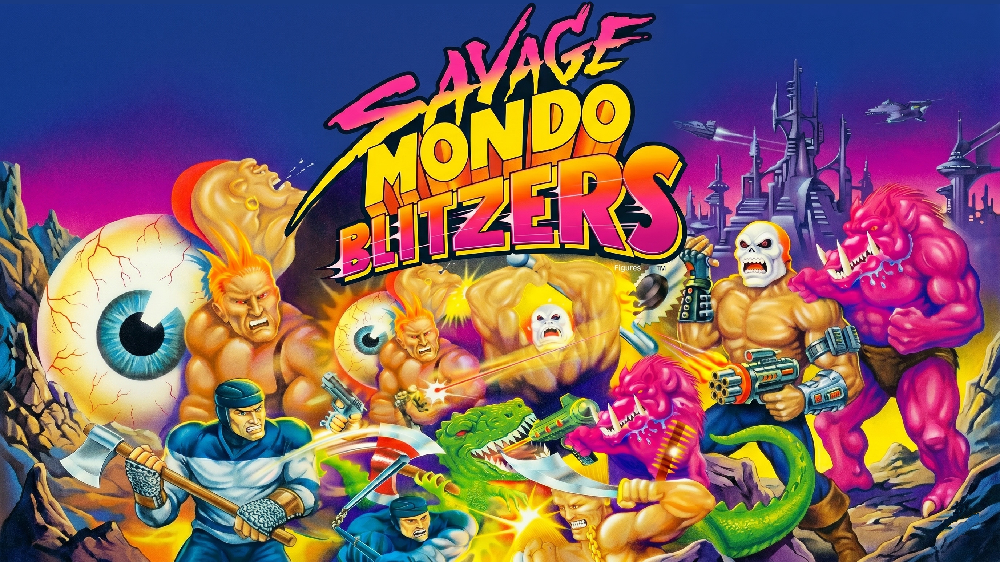
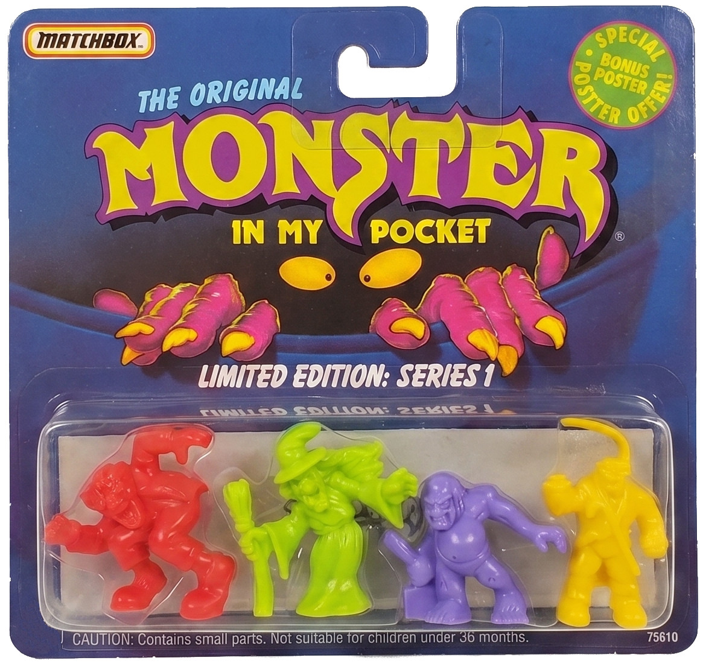
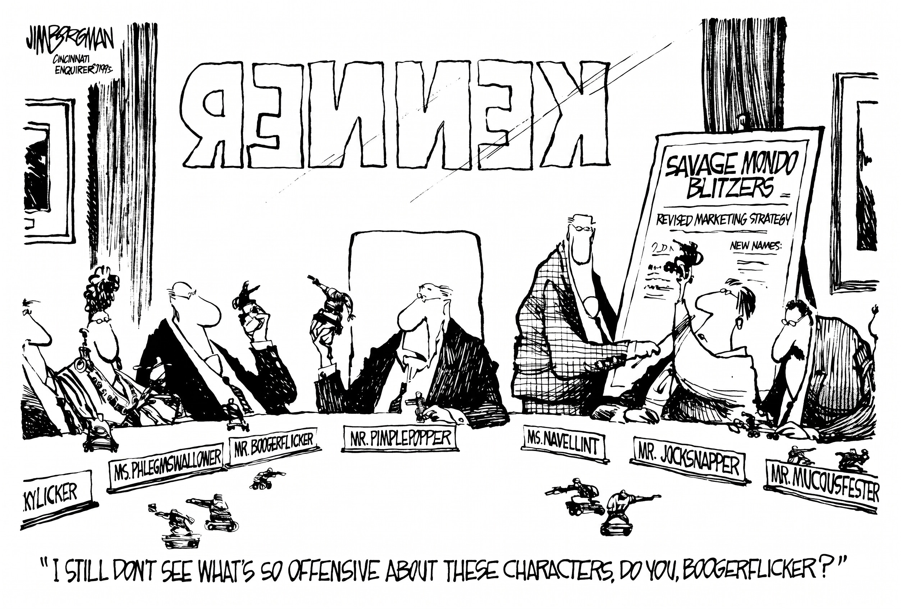
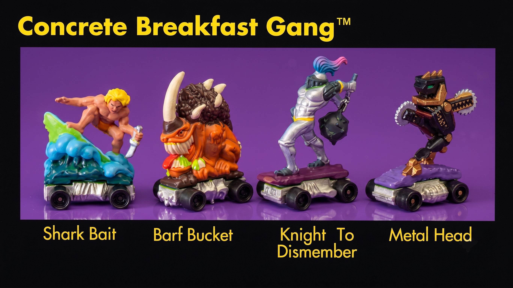
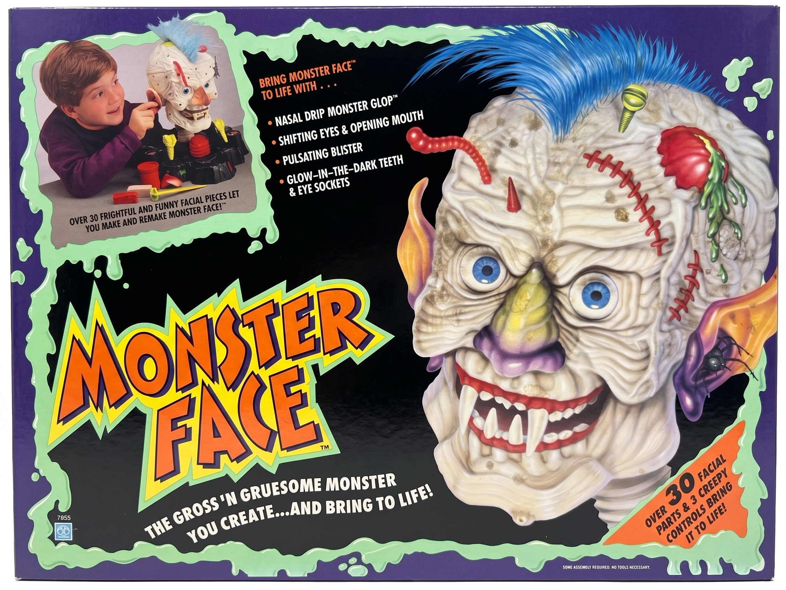

## ON TOY HISTORY
# Polluted Minds: The Savage Mondo Blitzers
## The Story of Kenner's Skateboarding Goons That Lit Up Loveland Teachers

---

## Disgusting Wares and Their Corporate Bets

**SINCE THE MID-TWENTIETH CENTURY**, American gross-out toys have climbed in popularity, each uglier than the last.

Arguably, Mattel started the new trend with Slime, a green ooze in a plastic trash can, synthesized by chemist Wally Shapero. Sid Krickheimer of the *South Florida Sentinel* [wrote](https://www.newspapers.com/image/236577846), "Within the first three years of production (1976–1979), about 30 million cans of original Slime were sold."

"Today's cringing parents were yesterday's pranksters, getting their jollies . . . at their parents' expense with disgusting fake vomit, vampire blood, and whoopee cushions," Mr. Krickheimer [wrote](https://www.newspapers.com/image/236577840/). Adults recoiled as kids bought into the trend.

Then monsters were added to the list of "gross." Garbage Pail Kids by Topps followed in 1985, with yuck artwork on signature cards. The newspaper, *Newsday*, [noted](https://www.newspapers.com/image/709297862/), "Back then [in 1986], Garbage Pail Kids suffered a backlash from parents who thought gross-out humor was detrimental to kids."

A year later, AmToy's Madballs arrived, grotesque, squishy balls that children threw at each other. Neal Ruben, picked up in the *Connecticut Post*, [reported](https://www.newspapers.com/image/1251305331/), "'Those gawd-awful Madballs' . . . They're the most high-profile example of the ugly turn the toy industry has taken over the last two seasons."

"Parents hoping for relief from Garbage Pail Kids haven't found it." And while every single American toy company profited from crude products, Hasbro, a major toy company located in Rhode Island, sat on the sidelines.

Following Food Fighters and Toxic Crusaders, mixing food, slime, and ugly monsters in the late 1980s, Creepy Crawlers, a plastic goop-insect-making machine invented by Mattel, was reissued by Toymax in 1991.

)](images/106-03.gif)

And so the gross-out-monster theme was experiencing a fever pitch, and with the release of R.L. Stine's junior horror series, Goosebumps, and the success of former Mattel executive Joe Morrison's [Monster In My Pocket](https://rikcw.medium.com/my-secret-history-with-monster-in-my-pocket-ea54e9a5b5d9),  the stage was set.

With the American recession of 1991 squeezing the toy aisle, Bruce Stein, president of Kenner, [announced](https://www.newspapers.com/image/102117320/) labor cuts in October. ". . . These moves ensure that both our division and our company will remain strong, productive, and competitive on a go-forward basis."
 
The toy design floor felt every word of the press release as Kenner Products in Cincinnati was being acquired by Hasbro. Importantly, Kenner and their engineers were fighting for their corporate survival. Kenner had always experimented with monsters and Play-Doh, its signature toy, and Beetlejuice, with its disgusting gothic themes overseen by Kenner Design Director [Tom Osborne](https://medium.com/@solidi/tom-osborne-on-kenners-m-a-s-k-d8b5d99a1bc9).

In February 1992, the *Cincinnati Enquirer* [previewed](https://www.newspapers.com/image/101696918/) the Kenner Toy Fair slate. "Kenner will also gamble on a few novelty items this year - the kind that either catch fire quickly or die equally as fast. In that category are Savage Mondo Blitzers, a line of collectible playground bullies with gross names like Eye Puss and Mr. Mutator Head."

)](images/106-04.jpeg)

SMBs' low price - about five dollars for four figures - was pitched at recession-weary parents. Bruce Stein wanted a winner, and designers gave their boss art. Would Hasbro, Kenner's new adoptive corporate parent, go along for the ride?

Eventually, Hasbro begrudgingly let its child lead. And to their surprise, Savage Mondo Blitzers was a generator of free publicity as Kenner [declared](https://www.newspapers.com/image/1296721516/), "National sales of [SMBs] are higher than expected," in a story by Laurel Adams. Kenner successfully combined gross with monsters on wheels, mixing in questionable gunplay.

---

## Ephemeral Maniacal Mutants On Wheels

**SAVAGE MONDO BLITZERS WERE TRADEMARKED** on August 14, 1991. Then, Kenner shipped an [endless](https://www.figurerealm.com/actionfigure?action=seriesitemlist&id=4555) number of carded packages the following year. A variation of forty skateboarding psychos were sold in gangs of four for $4.99.

Like Monster In My Pocket, the figures stood roughly an inch tall and were made of hard plastic; however, they were bolted to a die-cast metal skateboard, heavy enough for a child to roll across a kitchen floor. Importantly, their spray-ops (paint) were extraordinarily detailed for the time.

SMBs were the brainchild of Ernie Baker and Alton Takeyasu, who imagined a line within Kenner. Then, SMBs fell into the hands of lead designer Steve Wuesthoff. Mr. Wuesthoff already had other hits back then, including contributing to the transformation of vehicles called [M.A.S.K.](https://medium.com/@solidi/we-really-do-care-drive-by-scenes-of-kenners-m-a-s-k-34b1135d291d), as he expanded into working on Kenner's Nerf foam-based weaponry.

 / Patricia Gallagher)](images/106-05.jpeg)

Kenner's legendary sculptor Larry Elig, in an interview with *All Axxess Entertainment*, [recalled](https://www.youtube.com/watch?v=SL56fGKbcqU&t=610s) to Joe Bruen, "There was a designer named Steve Wuesthoff; he was pretty cutting edge. He . . . came up [with] . . . all of [the] lines. Basically, [his baby, SMB] was assigned to a number of sculptors . . . I did a couple figures."

The original prototypes, cut by preliminary design, were a combination of Micro Machines chassis glued to 25mm Ral Partha gaming pieces. Steve had come up with the name Savage Mondo Blitzers and followed through with the line into production.

Mr. Elig sculpted "Head Alert," one of those forty characters. Other designers handled the rest of the roster as business marketers and executives pushed the line.

SMBs' package verbiage was the typical 90s slop as the product text foretold their destiny. Marketers wrote, "STOP… WAIT… WATCH OUT. They're here, and they're the nastiest, most outrageous characters ever . . . Parents will hate em, teachers will despise em. But Savage Mondo Blitzers will be the latest rage with kids."

)](images/106-06.jpeg)

The blogger at *Popkorn* [wrote](http://popkorn.nu/lekcenter/savagemondoblitzers.html), "Savage Mondo Blitzers is a good example of distinct early 90s kitsch. Everything from the 'artwork' to such period-typical tough names for the gangs as 'The Dudes of Disaster' and 'The Sewer Surfers' attest to this."

YouTuber *Every Single MUSCLE* [described](https://www.youtube.com/watch?v=0kLixj3XYec) the time as "The Attitude Era. When the gross-out toy fad of the 1980s degenerated even further into the outright defiance of authority . . . [SMBs had] F- You, mom and dad energy."

While the toy mechanics were minimal, Mr. Wuesthoff's imaginative oeuvre was maximal. To complement the art Steve and team had finalized, Kenner sold Lightning Launchers - a small grey spring-powered catapult that fired SMBs.

*Vintage Toy Mall* [noted](https://vintagetoymall.com/rare-but-not-worth-much-savage-mondo-blitzers/), "You could get Lightning launchers and shoot the Blitzers at each other to fight." And the back of each card carried bizarre factoids. Per *That New Toy Smell*, "Fact number 31, the Chunk Blowers gang [were] last spotted in Depuke, Iowa."

)](images/106-07.jpeg)

The 1992 Toy Fair catalog hinted at what was to come. *Every Single MUSCLE* [said](https://www.youtube.com/watch?v=0kLixj3XYec), "The 1992 Toy Fair catalog gives us SMBs fanatics a glimpse into what could have been . . . The Rampaging Road Raiders, the Manics of Death, and the Gas Passers . . . and the SMBs Collector Case."

*8ByteBrian*, on the Warped Speeders prototype, [added](https://www.youtube.com/watch?v=C99LWLD7hbM), "The Warped Speeders that use the zip cord to make them go faster . . . [they were] never produced." Kenner's foreign subsidiaries picked up the slack: Italy, Greece, and Argentina released the gangs under the names Skateboard Mania and Skatenati.

*Bogs of The Obscura Toy Files* [said](https://www.youtube.com/watch?v=kKhyO-Pcxz4), "Here's guys that are made out of guns and stuff . . . What if we take Micro Machines and then attach musclemen guys to them . . . and then just . . . make them crazy."

)](images/106-08.jpeg)

While Kenner was hocking their toys at speed, there was a reason why some SMBs were never released. Their disgusting phrases, coupled with projected gun play, meat cleavers, knives, and bombs, eventually became its downfall, and it started as soon as advertisements hit consumers in March 1992.

Elementary school teachers would go on to protest that SMBs' gang names were ugly: The Skull Crushers and the Chunk Blowers. The character names were disgusting: Roach Kill, Eye Puss, Knight to Dismember, Mr. Mutator Head, Loaded Diaper. Some were unimaginable: Gun Runner and Gas Attack, which, to the teacher's point of view, corrupted children.

Kenner's pitch landed with the kids, mainly boys, but it would be a battle cry to a group of hardened mothers and teachers who would not have any of the grossly violent nonsense in a place called Loveland, as Hasbro's Alan Hassenfeld, Kenner's new owner, took notice.

---

## The Blown Chunks of Capitalism, Free Speech, and Moral Values
**LOVELAND, OHIO, IS AN AMERICAN SUBURB**, and Kenner was a Cincinnati company. The same school district that taught these consumers brought a boycott against the executives who made them. "Teachers and parents in Loveland organized their own version of the Boston Tea Party . . .," [wrote](https://www.newspapers.com/image/923166286/) the *Cincinnati Post*.

"It's mind-boggling that corporate executives will make this kind of junk to make money," [said](https://www.newspapers.com/image/1296721516/) Michael Jacobson, co-founder of the Center for the Study of Commercialism.

)](images/106-09.gif)

The *Cincinnati Enquirer* [reported](https://www.newspapers.com/image/101883688) in March 1992, "Loveland parents have organized a group called Citizens Against Mind Pollution (CAMP) to launch a national boycott of Kenner Products toys."

Mrs. Geraci, a moral individual involved in the PTA and education, organized and delivered on her mission: to stop the pollution of children's minds. That was CAMP.

The people who supported her were teachers who spoke on the record. Jenny Haynes, first-grade teacher at Mann Elementary, [told](https://www.newspapers.com/image/948738795/) the Associated Press, "Who is supposed to take responsibility when a [kid] goes on the playground and mutilates another little boy because he's pretending to be Mutator Head?"

Carolyn Zahner, a Loveland social worker, [pressed](https://www.newspapers.com/image/296410292/) further. "They made a decision to exploit a very special developmental stage of children. We're saying you made a mistake here. Please correct your mistake."

)](images/106-10.jpeg)

Like Fisher-Price, which [never admitted fault](https://medium.com/@solidi/the-fisher-price-action-garage-15b6a9556e2a) for consumer injuries, Kenner held the line against CAMP. Krickett Neumann, manager of public relations for Kenner, [replied](https://www.newspapers.com/image/546254285), "These aren't human figures. We're not trying to influence kids to be violent."
 
The company's official response was picked up by the Associated Press. Kenner said, "It appears that consumers are concerned with the choice of some names selected for SMBs. Sensitive to their interests, we have chosen to modify the names of a select group of our action figures."

Kathleen Geraci, a mother of two and CAMP's president, drew the line in the sand. She said coldly, "Name changes won't do." And Sharon Cooley, a CAMP member, also at Mann Elementary, [judged](https://www.newspapers.com/image/949139149/) Kenner's reply. She said, "It's a very, very poor response."

*Spy Magazine* in May 1992 [teased](https://books.google.com/books?id=bsf3-GfE_JoC&pg=PA6&dq=%22Savage+Mondo+Blitzers%22), "Kenner decided to rename a few SMBs - although they refused to tell us which ones." Kenner was committed to their toys, refusing to disclose which characters survived their word-cutting-room operations.

So, the local artists grabbed their pencils. Jim Borgman, the *Cincinnati Enquirer's* Pulitzer-winning editorial cartoonist, drew the Kenner executives as the Blitzer inspectors- middle-aged adults in suits, brandishing the products they had approved. The Hasbro-owned Cincinnati office was, in Borgman's view, its own Booger gang.

)](images/106-12.jpeg)

CAMP's boycott continued. The group did not litigate the toy line, as free speech would have protected Kenner. Instead, CAMP drew attention to the toys in the public eye. Then, the Hasbro boardroom relented on the expressive line, and those follow-up four-packs approved at Toy Fair - Brains Not Included and the Puke Shooters Gang - never reached retail.

*Every Single MUSCLE* [said](https://www.youtube.com/watch?v=0kLixj3XYec), "[Due to the boycott], the two new 4-packs, 'Brains Not Included' and the 'Puke Shooters Gang,' were never released here in the United States."

In a time before social media and the Internet, letters from [citizens](https://www.newspapers.com/image/101889198/) flowed. Mary-Jane Newborn, in a defense of the line, wrote, "This uproar reminds me of the authoritarian reactions to Slime and Garbage Pail Kids - aaarghh!" And Nancy Roth Cooper railed [against it](https://www.newspapers.com/image/101700362/), replying, "If the grown-ups and business people of today have their minds in the gutter, there is only one place we can expect to find our children's minds of tomorrow."

 / Kris Hachadourian)](images/106-14.jpeg)

The reason for SMBs' cancellation wasn't the loss of revenue; it was the view of Alan Hassenfeld, executive of Hasbro, who picked up a "Gun Runner," a toy of a robot harnessing a Colt 1911 handgun, while considering CAMP's position.

With Hasbro's only gross-out toy ever to be released at the same time, Monster Face, the ooze version of Mr. Potato Head, Alan shook his head. "This isn't what I want Hasbro to represent."

---

## Hasbro's Rousseauian View Wins, Too Cool to Stay Forgotten

**BY THE THIRD QUARTER OF 1992**, SMBs were commendable in terms of sales but were canceled due to pressures. *8ByteBrian* [said](https://www.youtube.com/watch?v=C99LWLD7hbM), "By the Summer . . . Kenner discontinued the toy line." *All Axxess Entertainment* [confirmed](https://www.youtube.com/watch?v=UifvMw0QL-k), "A lot of the parents of the children back then weren't a fan . . . so in 1992, SMBs were pulled from the stores and the line ended."

New pressings such as The Warped Speeders, the Collector Case, and The Manics of Death never shipped, a testament to how Kenner thought it would expand, but instead succumbed to the clean image of being a new Hasbro subsidiary.

 / Joanne Rim)](images/106-16.jpeg)

Patricia Gallagher of the *Cincinnati Enquirer* [chronicled](https://www.newspapers.com/image/101912304/) the corporate aftermath as Kenner's sales declined in 1991.

Bruce Stein, Kenner's president, offered the apology. "Managing a toy business is really managing risk." And after Kenner faced protests and national publicity over SMBs, the headquarters phoned in to cancel it.

*Forbes* [credited](https://archive.is/r6jGL) Hasbro's discipline, ". . . Hasbro has 'termination capability' - the ability to recognize when products should be killed and the will to kill them, as it did in 1992 with Savage Mondo Blitzers."

Jeffrey L. Hiday of the *Providence Journal* [caught](https://www.newspapers.com/image/870285280/) the last word from an executive, "SMBs made by Hasbro flopped. 'Hmmmm. Forget that one,' Hasbro chairman Alan Hassenfeld mused . . . when asked about the failed toy line."

A forty-eight-figure line - boycotted by teachers, lampooned by a Pulitzer winner, written off by its own chairman - went into the dustbin of toys. However, it wouldn't be the last time the public would hear the phrase.

Decades later, SMBs continue to pop up online. Millennial kids who hid the figures from their first-grade teachers grew up. *Every Single MUSCLE* [said](https://www.youtube.com/watch?v=0kLixj3XYec), "[SMBs were] the plastic embodiment of 90s attitude. Too weird for the mainstream, too hardcore for the classroom, too rude for parents, but too damn cool to stay forgotten." 

)](images/106-17.jpeg)

Paul of *Bennett Media* [wrote](https://bennettmedia.blogspot.com/2019/08/toys-are-us-savage-mondo-blitzers.html), "These guys were a culmination of every Horror, SciFi, Fantasy, and Action genre-related piece of pop from that very specific time; not reimagined, not rebooted, just direct inspiration taken from extreme vibes and an empowered youth."

Savage Mondo Blitzers were a gamble and a clash of corporate values. Whereas Kenner maximized profit, Hasbro had an internal doctrine that "children were innocents, and it was an adult's moral obligation to protect and nurture as they made the journey to civilized status in the grown-up world," wrote Wayne G. Miller in *Toy Wars*.

SMBs' design, finalized by Mr. Wuesthoff, was edgy yet perfect, and the sculptors delivered, but the teachers who backed Kathy Geraci won out in Hasbro's boardroom.

Four decades later, the kids it terrorized are the adults who collect them today. And if there is ever such a toy story about the moral values of old Hasbro, and how they differed from those of every other toy company (including its modern self), it is the story of Savage Mondo Blitzers.

---

*See this author's book, [Undercover Toy Stories](https://www.amazon.com/Undercover-Toy-Stories-Anthology-Inventions/dp/B0FR9RVRVH): An Anthology of Real American Inventions, [available now](https://www.amazon.com/Undercover-Toy-Stories-Anthology-Inventions/dp/B0FRB318L4), which contains other fascinating stories of American industrial archeology, reverent of its designers and engineering, telling tales as it was.*

*Hasbro has been known to "do the right thing," as written in business history. Some years later, they alerted the Federal Government that Galoob [concealed child injuries](https://medium.com/@solidi/wear-safety-glasses-galoobs-sky-dancers-3c3b499288f3) of Sky Dancers after its company acquisition in 1998.*

---

*Note: The product images above were restored using Nano Banana 2. While the author ensured that the accuracy is close to the original representation, computed images may exhibit minor differences.*

---

## Social Post

"Savage Mondo Blitzers were a Kenner gamble at a Hasbro table during a recession. The design was sharp. The sculptors delivered. The teachers won the boardroom and expressive art lost the long game."

This post tells the one-year story of Kenner's Savage Mondo Blitzers — the gross-out lineage that produced them, the Loveland teachers who boycotted them, the Borgman cartoon that lampooned them, and the Hasbro chairman who buried them.

#history #toys #Kenner #nostalgia #Hasbro

https://medium.com/@solidi/polluted-minds-the-savage-mondo-blitzers-0dbd825af897