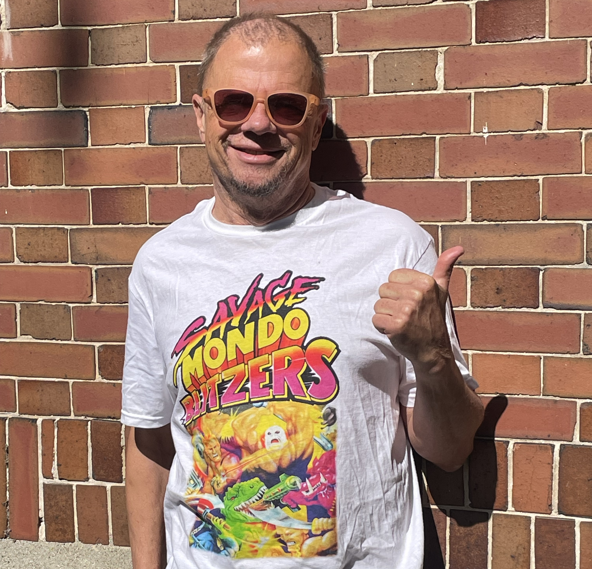
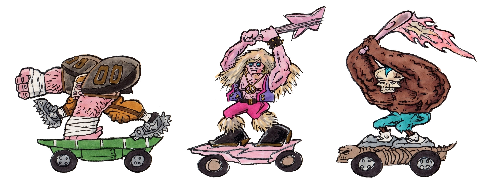
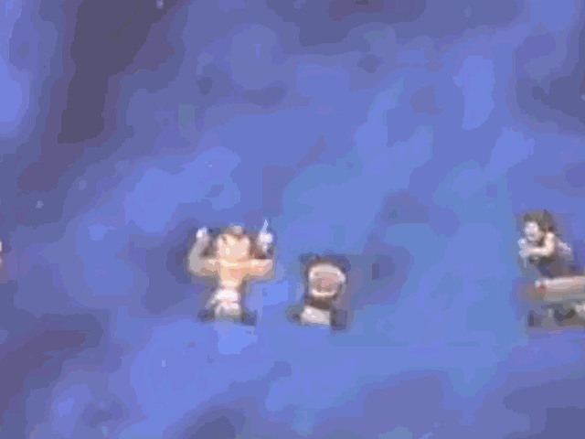
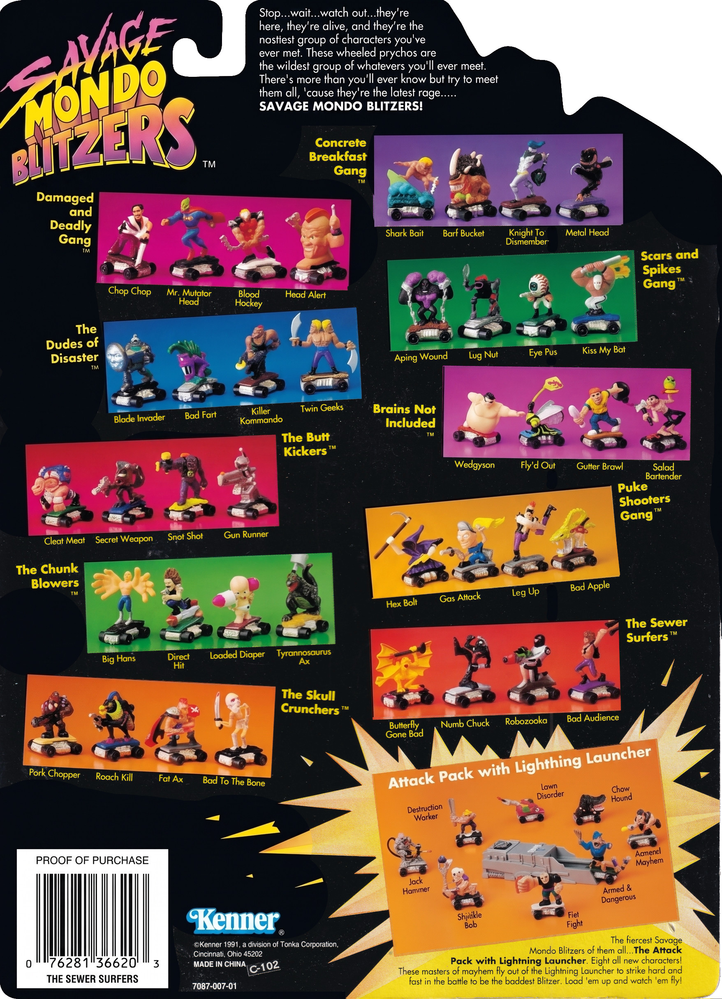
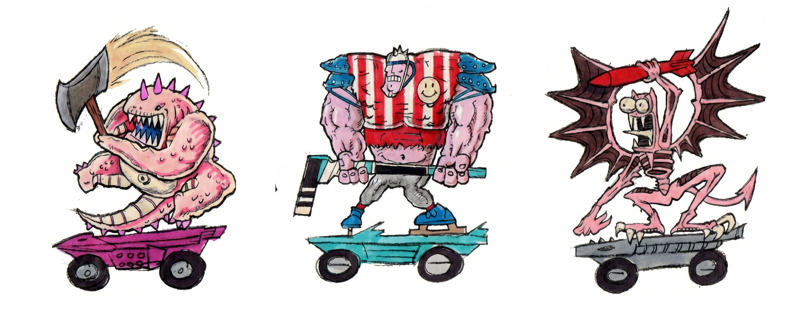
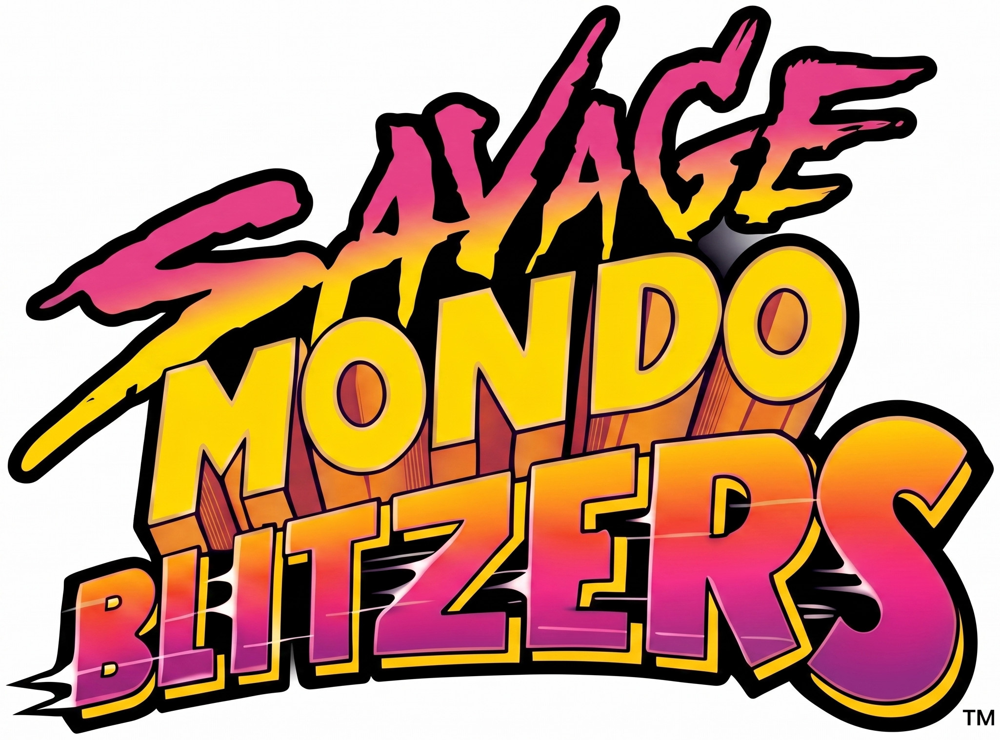

## ON TOY HISTORY
# Steve Wuesthoff On Kenner's Savage Mondo Blitzers
## An Interview With a Design Lead at Kenner

---

*What follows is an interview with a veteran toy designer. Also check out this author's book, [Undercover Toy Stories](https://www.amazon.com/Undercover-Toy-Stories-Anthology-Inventions/dp/B0FR9RVRVH): An Anthology of Real American Inventions, [available now](https://www.amazon.com/Undercover-Toy-Stories-Anthology-Inventions-ebook/dp/B0GYW7GSPM/).*

---

*WHILE BROWSING THE* nostalgic web, this author came across a beloved plaything. That product was Savage Mondo Blitzers, released by Kenner Toys in 1992. The toy line - controversial one-inch figures mounted on skateboards - had a chaotic run in the public eye. And after six months in the market, their swift cancellation was executed by Kenner's new owner, Hasbro.

)](images/108-02.jpeg)

Thirty-five years after its public demise at the hands of an organized group of [concerned teachers](https://www.kennercollector.com/2013/10/kenner-creates-a-controversy-with-their-savage-mondo-blitzers-toy-line/), this author connected with one of the toy's lead designers, Stephen Wuesthoff. Steve answered this author's questions about the product's history, which affected the lives of American Xennials, a cohort of kids stuck between Generation X and Millennials.

This interview follows the author's written essay, *[Polluted Minds: The Savage Mondo Blitzers](https://medium.com/@solidi/polluted-minds-the-savage-mondo-blitzers-0dbd825af897)*, which provides a reconstructed business story of the toy. And so, the conversation with Mr. Wuesthoff follows, providing his point of view at a time when physical toys ruled.

 Post, March 1992)](images/108-03.jpeg)

---

**Doug: Can you provide a little background on yourself - where you came from, your education, and how you got into Kenner?**

*Steve: I come from Ohio, and still reside there. I graduated from the Industrial Design program at the University of Cincinnati in '81. Then, I dabbled in toys in a few of my co-ops as an undergrad.*

*After graduating, I went full-time in consumer products for a consultancy in NYC. I missed toy work, then went back to Kenner in '84 [and worked there for 13 years].*

**Doug: What Kenner projects did you work on before SMBs?**

*Steve: I worked on [M.A.S.K.](https://medium.com/@solidi/we-really-do-care-drive-by-scenes-of-kenners-m-a-s-k-34b1135d291d), Nerf Brain Ball, Rat Fink & the Rad Rods, Carzillas, [Tonka Magna Crew](https://www.youtube.com/watch?v=GStpHnIbpa0), and Nerf Maxforce. I appreciated all of them because it allowed for stretching the creative envelope so nicely.*

*When SMB was developed, it scratched the itch for the love of word play. The creation process was packed with inventive writing that many folks participated in.*

)](images/108-04.jpeg)

**What were the first SMB prototypes that you remember?**

From what I've pieced together from the collectors that have contacted [Ernie Baker](https://boardgamegeek.com/boardgamedesigner/64027/ernest-baker) & [Alton Takeyasu](https://all-about-mask.com/publisher.item.90/interview-de-mit-konzept-de-en-with-concept-en-designer-alton-alton-takeyasu.html), I believe it started with a larger figure on skates. I remember seeing Alton's drawings which were awesome! From what I remember, the concept was based on a poseable skater.

Ernie & Alton made the first prototypes which ended up being Ral Partha gaming pieces painted up by Ernie, the master gaming piece painter, and one hell of a creative force.

They put [them] on sawed-off Micro Machines.

**Who came up with the name Savage Mondo Blitzers? Was there a working title before it was finalized?**

*As mentioned, we played around with words and that brought everybody together for joyful meetings that worked on SMBs. The name, Savage Mondo Blitzers, was my own addition to the line. I was inspired by another popular toy at the time, [Playmates] Teenage Mutant Ninja Turtles.*

*The working title was Roller Warriors.*

**Did you pitch the SMB work to management? How did that go?**

Yes. While working on SMBs I dressed up in punk gear with a rather large-scale pink pointy mohawk. During the first showing to management, we had kit-bashed Micro Machines and product drawings and me playing a punk.

I was stuffed into this rotating lazy susan barely big enough to hold me with that big bright pink mohawk. When it spun around in full view of all the suits, I leapt out and cried "Eins, zwei, drei, fear!" It was a conspicuous start.

The team's goal was to stir the parent-kid-dynamic with the irreverent names and get a bit of free, perhaps not so negative press, but enough to sit on the airwaves to allow the planted seed to grow. We created gang names like "The Chunk Blowers," and characters like "Bad Fart," among others.

Alan Hassenfeld (CEO of Hasbro) was a bright character, who was in attendance and observed this event. Alan said to all who were present, "I like it but do we have the stomach for what this may cause?"

The affirmative was the answer. But when we rolled out the product line, and after we received negative public feedback, it quickly changed to "No."

)](images/108-06.jpeg)

**How did you come to understand that SMBs were being protested by the public? Was there any outreach to change the names, and did you feel it was fair or unfair?**

Mmm, good one. Those days came quick and right at our doorstep. I'm guessing you know the story of the Loveland Ohio PTO (Parent Teacher Organization) - who protested the themes of SMB?¹

So basically, the team's plan was working like a charm, but then one day I walked into work and a host of public relations folk said, "You [meaning me] need to be answering these phone calls from angry PTO folks about SMB. It's your line after all."

I probably should have. There were a lot of probably "should haves" spreading everywhere at that point. And details on how we (as a company) came to announce we were caving in on names came down to cold feet. Since navigating lawsuits wasn't an everyday part of doing business as much as it seems to be as of today. That is my opinion.

Did I feel it was unfair that we caved? Yes, unfair and unfortunate. It certainly would have been a blast to work on SMB for more than one year, anyway. But there was always another toy line, and I continued with those.

)](images/108-08.jpeg)

**Anything else you like to share about your time at Kenner - that a reader would take away as interesting?**

I received the outdoor toy award from *FamilyFun* magazine back in 1995, called the Nerf Brain Ball. Again I was not the only person involved but in this case *my brain made that brain* come alive!

The funny thing was we were also working on a Pro Nerf football on the introductory schedule. They both were made of a slow return foam material. It was a perfect ball to throw to stretched arms, reaching to play catch for the first time.

If the Nerf ball bonks off a face, it lands with significantly lower impact. Young folks turn away from playing ball a whole lot less. Cool stuff.

Something about the shape of that Brain Ball threw tighter spirals and deeper long bombs than any other Nerf football ever.

This is why *FamilyFun* magazine gave an award to it.

**Overall, what were you most proud of working on at Kenner?**

I feel my Kenner years were very lucky overall. Not so much for the organization I'm afraid, as it was slowly absorbed into Hasbro.

I learned that navigating a toy company that sought large dollar returns with tiny fun toyline ideas that we gambled on was a very heady experience.

They all can't be winners but coming up with new angles of play that I'd hope will have a life of its own is *jazzy fun* for some and certainly was for me.

 / [Etsy](https://www.etsy.com/listing/1776908956/brain-ball-1995-nick-nerf-orange))](images/108-10.jpeg)

**Finally, which artists inspired you, and did you look up to any other toy designers, toy creators, or Kenner leaders as you worked?**

I was inspired by a cross between Ed "Big Daddy" Roth and [El Lissitzky](https://en.wikipedia.org/wiki/El_Lissitzky). I always wanted to grow up to be like them.

When it comes to the Kenner folks my managers - Wayne Beiser during Nerf days - he was very empowering and so fun. To [Tim Effler](https://timeffler.com/), during Jurassic Park's first year, love conquers with that dude. And my first Kenner manager Charlotte Eicher, during M.A.S.K., she had the power to make anyone feel like they could elevate an idea - with potential of play - and the positive attributes it could bring for each brand.

As Big Daddy would say, "[Kenner] was a gas."

Today, I remain fascinated by the good folks at [Bang Zoom](https://bangzoomdesign.com/boys-toys) Design. And in the end, I learned that solid toy creativity continuously keeps you young.

---

**STEVE WUESTHOFF WAS** kind enough to share his take on what occurred at Kenner. As he walked through his contributions, he also shared numerous early sketches of the SMB lineup.

In our email conversation, Steve remained proud of his designs. And what was important was his insistence that it took esteemed colleagues to make the craftwork happen, reminding this author of the importance of creative forces within teams.

For example, when this author approached Steve as the "brainchild" of Savage Mondo Blitzers, his immediate reply was:

"First, as clarification, the originators of SMBs would be Ernie Baker and Alton Takeyasu. They were in a preliminary design role and came up with a mash-up of Micro Machines and skateboarders. They passed off the lead design role to me to carry through to production."

Indeed, great art (of which these toys are now considered) means great people who credit-share. And since Kenner, Mr. Wuesthoff continues to hone his creativity at his consulting company, [Blue Sky Sketch](https://www.blueskysketch.com/work), where his craftwork is fully on display.

Thanks, Steve, for sharing your experience.

---

*Some images were clarified with AI, and there may be slight deviations from the originals. And if you enjoyed this fascinating write-up, you'll find more in the author's book, [Undercover Toy Stories](https://www.amazon.com/Undercover-Toy-Stories-Anthology-Inventions/dp/B0FR9RVRVH), available now.*

¹ *Explained in detail within [Polluted Minds: The Savage Mondo Blitzers.](https://medium.com/@solidi/polluted-minds-the-savage-mondo-blitzers-0dbd825af897)*

---

## Social Post

I located designer, Stephen Wuesthoff, former Lead of Design at #Kenner, to discuss the backstory of Savage Mondo Blitzers in the #1990s. SMBs were these one-inch toys that were controversial due to their labels, targeted by concerned parents and teachers. Enjoy.

https://medium.com/@solidi/steve-wuesthoff-on-kenners-savage-mondo-blitzers-f5bea05c0db0