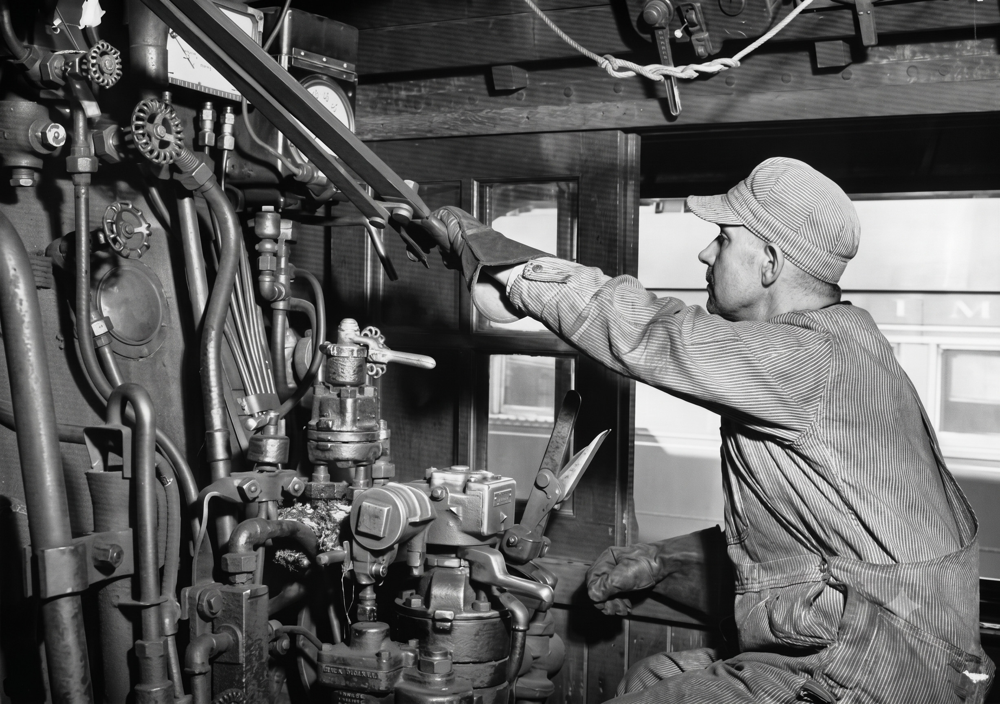
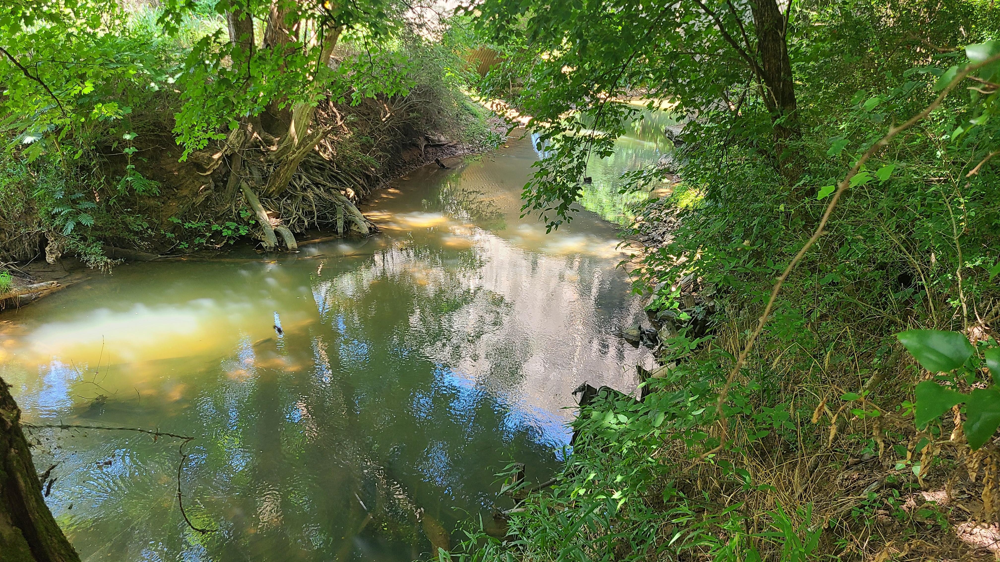
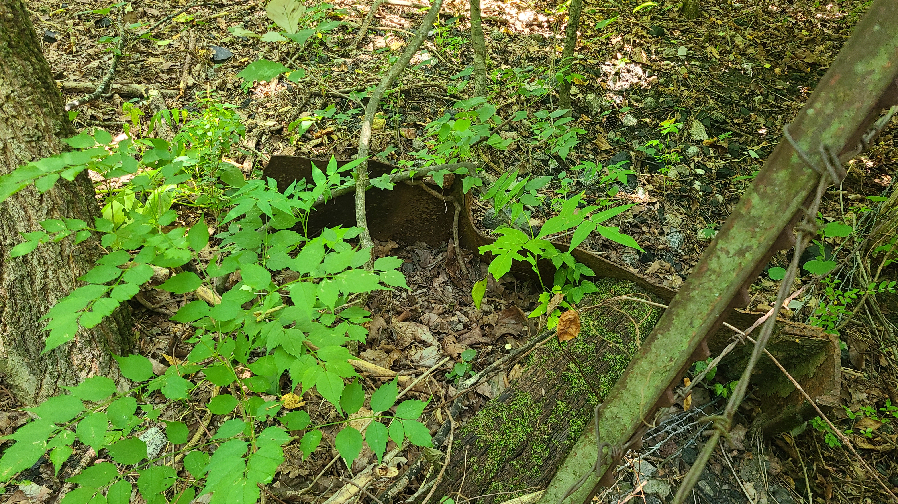
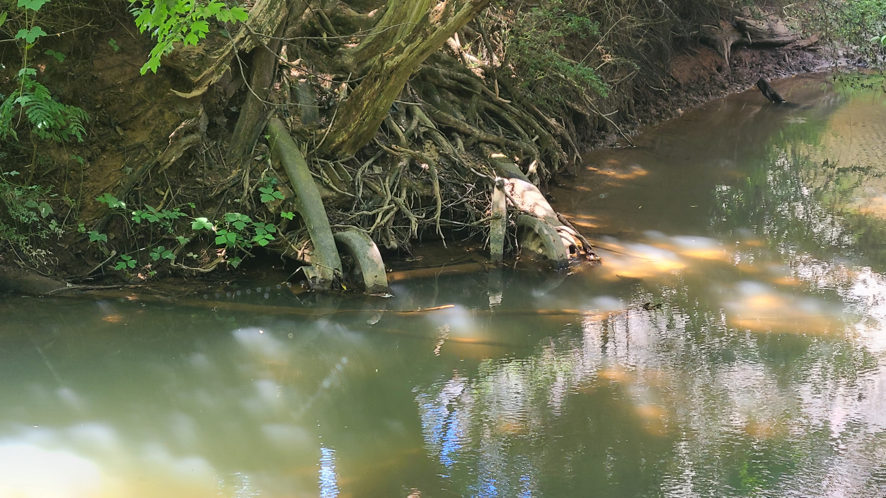

## ON RAILROAD HISTORY
# The Chestuee Creek L&N Derailment of 1959
## When Coal Spilled Into a Small Tennessee River, Convincing the Company to Invest In Roller Bearings

)](images/109-01.jpeg)

[*With dawn breaking over the horizon, a freight train is hauling heavy through the forest.*]

**A SEASONED ENGINEER WAS** at the controls of an old steam locomotive, working the equipment as a fireman continued to shovel coal. "Keep going, keep going, the pressure is dropping - speed too," said the engineer.

"Alright, John, I'm doing it," said the fireman. The engineer looked back along the long train, filled with box cars and an endless line of coal gondolas.

"What's going on?" said John. Both the soot-riddled men looked back and noticed a glow of fire on some of the train trucks about 300 yards back.

"Well, I'll be damned," said John, "That's it, we are hauling too hard." He yelled, "Hot box, HOT BOX!" At that moment, the fireman slammed the coal door.

Then, the train began to shake, and a sound of crashing metal filled the air in a coordinated symphony of destruction. The men held on.

Farther away, at the back, the brakeman looked at the conductor, "Oh God, No. It's on fire!" The brakeman immediately took out his red flares and ignited them all. "Look, those rails are going up!"

In the front, John pulled all the levers to stop, but it was too late. The crashing and destruction continued. Then, after a good three minutes, the sounds settled with only the howls of coyotes, the rasping of katydids, and the exclamation of railmen, somewhere in eastern Tennessee.

God was on their side that morning because those train trucks that were on fire were doused by the cool water of a creek ravine into which many fell.

---

**ENGLEWOOD, TENNESSEE, IS** a small town in McMinn County located northeast of the Smoky Mountains. According to the official Englewood [website](https://townofenglewood.com/history/index.html), its name was inspired by the forest in the book *Robin Hood*.

It started as a milling town - "a dam built on Chestuee Creek furnished the power needed for [Englewood] businesses, which included the cotton mill, a spinning mill, the grist mill, a sawmill, and a machine shop," wrote [Tennessee Overhill](https://www.facebook.com/tennesseeoverhill/photos/how-did-englewood-tn-get-its-name-in-the-early-1800s-elisha-susann-brient-moved-/502083011952857/). Englewood was built on textiles, starting with the Eureka Mill, where the owner's sister, Nancy Chesnutt, was an avid reader and named the very location.

Thus, among the rolling hills and sectioned forests, a railroad rolled through it. The old Louisville and Nashville (L&N) line operated tracks running north-south through the town, attracting migrant workers. And each train carried freight, lots of coal, and non-ticketed passengers, also known as hobos.

)](images/109-03.jpeg)

As Englewood grew slowly through the old century, a dedicated hosiery mill was erected by 1917. However, the Great Depression of the 1930s halted production, and men had to work the fields. Once World War II ended, the clothing mill reopened and employed hundreds of people, including many leading women.

Englewood continued to focus on textiles, such as sockmaking, throughout the 1950s, leaving its legacy in a book titled *Then & Now: The Women of Englewood's Textile Mills*.

## The Incredible Derailment

**SOMETIME IN THE EARLY** morning of September 16, 1959, L&N engineer John Payne was operating a southbound locomotive of a steam type with four other men (conductor, fireman, brakeman, and flagman), heading for a town south, named Etowah.

)](images/109-04.jpeg)

Hauling approximately [2,500 tons](https://www.newspapers.com/image/796537716/) of bituminous coal in Pressed Steel Car Company gondolas, 43 carts jumped the tracks just south of the center of Englewood. The crash resulted in a spill of 5.5 million pounds of coal used for electricity generation, steel production, and to power L&N's shrinking steam fleet.

At least [one witness](https://www.newspapers.com/image/604451268/) said it "was the worst pile-up [he] ever saw," and what makes the incident unique is that a portion of the wreckage spilled into the Chestuee Creek, which once powered Englewood's industrial production - a literal "Ask, and it will be given to you."

The wreck was in God's control, as not a single soul nor animal was injured or killed. But the location of the spill made cleanup difficult, with rolling farmland and forests set across the creek. Therefore, officials had to go through the rail tracks close to the farm owned by Ed Engram, as the coal began to run down the 55-mile-long Chestuee Creek.

)](images/109-05.jpeg)

The spill was so catastrophic that both the Associated Press and UPI carried the story, even though it happened in a deeply rural area and didn't seem particularly newsworthy. Neither a bystander nor a crew member was injured.

As cleanup began, it was estimated that the train had 30 undamaged cars ahead of the wreck and 40 behind it, while the 43 "were so badly smashed they could only be sold for scrap." So, the skeleton crew had to dispose of numerous wrecked parts to nature. Hundreds of feet of rails were ripped up, and the cleanup, put mildly, was hurried.

## The Rushed Clean Up

**THE DISPOSAL OF** the wreckage took approximately [two full days](https://www.newspapers.com/image/587735408/), with the rails shut down from September 16 to 18, 1959. Typically, derailments carry federal investigations, but there wasn't an Interstate Commerce Commission [report filed](https://rosap.ntl.bts.gov/cbrowse?parentId=dot:44452), likely because no one was hurt and property damage was minimal.

What is not negligible is the number of lasting artifacts of the incident. This author was permitted access to a portion of private property that still contains wreckage on the embankment of the Chestuee during a drought.

What remains on the banks are countless shoals of coal. Shockingly, there were at least two rail axles and visible gondola frames present, stuck in the earth on the embankment of the Chestuee Creek, seventy years later.

Apart from a sea of carbon mixed in soil and vegetation - rail ties, forged spikes, and J-hooks were discarded throughout the adjoining properties. At least one owner has stored the supply of coal to coax stubborn campfires as he told tales of the crash.

Full exploration could not take place due to property lines, but it's clear that a train derailment occurred and that nature could not fully erase the old railway scars.

## A Hot Box Derailment

**AFTER THE INCIDENT**, there was an internal investigation into what happened, with L&N and local law enforcement leading through October 1959. Suspicion of the derailment focused not on sabotage of the rails, nor the supporting structures surrounding the crash. The focus was on the gondola trucks, which contained the wool wadding in each journal box.

A journal box is the compartment that encases each rail axle end and contains lubricant to keep the axle bearings from wearing out. In a time before roller bearings were standard, metal bushings needed soaked oil wadding to keep friction low.

))](images/109-08.jpeg)

The suspicion was that at least one of the gondolas of coal developed a "[hot box](https://en.wikipedia.org/wiki/Hot_box_(rail))", which caused the axle in the journal box to wobble due to a lack of packing. Then the remaining wadding caught fire, destroying its capacity to hold on and setting off a chain reaction that led to a derailment.

Three months after the incident, L&N officials announced in the *Knoxville News-Sentinel* that the company purchased $33 million worth of roller-bearing freight cars, or about $380 million today. Carts with self-sealed bearings would not need the same lubrication methods as metal bearings. Journal boxes became simple inspection ports.

Interestingly, in the news [article](https://www.newspapers.com/image/773287503/), the publisher referenced the Chestuee derailment and then proposed an educated speculation. The reporter wrote, "Every so often, a hobo . . . will open the journal box of a standing car and help himself to a handful of oily packing." The reporter continued, "It's a tempting material for kindling."

And if a hobo got greedy to fuel a spectacular "jungle fire" to cook an assortment of beans, the box would not have enough wadding to perform properly - and the axle would heat up.

)](images/109-09.jpeg)

Although no cause was reported for the wreck, hobo activity was suspected. The number of hobos indeed declined after the Great Depression, but some were still riding the rails in the 1950s, making this legend real.

As stated by L&N superintendent S. A. Brownlie, "Hot boxes have caused a lot of derailments." Thus, the purchase of roller bearings was intended to reduce the negative future impact on their bottom line and to increase safety for crew members and the public.

## A Legacy of Textiles and Rails

**ENGLEWOOD REMAINS A** quiet town in Tennessee, which has hosted more than a handful of derailments. Similar coal-spilling incidents occurred again in 1964 and 1980; however, the locations were different, and the reasons weren't reported - they all involved L&N cars and leftover Pressed Steel Car Company gondolas.

Due to the high number of coal cars moving through, numerous mishaps over the years are coincidences. However, the 1959 coal spill remains unique because cars crashed off a bridge and onto an embankment, leading a major railroad to upgrade its fleet. Most of all, the incident site is visible to the naked eye today, albeit limited to the public.

Later on in modernity, L&N was dissolved into CSX in 1982, and the town's last clothing mill [closed in 2008](https://www.youtube.com/watch?v=5-NgTPb0ZTY). Englewood remains a charming place with an interesting history of train lore and textile making.

And it's not known what happened to engineer John Payne, but from what this author can gather, he came from a long family line in southern railroading. He was likely a respected L&N engineer.

*- For Dianne.*

---

---

## Social Post

On the early morning of September 16, 1959, engineer John Payne was hauling 2,500 tons of coal through Tennessee. But after a failure, a train derailment convinced the L&N Company to swap to new equipment.

This is the legend of the Chestuee Creek Coal Spill.

#history #railroad #america #railfanning

https://medium.com/@solidi/the-tennessee-chestuee-creek-l-n-derailment-of-1959-efea6a3865a9
