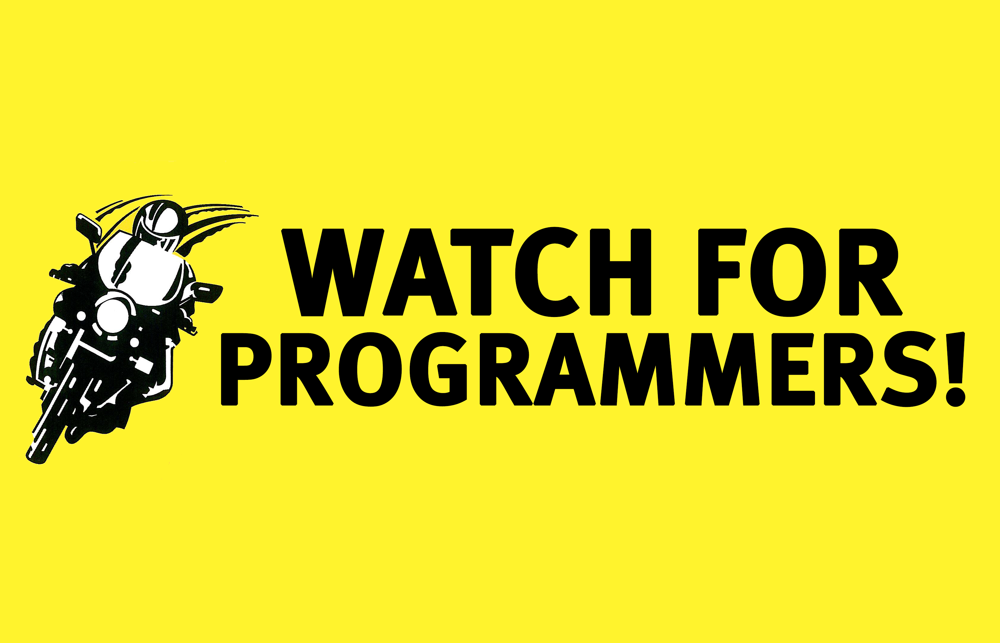
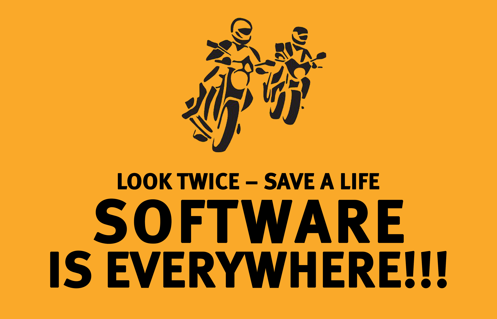

# The Zen of Motorcycling and Programming
## An Inquiry into Values of Software Engineering

I'm heading down the parkway parallel to the ocean through a hot summer breeze. My engine is slowly revving by keeping a legal speed limit. I was taking it all in on my motorcycle, with thoughts of inspiration and some doubt of nagging preservation. "Should I have checked that thing? What about this detail? Ah, whatever it is, enjoy this ride." Unfazed, I looked over to my right, nothing but dunes, on the left, the Great South Bay. There were wispy clouds in a blue sky and a bridge in the distance. I was making my way down to OBI, a parking lot in the middle of nowhere laid up against the Atlantic ocean.

Once I parked, I removed my helmet, gloves, and jacket. The sweat from my padded kevlar jeans ran down my legs to my riding boots. I sat by my bike, on the shaded side. I wanted to think, but instead, I flipped out my phone and stared lonely at the emails and social posts.

Some time passed. Finally, a bike pulled up, looking if it was safe to park close. An older woman jumped off her well-worn bike. I looked over and made a judgment. "Hmm, she's all geared up. My kind of rider." She slowly approached, admiring my bike and me admiring hers.

We chatted about bikes and philosophies of riding. The lady had more riding experience than I and spoke vividly about riding adventures. Then she asked about my profession.

"What do you do for work?" she asked.

I said the word.

She replied, "But what is... software programming?"

**Me:** "Well, in the simplest terms, we are readers. And more rarely, we are writers of code. And when we write, we likely follow checks."

**Her:** "What kind of checks?"

**Me:** "First, of course, we have *T-CLOCS* (tires/wheels/brakes, controls, lights/electrics, oil/fluids, chassis, and stands). Before we write, we read to understand. We have to *wrench* through issues first. Once we have something we can add, and this can take some time, we can jump on safely."

**Me:** "But before we jump on, we must wear gear. *ATGATT* (All the gear, all the time). In our writing, we wear gear to help protect us. Let's call them tests that check our writing. Tests won't protect us from everything, but it places us in a mindset that we could get hurt and are taking precautions to avoid future injury."

**Me:** "From there, we are worried about the visibility of that writing. We want high-vis on our code. We have others review and check it. Then code is bolted on safely."

**Her:** "Ah, kind of like *look twice, save a life?*"

**Me:** "Yes, but we take the onerous steps to make sure that the code will work well. We have high-vis, continuously move to be seen, and throw down the hand signals indicate clear intentions."

**Her:** "Are there programmers out there that write code and avoid these checks?"

**Me:** "Of course. Even if it's legal, these programmers are *lane splitters*. They go fast past others, and they win sometimes. But eventually, their odds run out, and they hurt themselves and others."

**Me:** "My respect for the machine is at the front of my mind, always. Just like I know that our bikes over there can hurt us. I know that the respect I have will keep me in check so *I can live to ride another day.*"

**Her:** "You got a good head on your shoulders. But back to this software programming thing. So you are readers, and sometimes writers. Apart from these checks and tests, how do you read and write well?"

**Me:** "Just like we should practice our figure eights, stops, swerves, and our finesse, we need to practice our reading and writing. We should do this continuously regardless of how long we've been in the game. I didn't believe this until I recently had a very close call. I was too lazy, but I learned that if I practiced the skill continuously, the incident would have been avoided."

**Her:** "Yeah, it's about seat time. Safety is also about rider attitude and risk assessment."

**Me:** "But here is the thing. Practicing has context, and we must be deliberate on how. It must be a campaign of focus. There is quite a bit of hype all over, and you can get dragged over reading and writing things that become irrelevant. *You do need to ride your own ride.*"

**Me:** "Sometimes you need to follow the advice of David Hough or Ken Condon, but sometimes Maria Costello or Keith Code. Lots of time, you have to go with data, like the Hurt or MAIDS report. And sometimes you have to go with your gut. But it's the attitude in learning that matters."

**Me:** "We all have dropped our bikes. You learn that it is important to dust off and pick it back up."

**Her:** "Got it. And the computers read these writings (code)?"

**Me:** "Indeed, and hence how these programs work. *Just like motorcycles, software is everywhere!* But it's about people. The machines can handle all the writings just fine. They can optimize, such that they bounce over edge traps, navigate sand, and handle all sorts of different weather and traffic conditions. But humans cannot always. Sometimes ego gets in the way."

**Her:** "Kind of like those riders who never throw down the peace sign after you threw down first?"

**Me:** "Yes. There are others out there that are oblivious and need to learn what it means to throw down that peace sign. We need to mentor well and take the opportunity to show them our programming *craft*. And learning to read a lot and write a little is a challenging thing. It gets difficult since what I described is mainly performed in *teams*. And you know how difficult it is to keep group rides together."

**Her:** "Yeah. Every four to six riders need leads."

**Me**: "Right. And just like motorcycling, programming cannot be mastered."

**Me:** "Just like motorcycling, programming cannot be mastered."

**Her:** "So, you are a team of readers and rarely writers. The machines handle the optimizations, and quality is paramount to the profession. Mentoring is an important aspect, just like I have shown others how to ride safely. It sounds to me that after all this, can you *ever* enjoy the ride?"

**Me:** "I do. These concepts are my opinions, but others may see it differently. Quality? The quality reminds me of that book, *Zen and the Art of Motorcycle Maintenance*."

**Me:** "Whether I'm classical or a romantic, I am not sure. When I read or write code or I perform an oil change or replace a stator, I keep looking at the gauges like a manic. 'Did I do it right? How can I be sure? Research, apply, and *trust*!' I am stuck looking into all the details of how to do things well."

**Me:** "But, I…, we must do more than *look*; *we* all must see and *be seen*."

---

## Social Post

At intersection of motorcycling, programming, and trust of eventual automation of vehicles -

- The craft and disipline of coding and riding.
- Looking twice to save a life.
- Living to ride another day.
- Riding your own ride.
- Just like motorcycles, the software is everywhere!
- Riding and programming cannot be mastered.
- We must do more than look; we all must see and be seen.

[medium](https://medium.com/hackernoon/the-zen-of-motorcycling-and-programming-620907dbab2c)
[linkedin](https://www.linkedin.com/pulse/zen-motorcycling-programming-douglas-w-arcuri/)

Thanks to Hazem Saleh, Alex Hart, and Danielle Arcuri

#motorcycle #SoftwareDevelopment #programming #ProgrammingZen #RobertPirsig #safety

### Posted

1. r/programming
1. r/softwareengineering
1. hackernews
1. r/motorcycles
