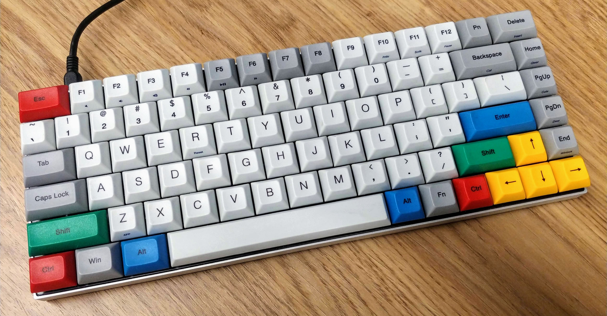
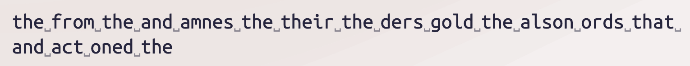
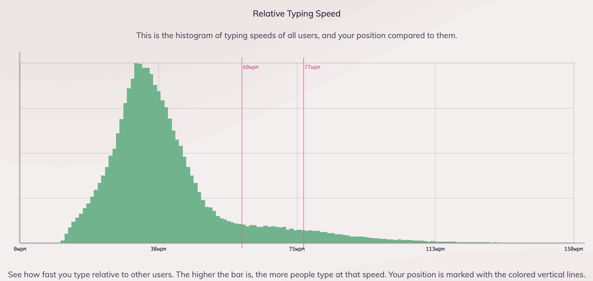
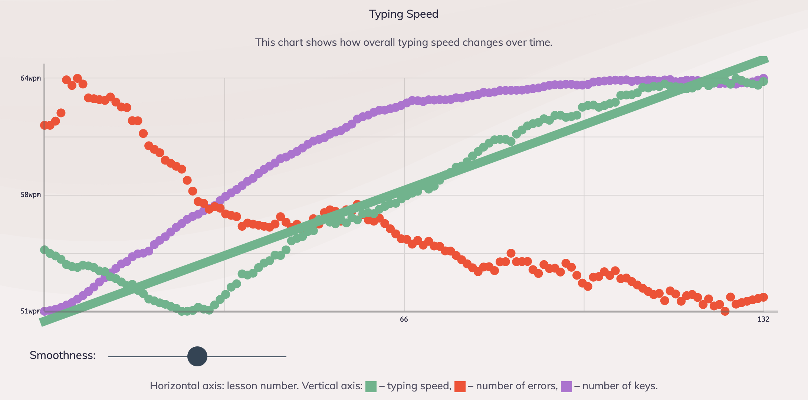
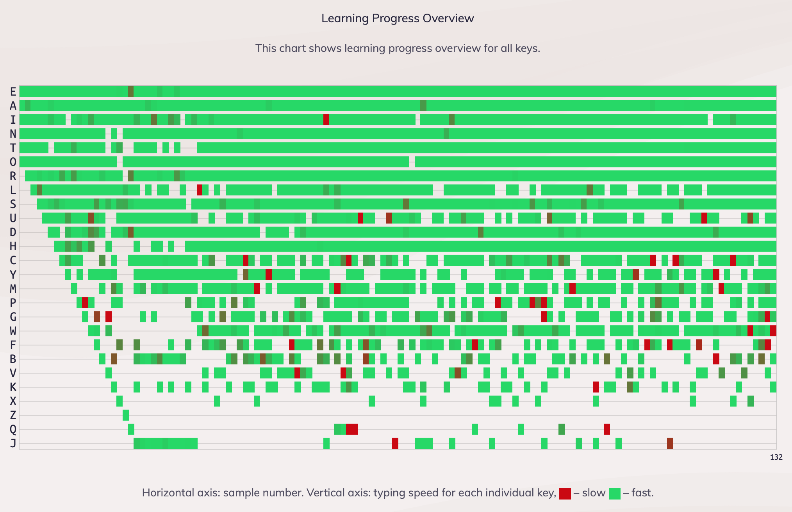
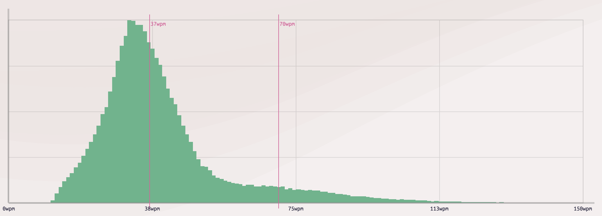
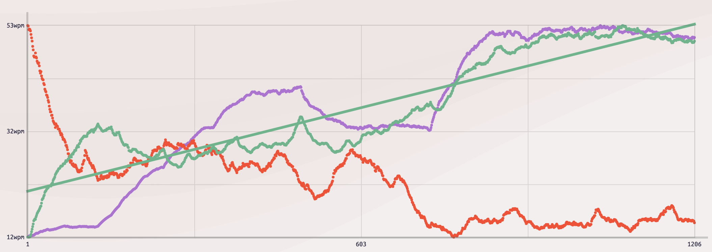
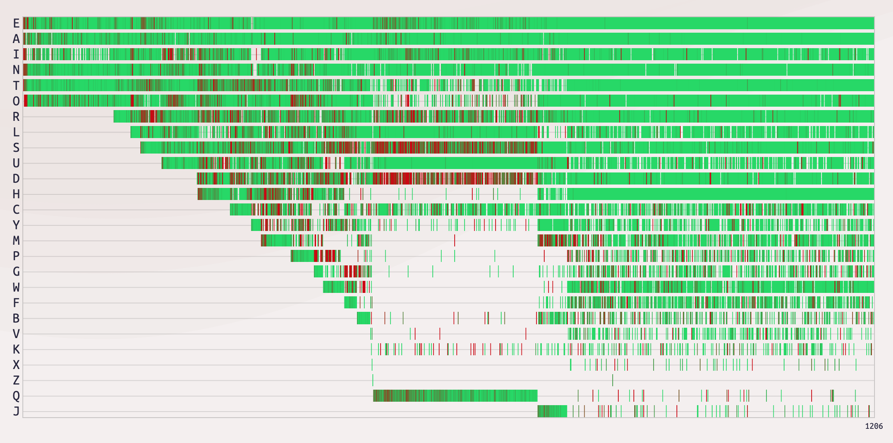
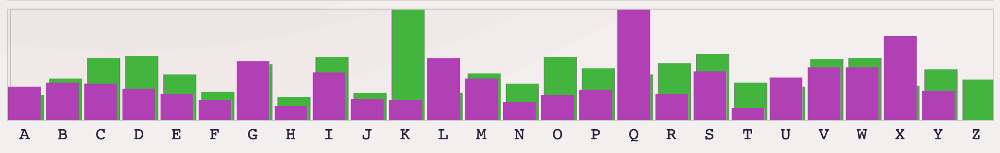
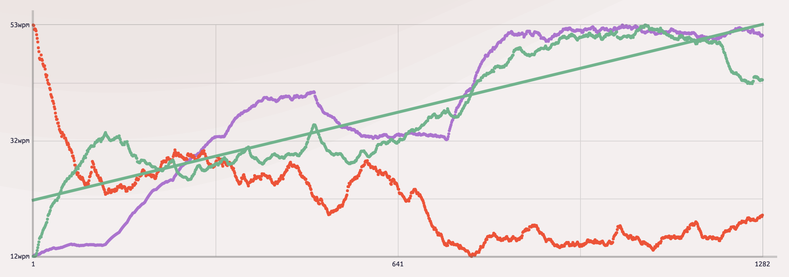

# Touch-Typing Feels Good But Isn’t For Me
## A Brief Analysis of Learning to Touch-Type

**MY RECENT OBSERVATIONS** of "humans with keyboards" motivated me to write this essay. It seemed, people around me type in a belabored “hunt and peck” style. Even a friend proclaimed he “typed more proficiently with two fingers than ten.” And so we fell into a debate. Strong opinions arose from our conversation, without an agreement if touch-typing was worth the practice.

I prefer the "hunt and peck style" too.

Of course, typing style is a personal choice. No one will ever force you to do it differently. Those who are curious discover their choice. And my curiosity set me off on a diversion of improving my typing. The question to myself was "With all these years behind the keyboard, how does my own style measure up? Can I do better?"

This exercise explores my typing trials on learning touch-typing with speed and error measurements. I’ll conclude on what touch-typing feels like and why I will not switch from my self-taught typing strategy.

## Motivation

With twenty years behind the keyboard, my typing style is embarrassingly inefficient and clumsy. I can measure this fact on numerous factors.

- I do not use all of the available fingers.
- My hands move significantly to find keys.
- I look at the keyboard to realign my position.

**From these points of my self taught typing strategy, I’ll label it as it looks: float typing.** I have a sense that my speed is decent but do not have a precise measurement. So, let’s find out.

## My Typing Baseline

To measure, we need a tool. I chose the website keybr.com to perform typing measurements on speed and error rate. What I liked about keybr is its no-nonsense learning. No typing games. It has algorithms that detect weakness in learning keys. Samples of commonly strung letters in the English language are recorded. The user interface is clear, straightforward, and the statistics are excellent.

I started with my style of typing. At best, my **float typing** predominantly uses both index fingers and sometimes middle fingers. Thumbs are on the spacebar. I utilize these six fingers where needed. My fingers do not feel the keys, but are proficient landing on the right keys. The hands fly across the keyboard as I type. I look at the keyboard when I cannot detect the next key’s position.

Let’s look at my relative typing speed first.

The lines marked in red are my average and top typing speeds. Here, my average typing speed is 60 wpm (words per minute). The green graph is based on all other users that are sampled at keybr. From their perspective, my average speed is in the 89th percentile and my top speed is at 95%.

Above, we can see the course of 132 samples taken over the course of 35 minutes. I am comfortable with the length of this sampling since we see a steady line past 100 samples. Error rate and typing speed are generally consistent.

Over the course of 132 samples my typing speed is generally "fast," with clarity of keys that are "slow." I chalk this up to unique word combinations that made me look down at the keyboard.

## Touch-Typing

My motivation during this exercise is to gain speed and reduce error rate. More fingers, less hand movement, and focus on the screen. After brief research, the style that addresses all three concerns is touch-typing.

Touch-typing is an efficient way to utilize all fingers at the keyboard. It helps minimize hand movement and decrease error rate. Touch-typing’s main purpose is to have eyes on the screen without looking at the keyboard. This is to focus clearly on content.
Okay, let’s take a look at my metrics around **touch-typing**.

As we can see above, my average is much lower at 37 wpm. What is interesting is my top speed is similar to the float typing baseline. As a stretch, we can say that my “top potential” is 70 wpm. This will require significant dedicated practice. At about this point, I max out in speed and wobble in error rate.

Above is the graph of 1,200+ samples. This is 10 hours of practice over 25 days. We can see a plateau of error and typing speed. Over time, my average will improve to 50–55 wpm. This falls short of my self taught typing strategy at 60 wpm. From keybr’s perspective, my average speed is in the 54th percentile and my top speed is at 92%.

As I become confident in touch-typing, each key becomes green and typing speed will improve. We can see here I had difficulty with R, S and D leading the tool to continually articulate on the left hand. There was also a good portion of time where Q was labored upon.

Finally, we come to errors. The review of the hit/miss ratio or relative miss frequency per key is clear. The green bar is representative of touch-typing and the purple is float typing. The lower the bar, the better. Since I am learning, it is natural that there is a higher tendency of missed keys with touch-typing. Twenty of the 26 keys report a higher error count.

## Touch-Typing Takeaways

The measures are clear. We can make an early conclusion. For me, there isn't a benefit in speed or error rate using touch-typing. But all is not lost. Here are important takeaways.

### It Feels Really Good

Related to muscle memory, touch-typing provided a sensation of "feels good" when it came to middle, ring and pinky articulation. For example, typing words that consist of adjacent keys produce a good feeling. Examples of words like "were," "wards," and "sad." As numerous fingers "rolled" through the keys my dopamine peaked.

### Finger Muscle Identification

Keybr identified weakness on my left fingers and right hand extremities. My middle, ring, and pinky fingers hurt as I practiced. At first, it was difficult to type sequences like "as" and keys like O versus I and finding P and Q. However, over time the use of the individual fingers became easier. I also noticed that my extremity fingers felt independent, especially the middle and ring finger.

### Discipline with Home Keys

It was very difficult to understand my location on the keyboard so I forced myself to “find the bumps”. After every word I forcefully “reset” to the F and J home keys, felt them, then continued with the next word. This slowed me down.

### Difficulty with Keys Closest to Palms

For me, touch-typing minimized the movement of hands in a horizontal fashion and maximized my fingers movement on the vertical axis. I noticed that keys M and X commanded my hands to move somewhat downward, unnaturally. This could be due to the length of my middle fingers and the natural inclination of my fingers pointing upward as I rested my palms.

### Looking at the Keys Inflates Numbers

I had a tendency to look at the keyboard when my hands began to stray from the home keys. Words that begin with B and G made me look as I typed. As noted above, it was either stop in motion to find the bumps then go for the key or look quick and readjust. Sometimes the latter felt faster. Let’s prove this.

At sample 1,206 I forced myself to keep my palms planted, never looking at the keyboard. The result setback is seen above, as my speed dropped by 10 wpm and my error rate jumped.

The exercise was difficult to fight through resisting the urge to look at the keyboard. This action will be difficult, more so than discovering my middle, ring and pinky fingers from samples 1 through 650.

## Conclusion

**What we focus on, grows**. Should this skill grow?

As I continue to practice I have found two modes of typing. If I want to type faster and with less errors, I choose float typing. When I want to feel good, both socially and from dopamine, I choose touch-typing.

I will continue to practice touch-typing but, looking over the data, it may not be for me. Dedicated practice will be required to throw away my self typing strategy... float typing. Will my articulation grow enough to hit high speeds if I practice? This post gives me hope that touch-typing could be answer.

What is your typing style like?

---

## Social Post

Analysis of my own touch-typing. Thanks to freeCodeCamp for picking this up! #typing #analysis #freecodecamp

Thanks to Hazem Saleh and Dan Leonardis

[url](https://medium.com/free-code-camp/touch-typing-feels-good-but-isnt-for-me-2cfbafee2074)
[linkedin](https://www.linkedin.com/pulse/touch-typing-feels-good-isnt-me-douglas-w-arcuri/)

### Posted

1. r/programming
1. hackernews
