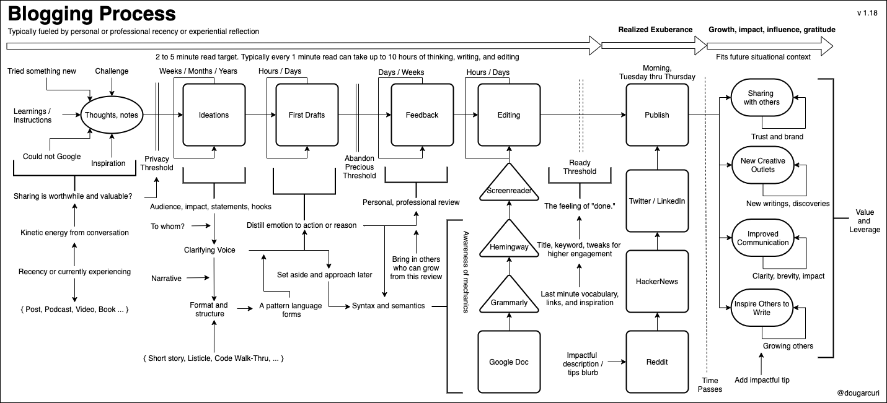

# The One About Blogging
## Mapping the Process After Three Years of Learning

I’ve learned a lot about my motivations while blogging over the past three years. Everything from self-reflection to clarifying intentions. I’ve also learned a lot about the process itself. While I could write a long-winded post about this meta, let me share what I’ve learned in a visual. Since the majority of the population are visual learners, this should suffice.

My blogging process after a few years. It will continue to improve.

Like all creative systems, blogging contains learning feedback loops. What is most interesting is the **catharsis of publishing**. Sharing these writings with others has **growth side effects88. It is impactful, rewarding, and gratifying to share the topic in *one link*. That is after struggling with the same topic years earlier.

The point of all the blogging is to start, no matter how difficult it may seem. We all have something to share. The writing helps others. It also clarifies motivations. For me, it is the self-improvement of communication and the reinforcement of the learnings.

* * *

I’m experimenting with my writing style and have started [a more focused blog at dev.to](https://dev.to/solidi). My first write of [What is a Tech Lead Anyway](https://dev.to/solidi/what-is-a-tech-lead-anyway-483p) seem to garner attention. My goal is transparency in software engineering. Years of experience distilled to no more than two-minute reads.

---

## Social Post

A diagram on how I blog about software -

- Thoughts and notes into #ideations
- First drafts and #narrative
- Abandon precious threshold
- Feedback from others and mentoring
- #Growth, #impact, #influence, and #gratitude

Thanks to Danielle Arcuri

https://medium.com/@solidi/the-one-about-blogging-cd9e65a2055b

#blogging #reflections #SoftwareDevelopment #PersonalGrowth #developemt
