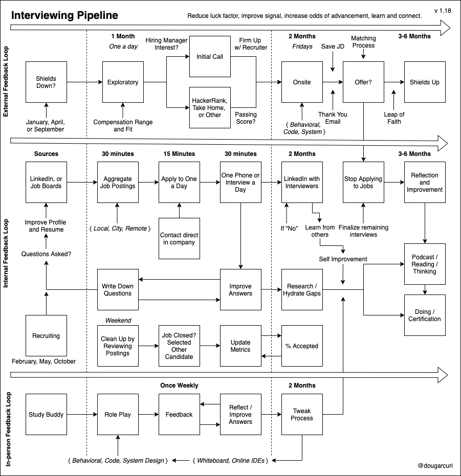

# The One About Software Engineering Interviewing
## Mapping the Process After Years of Learning

I've recently reflected on my experiences as an interviewee in software engineering. As I trace through each interview, I have learned and improved. I'd like to share these learnings with a diagram I'd built from my last search and highlight the significant bits.

## Practice Role-Playing

My most impactful learning is the value of practicing weekly with a friend. What I learned is that interviewing is a muscle. Finding a study buddy helped simulate [real interview situations](https://medium.com/free-code-camp/how-to-organize-your-thoughts-on-the-whiteboard-and-crush-your-technical-interview-b668de4e6941). This practice had a tangible improvement in offers. But even more so is that after securing a new job, we continue to practice once a week for an hour to be sharp at the interview skill, share stories, and continue to build a healthy relationship.

## Partnering with Recruiting

I found success in partnering with recruiting as I went through the pipelines. Being courteous, providing feedback, and asking what to expect had better outcomes. Being honest about my position in my search, expectations, and asking informed questions was an advantage.

## Optimal Months to Start a Search

My personal experience interviewing revealed that starting a search during particular months increased job opportunities and initial responses. These optimal months were January, April, and September. It became evident that these proceeded vacation times from typical holidays and breaks - where companies come back and advance their talent searches.

## Feedback is Rare
Interview loops do not provide direct feedback on performance. The rejection was frequent, and my approach was to guess what had happened and improve that performance. For example, - if a story wasn't on the tip of my tongue, I thought about the situation and formulated an impactful answer.

## Questions Improve Profile

Since feedback is rare, each question asked was an opportunity to improve my professional profile. These include the resume, social profile, and other mediums. Each item found gaps in my profile that I did not highlight as an essential experience or an outcome. By fortifying these skills and results, I appeared comprehensive over time - because I failed to highlight experiences finally extracted through interviewing.

## Hydrating Skillsets

Since [software engineering](https://dev.to/solidi/what-is-a-software-engineer-anyway-3fb2) is diverse with different skillsets, technical questions are also an opportunity to learn. If a technology came up where I did not have working experience, I would build cursory knowledge by setting aside time to learn.

## Expect Technical Variations

The technical interviews required knowledge of data types and operations. More importantly, some exercises were pair based, solving a problem together. Finally, I encountered three variations of system design. The three types included building something from requirements, debugging a mal-performing system, and talking through a system established by the team and discussing tradeoffs.

## Keeping at it

Interviewing is tough because you, as a candidate, are being judged for a role. There were times where I'd had disagreed with the outcome. There were times I completely bombed and felt humiliated days after the interview. By thinking objectively on my performance and persevering through difficulty were skills that driven me to succeed. Keep at it! 🎉

## Conclusion

My approach to finding the next opportunity is to understand the system [meta](https://medium.com/@solidi/the-many-senses-of-software-engineering-aba9f289498c). The result is the diagram above. By improving how I communicated my experience concisely, I achieved offers. While there is no formula to interview well, I hope that my experience and this diagram may help with your upcoming interviews.

---

## Social Post

My learning from my #software #interview experiences -

- Understanding the system by drawing it out.
- Role-playing with a friend is impactful.
- Partnering with #recruiting for advantages.
- Every question is a chance to improve.
- Keeping at it, no matter how tough it can be.

[medium](https://medium.com/@solidi/the-one-about-software-engineering-interviewing-6f126e3a3171?sk=3a99e4a80b288bc0e0626535a3a4414a)
[linkedin](https://www.linkedin.com/pulse/one-software-engineering-interviewing-douglas-w-arcuri/)

Thanks to Daniel Leonardis and Danielle Arcuri

#interviewingtips #interviewprep #softwaredevelopment #career #oppurtunity 
