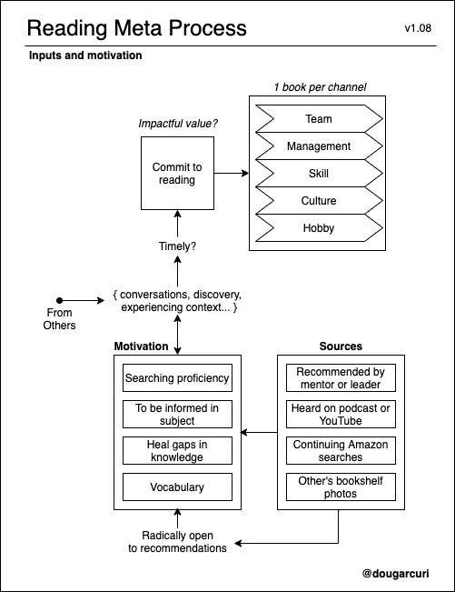
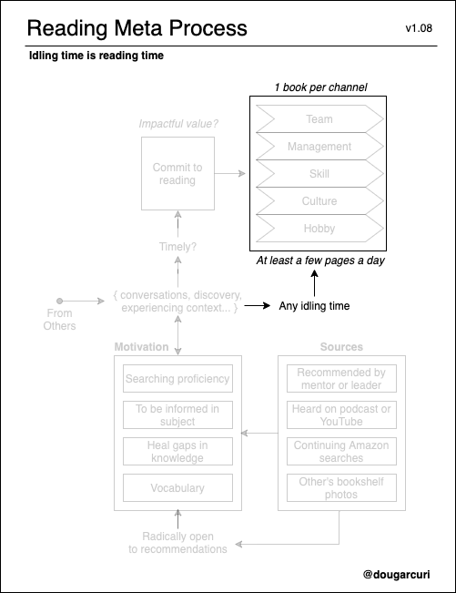
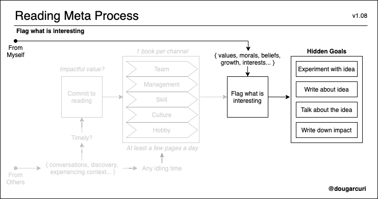
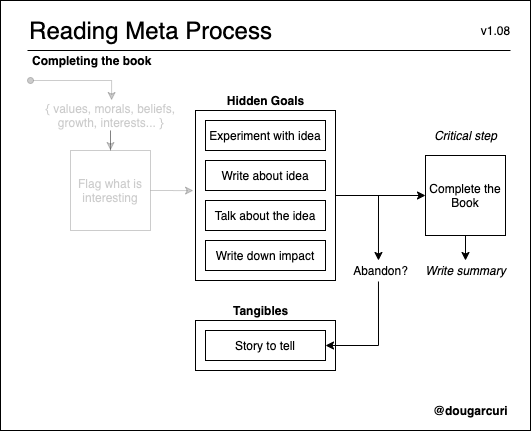
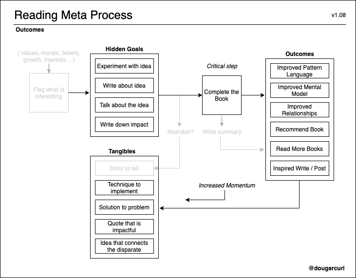
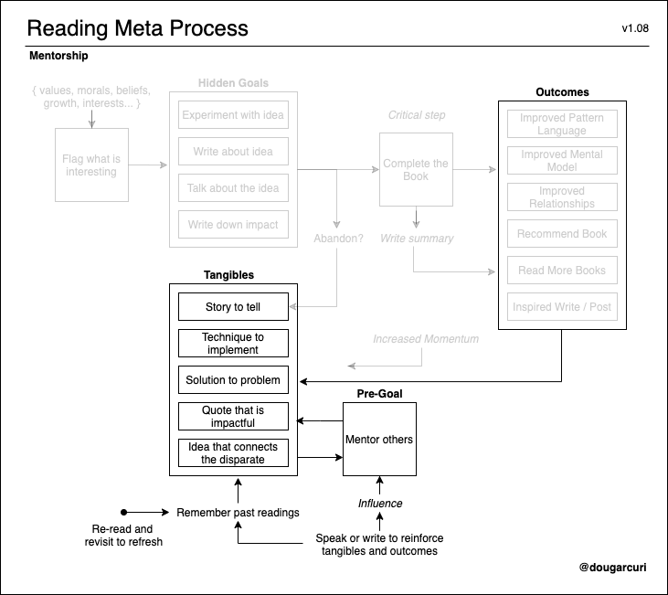
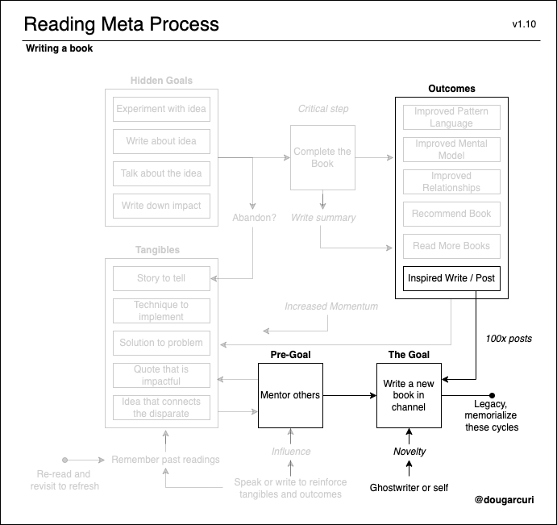
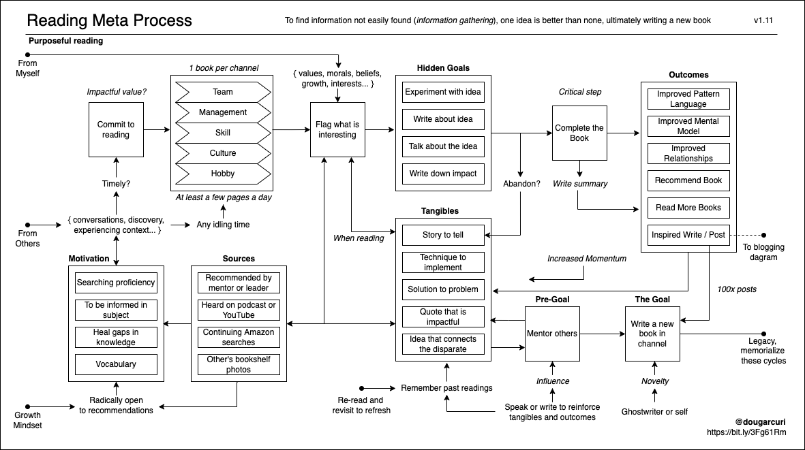

# Deconstructing My Reading Habits
## Understanding my Purposeful Discipline for Knowledge

Recently I had a conversation about my reading habits. Speaking through it, I realized the process I follow is *purposeful*. To better understand my motivations, I drew a diagram, similar to [how I blog](https://medium.com/@solidi/the-one-about-blogging-cd9e65a2055b). In this write, I will step through and highlight the essential parts. Sharing my process with others will memorialize my goal - writing a book.

## My Inspiration for Reading Books Comes from Others

When I choose books to read, commitment sparks from a conversation with another individual, mentor, or leader combined with a *motivation* factor. This recommendation aligns with a challenge I am experiencing or a skill set to improve. For instance, when I wanted a holistic view of distributed systems in software [in system design interviews](https://medium.com/swlh/the-one-about-software-engineering-interviewing-6f126e3a3171),  *Designing Data-Intensive Applications* improved my proficiency.

There are many routes to how I discover books. I am radically open to recommendations, and in some instances, I openly ask others. Book recommendations are also sourced from *asynchronous mentorship* — listening carefully to podcasts, YouTube, or crawling Amazon book recommendation lists.  If the recommendation is *timely* and has potential *return on discovery*, I will commit to reading the book.

## My Idling Time is Where Most Reading Occurs

My reading habits are sporadic, occuring in a gap of time when I am sitting or idling. Scheduling this time is usually not sustainable. The crucial point is I read at least a few pages a day, even if it’s not chunked (such as reading one full chapter in a sitting). The books follow me, and I prefer the physical book over a digital format to keep focused.

# When Reading, Note What is Interesting

I do not entirely understand my “interesting” scale, but I know how they appear in the text. These artifacts are impactful quotes, interesting ideas, or applied applications. Things that are **terse and succinct** positively engage me. I thought about this one for a while where interest originated from morals, values, and beliefs of my upbringing, culture, and experiences. From a skill set point of view, my "interests" are detailed information and novel application methods.

Like Robert Heatons *[How I Read](https://robertheaton.com/2018/06/25/how-to-read/)*, the way I track "interests" is a small system of Post-It flags and note-taking. My organization system needs improvement. Regardless, every book I’ve read has a handful of concepts and symbols that stick with me creating a never-ending snowball of knowledge.

## Completing Books is Important to Me

When committing to a book, it is a combination of recommendations, timeliness, extracting interesting points, and understanding actions. Books I start, I finish. I believe it is essential to complete a reading because it supports my momentum to start the next book.

Books that I abandon form a new story as to why I disliked the work.

## My Outcomes and Tangibles of Reading Books

For me, reading is a process of gathering new pieces of the context. Information and the experience they contain are valuable, for example, understanding *anchoring* from *Thinking Fast and Slow*, the *STARS* model from *The First 90 Days*, the *task-relevant maturity* model of *High Output Management*, and *mastering the art of letting go* from *Eleven Rings*.

Foraging **improves vocabulary**. Discovering the vocabulary builds a **mental model of the idea** expressed. The tangibles of the outcomes are clear —  exercising thoughts and speaking through the topic enhances connections to others, and the process is a never-ending cycle of approximation. In some instances, books connect ideas from different viewpoints, and in the end, form new opinions for me.

## My Reading Leads to Mentorship

As I read books that are purposeful in context, my goal is to *mentor others*. Telling stories of books builds trustful relationships. And the side effect is the inspiration to write openly to a community.

For example, when I read the book, *Hackers and Painters*, I connected the disparate, describing mentoring others [about a hobby](https://medium.com/the-innovation/cq-personal-mastery-through-hobbies-f25aab2e49ad) through “successive approximation.” Reading meta books on software engineering — such as *Programming Pearls*, *Pragmatic Programmer*, and *The Philosophy of Software Design* — equipped me the vocabulary of [correctness and pattern matching](https://medium.com/hackernoon/meta-skills-of-a-software-engineer-bed411f6685e).

## My Reading Leads to Writing a Book

My future goal is clear. The books I’ve read have **influenced me to write a book** — their content are my inspiration. My book will be a legacy of the  readings and what I've learned from them.

The purpose of why I read books is to write a new book for someone else - **to share what I’ve learned**. However, I am unsure of what *concept* to cover. I trust [it will come in time](https://martin.kleppmann.com/2020/09/29/is-book-writing-worth-it.html).

As I noted in the diagram above, *100x posts* is a critical concept. Writing enough and receiving feedback guides me to achieve the goal. The format will be essay-based — exploring *concepts* to a narrative arc.

## Conclusion

Reading books is a delightful process of learning. And writing is a result of reading books. The article, *[How to Read Fewer Books](https://www.theschooloflife.com/thebookoflife/how-to-read-fewer-books/)*, I'm discovered my goal in reading books. My approach is not rigorous. It is **constant and continuous**. The core parts of my process are sourcing and to improve *my meta reading machine*. While I do not remember everything that I read — ideas, thoughts, and previous writings unlock new conversation. Ralph Waldo Emerson’s quote describes what I feel:

> I cannot remember the books I’ve read any more than the meals I have eaten; even so, they have made me.

My reading motivation is to develop a purposeful skill set and to give back content — a creative exhaust as described by Brad Frost. Your reasons may be different from mine. What works for you?

---

## Social Post

I've deconstructed my reading habits by walking through a diagram.
Alt  title: I drew a diagram of how I read books

- My inspiration for reading #books comes from others.
- When reading, I note what is interesting with vocabulary and symbols.
- Completing books is important to me, so it increases momentum for more.
- My tangible of reading books is #mentorship.
- My goal is #writing more and authoring a novel concept for a book.

Thanks to Justin "Max" Pugliese for sparking the idea,
Danielle Arcuri, Hazem Saleh, Steve Guyer, Dan Leonardis, and others for editing.

Special appreciation to Manoj Thopcherneni, John Pavely, and Sang Lee for guiding me on the journey of reading, #purposefully.

[medium](https://medium.com/the-innovation/deconstructing-my-reading-habits-cef9e7d82bad)
[linkedin](https://www.linkedin.com/pulse/deconstructing-my-reading-habits-douglas-w-arcuri)

#reading #process #improvement #learning #career #productivity

### Posted

1. hackernews
1. r/programming
1. r/softwarengineering
1. r/howto
