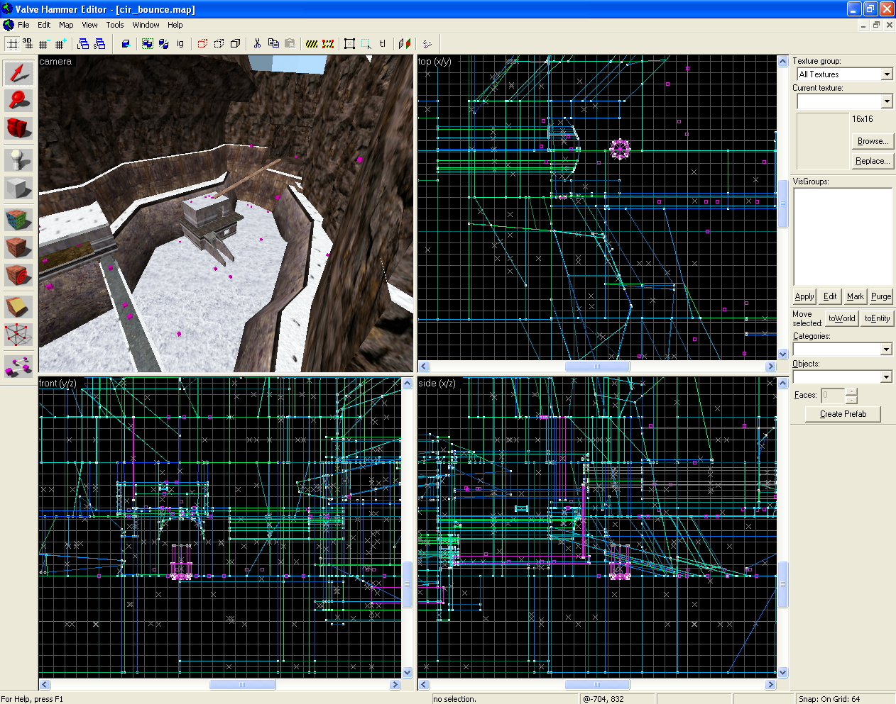

# Building a Popular Half-Life Mod During the Rise of Counter-Strike
## My personal account of building “Cold Ice”, an underground Half-Life mod

**When we purchased a home computer in 1998, I was consumed by PC video games. Particularly first-person shooters *[Quake II](https://en.wikipedia.org/wiki/Quake_II)*, *SiN*, and *Unreal Tournament*.** Out of all of them, my favorite was *[Half-Life](https://en.wikipedia.org/wiki/Half-Life_(video_game))*. The gameplay felt solid. The ambiance of the environment was immersive. The weapons felt heavy and responsive. The cast was engaging — [Marc Laidlaw’s](http://www.marclaidlaw.com/writing-half-life/) plausible scenario where theoretical scientists open a portal to an alien universe.

In my opinion, *Half-Life’s* online multiplayer battle mode felt realistic and fast-paced. *HLDM (Half-Life [Deathmatch](https://en.wikipedia.org/wiki/Masters_of_Doom))* was a place where online strangers compete to obtain “frags.”

).](images/34-03.jpg)

At about the same time I engaged with others in these online matches, the company that developed the game, [Valve](https://www.valvesoftware.com/en/), released an SDK (software development kit) in [April 1999](https://www.bluesnews.com/s/1239/half-life-sdk). The SDK enabled the community to modify the game to their liking. This helped the game’s popularity surge.

> “My first memory of HLDM was joining a server running a map called “[Stalkyard](https://combineoverwiki.net/wiki/Stalkyard)”. The things that sucked were the dial-up connection… and the game’s awful netcode.”

## Origins of Cold Ice.

Before discovering *Half-Life*, I dabbled in custom configuration changes in games like *Red Alert* and *Rainbow Six*. But *Half-Life* was my gateway to real customization with computer programming — [modding](https://en.wikipedia.org/wiki/Mod_(video_games)) to a community.

> “I remember Dad buying a copy of Microsoft Visual Studio Professional from Circuit City. He looked at me, “What is this for?” I shrugged, “I want to mod games.””

My curiosity engaged. How could I modify the weapons in the game to play differently? Then, without any prior programming knowledge, I started a modification later to be called *[Cold Ice](https://www.moddb.com/mods/cold-ice)*.

*[Cold Ice](http://members.tripod.com/~Half_Life_Page/Cold_ice.htm)* was fueled by changing the mechanics and “skins” (textures) of the weapons. I harnessed the digital echo-chamber of a clan — a group of people playing on the same team. The experience overtook my game consumption into a leading mod maker, an accidental producer/creator.

> “Cold Ice was unique, immature, violent, provocative, and rather…odd. But I didn’t care.”

Over time, *Cold Ice* became popular. Its concept was simple. Fast play, lots of explosions, [unearth unused weapons](http://transcriptions-2008.english.ucsb.edu/curriculum/lci/magazine/s_02/eric/mod.htm), a unique winter ambiance, and a good time.

The mod’s origin was discovered by accident. I found the “invert” functionality of [Paint Shop Pro](https://www.irt.org/software/sw003/). After extracting the player’s texture, Gordon Freeman, I recompiled it and placed it back into the pack file (a zip file the game uses to load resources).

It just so happen that the inverted texture looked cold. And hence, the mod name was born.

. Sting was one of our original beta testers.](images/34-07.jpeg)

## Curiosity on how things work drives determination.

When I first picked up the SDK, I knew nothing about game concepts and how to produce results. With research, I found the instruments to make the modifications. This included a toolchain of applications and 3D modeling software. What assisted discovery was the investigation of other’s modification project structures. I would download, unpack, and review their materials.

> “And in some cases, creative liberty was taken to “borrow” others project artifacts. In fact, I borrowed everything.”

Tools like Microsoft Visual Studio Professional 6.0, Paint Shop Pro 5.0, 3D Studio Max, and [Valve’s Hammer](https://developer.valvesoftware.com/wiki/Valve_Hammer_Editor) were learning curves for me. Still, I was determined to deliver an experience.

](images/34-12.png)

> “That experience was a crazy good time with lots of explosive devices. And those sound effects were hot as they were lifted from other pak0 files.”

. I remember thinking, “this place needs a swimming pool.” And so, I created one.](images/34-13.gif)

Experimenting with how the game was modified exposed me to wear many different “hats.” One day I would be working on developing a webpage to market the modification, the following day, I would be plugging a [vbsp](https://developer.valvesoftware.com/wiki/Source_BSP_File_Format) ray trace “leak” on compiling a map. The next day I would be editing the game mechanics. The intensity of the exploration sapped a majority of hours away from socializing in High School.

> “I stayed up late for many nights at a time. The grit to discover was immensely awesome. Nothing else mattered.“

, a texture exploration/editor from the Quake mod community. Textures are what are bonded to brushes (polygon surfaces) to give a visual appearance.](images/34-21.gif)

The tooling for Half-Life was a disparate toolchain. It was a grab-bag from various companies and modding teams. Since *Half-Life’s* tech incremented off [John Carmack’s](https://en.wikipedia.org/wiki/John_Carmack) (inventor of the base technology for *Half-Life*) brilliance in design decisions and logical organization, *Quake's* tools were useful. They were implements to look deeper in detail.

I was driven by the discovery of making things different. At that time, I was involved online with a team of players who wanted to see what we could do. This is what fueled me to keep going.

 — seen animated.](images/34-22.gif)

## Determination develops skills to glue things together.

Understanding how to build things that were required at the time was intense. Building websites, modeling new weapons, coding game logic, 2D art, finding and creating sound effects, and building levels were unique challenges to be discovered.

> “It was a vast playground of learning while being surrounded by invisible nerds doing the same.”

 (then hand-rolled HTML/CSS later on), we built and promoted Cold Ice.](images/34-24.png)

As time went by, I learned of community resources that healed my knowledge gaps. Conversations happened through forums and mailing lists. The best example was the Wavelength board, pictured below. [Wavelength](http://articles.thewavelength.net/) was a community watering hole, a place where we ask questions and got correct answers.

> “There were absolutely no wikis at that time, and no Lycos or Excite search worth its salt in finding what needed to be found. Everything was bookmarked in the mind.”

 in 2001.](images/34-27.png)

Players of *Cold Ice* highly appreciated the *sound effects*. The explosive sounds, the blaring of the multiple rockets, and the new weapon effects made *Cold Ice* what it was at the time. Crafting an experience was the result of finding resources that added value to the play.

” logo video intro looking through a window made by Coconutmonkey28.](images/34-28.jpeg)

Finding knowledge and interacting with a community was a part of that toolchain. And after finding that community, my skillset could only go so far. There is a point at which specialization was needed. I had to *scale* myself. This is what happened next.

> “What was this place? It was intoxicating with creative pleasure that nights, weekends, and summers would simply disappear.”

## Impact attracts others.

, a place to ask questions about code.](images/34-30.png)

As *Cold Ice’s* development went on, individuals came forward to usher the mod’s development. If I had to count, it was thirty contributors over its short lifespan. People liked the mod and wanted to add new value. This included level makers, modelers, and other artists to create an experience.

, a place where we found great maps and level designers.](images/34-31.gif)

, a prolific level designer who contributed to Cold Ice as well as many other mods.](images/34-34.png)

This allowed me to concentrate on my expertise area. For me, it was about game mechanics and improving the gameplay, making it balanced. I really liked the programming aspect and building the libraries called *.dlls*. The libraries contained the logic to make the weapons act differently. Every time I changed gaming behavior, it would have to be recompiled, and the game relaunched. This loop took at least three minutes for every change.

2D art was also of interest. I enjoyed fiddling with the HUD (heads up display), the information printed on the screen. I spent many hours developing a “smart hud notification system,” experimenting with mapping sprites (varying-transparency graphics). The goal was to improve real-time information and to enhance the play experience.

> “I went through this code, compile, launch, test loop thousands of times. It was like being a magician where things kept changing to my will. It was fascinating as it was frustratingly slow.”

At the time, the people I met were centrally located on a popular chat messenger called [ICQ](https://www.icq.com/) and [Internet Relay Chat](https://en.wikipedia.org/wiki/MIRC), a chatroom agent. And, of course, the ubiquitous email. There wasn’t anywhere near the video chat and tooling we have today.

> “And what is odd is that the identities of the individuals remain hidden. Probably for good reason; the acne was boiling over."

I only knew the names of one or two individuals, but we never once spoke on video in all that time. Besides, the cameras were too grainy on [NetMeeting](https://en.wikipedia.org/wiki/Microsoft_NetMeeting). I was on dial-up at the time.

> “The disreputable team was global. From Germany, Canada, Austria, UK, Finland, the USA, Australia, and other countries, we worked together to deliver something cool.”

Contributors poured in from all channels. Whether it be voice-overs, writing documentation and READMEs, 3D modeling experts, and numerous map makers. They all taught me how to become better at each skillset. Their gifts were appreciated and leveraged.

, a new style CTF mod styled in early post-war flair.](images/34-39.png)

And it also went the other way. See above and below. We were invited to contribute code and artistry in the community, which we did. The mods were popular at the time. In fact, both modifications, *Trinity Command* and *[Wasteland HL](http://wastelandhalflife.com/screenshots.shtml)* (WHL), were associated with early contributors of *Cold Ice*.

, a mix between Mad Max, Fallout, and “[John Woo](https://en.wikipedia.org/wiki/Hard_Boiled)” akimbo styled weapons.](images/34-42.gif)

I personally loved *[WHL](https://www.youtube.com/watch?v=OkEqjQbOMPw)* and *Trinity Command* because of their dedicated art direction. The feel of the gameplay was fantastic. When I had the chance to contribute to the weapons, HUD, and gameplay code, I had a lot of fun — I contributed to something larger than what we originally founded. And these founders were intensely good at the artwork and creating an atmospheric experience.

> “These contributors spearheaded other mods later, a testament to growing obnoxious leaders in digital [cabals](https://www.gamasutra.com/view/feature/3408/the_cabal_valves_design_process_.php). And I was too obtuse to stay with them. Drama was shared between individuals and mod teams.”

 with the map cs_siege — developed by mod makers [Gooseman](https://en.wikipedia.org/wiki/Minh_Le) and [Cliffe](https://en.wikipedia.org/wiki/Jess_Cliffe).](image/34-45.png)

Mod making was collaborative at that time — in the summer of 1999, we were invited to alpha test *[Counter-Strike](https://web.archive.org/web/20010803113019/http://planethalflife.com/features/motw/cstrike2.shtm)* with the map *cs_siege*. I gave notes back to the “test party.” Unfortunately, these notes are lost, but I remember that the mod was absolutely excellent. *Counter-Strike* became quite popular. So popular...that Valve eventually acquired them, and the mod became a globally recognized household brand.

## Software is about outcomes and consequences, not about technology.

, where we contributed back.](images/34-47.png)

We went forward in developing *Cold Ice*, rarely using version control, unit tests, product testing, or anything that would remotely resemble a modern development shop.

However, we launched the modification versions anyway, and when things broke, we quickly launched patches where they were needed (which happened frequently). It was a real R&D (research and development) setup.

, where voiceovers and sounds effects were shared.](images/34-48.png)

> “Craftsmanship is a new business we buy into; which didn’t exist at this time in software. Clean wasn’t in the vernacular. But we all needed serious personal linting.”

Between developers and artists, the process was libertarian. We shared most files through private FTP’s (file transfer protocol) and sparingly used patch files. We furiously messaged each other when changes occurred. What was most appreciated was the extreme quickness of the releases. Nothing ever stopped the team from delivering an update due to quality concerns.

 to upload files to shared places for mod contributions.](images/34-49.gif)

> “We listened to the community. We recklessly launched, in a way that promoted chaos.”

 by Jope. Nuke launchers and [railgun](https://github.com/solidi/hl-mods/blob/b57c4f608782014af36b88587f894c892829be76/cold-ice/src/dlls/railgun.cpp#L270) (à la Quake II) later in development.](images/34-49.gif)

The outcomes of the modification were never completely validated. But what is certain is that in developing software, craftmanship was never a crutch we used to validate our software existence. I didn’t know at the time, nor did the community.

> “This is not to say we didn’t have a practice or discipline. That practice was harnessing the pureist form of autodidactic exploration. The discipline was to ship. It was a Holy Land of craft, a geek Nirvana, a Mecca of maximum return on discovery.”

.](images/34-52.png)

There is a lot to be said about software quality in association with predictability. To think, after writing tens of thousands of tests over my career and nudging others to do the same, we once launched new software without the automatic checks. We celebrated our *beta testers*, and that was refreshing, liberating, and free.

## 1999–2000. Success in the community.

After several versions, Cold Ice made it to the *[mod of the week](https://web.archive.org/web/20000816001652/http://www.planethalflife.com:80/community/motw/coldice2.shtm)* located at [Kevin “Fragmaster” Bowen’s](https://www.vice.com/en/article/nzg4yw/fuck-you-and-die-an-oral-history-of-something-awful) Planet Half-Life (PHL). PHL was the central community hub located on the defunct [Gamespy](http://www.gamespy.com/) network.

 in early 2000.](images/34-55.png)

Others in the community noticed. I remember being invited to [Valve’s 1999 Mod Expo](https://combineoverwiki.net/wiki/Half-Life_Mod_Expo) in San Francisco, which I did not show —

> “I never pushed my parents to fly to SF, nor was extroverted enough to go through such a frightening social event — I was acutely introverted.”

And then there was the regular [PHL mailbag](http://planethalflife.gamespy.com/View555b.html?view=Mailbag.Detail&id=414). There always seemed to be a community. The replies were very positive, and the trolls abrasive as ever.

> “At that time, being a troll was normal fanfare. Everyone was doing it. Memes were the middle finger made in MS Paint.”

These events were like being #1 on the Apple app store in a major category and receiving tens of thousands of retweets within an hour. This was validation that we were doing things correctly and that the community was receptive.

, by Laserus, a dazzling map dedicated to open areas and tinkering with gravity.](images/34-59.gif)

Lots of people liked the play. Version 1.75, our most loved version, was the golden master build (GM) — a time when the software was burned to CDs and marked as 1.0 for manufacturing.

*Cold Ice* launched the beta 1 2.x update that changed how the game was played. This version visually improved the weapons and skins and experimented with an exchange system. This wasn’t receptive, as noted in the poll.

, noting dissatisfaction with the updated gameplay.](images/34-61.png)

We paused the development of *Cold Ice* as I contributed to other modifications and started to branch out to other areas, learning more about pure deathmatch play. *[Half-Life Pro](https://web.archive.org/web/20000815070305/http://www.planethalflife.com/hlpro/)* was an experiment inspired by *[Oz Deathmatch](https://steamcommunity.com/groups/halflife-ozdm)*. HLPro contained a mountain of configurable cvars (console variables) that included game modes, mutators (rules that change the way the game is played), and a redesigned heads up display.

 Its night ops mode was unique. The forum was the place to communicate.](images/34-62.jpeg)

In mid-2000, while work was going on *HLPro*, we launched a [“Cold Ice SDK” of our own](https://www.moddb.com/downloads/cold-ice-sdk). It appeared we “shut-down” *Cold Ice*, but that wasn’t actually the case. We attempted something bigger.

## 2000–2002. Release early and often; otherwise, the value will be shelved indefinitely.

](images/34-65.png)

As we grew, we realized that the current production version was highly naive. We wanted to improve. As we were working on other things, Valve broke the ecosystem by launching a non-backward compatible 1.1.0.0 update to the game. This caused labor for modders. Unless a non-trivial patch was attempted, the full crop of mods — *up to Spring 2000* — crashed on loading.

> “Valve fixed the netcode by optimizing server messaging, which was welcomed. But in the process, the patch created an unwashed caste of mods that would forever be locked in the 1990’s.”

And then we made a decision. Fix forward 1.75/2.x *Cold Ice* or attempt bigger changes? So we went with the latter and started our *failed rewrite*. We called it *Cold Ice Resurrection (CIR)*. I’ll share some of that work now, as it’s never been seen.

](images/34-69.gif)

The work was of much higher quality than the first versions, and the maturity of the approach was light-years ahead than when we started. We matured as developers. The *evolution* was tangible.

Hundreds of hours of work were labored over the project between contributors.

![images/34-71.jpeg]
![images/34-72.png]

 of CIR in early 2001.](images/34-73.gif)

The resurrection was an amalgam of many themes: *Counter-Strike*, *[Action Half-Life](https://en.wikipedia.org/wiki/Action_Half-Life)*, *WHL*, *Trinity Command*, and core elements of original *Cold Ice*. The direction was unclear, but we focused on fun gameplay and lots of mutators like *Iceman Cometh*.

We kept the rewrite to ourselves, reverting our original approach to feed the community. We went as far as to inform PHL of the incoming work, and they gave us a hosting spot, but we held back from sharing. This was a mistake.

> “There wasn’t a feedback loop like we had with the original versions. That was the mistake that screwed us. The resurrection was directionless in its visual beauty. I was an ineffective newb for not pushing it out the door.”

 for Cold Ice Resurrection. Also, the unreleased graphic.](images/34-77.gif)

Over time, the project became heavy, and motivation dipped to *zero*. We stopped work and left the project unreleased. The project artifacts began to decay into the digital ether. No one saw the update that we worked so hard on.

> “Without a community jeering us on, we failed to [grind through and ship](https://www.bluesnews.com/abrash/chap70.shtml). “When it’s done” never came.”

After the beta 1 source code was lost due to a hard-drive failure, we briefly started a beta 2. My last memory of *CIR* was that I wanted to modify the engine to make it snow — and then we gave up. The project was shelved in 2002.

> “I was pissed off. We restarted the work on a second beta with Infinity (lead contributor), but that fizzled out — and just like that, we were gibs all over the floor.”

## Retaining and sharpening skills after failure(s).

.](images/34-79.png)

Unfortunately, there isn’t a fairytale ending like what happened to other modifications. The biggest was that of Counter-Strike and [Day of Defeat](https://www.dayofdefeat.com/), which we were apart of that community at the time.

And that of Valve with [Gabe Newell's](https://en.wikipedia.org/wiki/Gabe_Newell) vision. They grew the gaming ecosystem pie by creating the massive [Steam Network](https://store.steampowered.com/).

What I can say is that for those who participated, we used *Cold Ice* to hone our skills and to grow as developers and artists. It was a great experience that I always thought shaped me as a person but left me questioning my understanding of what all had happened, quietly in my bedroom.

> “The experience was like a cold night in a “digital” football game where we won on the High-School internet. But no one was there, the bleachers were empty. But Mom kept calling me for dinner.”

My interesting lesson as a new [software engineer](https://dev.to/solidi/what-is-a-software-engineer-anyway-3fb2) was *even in failure; I grew a vast skillset*. I wanted to see what may happen next, what I could learn. *I would not surrender to solving a problem* — a shower or a walk helped with unlocking a solution.

The larger observation was for a project to survive; it is surrounded by a community betting the team to succeed and feeding off the releases. And if the cheering is absent, *projects die*.

.](images/34-83.gif)

> “There was no money in any of this. I left wondering where will I go — work somewhere and code with real people?”

 when taking on damage in a typical “think” loop.](images/34-86.png)

The road to developing, launching, growing, and maintaining game modifications in the community had taught me lessons. As I moved forward and started my career, these experiences were not forgotten. I had a unique and valuable perspective on building things.

My *curiosity* led to a determination to achieve something interesting. And critical afterthoughts — not to plan projects as “big-bang” releases unless there is a commitment to a [Valve time](https://en.wikipedia.org/wiki/Valve_Corporation#%22Valve_Time%22) scale, and to support backward compatibility where possible.

/doublecross architecture style.](images/34-89.png)

> “And while all of the above is in the trashbin of gaming, the skillset is valid and memorialized for meatspace to come get me. I’d be stuck in a [ch3wz0r](https://www.quakewiki.net/archives/features/polls/poll991110.shtml) map to be devoured like everyone else — but know better.”

 Geo-Mod influence)](images/34-93.gif)

## Exiting the scene.

After another pause, we had the energy and maturity to craft something elegant. We soft-launched a mod called *[HL Advanced](https://github.com/solidi/hl-mods/blob/b57c4f608782014af36b88587f894c892829be76/hla/redist/readme.txt) (HLA)*, a competitor to *[Adrenaline Gamer](https://www.moddb.com/mods/adrenaline-gamer) (AG)*, which was popular at the tail end of the golden time of modding in *Half-Life*. *HLA* included all of the game modes, like [1-on-1](https://github.com/solidi/hl-mods/blob/b57c4f608782014af36b88587f894c892829be76/hla/src/dlls/multiplay_gamerules.cpp#L502) arena matches. As it was a pure server-sided mod, no download was required.

> “I performed a solid 10,000 hours of being a troll and building things. My skillset was ready for whatever a company would throw at me. Except people skills — I had zero hours in that business.”

But *HLA* suffered the same fate as the resurrection; it was a failure. We repeated the mistake above, hiding in an unaccountable state over the brashness of launching incompletely — surrounded by trolls’ feedback. But the real fear was I’d receive no feedback at all.

With all my creative energy expended, [Half-Life 2](https://en.wikipedia.org/wiki/Half-Life_2) launched in 2004. I walked away.

> “In a golden era of mod making, Valve forever changed a scene. This wasn’t the plain old piping data in databases, it was an exploration of a new digital art form.”

Others eventually picked up *Cold Ice’s* development. A small team [launched a 2.5 version](https://www.moddb.com/mods/cold-ice/downloads/cold-ice-v-beta-25). But over the years, it’s been inactive. Interestingly, *Cold Ice* remains a small group of people on the [vast internet](https://forums.tomshardware.com/threads/cold-ice-a-hot-half-life-mod.137751/) asking [how to set up the mod](https://steamcommunity.com/app/70/discussions/0/1489992713697672376/) two decades later.

---

*The years have rolled by—much gratitude to those I modded with and to Valve. See Github for [those interested in contributing to the project material](https://github.com/solidi/hl-mods). The code, files, and screenshots above were located on an old hard-drive I found in storage. Unfortunately, artifacts are permanently missing. Maybe you have something to share to make it complete on Github? Leave a comment below; or contact above.*

---

## Social Post

Telling the story of Half-Life modifcation development.

#valve #gaming #half-life #mods #programming

I started to explore and make things work, ideas emerged. These truisms were validated many years after the mod was shelved back in late-2001. These lessons seem to replay when discovering and developing software in teams.

Thanks to Danielle Arcuri, and James Burns

### Posted

1. r/halflife
1. r/quake
1. r/programming
1. https://www.facebook.com/groups/363474493735643
