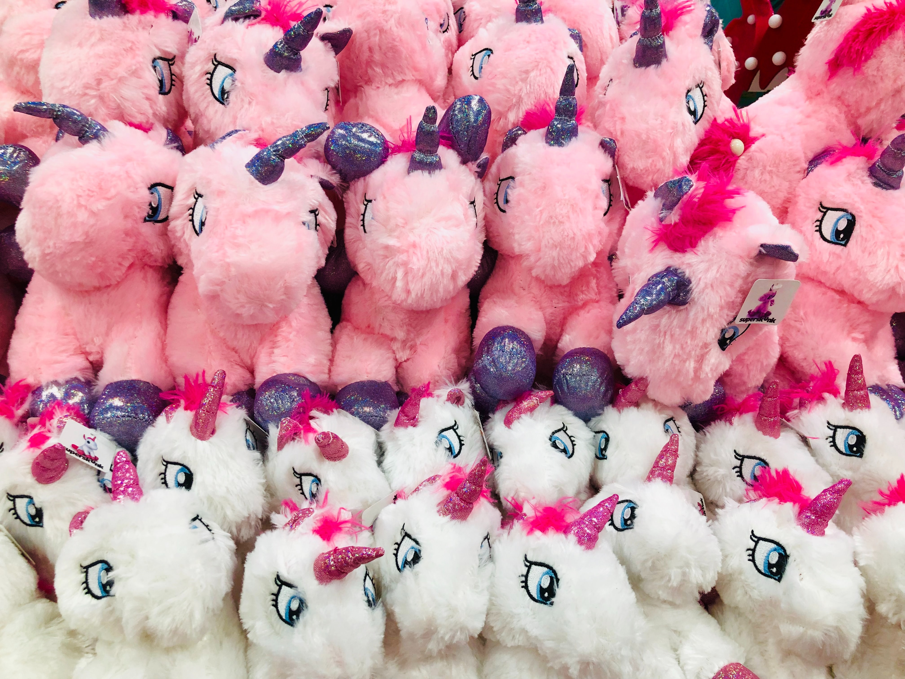

# The Joy of Collecting Timeless Engineering Posts
#todayisearched, #motivation, #watercooler, #mentoring

Hiding on the Internet are brilliant software engineering posts. They idle behind a few strokes of a query, having a quality set apart from the endless but helpful Stack Overflow threads.

I recently discovered another collectible gem. This one is titled *[When Bad Things Happen to Good Characters](http://hcibib.org/multilingual/badchars.htm)*. I'm not exactly sure who the author is.

What I enjoy about posts are their unassailable attributes. They unquestionably bring *deep nerd joy*. What do I mean?

**They are titled intelligently.** The title is well thought out, with a bit of play with words, but never mincing the impact. They are associatively memorable.

**The subject is succinct.** The story never wanders about something soft, they get right to the heart of the matter.

**There is playful humor.** The tale doesn't take itself too seriously. Somewhere in the post, there is a joust for a genuine laugh.

**Has clear examples.** Finding a phenomenon many engineers experience is hard. What's harder is capturing examples that are vivid in one go.

**Brings the joy of partnership.** When a teachable moment surfaces, the content comes back to be shared. Whether it's mentoring an engineer or someone who summons technological prowess, it's revered.

**The content is timeless in nature.** A post like *When Bad Things Happen to Good Characters* is unlikely to age. It lives for years without decay. It will always make me happy now I have it in my possession.

I came across the post as my teammate and I pursued a damned character encoding defect. For a moment, I thought, "wow, a language to describe this awful mojibake." I shared it, and we laughed nervously together about the *wild animals* eating umlauts for breakfast.

And so, *When Bad Things Happen to Good Characters* is added [to my list](https://github.com/solidi/learning-notes/blob/master/mentoring/shared-links.md), primed for the future.

I appreciate its pragmatic approach. It fits in a wide spectrum of engineering posts of principle or practice that invoke feelings of joy, brilliance, and supreme craft. Oh, how such an author distills experience into so little writing and then makes it timelessly shareable.

If by chance you were wondering, we solved the encoding issue by setting the *right* [code page](https://en.wikipedia.org/wiki/Code_page), keeping the wildebeests at bay.

---

## Social Post

There is deep joy in collecting timeless #engineering posts.

What may they look like?
- Are titled intelligently and has playful humor
- The subject is #succinct and walks through clear examples
- Brings the joy of partnership and is #timeless in nature

Thanks to Pratik Dhiman, Csaba Toth, Tom Lawless, and Danielle Arcuri

[url](https://dev.to/solidi/the-joy-of-collecting-timeless-engineering-posts-5el3)
[linkedin](https://www.linkedin.com/pulse/joy-collecting-timeless-engineering-posts-douglas-w-arcuri)
