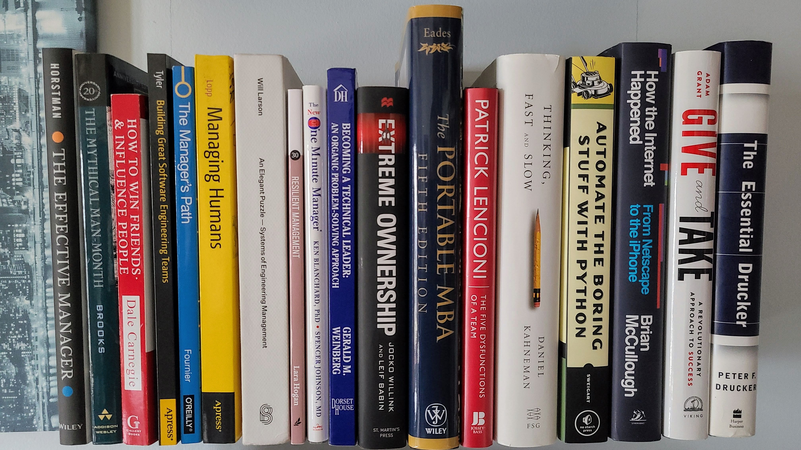

# Recognizing Remote Romantic Bibliophilia
#watercooler, #career, #motivation, #books

Attractive book spines in the background of remote video calls are a source of joy to me. And on more than one occasion, I snap a quick photo, secretly loving their collection too—a pendant into the soul of this beautiful, well-read person.

I want [to learn](https://medium.com/the-innovation/deconstructing-my-reading-habits-cef9e7d82bad?sk=622a30d66e361ceaab6943ebd6f9761c) with them.

For most of the pandemic, I have been happy - *grateful* - being [remotely employed](https://dev.to/solidi/do-great-at-working-remotely-1oh9). But my book collection sits in a small bedroom, seen in a different context. That is because my spouse is in that space, fighting COVID in projects that created vaccine formulation and mass production techniques.

And I am out here as an [engineer manager](https://dev.to/solidi/what-is-an-engineering-manager-anyway-4and) at my kitchen table, the team questioning my frequent house-bound geographical migrations in jest. Sometimes mimicking their virtual backgrounds of the places I've sat. I love them all.

But I wonder, do the engineers on *her* calls think that [*Mythical Man-Month*](https://medium.com/hackernoon/the-decision-hypothesis-aa512e0113) is an archaic titled process of medicine formulation? And for all the books I've seen, have they read through *their* titles so prominently displayed?

Regrettably, my collection has not been well-read. I'm ashamed of it. I'm trying to correct it. But I write this to end that. I am going to commit.

**No book seen in my remote view will be left unread.**

Regardless, my [book collection](https://github.com/solidi/learning-notes/blob/master/books/reading-list.md) will continue to grow like unabated technical debt. And all these beautiful book spines leave permanent imprints in my digital shopping cart.

Oh, and that book I saw on someone else's remote bookshelf yesterday? It’s on the way... borne from the brief moments of remote working and watching media interviews conducted on videoconferencing.

I recognize that every book in my collection started from a conversation. And lately, I have been suffering from a one-way conversation disorder. ***Remote romantic bibliophilia disorder***.

---

## Social Post

Do you recognize interesting #book titles in the background of remote calls or the #news #media? Unfortunately, I do. Here is to the #love and commitment of #reading purposeful #books.

Thanks to Danielle Arcuri and Steve Guyer

[url](https://dev.to/solidi/recognizing-remote-romantic-bibliophilia-255f)
[linkedin](https://www.linkedin.com/pulse/recognizing-remote-romantic-bibliophilia-douglas-w-arcuri/)

#learning #career #growth

### Posted

1. hackernews
1. linkedin
