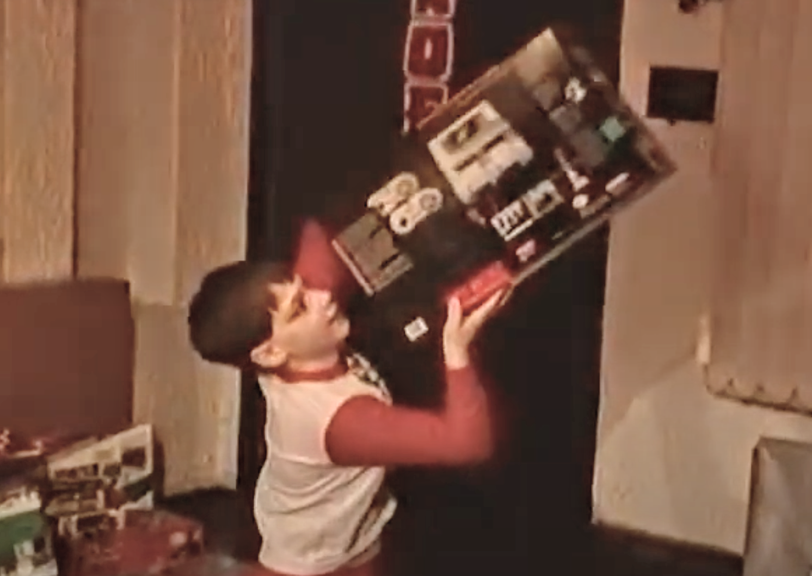
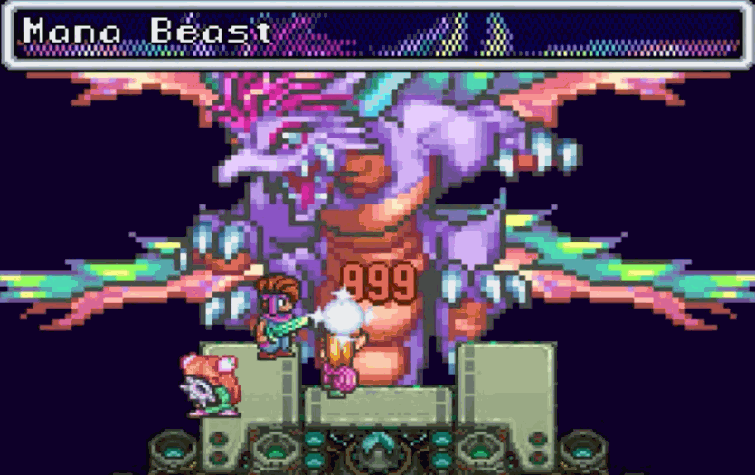

# Secret of Mana: An Oral History of Playing the JRPG in the 1990s
## Celebrating the experience of Secret of Mana on Super Nintendo

My childhood revolved around video games. My earliest memories start with the [Nintendo Entertainment System](https://en.wikipedia.org/wiki/Nintendo_Entertainment_System) (NES). Playing practiced my reading skill as it developed my sense of hand coordination. I enjoyed every minute.

Years into video gaming, [Super Nintendo Entertainment System](https://en.wikipedia.org/wiki/Super_Nintendo_Entertainment_System) (SNES) was my jam. I experienced summers dedicated to Japanese role-playing games (JRPGs). Specifically, masterpieces from [SquareSoft](https://en.wikipedia.org/wiki/Square_(video_game_company)), which authored Final *[Fantasy III](https://en.wikipedia.org/wiki/Final_Fantasy_III)* and *[Chrono Trigger](https://en.wikipedia.org/wiki/Chrono_Trigger)*.

Where it began was *[Secret of Mana](https://en.wikipedia.org/wiki/Secret_of_Mana)*. This post celebrates the original SNES console game. It describes what JRPG role-playing games are, provides historical context, shares personal nostalgia and memorable bits playing *Secret of Mana.*

> "Like other's stories of the time, mine starts with making friends in the neighborhood. My childhood friends bonded through the love of video games."

## A Primer on Role-Playing Video Games

The concept of role-playing games has a long history, starting with [Dungeons and Dragons](https://en.wikipedia.org/wiki/Dungeons_%26_Dragons). In the mid to late 1980s, video games took hold of the genre, replacing the tabletop format with one generated on the screen through an automated dungeon master, a game engine. A "player" role-plays, experiencing adventure through the eyes of playable "characters" virtually through a controller.

."](images/45-03.gif)

Video role-playing games include controllable 2-dimensional "sprites" or 3-dimensional "models" as protagonists or antagonists interacting with non-playable characters (NPCs). The generic context is a battle  between good and evil, with humanity in the balance.

Role-playing games have stories emulating real-life dramas, tragedies, and operas borrowing from religious and biblical references. They trace a familiar path of the "hero's journey," developing playable character "arcs," battle evil, confronting forms of God.

> "I'd experience the gaming on a "furniture" piece Zenith TV from the 1970s. The color bleed, clipped cropping, and the mono speaker was all wrong as it was right as it should be."

As gameplay unfolds, animated dialogue sequences tell the story. For JRPGs, these dialogues are translated or "localized." Stories develop from player's actions, real-time conversation, amnesia recovery of supporting characters, and dream or flashback sequences. These "mechanics" drive lasting gameplay.

," with Secret of Mana's unmistakable hit point animation popovers.](images/45-06.gif)

The player controls multiple characters, experiences melee fighting using weapons or magic, extending their way through the story to its conclusion. Players name characters and save game progress continually over time. Characters "level up" with experience points, manage their hit points (HP), magic points (MP), and increase strengths through "skill trees."

They "equip" armor and relics from defeated enemies, complimenting the natural "class" of the player. Optionally, they purchase these items from merchants  using a native money system, engaging in "inventory management" and repeated "gear checks," optimizing what is best for each player.

Players "grind" by repeatedly  battling enemies to increase their experience and money, ultimately maturing their attack abilities. Players develop strategies by deploying attacks and magic, driving outcomes. Fighting in the proper sequences at the correct levels gives the player an advantage, increasing enjoyment through accomplishment.

> "In these games I played, there was a perpetual wanting to go further into the escape of it all - to discover secret items and locations not easily found."

 and [Game Players](https://archive.org/details/Game_Players_Issue_35_December_1993/page/n89/mode/2up) uncovered strategy. I'd read with my friends on the school bus.](images/45-07.jpeg)

RPGs follow in "acts," like theatrical plays. They drive stories through diverse, "world-like" locations-unlocking new places from critical "boss" battles of varying difficulties.

The RPG's "final" battle is against the main antagonist. The lengthy struggle requires mature tactics to defeat the enemy. Once the player wins the final battle, the end credits play, completing out the game.

Apart from the game's completion, players enjoy achieving higher-level "stats," uncovering secrets, participating in "mini-games," and solving puzzles. Authors add "fetch" and "sidequests," driving alternative ending sequences of story content, increasing playability.

Seasoned players, known as "one-hundred percenters," prefer to replay their decisions in the game. These decisions have consequences -so they adjust for alternative experiences. These players go deep into the "backstory" of the playable characters, making them memorable.

)](images/45-08.png)

Finally, RPGs allow multiple players to experience the gameplay simultaneously, leading to sharing the journey. This mode, known as "couch co-op," was rare but highly appreciated on console systems.

## SquareSoft and the Release of Secret of Mana

Over time, role-playing video games developed styles between western and eastern cultures. These origins are where JRPGs get their name, produced in Japan.

JRPGs differ from western RPGs in a few ways. First, they are incredibly imaginative. Second, they tend to push the boundaries of emotional highs and lows, capturing the player's attention. Finally, they lean on a collective group for victory. JRPGs reflect specific tastes that translate well to storytelling in all cultures.

> "I'd name the characters after secret crushes from school. Years later, I wouldn't remember any of the original character names, but remember the failed attempts at relationships flawlessly."

Companies competed in developing these JRPG games. Nintendo was an original leader in the category, creating the series ("anthologies") *[The Legend of Zelda](https://en.wikipedia.org/wiki/The_Legend_of_Zelda)*. The series is considered "platform adventure," an entrance to role-playing. One company rose past the competition, developing a clear, vivid style. SquareSoft developed games breaking barriers with the technology. The art, music, and storylines were simulating.

Before having hundreds of people working in discreet teams, games were developed by one team from start to finish within a year. At SquareSoft, the team structure was manageable, with leads for programming, art direction, and concept play. These leaders, like [Koichi Ishii](https://en.wikipedia.org/wiki/Koichi_Ishii), would supervise numerous games in future efforts, leaving indelible hallmarks of stylistic passion.

In the early 1990s, SquareSoft became globally popular through its development of role-based games. They started different franchises, including the popular *[Final Fantasy](https://en.wikipedia.org/wiki/Final_Fantasy)* anthology. SquareSoft became the highest quality producer of video role-playing games on the Nintendo and Super Nintendo entertainment systems during the era. What they released were celebrated masterpieces. With learnings from the first series of *Final Fantasy*, they embarked on the next iteration labeled Final Fantasy IV, later rebranded as *Secret of Mana*.

*Secret of Mana* developers targeted the [Super NES CD-ROM](https://en.wikipedia.org/wiki/Super_NES_CD-ROM) system. Code-named *Chrono Trigger*, the original vision focused on multiple parallel sidequests within a rich playable world. This version fell on [the cutting room floor](https://tcrf.net/Secret_of_Mana_(SNES)), rumored to [have 40% additional content](https://www.usgamer.net/articles/my-ill-conceived-dream-to-play-secret-of-mana-for-the-nintendo-playstation) as the format held five times the space than a SNES cartridge. Years later, Squaresoft used this expanded ideation of *Secret of Mana* and reified it under the original code name.

With what remained, [Nasir Gebelli](https://en.wikipedia.org/wiki/Nasir_Gebelli) led programming, crafting its final version. The spirit of the game's [optionality](https://screenrant.com/secret-of-mana-snes-facts-trivia/) remained but ultimately played in a "linear" fashion. The game was localized to English by [Ted Woolsey](https://en.wikipedia.org/wiki/Ted_Woolsey) in record time, cutting [dialogue](https://gamefaqs.gamespot.com/snes/588646-secret-of-mana/faqs/19271) due to technical limitations. The cuts made the story difficult to understand before the internet.

> "The colors of Secret of Mana were impressively organic. Never before had I seen such a vivid scheme in a video game."

SquareSoft released *Secret of Mana* in Japan on August 6th, 1993, and later in North America in October 1993. In Europe, it would be another year before it was released. The game tops all the video game ratings, making it a critical success.

To this day, *Secret of Mana* appears in the top ten "all-time"  lists. It would [spawn remakes](https://www.polygon.com/2018/2/15/17012102/secret-of-mana-review-remake-ps4-vita-playstation-sony-pc-release-square-enix) decades later, attracting a new generation of players who were not present or were too young to play during its initial release.

## What is Secret of Mana?

*Secret of Mana* (Seiken Densetsu 2 in Japan) inspiration may have originated from [The Sword of Shannara Trilogy](https://en.wikipedia.org/wiki/The_Sword_of_Shannara_Trilogy). Set in a storybook fantasy land, you play three protagonists, Boy, Girl, and Sprite (In Japan: Randi, Primm, and Popoi). Equipped with the [Mana Sword](https://mana.fandom.com/wiki/Sword_of_Mana_(weapon)), you save the world from the [Empire](https://mana.fandom.com/wiki/Vandole_Empire_(Secret_of_Mana)) wielding the power of an ancient [Mana fortress](https://mana.fandom.com/wiki/Mana_Fortress), a weapon capable of destroying their world.

The game begins when the Boy accidentally unearths the Mana Sword, deploying monsters across the land. The Boy becomes committed, finds his allies, Girl, and Sprite, creating the "trio" to save the world from evil.

.](images/45-12.gif)

The trio unlocks powers to charge Mana's sword with the eight [Mana seeds](https://mana.fandom.com/wiki/Mana_Seed). The Empire pursues them, unsealing Mana seeds to unlock unimaginable power and harness the Mana Fortress. The main antagonist, [Thanatos](https://mana.fandom.com/wiki/Thanatos_(Secret_of_Mana)), is secretly controlling the Empire with his brainwash-like magic. The trio clashes with both, discovering each Mana seed throughout the world.

> "Decades later, I purged my SNES collection. What remained were fantastic games I would never sell at any price. In a potential future moment of peril, I would save my family first, and then my small collections of video games second - Secret of Mana in tow."

: Vendor Neko, Knight Jemma, and King Truffle.](images/45-15.gif)

.](images/45-18.gif)

Early in the game, Thanatos captures allies [Dyluck](https://mana.fandom.com/wiki/Dyluck) and [Phanna](https://mana.fandom.com/wiki/Pamaela), galvanizing the trio's resolve to fight. As the trio fights  battle after battle, they defeat the villains of the Empire. However, they fail to prevent the Mana Fortress from being resurrected by Thanatos. He unseals all eight Mana seeds raising the [Lost Continent](https://mana.fandom.com/wiki/Lost_Continent) - and thereby the Mana Fortress.

The trio meets the talking Mana tree, learning the [Mana Beast](https://mana.fandom.com/wiki/Mana_Beast) will be released to destroy the Mana Fortress. The Fortress destroys the [Mana Tree](https://mana.fandom.com/wiki/Tree_of_Mana). They clash with Thanatos and the Mana Beast at the Mana Fortress, defeating them with the Mana Sword, protecting the world from ruin.

 and his lieutenants and sees the Mana Tree for the first time.](images/45-21.gif)

," as "[The Oracle](https://www.youtube.com/watch?v=AYSoHfayX7c&t=3267s)" plays. Fighting the Mana beast set to "[Meridian Dance](https://www.youtube.com/watch?v=AYSoHfayX7c&t=3267s)."](images/45-24.gif)

The defeat of the Mana beast has consequences. As the Boy returns the Mana Sword, a force casts the Mana magic to a different world. The power casts Sprite away because of their close association with Mana. The "trio" is no more, ending the game.

## Discovering the Meta of Secret of Mana

*Secret of Mana* was the first game I played from SquareSoft. I first discovered it at our local [Blockbuster](https://en.wikipedia.org/wiki/Blockbuster_LLC), a place where we rented games. The box art was spirited, looking visually stunning - so I gave it a go. I rented it numerous times before I bought the game.

> "The secret was at Blockbuster. I was enamored by Secret of Mana. My parents rented it as many times as it cost to purchase it. I was obsessed, keeping the instruction manual from the first rental."

*Secret of Mana* was my sophomoric introduction to role-playing games. Before discovering it, I had completed the *Legend of Zelda* series on all Nintendo systems. In this series, the gameplay was straightforward by completing missions, defeating bosses, and solving puzzles. It contained an elementary configuration of armor and magic spells.

*Secret of Mana* had roots inclined to role-playing sensibilities. Those in the RPG community describe it as a "multiplayer *Legend of Zelda* with melee timers." The game contained a plurality of stats and sophisticated strategies but did not shy away from its active-time battle  system (ATBS). Statistics is what motivated me to play. To grind by leveling up was satisfying.

 My copy of the world map, the land of Mana.](images/45-30.gif)

), a dragon in which the heroes fly the world, and the [Mode 7](https://en.wikipedia.org/wiki/Mode_7) effect on the SNES. The floating Mana Fortress is in the distance.](images/45-32.gif)

> "When I was bored of play, I would adjust the color/hue on the TV set to have a new vivid gaming experience - essentially an old fashioned palette-swap."

*Secret of Mana* was whimsically lush for its color usage. The charming style would carry throughout the game. From the weapons, the magic, and the world, it was energetically vibrant.

The battle play system was similar to Legend of Zelda, where a player could move as the fights happened, except for the "arena-style" boss battles.

*Secret of Mana* had a unique blend of mechanics chiefly its own, rarely copied. The weapons and magic were sophisticated compared to other games I'd played. What set it apart was calling "elementals," [anime-like characters](https://mana.fandom.com/wiki/Mana_Spirits) who summon magic casts on behalf of the allies. As for melees, the weapon charges through a reversed "chicken-o-meter," unlocking critical hits.

.](images/45-36.png)

## The Bits that was Uniquely Mana

Playing *Secret of Mana* has remarkable qualities unique to the gameplay. I'll share those exciting bits, as others remember it the same way. There is a mix of frustration and joy in all of these items.

## The Addictive Music

*Secret of Mana* had excellent music composed by [Hiroki Kikuta](https://en.wikipedia.org/wiki/Hiroki_Kikuta). The progressive composition used unique and complex scales, mixed chord changes, producing melodically addictive harmonies. These tracks stuck to me after hours of play. At one point, I recorded the music on a cassette tape.

At the time, it was simple to record music. I used my [TalkBoy](https://en.wikipedia.org/wiki/Talkboy) to record the tracks. My favorite tunes were from the Ice Palace "[A Bell is Tolling](https://www.youtube.com/watch?v=AYSoHfayX7c&t=2178s)," Northtown "[A Curious Tale](https://www.youtube.com/watch?v=AYSoHfayX7c&t=102s)," and the Mana Fortress "[Leave Time for Love](https://www.youtube.com/watch?v=AYSoHfayX7c&t=2929s)."

> "Apart from the corded telephone in the kitchen, there weren't many devices to capture sound. I would take my TalkBoy and record the music of Secret of Mana on cassette tapes. I'd play them back later being enamored by the music. I'd also piss off my friends with the eclectic tunes - like the [Dwarf village medley](https://www.youtube.com/watch?v=AYSoHfayX7c&t=853s) on repeat."

## The Awesome Cooperative Multiplayer Mode

*Secret of Mana* introduced the ability to role-play with friends simultaneously. Using a [multitap device](https://en.wikipedia.org/wiki/Multitap), three players could control each character, battling together throughout the adventure.

Playing an RPG with others in real-time was rare. Other games did not allow this type of action as one person controls the game while others watch, waiting for their turn to play. The lack of multiplay wasn't the case for *Secret of Mana*, making it a unique couch co-op experience.

## Frustrating Computer Gameplay

Players of *Secret of Mana* select a leader they wish to play at any time. This game mechanic is helpful. When an enemy's magic attack stuns the chosen character, a player selects another, continuing the battle without interruption.

For the characters the player did not directly control, the game automatically operated the behaviors of the allies. The AI response was configurable through an intuitive matrix table, known as the "action grid." It did not work well in some situations.

."](images/45-41.gif)

> My friends and I would play the game for hours in my parent's basement. The world would go by as we walked the [Forest of Seasons](https://mana.fandom.com/wiki/Forest_of_Seasons), grinding in the Upper Lands."

Depending on the weapons equipped, running from screen to screen without "computer friction" was impossible. Either the ally would engage enemies when you did not want them, getting "stuck" between obstacles, causing backtracking to "unstick" them. This behavior caused accidental fights, reducing the trio's resources. Rarely, characters become "perma-stuck," where the player cannot move to the next screen, forcing a reset as the only remedy.

## The Last "Rare Drop" Weapon Orbs

In *Secret of Mana*, power "orbs" deliver weapon upgrades. Upgrading required forging the weapon by a dwarf named [Watts](https://mana.fandom.com/wiki/Watts). Discovering  the final "level 8" orbs was a challenge.

The trio receives orbs in defeating bosses. The  final upgrades are rare dropped treasures from enemies within the Mana Fortress. For example, the [Terminator](https://mana.fandom.com/wiki/Mace_Menace_(Secret_of_Mana)) in the Mana Fortress would drop the last whip orb.

To obtain a sense of completeness, I spent time purposefully locating each orb. Each treasure secured  great power but came at a cost. Finding the remaining level 8 weapons required an investment of additional hours, rumored to be set at a 1 in 256 chance after dispatching an enemy.

)](images/45-43.png)

> "I remember going to [Electronics Boutique](https://www.reddit.com/r/nostalgia/), a place where nerds would go to look at games. At the time, EB had a unmistakable odious electronic smell. To this day, it brings me right back to holding a fantastic game like Secret of Mana."

## Missing Melee Strikes, Magic Chain-Casting, and Level 8.99

When battling enemies, a player could evade and strike at their own will. But what was odd about the system was the handling of subsequent melee strikes. During specific enemy animation sequences, strikes wouldn't register, effectively making them invincible for a time. The lack of a visual indicator was incredibly frustrating.

The magic system had a quirk called "chain-casting." The player continuously cast spells on an enemy until the player decides to stop. Chain-casting allowed the player to carefully reduce a monster's hit points, accumulating a devastating "999" blow, as they were "stun-locked," delivering defeats  by quickly dispatching bosses.

Without this chain-cast mechanism, the game would be locked in "expert" mode, as sporadic melee and magic casts would be challenging to orchestrate well. Perhaps the creators wanted a blend of melee and magic casts in boss battles, using thoughtful "saber" magic for Boy to participate in striking. However, saber magic was ineffective.

 with Boss [Metal Mantis](https://mana.fandom.com/wiki/Mantis_Ant_Boss_Line) stun-locked. Level 8.99 magic on Dark Lich.](images/45-45.gif)

Finally, practicing spells upgrades the power of the magic casts. Once the trio charged all eight mana seeds, the magic level could reach level "8.99". The level unlocks an extraordinary magical effect. The new animation cast would temporarily pause the gameplay, making chain-casting a breeze.

> "Secret of Mana introduced me to a level of abstraction where I filled the story gaps. This property alone made it a creative piece never to be reproduced in a remake - maturing technology like voice overs and cinematic cut scenes had closed the door forever."

## Thirty-Eight Boss Battles with Palette Swaps

*Secret of Mana* contains a significant amount of [bosses](https://www.ign.com/wikis/secret-of-mana/Bosses#Boss_Guides), traditionally adhering to JRPG style. The pace of boss battles builds gradually in the first act of the game. As the game progresses, boss battles continue to increment. In the final acts of [Pure Land](https://mana.fandom.com/wiki/Pure_Land_(Secret_of_Mana)), bosses appear on every screen. The pace was frightening as much as rewarding.

 boss battles are "palette-swaps" in Pure Land.](images/45-47.gif)

One of the letdowns is the bosses appeared visually repetitive. More than a handful of bosses are "palette-swapped." Palette-swapping is considered a shortcut to add content, using the same sprite animations but different colors.

## Using Game Genie to Level Up

A final mention about cheating with *Secret of Mana*: I remember using [Game Genie](https://en.wikipedia.org/wiki/Game_Genie) to "auto-grind" the characters. [Specific cheat codes](https://archive.org/details/GameGenieSNESCodeUpdateVol1No4/page/n13/mode/2up) iteratively increased a player's experience, leading to overpowered players early in the game.

This advantage was an exciting hack to enable and the most memorable of the cheat codes. I'd experiment with other combinations of codes, finding ways to unlock playability with the gaming experience.

## Concluding a Memorable Masterpiece

.](images/45-51.jpeg)

. [Waldenbooks](https://en.wikipedia.org/wiki/Waldenbooks), a place where I would search for game strategies.](images/45-53.jpeg)

*Secret of Mana* was the first JRPG I immensely enjoyed. I spent an entire summer playing the game from start to finish. It had consumed all of my time in front of the television. There were moments where my friends would come over, playing in multiplayer mode. It was a fantastic time with an excellent game.

> "Every so often my Mom would bring us to the mall. When we arrived at Waldenbooks, it was always a journey to the video magazines and game book section to check out the latest strategy guides. I picked up the [Secret of Mana Players Guide](https://archive.org/details/secret-of-mana-official-game-secrets) and [Prima Game](https://en.wikipedia.org/wiki/Prima_Games) books - as expensive as the game."

I officially owned *Secret of Mana* when we purchased a copy in the late summer of 1994, swiftly beating  the game. I share memories of my friends in my parent's basement, where we played the game.

 plays.](images/45-55.gif)

> "Through nostalgia tinted goggles, it's the memories for me that last. Secret of Mana is a technical expression of the 16-bit era. This game, with [its oddities](http://www.flyingomelette.com/oddities/oddities25.html) and flaws, made me fall in love with the craft. There was one problem - it played within 20 hours, which I desperately wanted more."

---

*I dedicate this write to my friends Danny and Chris, who played Secret of Mana, and my daughter, who recently discovered it.*

*Sourcing of the material was possible thanks to the numerous Secret of Mana [long play videos](https://www.youtube.com/watch?v=p2YKXUlXjZM) and [many](https://twitter.com/cartcommand) [podcasts](https://twitter.com/squarerootspod). But best of all, the origin is memories.*

," with Sprite in the distance. If you wondered, Blockbuster never collected the [instruction manual](https://www.nintendo.co.jp/clvs/manuals/common/pdf/CLV-P-SABRE.pdf).](images/45-57.gif)

## Social Post

Celebrating a personal story of #SecretOfMana on the #SNES.

Thanks to Danielle Arcuri, Bryan Finck, and James Burns

#RetroGaming #Squaresoft #Nintendo #gaming #videogames #retro #nostalgia

[url](https://superjumpmagazine.com/secret-of-mana-an-oral-history-of-playing-the-jrpg-in-the-1990s-39029a28584f)

## Posted

r/nostalgia/ - removed
r/jrpg/ - removed
r/snes/
