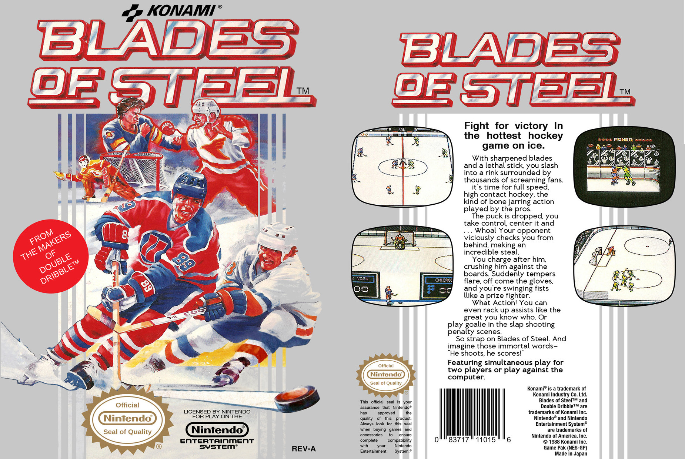
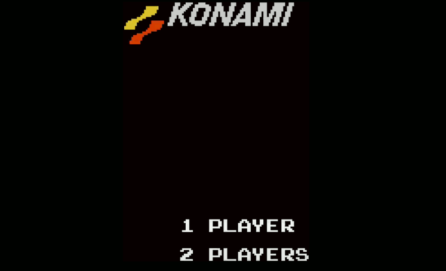
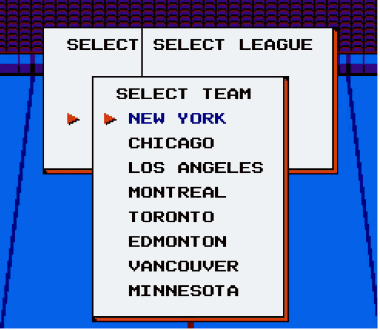
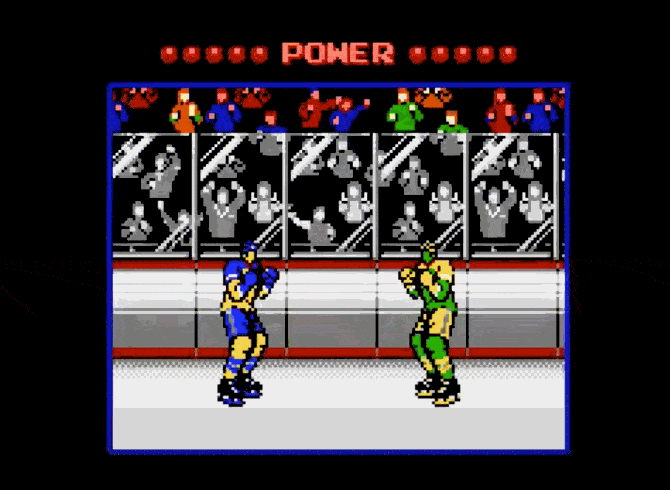
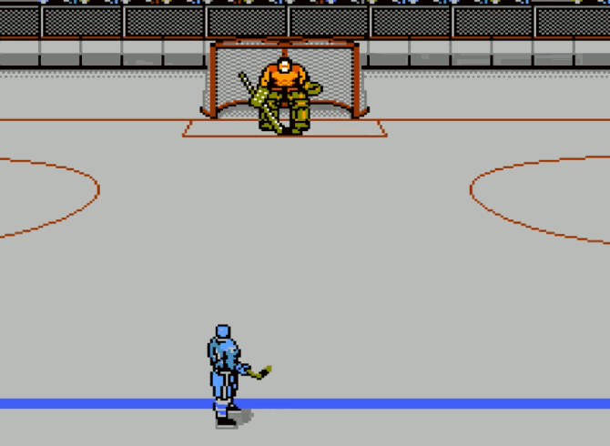
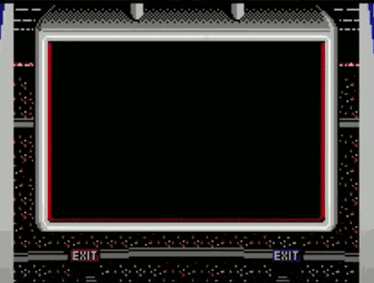
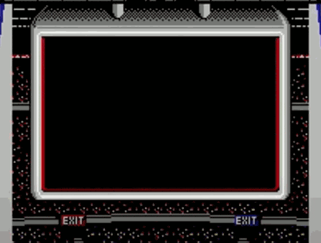
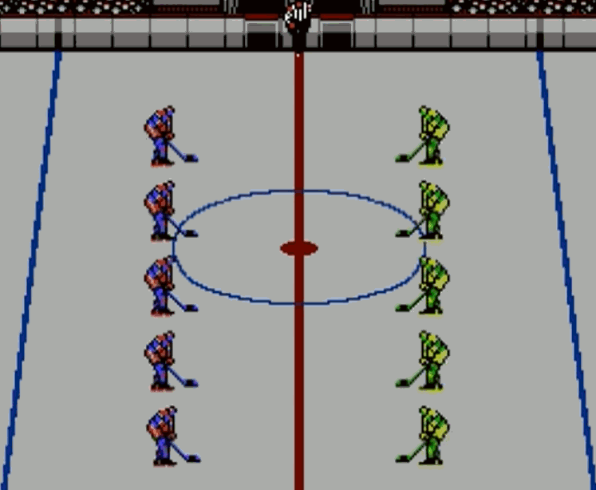
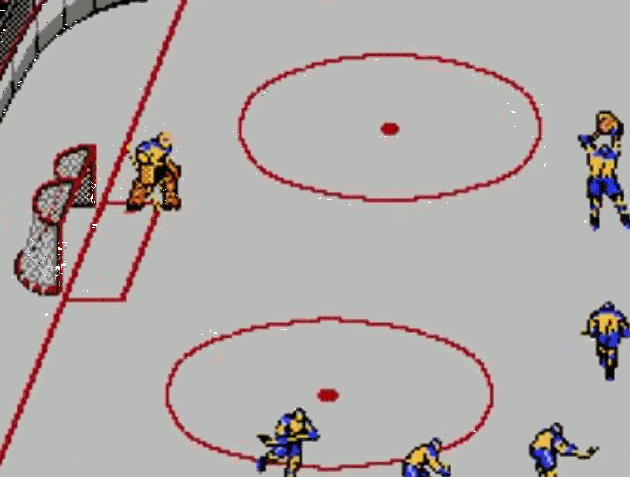

# Blades of Steel is the Greatest Hockey Video Game of All Time
## I'm not kidding. It's the best out there.

*Blades of Steel* for the [Nintendo Entertainment System](https://en.wikipedia.org/wiki/Nintendo_Entertainment_System) (NES) is the greatest hockey video game, period. It has outstanding elements, delivering a premium hockey playing experience. Let me explain.

## The Name and Top-Shelf Voice Overs

Let me start with the name-*Blades of Steel*. I mean, the title alone is the definition of extreme cool. It's more than *[Ice Hockey](https://en.wikipedia.org/wiki/Ice_Hockey_(1988_video_game))*. Only its cover art can top it, capturing a sweet illustration of hockey in one photo.

No other game starts with "*Sching* - Blades of Steel!" except for *Blades of Steel*. From there, excellent voiceovers follow. Pushing the limits of the 8-bit technology, these are of the finest quality. They include "Blitz..." uh, "Hit...", I mean, "Get the pass!" "Face-off!" "Ahhh!" "Penalty shot!" and "Fight!" There is no other that matches this level of linguistic pronunciation.

## The Teams

*Blades of Steel* cool doesn't stop there. Being unlicensed, their developers knew how best to avoid legal challenges from official gaming organizations.

They chose the eight best cities in Canada and The United States, with jersey colors being the only differentiator. No need to deal with player management, stats, or trading. Only their neon windbreaker outfits mattered, beating the fashion trend by *five years*.

## The Arrow of Fortune

No other hockey game gives the player the excellent fortune to victory-with a red arrow. Passing strategies and one-timers in *Blades of Steel* are absent.

Don't fear. Risk the shot by following that arrow. When the puck bounces off the goalie the *fourth time*, try again. In the end, the goalie will be too slow, showing how pissed they are by repeatedly slamming a stick on the ice.

## The Endless Fights

Let me be clear about the fights in *Blades of Steel*. Fights are plenty, and the referees take no prisoners. Bump a few times with the opponent, and hell breaks out.

When you fall, you lose the contest, dragged back to the sin-bin. That's how it works. The losers do time. If you are bad enough, you may not have any players left on the ice. Good luck with that.

## The Penalty Shots

Starting a fight close to the goalie will award the team *who is on offense* a free penalty shot. I mean, this is *Blades of Steel*. It doesn't mince on what it is to be the greatest.

The penalty shot mode is the sweetest experience. No skating is allowed to the goalie. The physics of each puck shot will never be in question. That's okay. This video game is *Blades of Steel*, the best hockey video game.

## The Intermission Commercials and Games

Back in the 1980s, no video game ever dreamed of adding intermissions - and for that matter, selling their wares during it. Except for *Blades of Steel*, their developers were ruthless entrepreneurs to kids, thirty-five years ahead of what they are immersed in now. (*Have you checked in on them since starting this read?*)

What's more, *Blades of Steel* possibly invented a new type of entertainment. As the game is "loading," you too can play a mini-game. The idea was so good that a rival [held a patent](https://www.eff.org/deeplinks/2015/12/loading-screen-game-patent-finally-expires) on it for twenty years. Smart.

## The Losers Line Into the Locker Room

After the beatdown fights, penalty shots, and losing the game, your team will line right to the lockers. There isn't a handshake line, dabs, or anything resembling recognition of the other team's efforts. Cry yourself to sleep. This is *Blades of Steel*; there are only winners.

## The Celebrations and Ending Credits

If you are the winner, no other game in existence has celebrations quite like *Blades of Steel*. As the crowd roars, your team will circle furiously, completing the triumph with sticks in the air. This gongshow is what hockey dreams are made of.

When beating the tournament mode, get ready for the best credit sequence known in video games. Grab your homemade pretzel bites, beer cheese dip, and tissues. It's a tearjerker and well made too.

Why did I write this? Only because each game ends with the effect of an old-styled photo, making it *the* masterpiece. No other hockey game comes close.

The camera's shutter click is where experience meets emotions, rarely copied, confirming why *Blades of Steel* is the greatest damn hockey video game of *all time*.

 by a photo from when my team last delivered the cup.](images/46-11.gif)

I love this game. I rest my case.

## Social Post

The debate is over. Blades of Steel is the greatest #hockey #video #game of all time.

Thanks to Danielle Arcuri and Matt Funk

#BladesOfSteel #Nintendo #NES #RetroGaming #Gaming #NHL

[url](https://medium.com/@solidi/blades-of-steel-is-the-greatest-hockey-video-game-of-all-time-9c6de5ab75ab)

## Posted

hackernews
r/nes/ - removed 
r/gaming - accepted
r/retrogames
r/nhl/
r/hockey/
