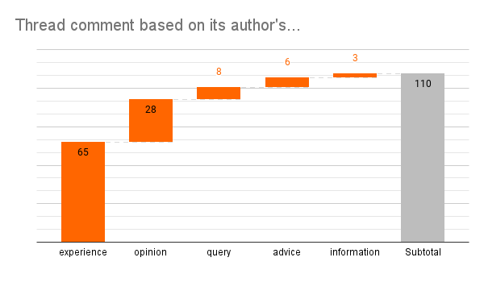

# How to Place on the Front Page of Hacker News
## Exploring Content Qualities that Resonate with the Community


[Hacker News](https://news.ycombinator.com/) (HN) is a community that prioritizes posts about software engineering, technology, startups, and other related meta conversations. Within HN, there is a continuous stream of topics that churn. The most engaged writings appear on the top thirty list.

Towards the end of my second decade in [software engineering](https://medium.com/@solidi/my-goal-is-to-ship-c772f63c278d), I began to write openly, exploring topics related to humans in software. A handful of my posts have reached its front page.

Being a genuinely curious person, I questioned why my posts rocketed to the top. So I collected the relevant information, put together a few graphs, and will share what I learned.

## Introvert by Nature

My writing motivation has been an authentic outlet, a long-winded expression of myopic introversion. Making it to the front page of Hacker News is an exciting side effect of time invested.
Speaking in crowds is exhausting, but my strength is talking privately to people. In those conversations, I prioritize writing ideas.

I’ll cover my essays that made it to the top of HN.

## #4 [Touch-Typing Feels Good but Isn't for Me](https://medium.freecodecamp.org/touch-typing-feels-good-but-isnt-for-me-2cfbafee2074) (2019) Placed [18th](http://news.ycombinator.com/item?id=19672434), 24hrs


**Motivation***: My in-depth conversations of mechanical keyboards made me furious, questioning the effectiveness of touch-typing, so I practiced.*

**Learning***: My result was inconclusive. However, after I published, I tried an alternative keyboard. It improved my typing by 20 words per minute. The hardware made a difference.*

When I discovered writing, it opened up a creative outlet, transforming my overthinking into a constructive habit. But writing isn't easy to do well. The blank page is constrained to my natural writing voice. Most of all, it's easy to start but tough to continue.

## #3 [Observations on Test Driven Development](https://medium.freecodecamp.org/8-observations-on-test-driven-development-a9b5144f868) (2018) Placed [17th](http://news.ycombinator.com/item?id=17756835), 36hrs


**Motivation***: The debate about test-driven development (TDD) went long in the shop, so I had to say something - supporting it - finding helpful patterns.*

**Learning***: TDD works well within small dogmatic groups but is too difficult to pull off at scale. I have not found a large shop that does it, nor do I practice anymore.*

An essential attribute to a document is clarity. Writing requires an editing process, sometimes ongoing for weeks to achieve transparency. More so, it is when the content resonates with the reader. Connecting with an audience is the goal, so I will piece together a shortlist of what and how.

## The List of What

Of my entries that went the farthest, they were intensively exhaustive in a practice of technical craft. Here are a few specific content qualities I noticed.

```
**Content qualities that place on Hacker News:**

- To the point, best attempt at clarity in thinking to writing
- Seeks truth through practice, data, or first-hand experience
- Interesting graphs or media paraphernalia that surround it
- The content is helpful and sometimes controversial
- Builds to something important at the end of the post
- The topic helps the reader to think or do something later

*But really: Content that resonates with the audience*
```

## #2 [When an Engineer Exits the Team](https://medium.com/@solidi/in-software-when-an-engineer-exits-the-team-1e550303cff8) (2021) Placed [2nd](http://news.ycombinator.com/item?id=28692059), 48hrs


**Motivation***: I lost numerous engineers within the continued "Great Resignation." I became a stoic for a while.*

**Learning***: Most people leave their managers. However, I forgot one poignant fact. As it is for me, leaving a job was about money.*

Friends in my circle have yet to accomplish a Hacker News placement, so there isn’t a peer available to compare notes. But I know people who fear speaking into the void. I was shy too, until I realized time was short, and there was so much to say. Not being able to say it in person well is the perfect reason to write.

```
**Possible shortcuts to reach the top:**

- Being popular in the community
- An important statement concerning a product, company, etc
- Oversell with satire
- Clickbait the title to spark a rolling thread
- Post your own work when published
- Meta post about HN or the practice of writing
- Timely content that is the focus of the community
- Tackle a profoundly controversial topic with impunity

*Honestly: Knowing and writing to an audience*
```

## #1 [Ham Radio - CQ: Personal Mastery Through Hobbies](https://medium.com/@solidi/cq-personal-mastery-through-hobbies-f25aab2e49ad) (2018) Placed [1st](http://news.ycombinator.com/item?id=18635362), 60hrs


**Motivation***: When my father was battling depression for a second time, I practiced a hobby he loved - writing about it to him.*

**Learning***: Constructive diversions, like a hobby, break the depressive cycle. My father recovered.*

For my entries that reached the top, I noticed a pattern in private sharing. But available tools cannot show inference. So I guess these ideas touch a nerve, for good or bad. How to place well on HN remains an educated guess.

Next let’s explore comments from the HN community.



## The Process of How

[Many of my writings](https://github.com/solidi/writing) haven't found an audience, nor have they reached the front page of Hacker News. After publishing, these posts achieve a few hundred views with a tip of the hat from a motivated reader.
While writing for years, I tracked each idea's inception to publication. Below is my thinking within a moving graphic.

## "How I write in this format" diagram

 discovered my years of documentation and labeled it "[Blogging as a System](https://twitter.com/Aida_Isay/status/1486018778001555457)," which I thought was the correct title.](images/48-13.gif)

I apologize if the graphic is overwhelming. Looking from left to right highlights each article's journey, from consumption to creation. Start by reading the top row to understand the significant points, then go deep within each column to appreciate its detail.

While every facet is essential, I'd like to bring in others who can grow from this draft review. Before publishing, sharing the editing process with a thinking person (secretly or overtly, as in social media) has led to deep conversations, improvements to a final draft, and the drive to publish.

```
**Other meta points that are important:**

- Experiencing something for good or bad, and sharing it
- Privately discussing the idea with a human before publishing
- Editing, placing it aside, cutting lots of things
- How the writing reads aloud / [red pen process](https://www.palmbeachcontentco.com/blog/2017/9/7/how-to-edit-your-content) on a printed page 
- Timebox the goal to publish, no matter what
- Targeting content that is relatable and timeless

*Or: Be genuine with an idea and explore it to your ability, openly*
```

All of my writing on Hacker News had that treatment. To invest in a conversation is to understand what *a* reader seeks. Targeting timeless, durable content that weathers aging may scale to *many* readers. To place on HN, like anywhere else, the content must resonate with the intended audience.

Hacker News is a fascinating place to share writings. Be prepared for constructive criticism. There is no specific formula to achieve its top spot.

## Social Post

Want to place well on the front page of #hackernews? Please read this as I dig into some of my posts that reached the top. I take a minute to create a few checklists for an inspiring #writer.

Thanks to Danielle Arcuri and Steve Guyer

#writing #blogging #howto #reflection

[medium](https://medium.com/@solidi/how-to-place-on-the-front-page-of-hacker-news-6f24a97a6dd5)

### Posted

1. hackernews
1. r/programming
