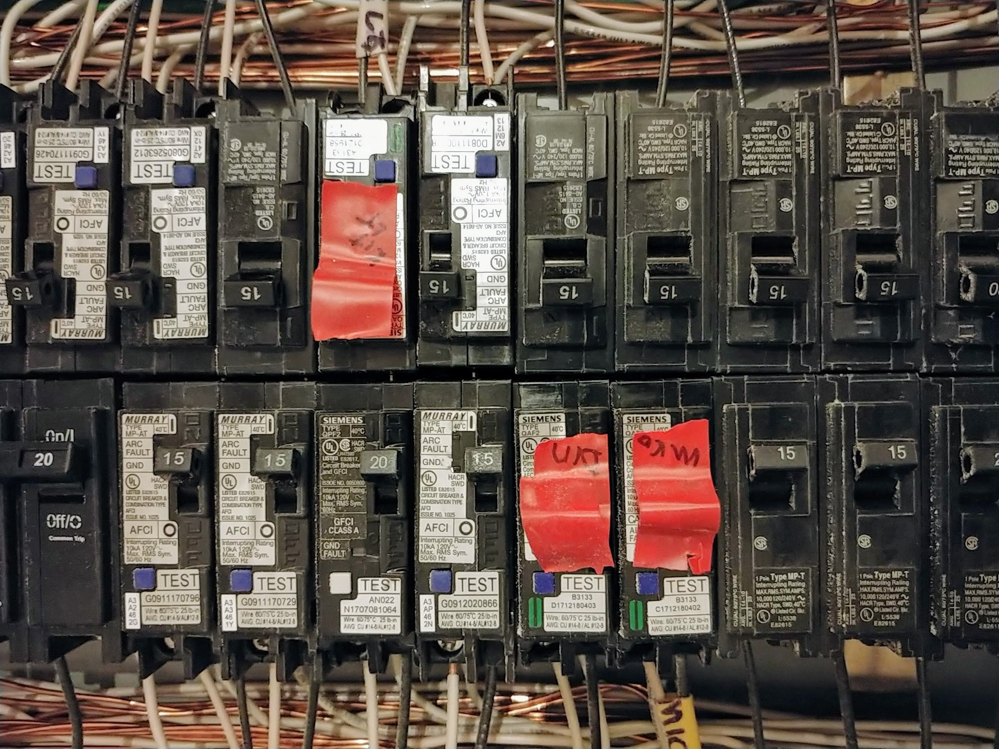

# Short Circuiting Fantastical Debugging
#watercooler, #beginners, #career, #debugging

Debugging things requires a level head. Problem-solving is an art of the *anti-freakout*. My problem is I dream of fantastical sources where the pain originates. It affects my problem-solving skills. I'll share a story of what I mean.

## Roaming Circuits

When relocating an electric circuit breaker box at a residence, there is a "certified" way to add contiguous lines. It requires a large plastic box hanging on an exterior wall containing wire splices for each circuit. These conjunctions make an exemplary engineer perpetually anxious, as splices are known to fail over time.

When we moved my home's electrical source, I became apprehensive. With an invisible electric force compounding my nerves, I was afraid that things would go wrong. Sure enough, something did go wrong, at least in my head. Fantastical visions of squirrels chewing on the lines, nefarious agents dismantling the box to disable alarms, and the elementals attacking from a well-placed lighting strike, in the night, without any sound.

Over the years, circuits have tripped for good reasons. The source of the problem *feels* like it originates from the splice box. These "random" flips compound my imaginary suspicions.

## An Example of How to Freak Out Properly

Weeks into playing a well-loved [JRPG video game](https://superjumpmagazine.com/secret-of-mana-an-oral-history-of-playing-the-jrpg-in-the-1990s-39029a28584f) with my daughter, the power unexpectedly went out. My mind began to race. Was it water seeping into a specific splice, violating this circuit? Did that bluejay nest in the right place? Did the thirty-year-old 16-bit system have a malfunctioning capacitor, drawing amperage, frying the line? 

Fear sank in as I considered this splice box dangerously janky.

We lost power again; I reset the breaker, squarely focusing the blame on the splice box in the elements. The device was toying with me, and sure enough, I made the mistake of the insane, flipping the breaker again, hoping for a new conclusion.

## What Happened

After we lost an hour of play, I reset the circuit breaker a second time, and we played on. After some time, my daughter dispatched a boss, jumping up with excitement on her bed. At the same time, sparks flew in a specific area of the room, and the power went out again!

I freaked out. My mind immediately had a vision of terminating this splice box—I was ready to grab my soldering iron and apply twenty-year-old Radio Shack shrink-wrap in the right places. *Deus ex-circuit-breaker* robbed our gaming progress once again. 

This time, I took a minute to think as my daughter's room was about to go up in flames. I applied what I've learned in [software development](https://medium.com/hackernoon/meta-skills-of-a-software-engineer-bed411f6685e) over the years. The logical deductions, inductions, and *abductions* of the electricity flooded my head. I said to myself, "keep calm and find the patterns." 

**Always believe in Occam's Razor.** Believing in the principle of the simplest thing is not enough. But it's a good start. There was no way it could be the video game system sitting there for a time.

**If the system is not well understood, it's never the first source of the system where you're looking.** Of course, this splice box may be the source of the issue, but somehow not understanding it is a detractor to solving the problem.

**If the system is stable, it's unlikely the system.** Since the system has been operating on [sound infrastructure](https://medium.com/hackernoon/software-is-unlike-construction-c0284ee4b723), there is no way it could have been anything in-between.

**If the problem is new, believe it is recently introduced.** It could have been the bluejay I saw that morning, but there was no evidence of a violation. I began looking at the source of the sparks immediately following the power outage.

**If it is a repeating problem, it's usually a misplaced configuration.** Looking at a distance, all I saw was a nightlight—nothing out of the ordinary?

**If the configurations are correct, it could be a newly introduced dependency.** I pulled the nightlight out, realizing it was half out of the socket, with its broken metal brace perfectly wedged in-between the wall and the receptacle. My daughter sparked the chain of events by first placing the nightlight there a day before—each time we celebrated dispatching a monster, an intermittent short circuit occurred from jumping on the bed, squishing it.

Bingo. Fix applied.

## Usually, it's the Simplest Solution

While the nightlight saw its end in the trash bin, I suspiciously blamed the system in error. While an established system is not often blameless, the focus should be on its added appendages. Looking into the core system is rarely necessary.

I've worked with these *splice boxes* in the past, both certified and not. In the end, the most straightforward source is to blame. It's probably a **configuration problem**, with force applied to it.

---

## A system problem, for sure.

This real event is actually fantastical, and is a true story.

The story above demonstrates the frailty of the North American electrical outlet. Because a gap develops above the hot and neutral prongs as a plug is stressed, there is a possibility of an object wedging itself within, bridging the gap.

Where liquids and thin metal instruments are numerous, North American hospitals avoid this problem by installing outlets upside down. The gap is guarded by the grounded plug.

At the time of this publication, the National Electric Code does not specify a recommended orientation.

---

## Social Post

A short story of how a simple #problem is mistaken for a large #complicated one. While it's easy for me to blow up a problem in my head, I must remind myself to believe in #Occam's razor!

Thanks to Danielle Arcuri and my daughter.

#watercooler #beginners #career #debugging

[dev.to](https://dev.to/solidi/short-circuiting-fantastical-debugging-ig3)

### Posted

1. hackernews
1. r/programming
