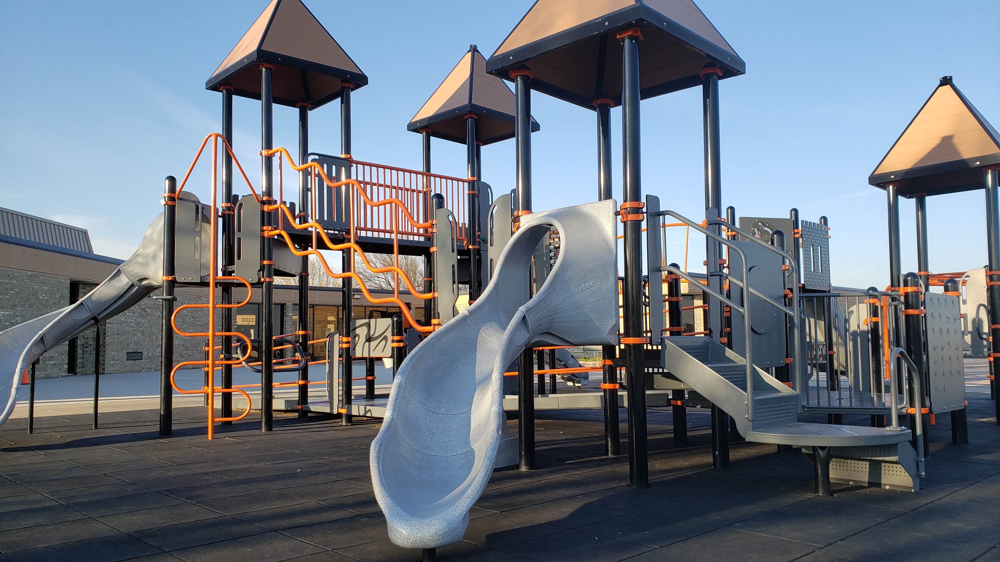

# Five More Minutes

As a parent, my mind is multi-threading tasks. First, enjoying my children at this playground. Second, engaging in creative engineering thinking to [resolve an issue](https://dev.to/solidi/what-is-a-software-engineer-anyway-3fb2). Three, observing the behaviors of other parents. One of which is the pattern of "five more minutes."

Around me, another _play project_ is coming to an end. A parent over to my left loudly states to their kids, "[five more minutes!](https://lifehacker.com/what-to-tell-your-kid-instead-of-five-more-minutes-1836058634)" Signaling playtime is about to expire, their time having fun is over.

I'm over here thinking about if I should enact the "five more minutes" decree. Should I? Probably not, I am still toying with this problem, and the scenes are nice out here in the playground. The weather is beautiful, and so is the laughter of my children.

## When it's Done

I briefly teleport back to previous software engineering projects in my past. The managers would serve up the rules of play "Five more minutes," the managers would say as the engineers blissfully played with frameworks, proof of concepts, and the art of balancing bits and bytes running around the _digital_ hallways.

"Five more minutes" was met with "[when it's done.](https://medium.com/super-jump/building-a-popular-half-life-mod-during-the-rise-of-counter-strike-fec6a5b9fd8f?sk=6d1427b3f1d832df06bd5b07aaa456bb)" The managers pushed back, finding ways to get the project in scope and out the door. They enjoyed deploying tactful briberies. Those who recently crossed the chasm from engineering to [management](https://dev.to/solidi/what-is-an-engineering-manager-anyway-4and) knew how to reel them in by speaking their language.

Coming back to the playground scene, I needed "five more minutes." My spouse was looking to me to make the call. I was wrestling with whether to solve the problem this way or work around it. "Daddy, I want to go higher," one of my daughters was on the swing next to me. I kept pushing mentally and physically.

## Cutting up the Pie

Oh fine. "Five more minutes." I let the kids know the _project_ was coming to an end and we needed to ship out. "But, but!" "No, we have to go," I said to my kids. They pushed back again. "Yeah, there will be a surprise when we go." Their sad eyes told the story but brightened up to the thought of something new.

In the distance was another family, also declaring "five more minutes," as if there was a [recurring pattern](https://dev.to/solidi/the-joy-of-collecting-timeless-engineering-posts-5el3), an odd pub/sub system continued its way to each of their delegates. Another parent said the same after I committed to our departure.

We left the beautiful playground. But neither my spouse nor I checked with the stakeholders. They were the ones who wanted to play more—unfortunately, another handful of _business_ problems needed solving.

I continued mentally [debugging](https://dev.to/solidi/short-circuiting-fantastical-debugging-ig3) as we loaded them into our car. Then it hit me; I knew what [to write](https://medium.com/@solidi/the-one-about-blogging-cd9e65a2055b) _this_ month. I just needed a way to connect the observation to the craft. Aha!

When we came back, we had their favorite surprise, pizza.

## Social Post

As a #parent, #engineering #thinking happens while the kids have all the fun. Here is a short #observation of when the parents declare "5 more minutes" at the playground, with some #software bits mixed in.

Thanks to Danielle Arcuri.

#watercooler #beginners #career #management

[dev.to](https://dev.to/solidi/five-more-minutes-5b7d)

### Posted
