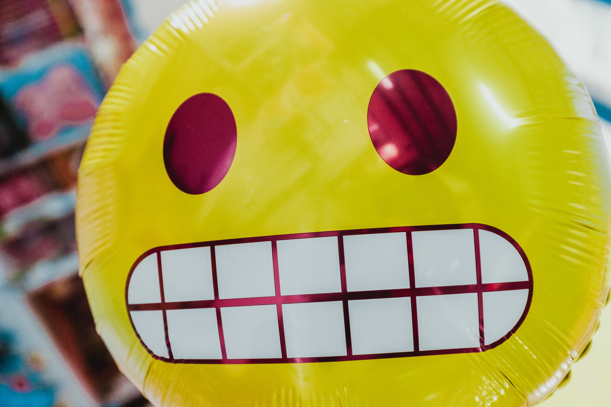

# Apps Doing Sh*t
## A rant on my app experiences

Every so often, I get caught in a thirst trap of a newly spun Twitter bot. Aptly titled "*People Doing Sh*t,*" they sling catchy videos of humans doing heroic or moronic things. I'll click on each video, clap at their success, close my eyes in horror, or be amazed at how people act in befuddling ways.

My consumer app experiences can feel the same. Imagine a continuing thread of 5-second head-slapping experiences where reality is amiss. Apps are doing sh*t, either for good or bad, as I clap for joy or scream into the ether to those who make my life easier at a small price of WTF.

## It Happens From Time To Time

You see, apps doing sh*t *are not* slow to load or crash. No, it's more like when things are working well, maybe too well. Their experience rises  above the competition - spectacularly failing the customer without intending to do so.

Let's assume everyone experiences degrees of apps doing sh*t. I aim to unearth a list of "*check out these awful/amazing things I experienced!*". Then maybe, after a long thread of examples, those who craft our complex experiences can consider how to mold the app world into a beautiful place. So here are mine in no particular order.

**Memories with ex-partners** - what my spouse was laughing about! We share photos on the cloud, and often the provider autogenerates *moments with others*. I saw my beautiful ex's face, titled "*Amazing Memories*" served to my *spouse's phone*. Being cheeky about it, I said, "*Save it!*" The good news is they both share the same name, so no slip-ups to date!

**Kids learn adult language through the Assistant** - pop music likes to dabble in adult language when we sling to our home assistant. Curses fly, and I'll jump on the live grenade - "*Hey, Assistant! Please play music without these curse words. My young kids are present! Uh... no explicit. Yeah! Clean version!?*" Then the response, "*I'm sorry, I don't understand.*" Lyrics will continue to play unabated. I'm left fumbling with unhelpful parental controls.

**Dijkstra's pathing efforts with the highest risks** - ever so often, I'll have to triple-check the car navigation I'm following. Rarely am I set on a slower path when the main road is the way to go. Often, I am set on the fast track, requiring the intense mental effort of maneuvering through dangerous intersections. I'll reach the destination, but my head hurts, narrowly escaping injury from a heroic left-handed turn with family in tow.

**Friend recommendations to the beloving deceased** - one of our immediate family members passed away. Weeks after her passing, I was recommended to friend her, as she had discovered the joys of social networks. Sighing deeply, I remember her humor, "*Oh Douglas... you never call me.*" I started to laugh uncontrollably due to the twist of irony. I miss her, but I don't have the courage to decline her request as it sits idle *for years*.

**The private becomes public through screen share** - at the height of the pandemic, personal screen sharing caused pain within my team. A side conversation was shown, resulting in hurt feelings. I was saddled with giving private feedback to this individual, which was funny as it was horrible. Surely I would not want to be in their shoes. After, [I posted a plea on the Internet](https://twitter.com/dougarcuri/status/1300474757935235072), but time passed without an answer.

**Scrolling into spoilers** - I enjoy watching missed sporting events, movies, episodes, you name it! With sheer willpower, I'll avoid people for fear of revealing spoilers. On more than one occasion, I'll sit on my couch, having food ready. Without thinking, I'll have a virtual cigarette, opening social apps *before* I watch. Sure enough, something is revealed. I *completely ruined the experience* to satisfy my subconscious need to scroll. Sometimes I don't make it to the couch as a well-placed personalized push notification or a trending feed short-circuits the fun. I'll ask myself - *what just happened*?

**The baby formula on discount, buy now** - it is without question what we search and say in our home is monitored for market favoritism *with good intentions*. As I type this, we are searching for delicious food for our youngest. In our exhaustive search for baby formula, we are slung excellent ads with deep discounts. Well, we click through. Look at that, *out of stock*.

## Context Matters

I'm sure I missed other examples of apps doing sh*t to me. My hunch is we are moving through an awkward age of *tween* personalized recommendation systems. Mature experiences require a higher resolution of related information, its correctness, and providing personal choice - increasing questions and actions to protect privacy.

Aiming for smooth app adventures requires tuning context. I think solving this complexity is possible in time - it's not a technological problem but a cooperative human one. As the saying goes, we criticize within a context. And when apps are doing sh*t, *the lack of* context is to blame.

What have *you* experienced?

## Social Post

Sometimes my #consumer #app #experiences are working well, maybe too well. In this write, I share spectacular moments when apps are doing sh*t to me. Have they done the same to you?

Thanks to Danielle Arcuri, Colby Stone, John Revano, James Shvarts, and Steve Guyer

### Posted

1. hackernews
1. r/programming
