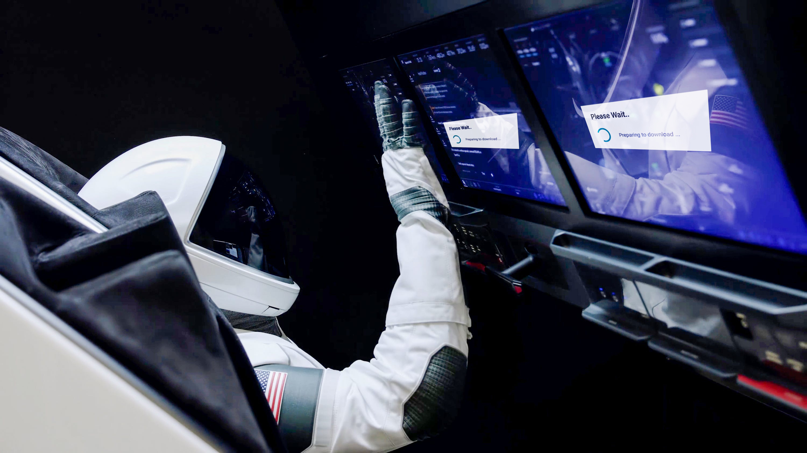

# Cancel This App Update, Dammit!
#watercooler, #career, #opinion, #rant

My morning routine hasn't changed over the years. I'll scan [serializer.io](https://serializer.io/), get [the kids ready](https://dev.to/solidi/five-more-minutes-5b7d), work out, eat breakfast, shower, and flip open the work notebook. Then I'll be a few goddamned minutes late to the first team meeting of the day.

## I'm the Sucker
Apps that connect to others have little regard for my time. They [like to do sh*t](https://medium.com/@solidi/apps-doing-sh-t-f5ffa72140db), working as intended. I'm late because of a random dice roll from the updating gods. They decided it was my time to watch a slow-moving progress bar as my manager waited in silence. Or it's simply Monday. Then the app will crash. I'm stuck in a loop.

***I'm late. It's a bad look.***

When I arrive, I'll apologize for my tardiness, being infuriated by the snag. I was *really* a minute early, but I knew no one believed me. My reputation bank account has lost coin.

These apps enjoy finding random suckers like me at their morning launch. A long-tailed update isn't the first nor last that will steal my time. I'm dumb for taking the abuse.

Then I'll contemplate. As [a person who develops software](https://dev.to/solidi/what-is-an-engineering-manager-anyway-4and), it doesn't need to be this way. What is the problem with updating the app after I leave a meeting? Or execute when signaling the app's close when the day is over? Stay outside my critical path, please.*

## Update to Perfect Critical Frustration For All
I'm confident apps sap millions of hours from poor souls needing to perform *on time*. Everything is at stake when updates wag their finger—such as a critical presentation, meeting a customer, joining an interview, or failing to join a 1-on-1 where the manager is stressed-out.

As I type, an angel investor is tapping their fingers, tending to their boatloads of cash, as their high growth potential screams at the best-looking progress bar on the other side of a digital pipe.

***My point is the scheme for updating apps remains broken, and nobody cares.***

Yeah, another app is doing sh*t by disrespecting my time and probably yours. We all have been in meetings where many people sit, blissfully waiting for a stuck colleague while being paid. Some people are okay with that. Not me.

Do you know who doesn't screw around? It's the people that demand mission-critical software experiences because they are always on the critical path. Do astronauts receive updates while the rocket pushes hard to escape the atmosphere?

But we all can't be astronauts. After all my anxiety clicks and Crtl+C's, my VPN disconnects too, and I am staring into this effing stalled app update. ***Sigh***.

 ---

\* *Now happens with carrier smartphone updates! I played the "delay this update" game, then lost when I needed the phone most. It aggressively updated at the most inconvenient time, delaying meeting a family member at the airport. I could not contact him while my phone was updating.*

## Social Post

On another #anniversary of the #moon landing, I'm late to another virtual meeting. Here is my short #rant on broken #user #experiences on #software #app #updates. Enjoy!

Thanks to Joe Dimartino, Danielle Arcuri, Pratik Dhiman, Steve Guyer, and Matt Funk

https://dev.to/solidi/cancel-this-app-update-dammit-5f6j

### Posted

1. hackernews
1. r/programming
