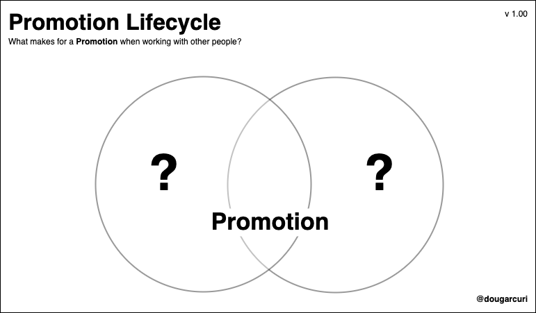
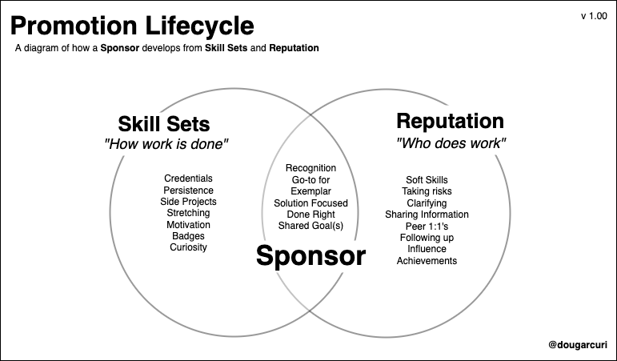
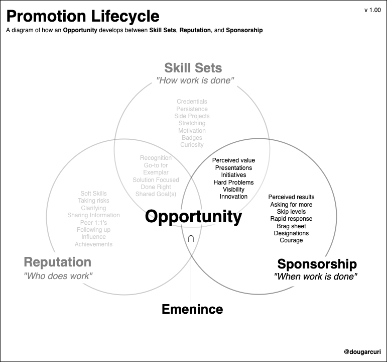
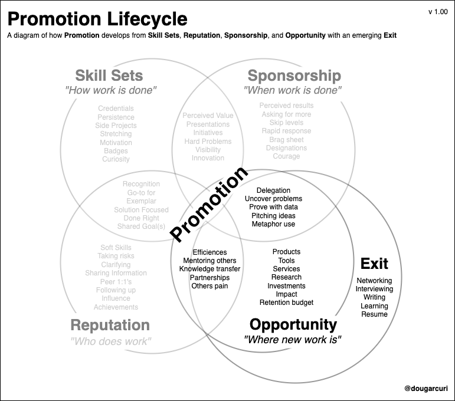
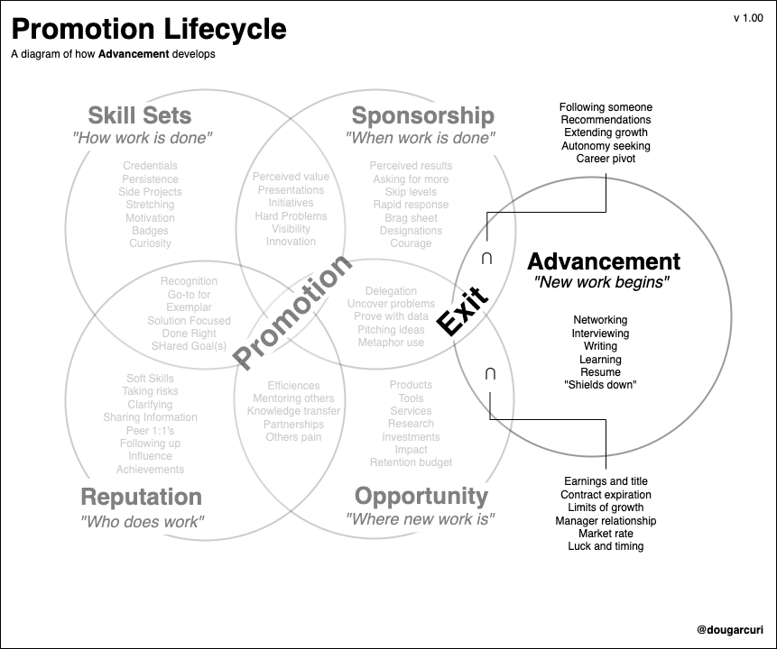
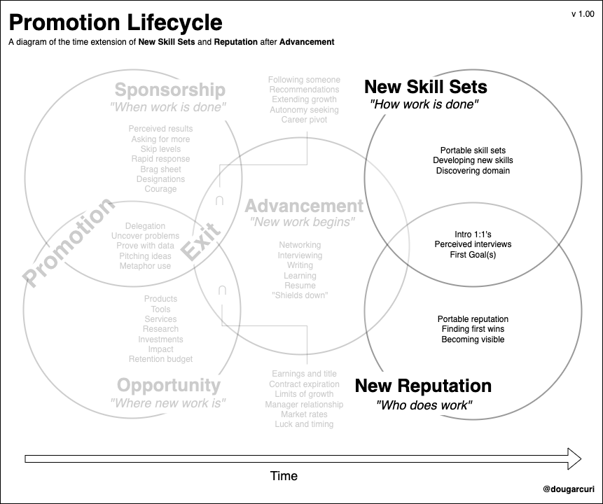
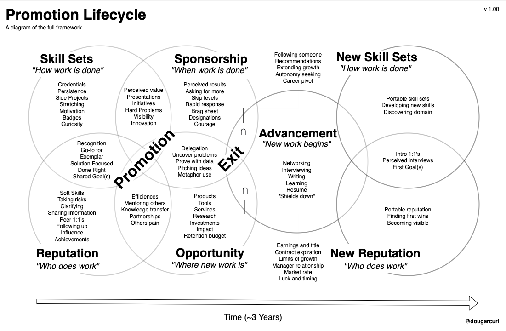

# What's in a Career Promotion?
## Deconstructing a Path of an Individual's Advancement
#Careers #Sociology #Promotion #System #People



Recently, my friend shared opinions on the promotion process. I found our discussion fascinating, drawing out our thinking. The result is mapping an individual's path for seeking a promotion packet, which I'll call the **promotion life cycle**.

The life cycle defines points along the individual's journey within a business context. They are **skill sets**, **reputation**, **sponsorship**, **opportunity**, and **advancement**. These qualities are timeless but are not intended a panacea. They depend on an individual's adaptability to a business culture, quality of relationship with the manager, and meeting personal needs.

While I cannot highlight every dimension, my goal is to draw a holistic trail for an individual's *advancement*, identifying qualities in a group of people performing work. Along the way, I'll uncover interesting bits of behaviors between people, providing hints to accelerate their relationships.

## The Promotion Life Cycle

Obtaining a promotion follows a sequence of events. First, *skill sets* and *reputation* develop *sponsors* providing *sponsorship*. Next, having *sponsors* unveils *opportunities*, concluding in a *promotion*. If an organization denies promotions, a motivated individual *exits* toward *advancement*. Let me break them down to provide context.

### Skill Sets and Reputation Promote Sponsors

At the start of one's career or collaboration on a new project, one applies *skill sets* to solve business problems. As time advances, people perceive the quality of their peer's application of knowledge, which forms opinions of this individual's work, creating a *reputation*. Reputations become recognized in the workgroup and leadership chains, making them *sponsors*.



### Skill Sets

An individual applies *skill sets* to complete work. Skill sets are the necessary application of knowledge when performing work. Whatever the domain, the group acknowledges levels of *skill sets*. The natural course of skills development provides *eminence*, optimally tackling the job. Eminence demands an efficiency of delivery, exemplifying orchestration to their peers.

```
**Skill Set Accelerants**
- Staying up to date with latest techniques
- Credentials such as badges and certificates
- Finding and participating in side projects
- Taking on unestimated work, orchestrating path finding
- An attitude of persistence, not giving up on a solution
- Having curiosity of how something works
- Knowing the right time to seek help
```

### Reputation

*Reputation* defines who completes the work and how. *Reputation* follows *skill sets*. Reputation aligns with how the person completes work, its recipient, and in what "bedside" matters. Reputation requires the right balance of achieving the result and doing it well with others.

One can have unique *skill sets* but lack interpersonal achievements due to poor likability, or one has an excellent reputation but lacks the required skills, requiring refinement in their craft.

```
**Reputation Accelerants**
- Seeking what is essential in the work group 
- Possess a [high form of valency](https://www.amazon.com/Experiences-Groups-Papers-W-R-Bion/dp/0415040205), combining with others to perform
- Taking on risk and raising a hand when leadership needs a volunteer
- Securing designations that are recognized by the group
- Inclusive mindset for tackling business problems
- Bringing others in at the right times, improving [soft skills](https://twitter.com/heykahn/status/1551556521628094465)
```

## Skill Sets, Reputation, and Sponsorships Promote Opportunity

Once an individual has enough *skill set* and *reputation* which is optimal for the environment, sponsors find them *opportunities*, directing the needs of new problems that require solving.

Those with potential *eminence* take on these challenges.



### Sponsorship

*Sponsors* observe the work and by whom. *Sponsors* socialize with who in the group is delivering the work. People raise awareness of what is happening in the environment and often talk to one another in an initiative context. Both *skill set* and *reputation* feed into these conversations. Being visible to leadership is often a key to promotion. Sponsorship aligns with extrinsic motivators such as money and intrinsic motivators such as providing impact.

```
**Sponsorship Accelerants**
- Foster a good relationship with the manager
- Continue manager 1:1s
- Start skip level 1:1s
- Take on new initiatives without deferring current work 
- [Mature their presentation skill set](https://dev.to/solidi/how-to-crush-your-next-team-demo-2bb5) and group communication
- Increase visible achievements in execution
- Develop [brag sheet with a manager](https://jvns.ca/blog/brag-documents/)
- Being able to operate autonomously
```

### Opportunity

*Opportunity* is where the new work resides. *Sponsors* discover delegation opportunities. Finding an opportunity is an excellent step toward *promotion*. Operating in the context for some time is required before recognizing the individual.

While enough *skill sets*, *reputation*, and *sponsorship* are essential, timing and luck factor into an opportunity. One can [optimize for the talent review process](https://levelup.gitconnected.com/getting-promoted-the-boring-work-youll-need-to-do-398e0c9defb2), but not all teams have ascending options. If they do, it may require waiting in a line of succession or finding a way through the competition.

```
**Opportunity Accelerants**
- Finding new problems and solving them
- Pitching to leadership new ideas
- Asking the manager to delegate work
- Using metaphors and having a command on domain language
- Having motivation to advance one's career
```

### Skill Sets, Reputation, and Opportunity Forms Promotion

An individual's journey will lead to *promotion* if opportunities exist in the environment and leadership recognizes the person doing the work.



### Opportunity and Sponsorships Promote Advancement

Suppose the individual cannot find *opportunitie*s*. Challenges within the environment may prevent *promotion*. For example, if retention budgets do not match market rates. In that case, there is the ability to *exit*, leading to *advancement*. The individual joins a new group  working on different business problems.

### Exiting and  Advancement

Adding the final piece to the framework, if an individual finds that new *opportunities* do not exist in their environment, [one leaves the workgroup for an opportunity](https://betterprogramming.pub/in-software-when-an-engineer-exits-the-team-1e550303cff8). The schism is a ripcord to correct mistakes made with *reputation*, sensing their career in the organization is limited, or if *skill sets* no longer align. Leaving brings the individual a new promotion, money, or title. Hence, the *advancement* of their career.

```
**Exiting and Advancement Accelerants**
- Following trusted individuals through prior sponsorships
- Being informed on market rates for work performed
- Keeping contacts and networking up to date
- Being open to new opportunities
- Continuous interviewing
- Doing what's best for the individual
```



### A Note About Portability

Following one's *promotion* or *advancement*, a life cycle repeats in timeframes. In a *promotion*, one gets to keep parts of their *reputation*. They obtain specific domain *skill sets* in a similar environment but trade-off potential accelerating *opportunities* and new *skill sets*.

In *advancement*, the person returns part of their *reputation* and *sponsorship* to the organization, discovering new *skill sets* and *opportunities* instead.

There are a myriad of reasons a schism occurs. Why someone leaves their workgroup includes seeking market rate for the work performed, limited individual or product growth, poor manager relationship, mismatch of recognition expectations, and contract expiration. Those that decide to leave may follow those who are trusted.

After following a *promotion* or *exit*, one begins seeking first goals, discovering the environment, and building a new reputation.



## Conclusion

Pursuing a promotion requires *skill sets*, *reputation*, *sponsorship*, and the *opportunity* to grow. The proverbial ripcord is the emerging *exit* to *advancement* if the environment is no longer optimal. Following an individual throughout the process is called the **promotion life cycle**.

While this system is challenging to draw out, I attempted to visualize what is happening between people through an individualist's eyes. What follows is the final draft in an approximate three-year timescale.



## Social Post

What's in a #career #promotion? In this write, I've visualized my #opinion of what a #promotion #cycle may look like. Along the way, I provide a #language of what's happening through an #individualist's eyes, discovering #behaviors to #accelerate the #results.

Thanks to Douglas J. Arcuri, Khalid Richards, Danielle Arcuri, and Steve Guyer

[url](https://medium.com/@solidi/whats-in-a-career-promotion-9f99df29c1c)

### Posted

1. hackernews
1. r/programming
