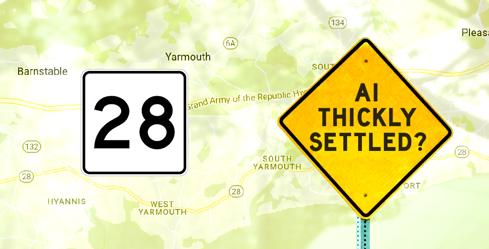

# Driven to Optimize for Nice
## Can Humans Coexist with Driverless Vehicles?
#Driving #Opinion #Future #Change #ArtificialIntelligence

Driving on [Massachusetts Route 28](https://en.wikipedia.org/wiki/Massachusetts_Route_28) in Cape Cod made me think. When we arrived for a [family vacation](https://dev.to/solidi/10-self-care-tips-for-a-great-vacation-2jgp), drivers bent the understood rules of the road. Their misbehavior made me pump the brakes, inconveniencing our last mile.

What the hell was going on?

## A Driver's Primary Goal is Kindness

The driver behaviors in this area were an odd edge case. I've never experienced such "niceness" with over twenty years behind heavy machines made of [steel cages and iron horses](https://medium.com/hackernoon/the-zen-of-motorcycling-and-programming-620907dbab2c). I've driven in other parts of the US, experiencing different regional driving attitudes, but this was different.

The misbehavior occurred on Route 28, a single-laned two-way thoroughfare with businesses on each side. Traffic was a never-ending procession of vehicles in both directions. Every two hundred feet, a car would hurry out. Those who had the right of way paused to let them in, causing those uninitiated (like me) to stop uncomfortably. Indeed, *I have the right of way*.

> I later discovered drivers gave access to the road, which otherwise would be denied entry for a significant time. As I made [wild turns](https://medium.com/@solidi/apps-doing-sh-t-f5ffa72140db) into busy intersections, my screaming kids egged me on. But fear not, I got a blink of the headlight before I entered.

After passing through the area twice, I itched to do the same. I let go of my hardened New Yorker attitude, dropping a defensive posture. [I optimized for nice](https://twitter.com/diannaeanderson/status/1557155725796941830), no longer shaking my mental fist. Instead, I'd blink my lights at abandoned drivers, peer pressuring the opposing lane to yield. Laughing loudly, my family in tow thought I had gone mad. But instead, I'd become coherent with the syntax of the arranged system.

On the outside, nobody was angry. Everyone else was doing it without a care for the legal ramifications of liabilities.

Why should we care?

## Mood Generator Unavailable Within Trained Models

In my style, I like to synthesize a mix of experiences during vacation, bringing a book with me. During this trip, I read an old classic called *Artificial Intelligence (AI): The Very Idea* (1985) by [John Haugeland](https://en.wikipedia.org/wiki/John_Haugeland). While the book predates newer AI thinking, it tackles a symbolic approach. The book made me question my observation about these human driving habits within context. So I formed a question:

> How would a development team safely automate driverless cars in an area like this? They need to train "nicer" into their machines.

With the formal rules being bent, there was no indication of what was happening until inputs of "*Another car is crossing in front of me, but everything is nominal? **Brake!***" Mix in random drivers who are "uninitiated" to the process. They would wreak havoc, causing screeching brakes, while others yell out of their window, "*Yes, bend these rules, you are supposed to, dammit!*"

Indeed, automation would learn the profile in time, trading off waiting on the side of the road versus the probability of a fender-bender. Of course, AI neural networks would share data with other robots in real-time, pouring over their global positioning system. But how would it compute those who stop from speed, blink their lights and tie up all traffic to let another pass?

Teams will train narrow models to predict routes, feeding copious amounts of data from previous reports, but no way I've heard they capture a mood of helping out someone who needs to get in the "right of way" when they do not qualify based on legal rules. There are *happy radicals* everywhere.

Highways and byways are easy to train, but here in the mess of "locality" is where the impossible problems cruise along. 

> To solve this problem, you'll have to train for **kind and fair**, not to be predictably safe. Yikes, is it even possible?

The interpretation of the real-time situation's optimal path would be to cooperate immediately or risk a poor travel experience. From what I've read about artificial intelligence, developing a fleeting cooperative mood that bends the rules is crazy hard. Humans are all about *uncontained self-perspectives*. Machines, *deterministically optimized* through a metaphor of learning on a matrix map of infinite ones and zeros – not so much.

## To Be Nice on the Road, Humans and Computers Must Share Critical Context

Let me be clear. I am not skeptical about the automation of driverless cars or the AI that will power them. Consumer driverless vehicles will happen, [but at what timescale](https://blog.codinghorror.com/the-2030-self-driving-car-bet/)? For instance, if humans are in the mix, these situations will make the coming driverless vehicles hard to implement safely.

In my vacation scenario, humans are making up rules for utility, feeling for others' pain of having to wait long times to enter the right of way. They want to feel good, to serve another.

> There could be a paradox where no one wins in convenience or security. Developers will train robots to travel safely. Humans want to get there fast. Kind humans with robots wish to do both at the same time.

If automatons are driving in these conditions, riders *within* the automatic car will be dumbfounded that their all-seeing-brain hadn't made the apparent turn. An hour would pass when it was clear opportunities existed. With each friendly human waving them on in happy anger, the AI's confidence level would never hit a proper threshold to make a move in fear of self-preservation. Empathy is not in their vocabulary.

Suppose we continue to grant human driving while Autobot vehicles ramp up. When predictably safe seems paramount, how do you optimize for "friendly" within systems? It starts with mood context. People are on vacation in a land of leisure, you know? Local context is critically important to a safe ride. And context can be contrary to agreed rules.

> Anyone who says engineers cannot solve the technical problem is wrong (in spite, a tenacious individual will fight through.) Finding the vector of attack by faking behavior until it becomes genuine is how they will solve it. In the process, lots of care is needed - these are mission-critical systems where life is at stake.

Do we need to remove the fallible humans, eventually?

## Wheel Resistance is Less Than Futile, and it's Mixed Tire Pressure of Political Results

In my view, there is continuing resistance to automating formal driving rules in my community. People love their driving. Their associations go deep with nostalgia, speed, and everything culturally ingrained in people spanning generations. Included are car shows, night cruises, drag racing, and everything reminding us of years past. Would anyone want to see bots driving when racing is [about human drama](https://www.espn.com/f1/story/_/id/33319352/lewis-hamilton-lost-little-bit-faith-f1-abu-dhabi-gp)? With driving, it's all human feeling.

For example, in the same area of Route 28, the federally mandated realignment of exit numbers proved so opinionated it has cost taxpayers money to reprint beautiful "[Old Exit signs](https://www.capecodtimes.com/story/news/2020/11/27/route-6-exit-signs-days-numbered/6410312002/)." The advocate's passion ran deep for exiting off nostalgic single-digit numbers. Or a time when my community [rejected speed cameras](https://www.nbcnewyork.com/news/local/nassau-county-shuts-down-school-zone-speed-cameras/2015385/) in places where children cross streets right in front of their schools.

> People dislike the peering eyes of virtual referees which surround their cars. They fight to protect their privacy and privilege. Politically? I'll brand it now, the ideas will become the "[Third Lane](https://en.wikipedia.org/wiki/Third_rail_%28politics%29)." Surveillance can solve our problem by knowing all the pieces on the gameboard, but humans will prevent it.

If this indicates human resistance ahead, there is a continued price to privilege, which is tallied yearly by the National Highway Traffic Safety Administration (NHTSA). As I type, the numbers of fatalities are going in [the wrong direction](https://www.nhtsa.gov/press-releases/early-estimate-2021-traffic-fatalities). With automation, I like the promise of fewer deaths, lower emissions, and what it will do for us collectively, but I am not the one who needs convincing.

I savor the idea of not having to drive. But then again, I've had years of driving experience. I am content to hang up my shoes, telling stories to younger humans of how I earned my road rash battle scars. Living to tell tails of [low-siding](https://en.wikipedia.org/wiki/Lowsider) motorcycles, getting [t-boned](https://en.wikipedia.org/wiki/Side_collision) more than once, and having dreams of being covered in shattered glass as my mother screamed my full legal name seems pedestrian in my culture. The young ones will want to experience it too when we say "No" to their brilliant [Red Barchetta](https://en.wikipedia.org/wiki/Red_Barchetta) from a better vanished time.

> Once the robots are out on the road in numbers, humans have a distinct way of learning patterns of behaviors. When incentives are understood, would it be legal for us to "game" the AI to obtain travel preference? Not everyone is [lawful good](https://en.wikipedia.org/wiki/Alignment_(Dungeons_%26_Dragons)#Lawful_good).

But to have robots driving and humans taking a back seat is not in the purview of the lexicon in this area of the world.

## Thinly Settled Now, but Eventually a Thickly Future Problem

As our trip ended and we made our way back, I enjoyed the signs that read "[Thickly Settled](https://www.mass.gov/info-details/speed-limits-in-thickly-settled-or-business-districts)," a happy tour of regional flair not found elsewhere except on Route 28. The reality is these signs indicate specific changes in the rules of the road. And I wondered what happens when AI becomes intermingled with humans to its saturation. As I write, it's hardly existent.

My understanding of automation trials of humans not at the wheel has been [successful in modern American cities](https://www.smithsonianmag.com/smart-news/driverless-taxis-are-coming-to-san-francisco-180980202/) within limited optimized goals of taxiing to direct points. There are also ongoing [company trials](https://www.globaltrademag.com/artificial-intelligence-the-trucking-industrys-biggest-asset/) with trucking AI which optimize for maximum efficiency and safety. Finally, car manufacturers offer [level 2 consumer controls](https://www.nhtsa.gov/technology-innovation/automated-vehicles-safety) where a human supervises the operation.

> Those manufacturers who are in business should provide drivers with a "my head is burning" button. While driving, tap the button when human decision calculations are burning your head, and in this case, how I felt in [Chatham](https://en.wikipedia.org/wiki/Chatham,_Massachusetts), a town on the eastern tip of Cape Cod. People were blissfully shopping off Route 28 - and getting in the way. The feedback could be a starting point of simulations.

While no one in the auto automation business cares about my observation of human driving attitudes at this time, once the game scales to serve many, I suspect these edge cases will flare up as potential consumer resistance. If there is a poor reception to the results of the automatons driving with mixed-in human compatriots, there will be a rejection, with favoritism of the familiar. No, I'm not talking about *safety to protect life*, but piss poor travel experiences as the humans command their preference - until they do not. Along the way, news of "[death by computation](https://en.wikipedia.org/wiki/Death_of_Elaine_Herzberg)" will shape future reactionary perspectives.

Let's watch what control humans have on driving as we head into the mid-21st century. I suspect challenges will be raised because of the cultural significance and prestige of driving.

> We need mix-controls (not invented) to mend technology operating within erratic human behavior. Redundant sensory controls with the red "stop button" are not enough. If capabilities fail politically, perhaps it's a side-car approach where [robots fly](https://en.wikipedia.org/wiki/Flying_car), and humans remain terrestrial in what they love.

It will be a tremendous strategy to lobby these controls *while* keeping humans happy. But for now, we will continue to ratchet the human safety features incrementally.

So, for now, enjoy the lovely human pilots in "thickly settled" areas. Let those wheels spin as drivers blink their headlights - to allow entry onto Route 28.

## Social Post

While on summer #vacation, I experienced such friendly #drivers that it made me think about the #future of #self #driving #cars. So I formed a fair #opinion about #artifical #intelligence in the field, letting it #ride.

Thanks to Danielle Arcuri and Pratik Dhiman

[url](https://medium.com/@solidi/driven-to-optimize-for-nice-39a3f2a796a0?sk=048248c06fdb2d210a545a9a5c84c821)
