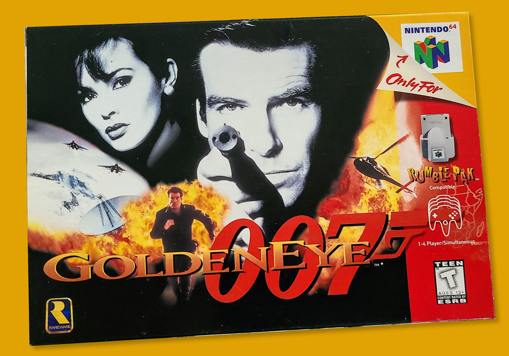

### Video Game Review
# What Made GoldenEye 007 Great?
## Back of the Napkin Qualities that Made the Game Timeless
#Gaming, #Nostalgia, #Nintendo, #VideoGameHistory, #007

[GoldenEye 007](https://en.wikipedia.org/wiki/GoldenEye_007_(1997_video_game)) (1997) on the Nintendo 64 was released twenty-five years ago. No other first-person shooter has come close to its groundbreaking features. So, while I watched the documentary [GoldenEra](https://www.imdb.com/title/tt11753760/) on the best console game the developer, [Rare](https://en.wikipedia.org/wiki/Rare_(company)), has ever made, I thought about its intrinsic qualities. Why is GoldenEye a [great](https://medium.com/@solidi/blades-of-steel-is-the-greatest-hockey-video-game-of-all-time-9c6de5ab75ab) [game](https://medium.com/@solidi/river-city-ransom-is-the-best-beat-em-up-video-game-of-all-time-bc49e9776c94)?

What follows is my opinion of the game's fantastic experience. GoldenEye has [design qualities](https://goldeneyedecoded.blogspot.com/2013/12/goldeneye-007-game-design-document-by.html) that rise above the others in the genre, even today.

**Six degrees of movement** - players [move freely](https://en.wikipedia.org/wiki/Six_degrees_of_freedom), inspecting their 3D environment. While GoldenEye is shy about jumping, the gameplay allows exploration outside the regular linear path. Discovery was exciting for this era of gaming. Its overarching element of stealth was novel for the time.

**An interactive world** - apart from weapons, GoldenEye features items a player must operate through the mission objectives. This equipment added the element of puzzle-solving. Interactive gifts such as shooting enemy hats off their heads added believability, and everything exploded if inflicted damage. While GoldenEye fell short of a genuinely mutable world, it introduced elements of [systemic game design](https://the-artifice.com/systemic-games-philosophy), where one measure by the player sparked chain reactions.

**Depth of cheats and rewards** - GoldenEye features a cheat-earning mechanism associated with time trials. A player must complete a mission in a set time to achieve those awards. The dawn of [speed runs](https://en.wikipedia.org/wiki/Speedrun) opened up a world of sharing records with others on the early Internet, increasing playability.

**Includes the incomplete parts** - GoldenEye was unique in keeping parts of the [cutting room floor](https://tcrf.net/GoldenEye_007_(Nintendo_64)) within the final release. For example, portions of maps are visible but lead to dead-ends. Unfinished pieces of the game led to exciting questions about Rare's intentions. It gave the air of enduring mystery and gossip. 

**Enough believable graphics** - GoldenEye had the right balance of believability, challenging its hardware but not instilling horror or questioning the player's morals. While the game's graphics are aging, an upcoming [remastered version](https://www.ign.com/articles/goldeneye-007-remaster-limbo-ukraine-war) will refresh its visuals.

**Satisfying, fun, and engaged throughout** - GoldenEye is enjoyable. The missions stream pleasingly with a dynamic atmosphere with great music. The right amount of exploration balanced with clever artificial intelligence made it a gratifying experience. It added side quests not associated with the movie but with the franchise. However, GoldenEye missed one aspect, a sandbox play/editing mode becoming viral [years later](https://en.wikipedia.org/wiki/Garry%27s_Mod).

**Multiplayer with gameplay modes** - one of the most excellent parts of GoldenEye is its "[couch multiplayer](https://medium.com/super-jump/secret-of-mana-an-oral-history-of-playing-the-jrpg-in-the-1990s-39029a28584f)." The four-player multiplayer mode was a last-minute addition. GoldenEye brought an [arcade-style feel](https://en.wikipedia.org/wiki/Amusement_arcade) to the home. Multiplayer mode made the game replayable for years, making the play timeless while ruining friendships.

**Materialized by developers first** - the development team behind the creation of GoldenEye developed with autonomy. They operated with freedom from micromanagement, which was unusual for the time. While the team missed deadlines, they avoided cancellation and invested deep care into all aspects of the game. "[When it's done](https://dev.to/solidi/rediscovering-the-plan-file-4k1i)" was their mantra, and in the end, they delivered an enjoyable product enabled by the work environment.

**Aged well with enduring nostalgia** - with online communities developing over the years, GoldenEye has aged well while commanding millions of gamers' respect. This quality makes it a perpetual nostalgia engine for people writing and discussing the game online.

**Had the right timing** - GoldenEye delivered when the 3D revolution in home console gaming was nascent. While coupled with the information age of the Internet, there will not be another time in history when this will culminate. Its timing leads to interesting questions about the next successive technological triumph, which may not come anytime soon.

Indeed, GoldenEye is a superb game. Selling [eight million units](https://nintendo.fandom.com/wiki/List_of_best-selling_Nintendo_64_games) in the late 1990s was no easy accomplishment. Its above qualities at the right time make it a part of gaming history.

There is no formula to make a great game. However, a game's intangibles make it so. Timing, luck, and satisfyingly fun gameplay with friends are surefire ways to make a game sell well. Regardless, GoldenEye 007 is a product of its time and a part of the gaming lexicon forever.

## Social Post

Twenty-five years ago this month, #GoldenEye 007 was released for the #Nintendo 64. I take a moment to #reflect on the #qualities that made the game #timeless. If you like #video #games, this read is for you.

#gaming #history #graphics #nostalgia #gamedesign #development #rare #goldeneye #007 #bond

[substack](https://solidi.substack.com/p/what-made-goldeneye-007-great)
[medium](https://medium.com/@solidi/what-made-goldeneye-007-great-946b30e7f2a9)
