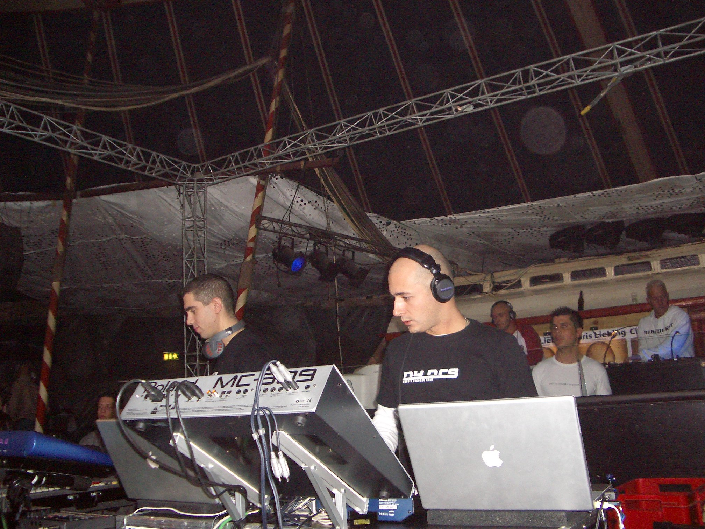
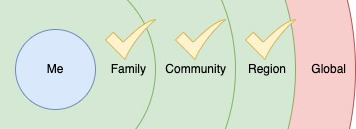
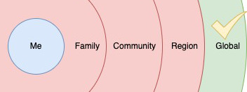

# Listening Alone on the Internet
## My Solo Music Experience as a Xennial

A sudden urge came over me. I craved a particular type of music. Not just any music, but the stuff that reminded me of when I was younger. I wanted to listen to [Nu NRG](https://everipedia.org/wiki/lang_en/NU_NRG). So I dialed them up on YouTube with no one else to share the experience.

## Who is Nu NRG?

I'm sure you don't know who Nu NRG was. Nu NRG was a flash-in-the-pan electronic music duo that made numerous high-quality tracks during the turn of the century. Their most significant self-authored hit was [Dreamland](https://www.youtube.com/watch?v=d8Ee59Yd1lI&t=180s). Nu NRG's live sets contained high-energy melodic harmonies, such as their set from Orgasmatron in 2002. As fast as they rose in popularity, they disbanded. They left a few years of unique sounds between the golden era of [trance](https://en.wikipedia.org/wiki/Trance_music) music and the progressive style soon to come.

I cannot remember how I discovered Nu NRG. Their popularity was not expressed by family, friends, or radio media. Nu NRG didn't land at a major airport with an entourage. Their music was not recognized in my community. However, something new was happening. Groups like Nu NRG's influence rose from the earlier obscure Internet, championed by other artists.

 to Nu NRG in 2003, their coming to America tour.](images/62-02.jpeg)

Back then, I downloaded tracks from forums like [tranceaddict.com](https://www2.tranceaddict.com/forums/showthread.php?s=6747b48233000365afcd2813cc44df2e&threadid=124606&perpage=12&forumid=21&pagenumber=1#.Y2aYf-zMKHG) and shared in-depth reviews with aliased cohorts. In 2003, I saw them live in NYC at a club called ARC. The music was too loud to speak to anyone as the duo pushed hard on their instruments. Their real-time music composition made them unique. They constructed high-energy music *live on keyboards*, a rare sight.

## Shared Experience No More

My last twenty music-listening years are these types of indulgent adventures. Nu NRG was one of many artists that have come and gone. It all started in the early 2000s when I primarily sourced music from the Internet. As my interest in popular music waned, I sought outlets online. My electronic music addiction was shared with a friend, the occasional clubgoer, or the millions on the Internet.

 shirt at ARC with Nu NRG in 2003.](images/62-04.jpg)

Nu NRG's music contained beats and harmonies touching on emotional tones. As with all my bedroom listening sessions, I turned off their music after receiving my high. The good memories waned, but a lingering thought remained. My night sessions with the glaring computer screen were undoubtedly a solo experience worth mentioning.

As I grow older, sharing these listening moments remains estranged. I'd have to call a friend a thousand miles away or reach out to Internet handles. But there is always the last resort. I could post a reply to a YouTube video proclaiming [*insert obscure artist here*] performed the best music of all time. Others do it to their music, famous or not. Perhaps this is a normal function of aging.

## The Internet Brought Me Access To Solo Experiences In Music

Of course, underground music has existed in all genres since the beginning. Though what I find interesting are two concepts that dominate my journey.

First, my experience has been a split duality as a [Xennial](https://en.wikipedia.org/wiki/Xennials). When I was younger, it was shared experiences from the radio, cassettes, or CDs with those around me. This included pop, [grunge](https://en.wikipedia.org/wiki/Grunge), [hip-hop](https://en.wikipedia.org/wiki/Hip_hop_music), etc. We gossiped about music videos on [MTV](https://en.wikipedia.org/wiki/MTV). But a singular cultural music stream was destined to die. Nowadays, I connect with people my age or older in an intense form of nostalgia.

When the [MP3](https://en.wikipedia.org/wiki/MP3) player came, something brilliant happened. I downloaded music no one else had heard of. Access to information, especially music, [was easy](https://en.wikipedia.org/wiki/Napster). That's where my journey went in an unshared direction. I became pleasantly isolated, loading MP3s on my archaic solid-state player. Groups like Nu NRG came to be by reaching people who once did not have access.

 player, framed. Where solid-state media changed everything.](images/62-06.jpeg)

Secondly, since the dawn of easier access, **most** of my experiences have become an eclectic mix of music, electronica included. While I can express my love of specific genres to those around me, those people rarely connect in kind. So, my outlet is to speak into the void of the Internet. Occasionally I listen to what's playing on the radio to communicate with people. But no longer popular music is a significant stream of shared cultural consciousness. Connecting to someone on the admiration of my selection of music is like discovering gold dust, a result of over-selected access.

For years, I shared my love on the Internet and discussed the latest music tracks I enjoy. I'd drag my friends to underground clubs or listen to left-field electronica, [wave](https://en.wikipedia.org/wiki/Wave_music), and other oddities. There was even that time I took the whole team I worked with to an underground event. No one got the vibe.

Rarely has someone in my proximity shared a similar experience. Of course, on the web, my shared encounters will resonate. In-person, I seem to lack new musical connections. Thanks to the Internet, I somehow dug into comfortable solitude.

## Social Post

A short write-up on growing up to easy #access to #music has led to my love of #electronic #music. The #Internet has led me to a #comfortable #solitude.

#change, #society, #culture

[url](https://medium.com/@solidi/listening-alone-on-the-internet-91904956162)
