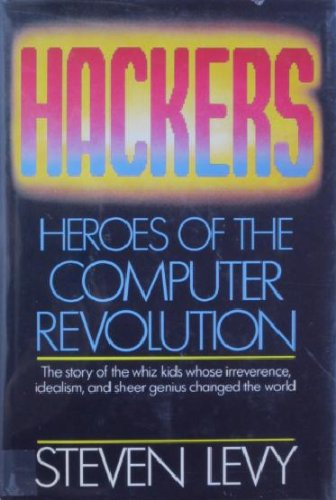

# Read These 5 Passionate Software Engineering Books This Holiday
## Recommendations That Inspire Building Something

While we sit by the holiday's proverbial fireplace, why not read what we love most? Classic stories that highlight human heat, passion, and the inner workings of software engineering projects. Here are my five *timeless* must-read books which capture the imagination.

## The Soul of a New Machine by Tracy Kidder (1981)

No matter where you come from or what generation you're associated with, when a software project moves to a batshit crazy release, you're *flying upside down*. [Tracy Kidder's story](https://www.amazon.com/Soul-New-Machine-Tracy-Kidder/dp/0316491705), *The Soul of a New Machine*, covers the birth of the first 32-bit computer that pushes the register counts in a fantastic journey of human sweat, creativity, and the drive of [Tom West](https://en.wikipedia.org/wiki/Tom_West) (and his lieutenant Carl Alsing) to release Project Eagle at [Data General Corporation](https://en.wikipedia.org/wiki/Tom_West) in the late 1970s.

You want to read this for a gripping story with real people as if this was fiction. Along the way, technical jargon is explained not to alienate the reader. Learn about Tom's engineering management tactics to motivate the team (both good, bad, and frankly [mushroomy](https://en.wikipedia.org/wiki/Mushroom_management)!) that ultimately delivers a project after a violent skunk-works development process with engineers who were none the wiser. Sometimes it's okay to push the envelope. A triumph!

## Code: The Hidden Language of Computer Hardware and Software by Charles Petzold (Second Edition, 2022)

Imagine *programming the machine is like eating from a toothpick*. In [*Code: The Hidden Language of Computer Hardware and Software*](https://en.wikipedia.org/wiki/Code:_The_Hidden_Language_of_Computer_Hardware_and_Software), travel through the inner workings of computers and their abstractions. *Code* takes the reader on a non-threatening technical adventure with the problem: how can two humans communicate through distance? Petzold's book is a fantastic walkthrough of machine parts designed to *communicate*.

You want to read this book to have bite-size servings of hardware and software history on a platter. Go a level deeper into the workings of such machinery to see how humans invented abstractions in a fantastic multi-century dissection of its parts. In 2022, its [Second Edition](https://www.amazon.com/Code-Language-Computer-Hardware-Software-dp-0137909101/dp/0137909101) added context by easing the ramp of understanding before going into microprocessors. It's all tweaked up for the twenty-first century!

## Mythical Man-Month by Fred Brooks (Twentieth Anniversary Edition, 1995)

From machine to project focus, the late [Fred Brooks'](https://en.wikipedia.org/wiki/Fred_Brooks) book, [*Mythical Man-Month*](https://www.amazon.com/Mythical-Man-Month-Software-Engineering-Anniversary/dp/0201835959) (MM-M) is an excellent self-analysis of challenging technical and management problems. He walks through the IBM [OS/360](https://en.wikipedia.org/wiki/OS/360_and_successors) project, which he managed. While everybody quotes MM-M, some people read it, and a few go by it. What remains is the most famous quote repeated by well-intentioned engineers. *Adding developers to a late project will only make it later*. Most technicians lose this battle to all well-meaning but silvered-tongued leaders with other ideas (really, it's their managers demanding the impossible!)

You want to read this for a fantastic write-up of how a technical lead directs their surgical team with a touch of religious context by Brooks' devout sensibility. While MM-M's technical breakout is now considered old-fashioned, it holds tested observations that have become fact, such as his thoughts on [conceptual integrity](https://wiki.c2.com/?ConceptualIntegrity). His addendum paper included in the anniversary edition, [No Silver Bullet](https://en.wikipedia.org/wiki/No_Silver_Bullet), is still raised in canonical conversations today. Please read it!

## Hackers: Heroes of the Computer Revolution by Steve Levy (1984, Republished 2010)

While Fred was all corporate *inside* [Big Blue](https://en.wikipedia.org/wiki/IBM), imagine a well-written book of the antiheroes *outside*. Steve Levy's book, [*Hackers: Heroes of the Computer Revolution*](https://en.wikipedia.org/wiki/Hackers:_Heroes_of_the_Computer_Revolution), captures the imagination of the hacker ethos in chapters logically ordered in a three-part series. Learn about the origins of hackers in the 1950s with the tech model railroad club, the room with the machine called [PDP-1](https://en.wikipedia.org/wiki/PDP-1), and hacking the first video game, [Spacewar!](https://en.wikipedia.org/wiki/Spacewar!) Move to the 1970s, go west to understand microcomputers with Ted Nelson, Homebrew, and [social revolution via a bulletin board](https://en.wikipedia.org/wiki/Computer_Lib/Dream_Machines). The book will take you to Bill Gates in the desert, Stanford, and Woz and Steve forming Apple. Finally, move to the late 1970s to 1980s with game development in a hot tub by [Ken Williams](https://en.wikipedia.org/wiki/Ken_Williams_(game_developer)) at Sierra. In between, they define the hacker's amorphous motto, do "*The Right Thing*."

Read this book on stories about humans who have the pulse on the future. But they did it their playful way, regardless of what others thought about them. You'll learn what it was like *before* technology was a primary cultural driver. These hackers made computers *do what they shouldn't, which no one asked for* - ages before the Internet became a pinnacle of humanity (but will be our undoing).

## Masters of Doom by David Kushner (2003)

[*Masters of Doom*](https://www.amazon.com/Masters-Doom-Created-Transformed-Culture/dp/0812972155) could be the missing fourth section of *Hackers*. Take two Gen Xers, [John Carmack](https://en.wikipedia.org/wiki/John_Carmack) and [John Romero](https://en.wikipedia.org/wiki/John_Romero), with their untapped software engineering passions. Mix in the late 1980s when computer games were prepackaged and cookie-cutter. As they cut their teeth in the industry, Carmack and Romero pushed the boundaries farther than they imagined. This book dives deep into the eventual development of [Doom](https://en.wikipedia.org/wiki/Doom_(1993_video_game)), its shareware release, and how these passionate engineers built a radical empire of new violence in gaming. *Masters of Doom* highlights the anti-corporate working conditions of making something new. They changed the literal game underneath the industry where it stood and inadvertently coerced politicians to  birth the [ESRB rating system](https://www.esrb.org/ratings-guide/).

If you like a story of people working toward solving problems, you want to read this book. Their results are in the work they released. They had the hacker motto "do *The Right Thing*," quoted by Steve Levy. It will resonate if you have had any time with [id Software](https://en.wikipedia.org/wiki/Id_Software) games in the past three decades. Between John Carmack's extension of breaking technical boundaries of 3D graphics, John Romero's killer design aesthetic, and the fundamental impact of another team's forcefully creative members like [Tom Hall](https://en.wikipedia.org/wiki/Tom_Hall), this book does not disappoint.

## Honorable Mentions

## The Cathedral and the Bazaar by Eric S. Raymond (1999)

[The Cathedral and the Bazaar](https://en.wikipedia.org/wiki/The_Cathedral_and_the_Bazaar) contain essays from leaders in the development trenches who believe *all bugs are shallow, given enough eyeballs*. They discuss the desire for free software, which led to the accidental revolution. This book highlights the passion prominent within the [Linux kernel](https://en.wikipedia.org/wiki/Linux_kernel) development process that overspilled, becoming what we know as "[Open Source](https://en.wikipedia.org/wiki/Open_source)." This book will change your mind on how software is developed by people who hold radical opinions of for-profit juxtaposed with free software creation. Read this one!

## Hackers and Painters by Paul Graham (2010)

In [*Hackers and Painters*](https://www.amazon.com/Hackers-Painters-Big-Ideas-Computer/dp/1449389554), [Paul Graham's](https://en.wikipedia.org/wiki/Paul_Graham_(programmer)) eloquent writing style crystallizes a series of essays about being a nerd, working in technology, startups, and what it means to be a "hacker." Paul famously said *it's hard to do a good job on anything you don't think about in the shower*. Read this book to understand the origins of being a problem solver. And he is one. Paul founded the machine to fund big ideas that changed an industry into present-day tech. That apparatus is an accelerator called [Y Combinator](https://www.ycombinator.com/), which birthed unicorns like Airbnb and cemented idea exchange with Reddit and [Hacker News](https://news.ycombinator.com/).

## Peopleware: Productive Projects and Teams by Tom DeMarco and Timothy Lister (Third Edition, 2013)

[*Peopleware: Productive Projects and Teams*](https://www.amazon.com/Peopleware-Productive-Projects-Teams-3rd/dp/0321934113) contains inspiring essays about setting up and orchestrating a well-oiled software engineering shop. It includes articles tackling what team formation should look like within an organization and recommends office space setup! While this book does not directly highlight human feats or passions, it consists of the seeds to evolve into the results of all the other books written above, hence why I include it. I recommend this book to anyone in software who wants to influence getting stuff done in a great environment.

## Conclusion

These five well-written books (and honorable mentions above) are solid reads of the human inner workings within technology. My only wish is that there are many more like it. They are a small slice of what has been achieved in software. Each compelling story needs telling.

Take a moment to grab at least one of these this holiday and enjoy. If you have a solid recommendation, post it below! I'd love to hear why it resonated.

## Social Post

This holiday, cozy up by the fireplace with #stories that #inspire #building something. Here are my 5 books on #timeless #software #engineering triumphs that certainly are not to miss.

Thanks to John Elden Revano and Hazem Saleh

[medium](https://medium.com/@solidi/read-these-5-passionate-software-engineering-books-this-holiday-6c6ad8fbd211)

#books, #reading, #history, #innovation, #readinglist
