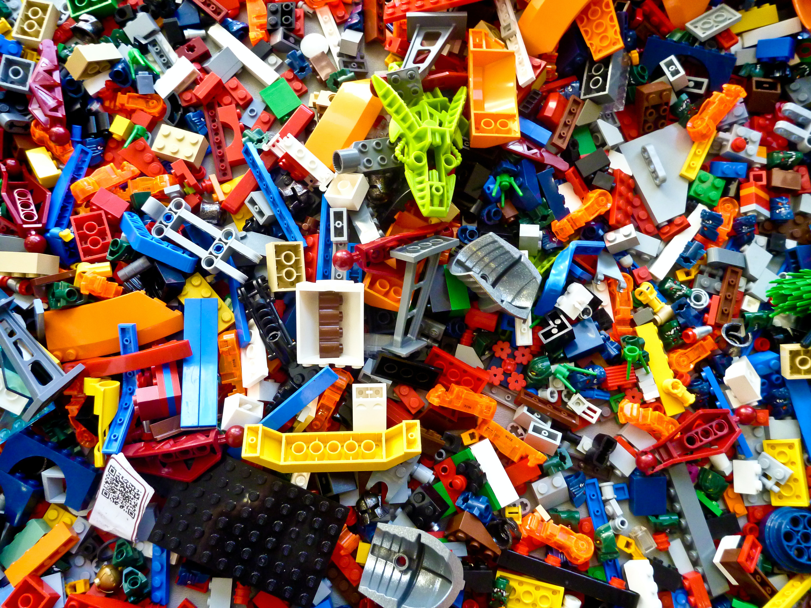

# Goodbye to Saccharine Feelings of Clean Code
#watercooler, #career, #opinion, #rant

A surprisingly soured reaction has come over me. Feeling giddy about sweeping up code is now absent. It sucks because I find myself middle-aged. The bursts of dopamine are no longer an assertion of *knowing* as time accelerates [hyperlinearly](https://twitter.com/paulg/status/1619480259556179968) within my text editor.

I'm giving up on clean code and consistency, coming full circle in a game of [sparking joy](https://www.dailymail.co.uk/news/article-11687263/Marie-Kondo-says-shes-kind-given-tidying-having-three-kids.html). If I feel good about mopping up code, I'll remind myself that it's lost time, which steals from what needs doing. Whatever I'm working on will be [sullied over or thrown out](https://xkcd.com/2730/), anyway.

---

*Editor's note: Feel free to share this rant in your next code review.*

## Social Post

With Marie Kondo giving up on sparking joy, so too am I in the text editor. While I wrote this short rant, my kids were out back, creating a new mess for Danielle Arcuri and me to clean. Enjoy!

Thanks to Jonathan Chu

[devto](https://dev.to/solidi/goodbye-to-saccharine-feelings-of-clean-code-15o4)

#watercooler, #career, #opinion, #rant, #programming, #productivity, #future
