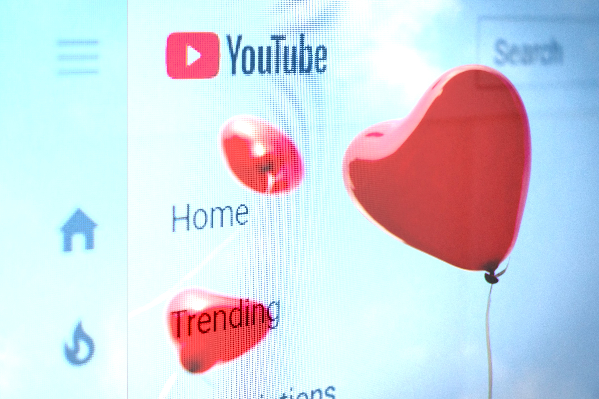

# A Love Letter To My YouTube Subscriptions
## Cutting Cable Turned Me Into a Couch Farrier

#youtube, #culture, #socialmedia, #technology, #streaming

When I ditched my cable bundle, a transformation happened on my couch. I became a voyeur of a comforting formula, peering into the souls of once-ordinary individuals. Every day, they post content on [YouTube](https://www.youtube.com/). Before bed, I stream their warez to my screen. This post is a love letter to their content after the collapse of reality TV, but before we [roll it back up again](https://www.engadget.com/disney-is-bringing-the-first-episode-of-the-mandalorian-to-broadcast-tv-231407016.html).

## New To You (and Their Content)

Until now, my list of YouTube subscriptions was a well-held secret. The enigma was shattered after I confided with a co-worker in front of others. We got deep into the detail of [unperturbed farriers](https://en.wikipedia.org/wiki/Farrier) shaving the hoofs of their prized heifers. From there, I realized I wasn't alone.

It's clear to me I've gone down the rabbit hole with these beautiful people. I'm in the comfort of individuals I'll never know. But is it reflections of me against the LCD mirror? Who are they, and what do they do? Let me share because I know you consume lovely weird shit deep down too.

### Nate The Hoof Guy

My co-worker and I bonded with [Nate The Hoof Guy's](https://www.youtube.com/@NatetheHoofGuy) content. While I don't see Nate in his YouTube videos, I'm close up with the captivating animals getting their big nails done. I come for the exciting thumbnail descriptions of "*Blowing Bubbles*" and "*What's Stuck in this Hoof?*" I'm right there with Nate as he carves away the cow talon.

His formula is straightforward. Nate comforts the animal and gets to work. Exciting discoveries like [white line defects](https://en.wikipedia.org/wiki/White_line_disease) are seen as he carves away with precision. When the abscess is cleaned up, Nate slaps on salicylic acid so no bacteria enter. He glues on a block on the opposite hook for proper balance. The cow is released, and so am I, discharging the beautiful animal to graze.

Nate's formula repeats with three-quarters of a million subscribers as of 2023.

### CrazyRussianHacker

It is without question there are YouTubers out there who unbox and review cool stuff. For Taras Kulakov, better known as [CrazyRussianHacker](https://www.youtube.com/@CrazyRussianHacker), his reviews have been a staple of my YouTube diet for at least a decade. He'll take on weird man-like reviews of tools, survival gear, and kitchen gadgets. They make me smile every time he reviews.

CrazyRussianHacker has influenced me to say, "*Let's put it to the test!*" and the joy of speaking, "*Safety is number one priority.*" In real life, I'll say these quips in jest where preparation wasn't planned, as CrazyRussianHacker performs dangerous tests regularly. The repetitive hooks in his language have seeped into mine. And if you have been watching, I'm sure you are also doing it.

With almost twelve million subscribers, his influence is "*No joke guys.*"

### Xiaomanyc 小马在纽约

Better known as Arieh Smith, [Xiaomanyc](https://www.youtube.com/@xiaomanyc) drives smiles when articulating an unsuspecting language to native speakers. He's famous because the looks do not match his impressive Mandrian and [Fuzhounese](https://en.wikipedia.org/wiki/Fuzhou_dialect) skillsets. It's incredible to watch Arieh order food in an unfamiliar language while I experience anxiety about ordering a cheeseburger in my *only* language.

Xiaoma's experiences are the deepest nightmare of an introvert and the key to mastering a second language. Lately, he's been exploring additional languages, which appears uncomfortable to this polyglot. I come back because of the human reaction of others. People indeed connect on a level when their language is respected and, stunningly, when they speak their language imperfectly with passion. 

Arieh is one of those people that make the human race worth preserving. Xiaoma has five and a half million subscribers as of 2023.

### Featureman

One of my latest subscriptions, [Tom Williet](https://www.imdb.com/name/nm0932517/), or [Featureman](https://www.youtube.com/@Featureman), was a pure joy to find. At first, I was intrigued by a wise-looking man reviewing TV dinners at their low price points. And recently, I have been watching during my lunch when I eat alone. I'm drooling at his "secret dessert" reveal in every video; sometimes, they are fantastic. But shut up and listen. He's speaking.

Featureman is a pleasant guy talking about high-processed food concerned with its economy. Until I realized he's saltier than the TV dinners. Tom has worked with Hollywood's greatest actors as a stand-in, extra, and double, spanning forty years in Hollywood. From [Rock Hudson](https://en.wikipedia.org/wiki/Rock_Hudson) to Leslie Nielsen, he's worked with outstanding actors and actresses. And this is why I come back. Featureman's stories would make any mortal smile. God bless my vanilla pudding time with him.

Astoundingly, Tom has four hundred thousand subscribers as of 2023.

### 11foot8plus8 (Originally 11foot8)

Vehicle accidents are scary, life-changing, and downright horrific. And in the Internet age, I've learned to swear in Russian from the glut of leaked car camera incidents. But if you look deep enough, there are misfortunes we all laugh at, and no one gets hurt except in their wallet. [11foot8plus8](https://www.youtube.com/@11foot8plus8) is a camera looking at a train bridge where unsuspecting box trucks get "can-opened" by a hungry bridge in North America. This one is a blast, and my kids love it.

Jürgen Henn has been running the camera surveillance on this bridge for a decade. He has a library of at least 150 truck and RV *rip-roaring* incidents that will make you cringe and then laugh at their stupidity. I mean, there is a sign flashing "*OVERHEIGHT!*"

Even after the locality raised the bridge another eight inches in 2019, videos roll in, albeit less lately! Please wait for it before the roof pops open. Boom! Ah, there it is. 11foot8plus8 has a quarter million subscribers as of 2023.

### Mr. Heang Update

Do you want to watch strong people develop a tropical paradise with hands, sticks, and pure genius? Well, you're in luck. [Mr. Heang Update](https://www.youtube.com/@MrHeangUpdate) locates you in the southeast corner of the world. Watch a few people dig into the earth; twenty minutes later, you'll find a pool, a resting area, the bbq, and even running water. How did that happen?

There is [chatter on the Internet](https://boingboing.net/2022/07/08/primitive-building-videos-deemed-fraudulent.html) that this genre is fake, and the location contains modern tools to make crafting happen. But I don't want to believe it. The editing is flawless, the video sped up, and these people are building an oasis I want to live in, even if digging machines and power tools exist behind the camera.

Mr. Heang has close to eight million subscribers.

### Steve1989MREInfo

It is without question there is poignant interest in nostalgia. But to unbox and then eat that nostalgia is weird and *very satisfying*. Steve Thomas, or [Steve1989MREInfo](https://www.youtube.com/@LetsGetThisOutOntoATrayNice), is making these videos of collecting, showcasing, and then eating MREs ([meals ready to eat](https://en.wikipedia.org/wiki/Meal,_Ready-to-Eat)) your great grandfathers and grandmothers ate during the World Wars and your parents and friends later. And like him, I'm saying, "*Let's get this out on a tray, nice!*" and "*Catch you on the next one. Cool. See ya.*"

When Steve blows the finest asbestos hickory smoke from century-old [Chesterfield cigarettes](https://en.wikipedia.org/wiki/Chesterfield_(cigarette)), I'm relaxed like I've never been. What's interesting about his channel is the deep knowledge I've obtained by watching the unpackaging. The engineering, craft, and intensity of developing long-distance food delivery in combat is an incredible science.

Steve un-cans potential botulism I'll never have to experience. Since watching, I've savored a few modern MREs. And with Steve1989MREInfo's two million subscribers, the flavor is always good.

### SB Mowing

In the land of YouTubers, watching people work is no joke. In the case of mowing lawns, that's a business with lots of money to be made. Spencer over at his channel, [SB Mowing](https://www.youtube.com/c/sbmowing), uploads videos where he gifts his landscaping services to abandoned properties and neighbors. I'll spend hours with Spencer with his formula of revealing what once was considered lawn and brushes.

SB Mowing is doing something extraordinary with half a million subscribers watching... which is mowing lawns? I arrive for those delicious sideway reveals. Lifting sod off the concrete makes for a soothing experience if you are a mind-bended, neat freak like me. I come back for the straight rhythmic shots of clean edges.

### Hydraulic Press Channel

In the case of Lauri and Anni from the [Hydraulic Press Channel](https://www.youtube.com/@HydraulicPressChannel), they have been at it since 2015. They crush things with their expensive press equipment. And I'm back, again and again, watching this duo from Finland destroying objects I've never dreamed of. And lately, they play with fire and explosives on their frozen lake outside, making it all the better. Finnish people are *cool*.

Hydraulic Press Channel touches my inner soul of being a child. I liked destroying my playthings, specifically my toy cars with hammers, or at least this is what my Mom said. But with Lauri and Anni, I'm in good company without anyone yelling at me. I like this duo, what they do, and how hazardous the activity of crushing ballbearings produces authentic military-grade shrapnel.

With close to four million subscribers, people enjoy this dynamic dual with Lauri's classic Finnish response, "*Holy Shit!*" as the shards fly.

### LA Beast

My final YouTuber on the list is Kevin Strahle. Better known as [LA Beast](https://www.youtube.com/@LABEAST), a competitive eater whose videos reflect his nature of doing crazy things like eating cakes off a moving toy train while upside down on a yoga stand. LA Beast became famous for [chugging a twenty-year-old Crystal Pepsi](https://www.youtube.com/watch?v=CGwibPdEOVk) and throwing it all up. I connect with Kevin and make his videos my priority.

LA Beast lines his rooms with physical nostalgia, which connects to my deepest childhood, including Ghostbusters, WWF, Nintendo, and other oddities. With the peculiarities he accomplishes, I drop everything to watch his next challenge. With his recent video [completing a 50-mile jog](https://www.youtube.com/watch?v=s-10rEbLWnk), I rose off my chair, clapped, and then began crying with him on his win. Watching LA Beast is the peak of a good person trying his best at YouTube.

With close to three million subscribers, he's doing it well, while others are not. As Kevin would say, "*Have a good day!*"

## Link and Subscribe Below (and Click the Bell)

Of course, there are others on my list. From [riding trains](https://www.youtube.com/@RailCowGirl) in Scandinavia, sipping scotch in a [Manx bothy](https://www.youtube.com/@ralfydotcom), riding expensive [naked motorcycles](https://www.youtube.com/@royaljordanian) in Europe, and reviewing [delicious US fast food](https://www.youtube.com/@TheReportOfTheWeek), these individuals are privately celebrated and publically embarrassing to share. But we are all watching a flavor of their creative content.

I've chosen these people because they are my new media consumption. They are doing something incredible by keeping me entertained on YouTube. And since my separation from cable, I've subscribed to these individuals, and I hope more will come. Well, *until the next big thing arrives*.

And with liberty, as [Lauri](https://en.wikipedia.org/wiki/Hydraulic_Press_Channel) says on the Hydraulic Press Channel, "*Thank you for **reading**, and have a nice day.*"

## Social Post

This #Valentine's Day, I'll #stream #weird but satisfying #content on #YouTube. And after sharing my #subscription list at a recent #work function, I won't be the only one. Here is my #love letter to those content #creators.

Thanks to @Danielle for watching with me all these years and to Steven Black.

[medium](https://medium.com/@solidi/a-love-letter-to-my-youtube-subscriptions-c4ab16a5c88)

#culutre, #socialmedia, #technology, #people, #reality, #humaninterest
