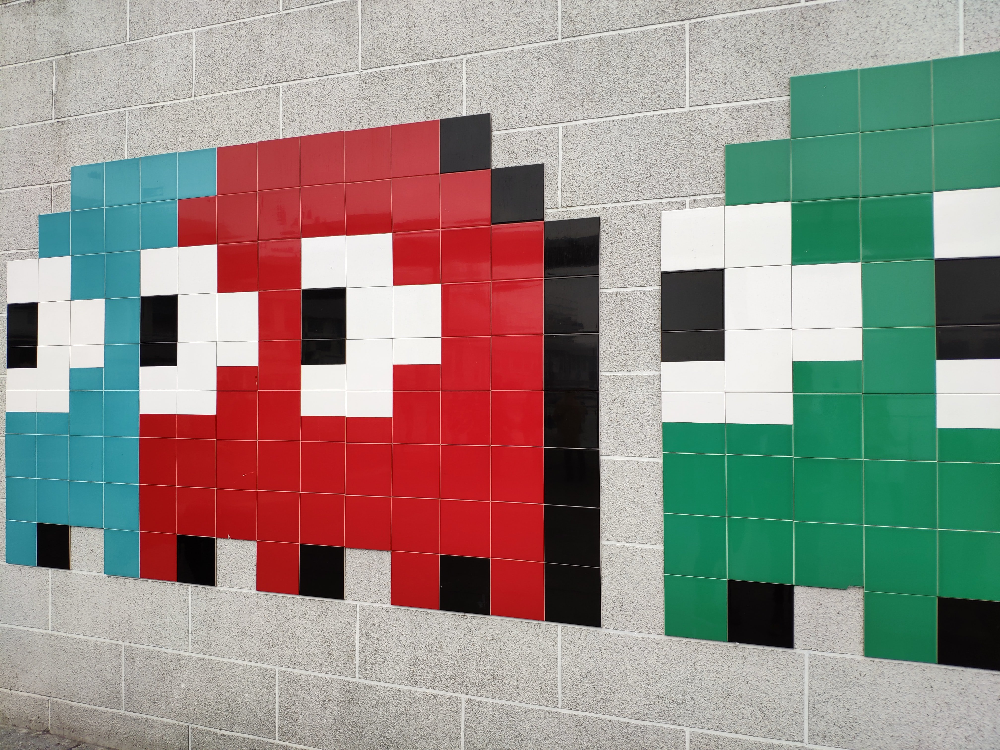

# Video Gaming Concepts for the Uninitiated
#watercooler, #gamedev, #videogames, #beginners

Watching my children play provides exciting observations. Their behaviors are organized into distinct concepts. I'll tinker, associating their manners with unrelated ideas. Then, it came to me. I crave comparable actions while playing *video games*. In this write, my goal is to label them.

As an [uninitiated developer](https://medium.com/super-jump/building-a-popular-half-life-mod-during-the-rise-of-counter-strike-fec6a5b9fd8f?sk=6d1427b3f1d832df06bd5b07aaa456bb) who could not hold a candle to gaming theorists, I believe the following behaviors make gameplay fun. At the same time, the results trigger my children's laughter at loftier decibels while at play. My fascination is this question: *Do these behaviors transcend to video game mechanics, delivering higher fidelity?*

## The List of Uninitiated Attributes

So, I created a list to answer the question.

**Physical possession of objects** - holding on to things is an essential ability. While video games have inventories of collecting possessions, few have allowed players to hold onto the objects in space. Grabbing onto two items is better. How about even more?

**Picking up objects and throwing them** - while holding things is excellent; picking them up and manipulating them in space is perfect. Why not throw them at something? Better strength means adequate velocity. Start laughing because there is plenty to throw.

**Damage and destruction of objects** - objects are damaged if enough force is applied. Things can be destroyed too. Of course, laughter increases with the amount of destruction, to a point before it becomes out of hand. Specific items can be destroyed in video games, with lots to explore.

**Hiding without others knowing** - also known as *stealth*, this concept has the stimulating effect of protection. Cloaking oneself leads to laughter. Being hidden provides a feeling of opportunity. Games have analyzed this concept over the years, but there is much to explore.

**The permanence of objects** - objects which remain strewn across an area is an expression of disorder, especially if these objects are revisited later. Going back to what was placed earlier is of interest. Things are rarely accumulated in video games, as resources are reclaimed.

**Repeat and retry** - reprising one of the items above or below, doing it repeatedly. The same goes for these concepts in video games. A solid rewind/repeat mechanism is yet to be developed, but systems have been tried.

**Full brights and environment** - nothing gets the kids laughing if there is play at night, in the snow, or an environmental change. Environmental space is the same as in video games. There are copious amounts of effects. Recently, glowing objects, or full brights, are often used for improved visual style.
  
**The fluidity of movement** - kids like to climb to inaccessible areas. They jump around and laugh when their perspectives are altered, looking upside down! The same goes for video games; lately, games have opened up into fantastic "acrobatics," "parkour," vertical play, moving fast, and [flying upside down](https://medium.com/@solidi/read-these-5-passionate-software-engineering-books-this-holiday-6c6ad8fbd211). There are mechanics left undiscovered.

**Chaos in quantity** - increasing the number of objects makes kids go nuts. Think of a ball pit where there are thousands of similar items. So in video games, in a gray box or sandbox, with lots of abilities to spawn them. Chaos mode, where objects are at insane levels, makes for an exciting, time-consuming experience.

**Pretend building** - nothing gets my kids minds flowing with ideas when they pretend to build. Either sandcastles or pillow forts, it's a lot of laughter with creative imagination like *substitution* and world-building in the small. The same sentiment stirs within video games. Making things virtual is a captivating topic worth investigating its value.

**Mutator configurations** - kids have a way of inventing the play in which they engage. They make things up, configure their toys in a particular way, or change the environment with unique rules such as copious amounts of pretend lava. So too, are nice to have with video games. Changing up its composition is a must-have. Unfortunately, games limit their options.

**Playing with invented rules** - is an unmistakable quality explored intensely in video game communities, so involving others increases the fun factor. [By keeping score](https://dev.to/solidi/five-more-minutes-5b7d), kids create play rules in which inspirit the experience, bringing out their disagreements!

## Is it Fun?

From here on out, adults invent intricate rule sets, ending my list. Those were my observations about video games, my kids, and what I crave while playing. But how do you quantify fun? Having these qualities alone does not equate to joy. A combination of them will provide incentives.

I'm sure I missed other attributes which are a part of gaming elements. Of course, numerous mechanics are well-known within the community. My goal here was to list out these observations. How they connect will be a topic I'll explore as I find other patterns.

---

## Limit Seeking

Limit seeking is a pattern, where a player pushes the rules of the system (or of a leader.).

Regardless of age, players tend to test boundaries of the system they are in. How fast a car can go, how much one can hold, how sharp a turn can be made in a vehicle.

The game is up when the boundary is exceeded, and a consequence is tolled.

---

## Social Post

What are the core elements that make #video #games #fun? Here, I break down my #observations from my kids and roll them into a nifty list worth #exploring.

[dev.to](https://dev.to/solidi/video-gaming-concepts-for-the-uninitiated-4k8m)

#watercooler, #gamedev, #videogames, #beginners
