# The Toys That Made Us: The First Hot Wheels Sto & Go Playset
## The Missing Workshop Manual to the Revered Accessory
#Toys, #Mattel, #HotWheels, #Nostalgia, #Culture

. The hull of the Hot Wheels Sto & Go.](images/69-01.png)

---

*This draft is part of an American Toy Anthology. For information on the upcoming publication, see this author's announcement, [Undercover Toy Stories](https://medium.com/@solidi/upcoming-book-technical-toy-stories-80d5bfbd76c0): Volume One.*

---

**ON A COLD SATURDAY NIGHT** in February, there wasn't much to do but spend time with my toddler. We had choices. iPads? No. Stream nostalgic [Masters of the Universe](https://en.wikipedia.org/wiki/Masters_of_the_Universe)? No. I rolled out the [Matchbox](https://en.wikipedia.org/wiki/Matchbox_(brand)) and [Hot Wheels](https://en.wikipedia.org/wiki/Hot_Wheels) instead. Our "beep-beeps" and "vroom-vrooms" filled the room.

While playing, we rendered a city out of his socks. That wasn't enough. I wanted to buy something, but there [wasn't a store](https://www.retaildive.com/news/the-story-of-toys-r-us-bankruptcy-is-still-unfolding-and-it-still-matters/617429/) or a [mall](https://www.businessinsider.com/american-mall-decline-150-left-10-years-how-many-2022-10) to make the purchase the main event. These places have long compacted into the synchromesh of online retailing.

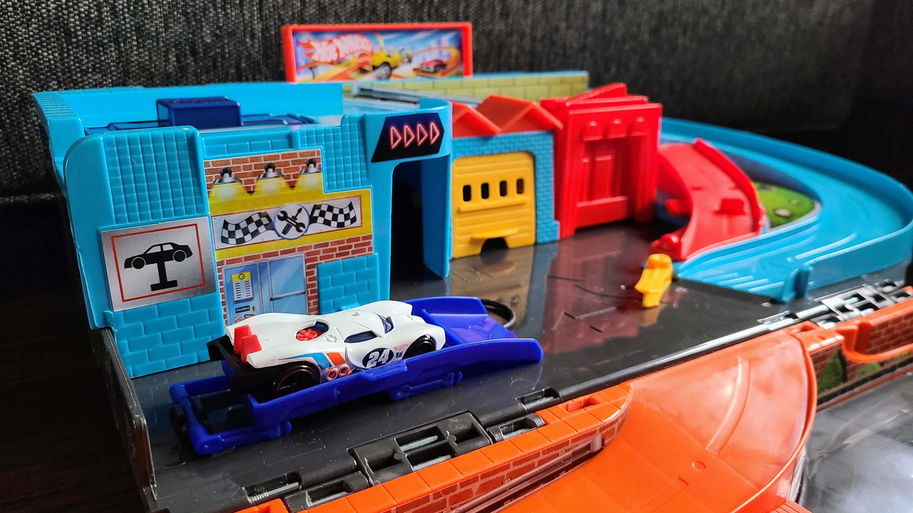

So I dialed up a big box store app and purchased a modern-day [Hot Wheels Sto & Go](https://www.barcodelookup.com/194735028993), which arrived at our door in one hour. My son's face lit up joyfully, and I unboxed (with my nervous collector's hat on), cleanly ungluing the seams. But something strange happened. The big gray blobs in the center of my brain lit up my check engine light. A complete rush of [nostalgia](https://www.reddit.com/r/80s/comments/zy4o8w/hot_wheels_foldable_sto_go_playsets_never_knew/) unpacked from decades past. I had one, too, *so long ago*.

As I put my son to bed, I had to understand Hot Wheels *deeply*. That set me on a six-week journey of playful discovery and sleepless emotional grit. With a head nod to "[Challenge Accepted](https://podcasts.apple.com/ca/podcast/081-challenge-accepted/id1308510891?i=1000480075666)," I buckled up for adrenaline-infused memories, unearthed new Hot Wheels lore - and swerved technical as a plastic gearhead.

## Stowed & Gone, Now Back Again

**THE HOT WHEELS STO & GO** sets by [Mattel, Inc.](https://en.wikipedia.org/wiki/Mattel) have a long history of toy-making that deserves eyeballs. I've encountered [many collapsible products](https://hotwheels.fandom.com/wiki/Sto_%26_Go) which unpack unique play themes. As a premium Hot Wheels accessory, each flavor appeared in [Wishbooks](http://christmas.musetechnical.com/) and on toy shelves throughout the 1980s. Then, technological evolution, the Internet, and [remote work arose](https://medium.com/@solidi/the-world-i-worked-into-no-longer-exists-732659963058).

 Sto & Go from the JCPenney Wishbook 1981. Source: [musetechnical](https://christmas.musetechnical.com/ShowCatalogPage/1981-JCPenney-Christmas-Book/0473)](images/69-03.jpeg)

The playset's novelty contains three distinct levels of play (ground, platform, roof), with a long top ramp connecting both worlds with gravity. Once a car reaches the base, it rings a bell in front of a gas station (back when gas stations had attendants). As a bonus, the Sto & Go packs up to the side by a stressed parent and unboxed by a child at a moment's notice-a genius stroke now as it was then.

Their main competitor at the time, Matchbox, had no answer to the "lunch-boxed" Sto & Go. It would be a decade before the [Fold 'N Go](https://www.mdiecast.com/mpictures/catalogs/Matchbox_1990.pdf) line appeared in the early nineties. [Mattel later acquired them in 1997](https://www.latimes.com/archives/la-xpm-1996-11-19-fi-734-story.html).

](images/69-04.jpeg)

But back then, the defunct Durham Industries Play 'N Carry Auto Center playset developed a camber-close design (stamped with a questionable year, [1972](https://www.ebay.ie/itm/263767731791)). I couldn't find information about them except their playset lay flat to "co-invent" at the patent office with half-measured gravity ramps.

Other competitors claimed Durham [did not own the car title](https://law.resource.org/pub/us/case/reporter/F2/630/630.F2d.905.79-7752.639.html), leaving my [unspun](https://www.reddit.com/r/HotWheels/comments/c5crx6/what_does_unspun_mean/) analysis abandoned on the information superhighway. In short, Hot Wheels had the high-occupancy vehicle accessory lane all to themselves.

](images/69-05.jpeg)

Before Fold 'N Go, Matchbox stuck parents with [unfinished "car projects" in the playroom](https://www.youtube.com/watch?v=LLjRrjR8WQU). Hot Wheels participated to duly compete (admittedly, I have memories of [Matchbox's Motorcity Car Wash](https://www.ebay.com/itm/354530183744)). Post-war lithographed tin seen in Sears catalogs from the 1950s had been replaced with cardboard, vinyl, and plastic. These sets, stunning when complete, were known for ripped plastic mats and missing parts, becoming rat rods in toy bins forever.

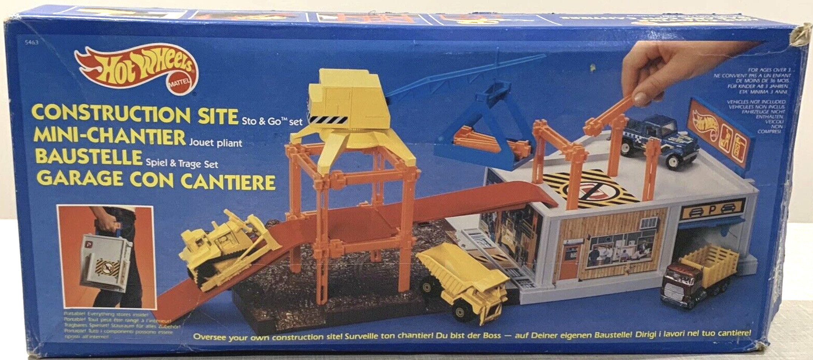

Hot Wheels continued with the genre developing miniature Sto & Go playsets later in the 1980s, such as the [Fix and Fill Up #1142](https://www.youtube.com/watch?v=G7mwbuQ_42U) and the unique Kid-Powered [Railroad Freightyard Sto & Go](https://hotwheels.fandom.com/wiki/Hot_Wheels_Railroad) (another favorite of mine and well-known collector [Mike Zarnoc](https://www.youtube.com/c/HotWheelsTV)).

Throughout the 1980s, these large carry accessories were monolithic platforms storing up to [fifteen](https://www.youtube.com/watch?v=HMR4leISigk) diecast cars inside, as advertised. Even [Tom Kalinske](https://en.wikipedia.org/wiki/Tom_Kalinske), a previous Mattel CEO from 1985–1987, encouraged every parent to [load them up](https://poddtoppen.se/podcast/1541808441/gamemakers/tom-kalinske-the-king-of-brands-from-flintstone-vitamins-barbie-hotwheels-he-man-and-sega) with Hot Wheels (and I certainly did).

](images/69-07.jpeg)

Boost-forward thirty-five years, a team at Mattel remembered that line of products. Hot Wheels [launched](https://www.facebook.com/hotwheels/posts/10153330974805807) a 1980s-styled [reboot in 2016](https://lamleygroup.com/2016/05/09/hot-wheels-sto-go-the-best-hot-wheels-playset-since-the-1980s/) with a new generation of Sto & Go's in a similar blueprint to the now public domain "Playset for Toy Vehicles," [US 4,349,983](https://patents.google.com/patent/US4349983). Yet another variation was released in 2022, the one I bought my son.

](images/69-08.jpeg)

The new toy is slimmer than the original, with new hinge clasps, embossed car artwork on the case (a nice touch), and added "track builder" connectors. The fascia design within has been uplifted to match current cultural references. [Old-time work, small shops, and personal duty](https://wearethemutants.com/2020/02/25/remembrance-of-ramps-past-hot-wheels-service-center-playset-1979/) have been reshaped to futuristic speed, suggestive [technological advancement](https://medium.com/@solidi/driven-to-optimize-for-nice-39a3f2a796a0?sk=048248c06fdb2d210a545a9a5c84c821), and human leisure. But its original crisscross crash of [ramppunk](https://twitter.com/robotnik/status/1204455779140542464)-[spacecamp](https://www.imdb.com/title/tt0091993/) remains paved in the minds of many.

This specific product line was (and is) novel - an engineering triumph in toy design. In each playset, children pretend with tropes of good guys vs. bad guys, extinguish fires, construct/haul things, reenact fender-benders, race for slips, and new-styled collaborative rescue teamwork (as my son binges this media on their [YouTube](https://www.youtube.com/user/hotwheels) channel.)

](images/69-09.jpeg)

But more so, Hot Wheels children experience intense [imaginative play](https://dev.to/solidi/video-gaming-concepts-for-the-uninitiated-4k8m) with the order of systems, hand-eye coordination, social communication, and grouping ideas within understood play patterns. And now my son, a fourth-generational customer, has received his new junior license.

## Generational Gravity-Ramp Bridge

**AFTER ACQUIRING MATCHBOX’S PARENT COMPANY**, [Tyco](https://en.wikipedia.org/wiki/Tyco_Toys), Mattel's Hot Wheels dominated the podium, producing [eight billion cars](https://www.youtube.com/watch?v=BqLho6jcQpo) over the years, with forty million players at an average collection of [forty-one vehicles per child](https://www.youtube.com/watch?v=uH6bP2FJ7jg). A 1/64-scale car is made [every 16.5 seconds](https://www.caranddriver.com/features/a20734339/hot-wheels-turns-50-heres-how-design-drives-the-iconic-toys-feature/), with [millions of units sold weekly](https://youtu.be/SUVyqAgjorQ). Children and adults spend billions of hours playing globally.

 in the present-day. Source: Reddit](images/69-10.jpeg)

Joining other toy lines, Hot Wheels is steering into [digital content and gaming](https://www.barrons.com/podcasts/streetwise/barbie-back/9ee18a06-4e4b-48ae-8000-b381c48a095b) as much as profiting from what I like to call *generational bridging*.

Since the mid-1990s, the newly minted parents who played with Hot Wheels in the 1970s shared the toys with their children, creating a collector boom for Mattel. Another generation has turned from that, and now a mixture of three generations throw the [peace sign](https://www.motosport.com/blog/the-motorcycle-wave-handbook) down to one another. There is a nod to the behavior in this [50th-anniversary book](https://www.amazon.com/Hot-Wheels-50-64-Scale/dp/0760360308), driving its perfect 100% brand recognition (my son knows the flame, too) thanks to the 20-year nostalgia cycle.

For example, at a big box store, you will find an adult person searching for a missing car in their collection (or clearing out the entire aisle while "hunting") to another parent racing to get their shopping done. Still, a portion of digital customers buy [mystery box](https://www.amazon.com/Hot-Wheels-Basic-50-Pack-Packaging/dp/B003FW0YZG) sets online. While one would pay a premium on their high-detailed "car culture" rides, the other grabs a fist full of [inflation-busting](https://www.npr.org/2022/12/16/1143282569/why-hot-wheels-are-one-of-the-most-inflation-proof-toys-in-american-history) cars for a dollar a piece, even in the 2020s.

](images/69-11.jpeg)

We are now in an age of toys with fine gear ratios, competing digital *windshield* technology, and ultra-unique distribution methods. I suspect this is why "retro" (and their respun collector lines) have become so relevant in current toy culture. Its demand has increased across a horizontal "[Sebring](https://www.sebringraceway.com/)" with disappearing shelf and peg space from a vertical "[quarter mile](https://en.wikipedia.org/wiki/Dragstrip)." While we will never see a [Toys "R" Us](https://en.wikipedia.org/wiki/Toys_%22R%22_Us), [Child World](https://en.wikipedia.org/wiki/Child_World), or [Kiddie City](https://en.wikipedia.org/wiki/Lionel_Kiddie_City) again, these twisties demand navigation as a loud side-car of people who wrench their hearts out on the Internet (and now, me.)

When I think about its collector culture, the Hot Wheels Sto & Go has placed a permanent "[tampo](https://en.wikipedia.org/wiki/Pad_printing)" styled tattoo (their pad print process using color ink) on my heart that I cannot rub away. So I had to pump the brakes for a minute and find personal photos. Was the Sto & Go there?

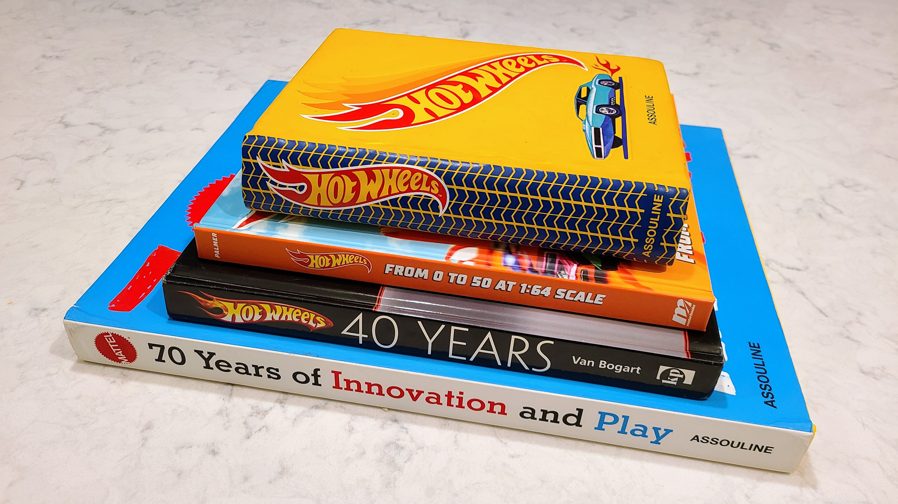

At its core, the accessory connects me to my [Greatest Generation's grandparents](https://en.wikipedia.org/wiki/Greatest_Generation). With my parents too seasoned and my kids latently nascent, I'm a [Xennial](https://www.businessinsider.com/xennials-born-between-millennials-and-gen-x-2017-11) track connector squarely in Hot Wheels second generation. In digging up family photos, I encountered candid grimace shots of my Grandma Flo "Ridgewood" and Grandpa Willy "Yonkers."

Sure enough, the Hot Wheels Sto & Go City (1981) stands stoic in bedroom backgrounds. I'll share one, and it's essential. See how "real" the visual design is compared to my [Fisher-Price toys](https://www.etsy.com/market/fisher_price_garage)? (my son has the updated [Helping Garage](https://shop.mattel.com/products/fisher-price-little-people-helpful-neighbors-garage-fhg50)). This made a lasting impression on me, and perhaps you if born between 1970 and 1990.

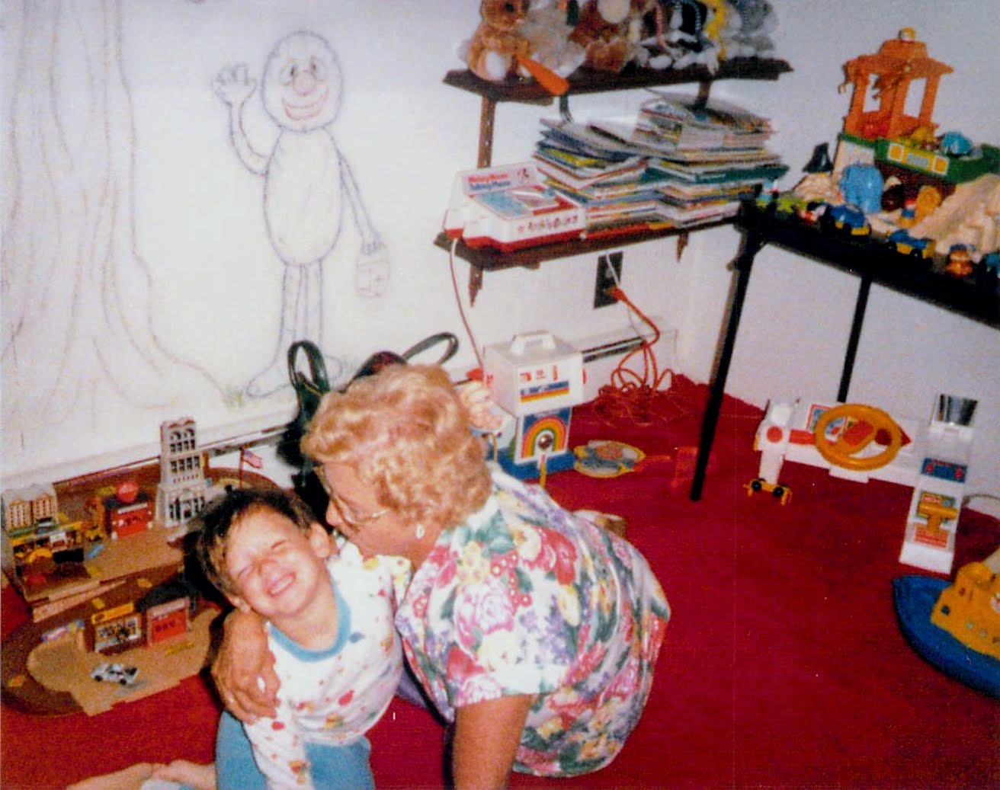

And lasting impressions are what toys do in all of us. In the 1980s, my father lamented his missing Marvin Glass' [Mr. Machine](https://en.wikipedia.org/wiki/Mr._Machine) and missile launcher playsets at an office while my contemporaries and I played at home with the Sto & Go. Then it ended when I turned eleven. *Someone* lovingly threw it away with its scuffed plastic, hundreds of play hours, missing legs, and [ripped stickers](https://scredlines.com/SCR/SCR_Item.aspx?ProductID=21286) (mom thinks my playset buried in the basement).

At that time, Sto & Go appealed to beautiful car machinery from the original direction of [Larry Wood](https://hotwheels.fandom.com/wiki/Larry_Wood) and the model engineering of [Bob Rosas](https://hotwheels.fandom.com/wiki/Bob_Rosas) (plus many others) that cannot be driven but invited play throughout its plastic landscape.

Since then, [countless artists](https://hotwheels.fandom.com/wiki/Category:Designers) have crafted thousands of legendary vehicle designs (Manson Chueng's [DMC-12](https://hotwheels.fandom.com/wiki/%2781_DeLorean_DMC-12) is my new favorite). But this story isn't about [Batman](https://shop.mattel.com/products/hot-wheels-themed-premium-bundle-4-grm17)'s rides. It's about his uncredited sidekick Robin's hideout. Where was the starting grid?

# Pouring the Pavement to Sto & Go

**IT’S HARD TO IMAGINE** my country's history without people who developed [Barbie](https://en.wikipedia.org/wiki/Barbie) and Hot Wheels under one roof. [Elliot](https://en.wikipedia.org/wiki/Elliot_Handler) and [Ruth Handler](https://en.wikipedia.org/wiki/Ruth_Handler) started in a California garage a decade before Silicon Valley got its name. They are the pioneers of making detailed toys at scale, delivering modern-era toys because they observed their children. They questioned and then acted intelligently.

While constructing the then space-age toy apparatus (and with people from aerospace), the Handler created an environment to forge evergreen intellectual property (IP) where inventors and artists created the Sto & Go that transcended multiple generations, decades after their founders [walked away](https://podcasts.apple.com/th/podcast/hasbro-vs-mattel-the-house-of-cards-3/id1335814741?i=1000433557244) from the business they built.

A balanced couple of artist and entrepreneur, Elliot and Ruth constructed a special thousands-ideation-per-year flywheel developing toys that children dream into. At the same time, they protected inventors and artists from sales and marketing influence, a toy industry first.

If you look past new 3D print computer-aided work today, the Handlers revolution of toymaking craft is de facto into the 21st century. This inspirational environment crafted IP so beloved by generations and streamlined toy manufacturing that it paid dividends to new ways of navigating the product GPS. For example, Ynon Kreiz (CEO of Mattel) reports [reigniting recognizable IP](https://www.iheart.com/podcast/1119-good-company-with-michael-62503852/episode/ynon-kreiz-the-opportunity-for-us-82888523/) is now the way to go.

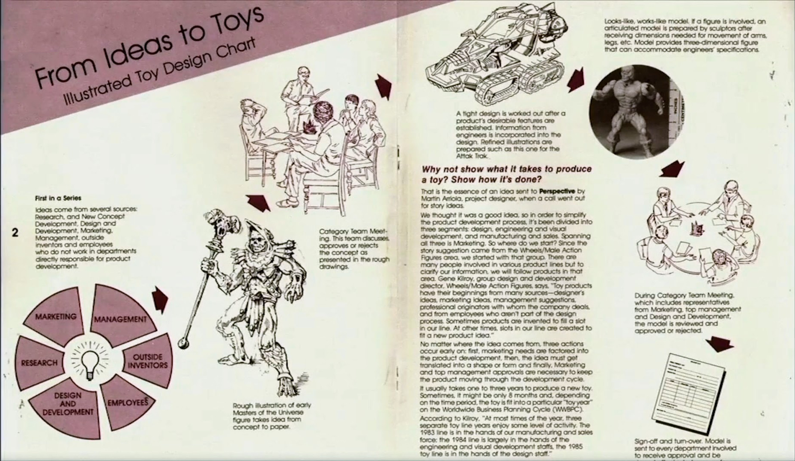

What is so mind-bending about the journey of the Sto & Go is its quiet inventive timescale without its success story. It has anchored an aging generation like me who watched music videos on TV.

While the Sto & Go delivers peak [mechanical](https://www.howacarworks.com/advanced-driving/sympathy-and-understanding) toy craft, the playset has received little attention in the literature within the tune of "Southern California Car Culture" and the "[Sweet Sixteen](https://hotwheels.fandom.com/wiki/List_of_1968_Hot_Wheels)" (the original line of cars launched in 1968). But these bold plastic boxes invoke memorable Internet posts, "*Memory unlocked. This was great.*"

Only a product like Sto & Go could be [ultrasonically welded](https://en.wikipedia.org/wiki/Ultrasonic_welding) and friction-fitted within. Thousands of creatives built, [defended](https://www.imdb.com/title/tt1754780/), demoed, and released their toys and protected their IP for decades before software became *creative*. Big tech still wasn't big tech. The Sto & Go was a part of this elective Le Mans, crafted by artists and engineers, and they responded.

## The Bell Goes Ding-Ding on the Sto & Go

**SOMETIME IN THE 1970s**, Ray Wagner, then president of Mattel, transmitted the need for a "Hot Wheels garage" (really, a gas station). While it remains unknown if Elliot hit the Hot Wheels launcher on Sto & Go himself (he left in 1974), it was clear to management and market research a new invention was needed for children. Being added to a product wishlist, Gene Kilroy, the "chassis wizard" to this project, headed up a vertical within Hot Wheels toy experimentation.

It is essential to understand that there are numerous inventive influences when developing products. And in this story, there are multiple axles. First, "Vinyl-stay-Vinyl" (VSV) playset units, like the [Talking Service Center](https://hwredline.com/talking-service-center/) and diecast car totes, were aging. In competition, Matchbox had a [full vinyl line](https://www.ebay.com/sch/i.html?_from=R40&_trksid=p2047675.m570.l1313&_nkw=matchbox++vinyl+playset+1973) with a city, construction site, airport, and country (it goes on) circa the late 1960s into the mid-1970s. We think of this as the "Sto" influence on the product.

. Source: [Auctions](https://www.etsy.com/listing/1368440069/rare-vintage-hot-wheels-talking-service)](images/69-16.jpeg)

While VSV manufacturing costs were low, so was the ability to turn these accessories into profit. Everyone in the trade (the toy industry and retailers controlling the shelves) knew it did not require expensive [tooling](https://en.wikipedia.org/wiki/Injection_moulding) (a detailed metal casting for molding plastic). VSV was cheap with inlay cardboard. It performed poorly in realism and maintaining form, so it was on its way out. VSV was avoided in this invention and disappeared by the late 1980s.

Second, Hot Wheels could benefit from a "push around and play" accessory joining their maturing racing and stunt sets, in which a product gap existed. This new product could ignite slumping accessory sales and move more Hot Wheels. We think of this as the "Go." This play function was supremely novel and America's earliest recorded mechanically rigid Pack-n-Play invention (people now relate this compound word to [Graco](https://en.wikipedia.org/wiki/Graco_(baby_products)), but that was invented ten years later in 1987.)

](images/69-17.jpeg)

Third, around this time in industrial toy design history, materials and plastics ([polystyrene](https://en.wikipedia.org/wiki/Polystyrene) and [polypropylene](https://en.wikipedia.org/wiki/Polypropylene)) dropped in price to make such a product rigid enough, but importantly, produced at scale. While mold-making did not have the intricate computer-cut design we see today, [techniques](https://en.wikipedia.org/wiki/Tool_and_die_maker) were available. Mattel had all this in tow, in the environment they set up that allowed inventors to lathe with wood and plastic freely if they should choose to heed Gene's flag drop.

This kicked off the in-house invention process, where the preliminary group took charge and was protected from foot traffic. "Prelim" (referred to as a high school playground by other departments) developed prototype toys, buying in management and marketing with demonstrations. Gene sent the request to the group, and a prototype design began forming from a few interested individuals in his cabal car garage.

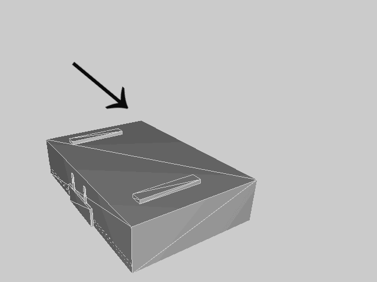

The Sto & Go prototype was developed to make an attractive "service station" playset. Ideas were unveiled by placing the kit within a box, eventually making it novel. While designing the way the set opened like a "lunch box," there was the eureka moment. Cut one edge on the plastic box and redirect a hinge on another, enabling its unique unfolding three-level design. Finally, add legs to keep it upright.

This enabled gravity to carry cars throughout the playset, demonstrating top Hot Wheels performance (the reason why this brand existed). A novel track was crafted throughout to make cars fly to the finish line- a gas station - with an iconic mechanical bell (they used the [Mattel-O-Phone](https://www.collectorsweekly.com/stories/61900-1965-mattel-o-phone) in the final production run).

From there, they appended extraordinary contributions like the external ramps and customizable nested structures to increase play value within a three-leveled buffet box with a stowed carry handle-a new design for the emerging [G-Body](https://en.wikipedia.org/wiki/General_Motors_G_platform_(RWD)) platform tech age.

) - 1980](images/69-19.jpeg)

The Sto & Go serendipitously solved what we'll call the "garage problem," a toy being lost within a structure while in play. While they didn't set out to solve this problem, it was known with Barbie and similar playsets. Its emerging "theater box" design enabled a child to move the held diecast freely within a playset without losing sight, keeping play value high at all chicanes. While down at eye level with the accessory, it's a vibrantly real [Lombard street](https://www.inside-guide-to-san-francisco-tourism.com/lombard-street-san-francisco.html) seen through a child's eyes all the way through.

At this time, the sales and marketing team set Hot Wheels accessories to a maximum of *nineteen dollars* (confirmed in catalogs and made sense on a consumer psychological level). This Sto & Go could not be twenty dollars; otherwise, they risk parents passing it by. And after crafting a prototype by hand in painted polystyrene and the fresh decals applied, the model was presented to management. Ray Wagner presided over the signing of its new toy car lease.

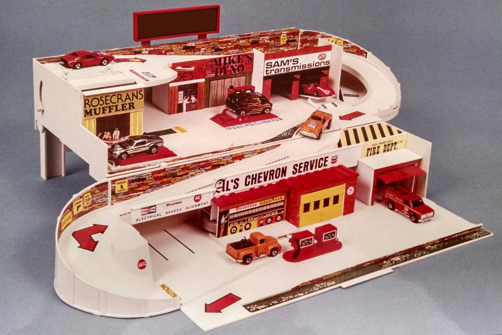

As the team demoed, they walked through its unique design and encasement. As management's eyes glazed over in its engineering, they looked for the bait and switch. Legend has it that the car was carefully placed on the roof and raced down the track: the bell rang (ding-ding), and there was a long pause. Everyone looked up from the car and toward Ray. He stared… then smiled widely and said (something like), the bell was a *twenty dollar* if he ever heard one.

Even if said differently (no printed quote exists), the point was clear - he believed in making the idea work above a max accessory cost limit. Soon after, Ray thought the toy could fly off the shelf (ding-ding) at twice the speed and announced a "double tool" in anticipation of significant sales. That action alone confirmed statements to target above its set accessory threshold. Ray performed in a challenger spirit, confidently walking down the car show row.

](images/69-21.png)

With Ray delighted, the new Sto & Go moved from idea to project, sprinting through the remaining process, and a patent disclosure began. On the patent -Bill Kelley and Phil Crane - prelim designers working with Gene, brought it to Mattel's engineering department for production crafting. It was set for scaled production planning next.

While I couldn't confirm who said *Sto & Go* first, it is believed that someone in marketing or visual design was its source. And with the accessory labeled, the name lives through the generations - kick-starting future kids playing with these everywhere. Over friends' houses, at the pediatricians, schools, and toy bins, but with little mention in history.

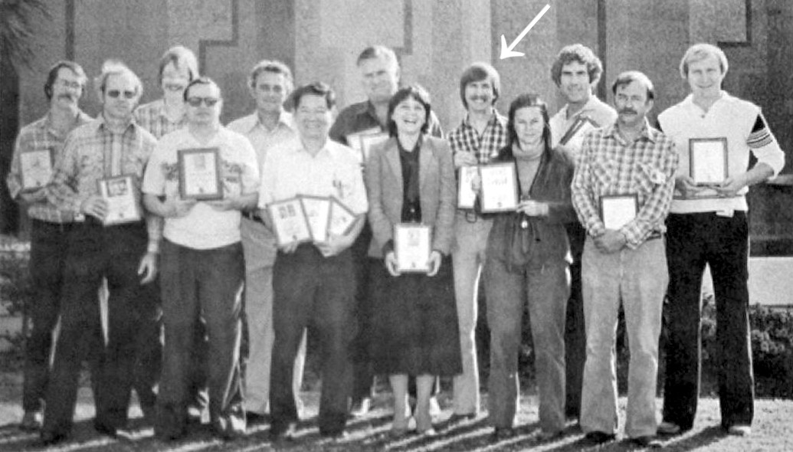

Like other automotive firsts such as the mid-engine GT40, carbon fiber applique, and [paddle shifters](https://www.evropublishing.com/en-us/products/the-perfect-car-the-story-of-john-barnard-motorsport-s-most-creative-designer) from Ferrari, the Sto & Go is the world's first production monocoque-unibody plastic chassis playset. Only at Mattel could this have happened in the late 1970s, with its push-pull and Gene honoring its warranty throughout.

---

*The Sto & Go could be considered a Hot Wheels Dreamhouse. When described this way to adults, an universal understanding is forged throughout. This is the world's first storied carhouse that stores and travels. Barbie renovated her [Dreamhouse](https://www.nytimes.com/2022/12/14/style/barbie-dreamhouse-history-six-decades.html) with similar materials, from cardboard to plastics (1962–1980), but that invention differs.*

*At about the same time of the Sto & Go release, a German toy manufacturer named AK Stelco released a similar one-level design in Europe. Using Shell gas station deco, rare auctions of the toy can be found on-line. Its story of how it was produced (and if it was authorized by Mattel) is unknown.*

---

## Lathing the Triple Cylinder Sto & Go's

**WHAT DEVELOPED WITHIN** the creative prelim engine is a kid-powered smooth manual transmission playset that deserves a look not found on the Internet (and I did look everywhere). Typical in these creative stories, engineers are hard to find. So with the impulse to discover its construction, I sent enquiring emails to those collectors celebrated in books.

[Bruce Pascal](https://www.instagram.com/pinkbeachbomb), who owns the [most valuable Hot Wheels](https://www.hotcars.com/most-expensive-hot-wheels-cars/#1969-pink-vw-beach-bomb), answered my call. "*Who are the people?*" I asked. He pointed me in the right direction, which led to its engineering. [Derek Gable](https://easyreadernews.com/fun-at-work-former-mattel-designer-derek-gable-is-being-honored-for-teaching-kids-that-fun-at-work-is-part-of-the-job/) (Gene's peer at the time of this story) placed me on deep email exchanges with notable people, with [Mike McKittrick](https://www.mckittrickdesign.com/About/) stepping forward in the conversation.

 / [Twitter](https://twitter.com/Nostalgiapix25/status/1564763226360905731) / [Alternative](https://www.battlegrip.com/1982-hot-wheels-service-center-advertisement/)](images/69-23.jpeg)

Mike worked as a project engineer at Mattel on the Sto & Go [Service Center](https://serpentorslair.com/the-pop-expose-my-first-hot-wheels-playset-story-by-mitchell-smith/), City, and Construction Site for three years. He is unique in this story because Mike is an industrial design artist seeing it all the way through on the shop floor three times over (other lanes to this story remain undiscovered!).

As we pick up from the model delivered to engineering, sales, and marketing filled its orders. Mike and others engineered the Sto & Go shaping the preliminary ideas into production reality. Mike worked on vellum diagrams to send to its tooling department (for injection molding), crafted the associated mechanisms, managed fit, materials used, and safety. He planned elements that created the consumer product we know as the original Sto & Go line.

 was prevalent. Service Center case tool molding and layout sketches.](images/69-24.jpeg)

Mike shared his passion for Service Center #1503. He explained the challenges of crafting the toy's mechanical elements, sturdiness, and care to tolerances to its [living hinges](https://en.wikipedia.org/wiki/Living_hinge). I also learned his manager, Bill Hart, within its Preschool group, was assigned the out-of-lane project recognized for his love of solving challenging mechanical problems.

Admitted by Mike, his manager went on to save the product from cancellation by maximizing tool reuse due to its significant amount of plastic, confident the platform would succeed (*engineering heroics are a staple in every industry, and I loved hearing this from Mike that a **manager** performed*).

Weighing in over three pounds of high-impact polystyrene and polypropylene, Sto & Go proved challenging to balance the amount of new-age plastic and an engineering cost limit, critical for toy making ([ABS](https://en.wikipedia.org/wiki/Acrylonitrile_butadiene_styrene) plastic was absent in the product as it was too expensive).

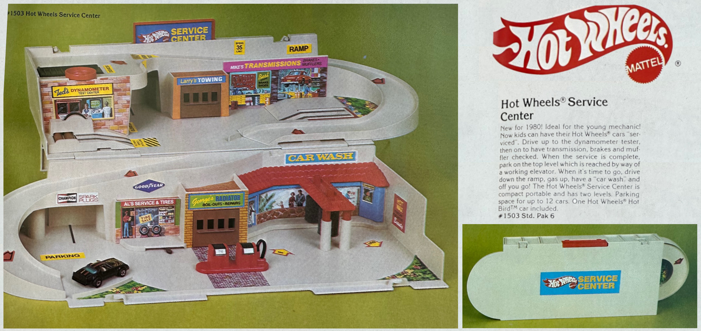

While the prelim department delivered a great prototype, the Sto & Go needed "on-brand" changes. Arvin Carlson's team led visual design adjustments to improve its playable theme to make buildings "real" and the play fun. A carwash was added, its elevator turned to an easy-to-turn wheel, and garages moved. [Larry Wood](https://hotwheels.fandom.com/wiki/Larry_Wood) (a part of visual design) inked its beloved production stickers, rearranging the original prototype names as Mike sweated the details on the car wash foam placements.

In a funny aside, the decal that says "Mike's Transmissions" was an inside joke about the gearbox woes of Mike's British [TR6](https://en.wikipedia.org/wiki/Triumph_TR6) roadster (perhaps he should own a Hot Wheels instead). The remaining shops were named after contributors to the project, Mr. Hot Wheels included.

. [Jason Hervey](https://www.imdb.com/name/nm0381155/) was in its [TV commercial](https://www.youtube.com/watch?v=RPeC55RV5wM). Did you know the filming took place in the [house](https://www.imdb.com/title/tt0075500/) that gave the [Karate Kid](https://www.imdb.com/name/nm0001494/) his future break?](images/69-26.gif)

Fitting to the context, this was all happening during the 1979 [oil crisis](https://en.wikipedia.org/wiki/1979_oil_crisis). Mike remembered luring creative feedback at his drafting board. He formed a long line of cars down the hall at Mattel, waiting at the incomplete Service Center for pretend gas. Although hydrocarbons were rationed outside, the Sto & Go iconic bell rang at his prototype, and conversations flowed inside (perhaps Mike was checking *department* plates?).

-unique briefcase latch design.](images/69-27.gif)

More calibrations were applied through his creative idea-gouging techniques of cost engineering. This toy was not seen in history, but he and the team were working on it, finding the friction point between throttling costs while keeping play value high.

With the engineering drawings complete, next came the heel-and-toe with tooling under Frank Sesto's group. [Otto Kuhni](https://www.hotwheelsonline.com/otto-kuhni.html) developed the box print proof with a recognizable white/black/blue diagram on the back. Then the production-ready Service Center design went "in line" with operations for manufacturing and boxing. Out it went for holiday 1980.

](images/69-28.jpeg)

Following, the demo cranked once again with prelim designer Dietmar Nagel. He and others developed the next concept, incrementing off the Service Center, duly receiving management signoff from start to finish-as orders were sourced. With the chassis flexibly accommodating, a new world was crafted on this first space shuttle of a toy.

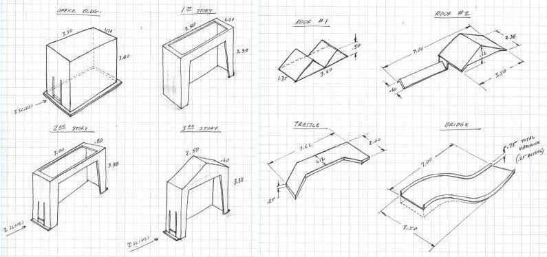

Once over to engineering, Mike worked on the beloved City #3324 playset by designing memorable telescopic buildings and a plastic-saving living hinge car elevator. He reflected on improvements to its platform legs, a critical component of the playset, which was re-engineered to stay put correctly. Those designs also went to production, with a target of holiday 1981.

Sto & Go vintage car elevator layout sketch made out of a single piece of polypropylene.Mattel's third and Mike's last project on the line was Construction Site #4100. He mentioned the creative fusion with new prelim designer [Keith Hippely](https://hotwheels.fandom.com/wiki/Keith_Hippely). Mike recalled being a genuine cost engineer on that project by saying "no" - nixing expensive toy features. Keith got the kid-powered crane, though. The crane and its associated elements were a challenge for Mike, which took creative jigsawing to ensure the box closed correctly.

The Construction Site was the pinnacle of this 80s monorail ship and most memorable due to its fantastic play value. Like the Service Center, the stickers were ratcheted by design, immortalizing Mike (*McKittrick - Welding*), Keith (*K. Hippely - Manager*), and Phil Crane (*Phil's Crane Co.*), hoisting them into toy history on the third iteration. The Construction Site playset was released in 1983 (Oh, and *[Ellis Iron Works](https://www.facebook.com/thetoysthatmadeus/photos/behind-the-scenes-of-our-interview-with-mark-ellis-one-of-the-mattel-marketing-m/395841204208598/)* too).

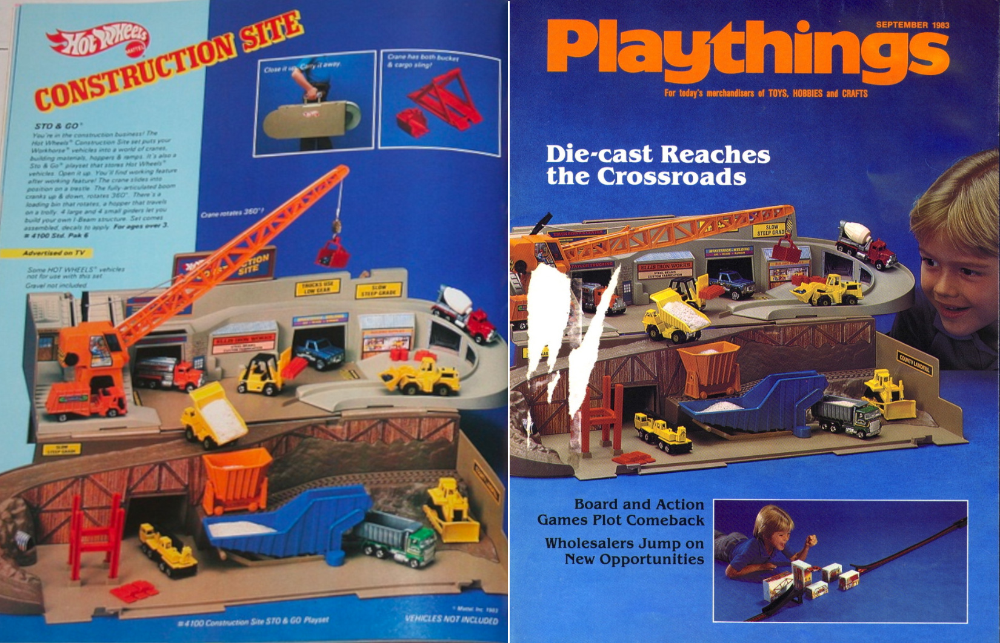

Other car accessories went out later, such as [Action Command #9250](https://www.vault1541.com/2020/05/youtube-hot-wheels-action-command-sto.html) (1985), the refreshed and reimagined [Car Wash and Service Center #3342](https://www.youtube.com/watch?v=AYsbRD8B-oM) (1987), and Alpine Adventure #4451 (1988). A long line of products shipped years after the original team moved on to other projects.

In all, they pushed the pedal to the floor with an entire railroad and pop-up line, and then into the 1990s with new Sto & Go playsets. While there are no official sales numbers publicly available, it's clear with the convoy of toys that millions of units were produced and sold over the years, impacting the lives of millions more in one complete generation.

 to leave the station. Phil Crane is credited for keeping the toy line visually appealing throughout its original run.](images/69-31.gif)

---

*After the success of the first Sto & Go's (among other [famous lines](https://en.wikipedia.org/wiki/The_Toys_That_Made_Us)), the prelim group was reorganized when [Ray Wagner exited](https://www.nytimes.com/1984/12/03/business/business-people-hasbro-bradley-hires-ex-president-of-mattel.html) in the early eighties. For those that participated during this era, it was described as a time of pure magic. The Sto & Go was a cultural touchstone artifact from such an environment.*

*American companies (and software successors) have churned to recreate the mystique of (what I'll mend from [Jackie Stewart](https://en.wikipedia.org/wiki/Jackie_Stewart)) "[creative empathy](https://www.linkedin.com/pulse/tech-concept-day-mechanical-sympathy-ankit-gaur/)" for artists, engineers, and inventors in various protective environment formulations - with no guarantee of success against stressors of marketing and sales. But when they all delivered big, the side effects were culturally historical.*

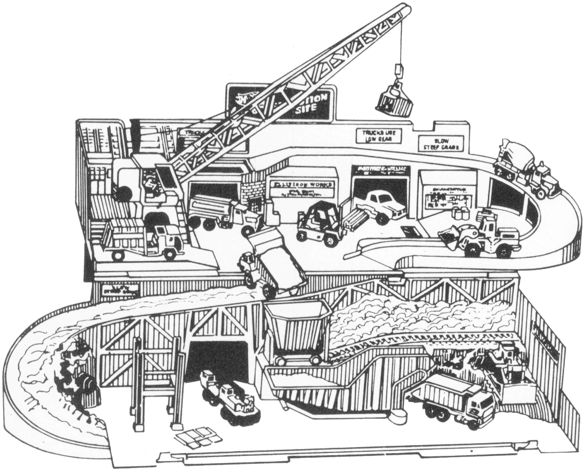
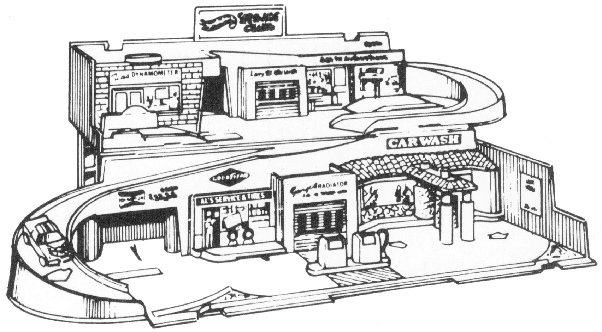
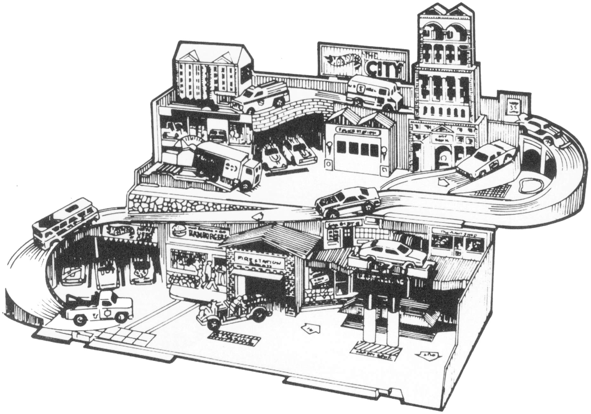

This concept is inextricably linked to people who courageously defend an idea within-from American firsts recorded by [Menlo Park](https://www.nps.gov/edis/index.htm) to the toy manufacturing vision founded by Elliot and Ruth.*

---

## The Emotive Living Hinge Car Elevator

**HOT WHEELS CONTINUES ITS PLEASURE CRUISE** celebrating 55 years of toy-making this year. Kids like my son, who are car-seated from 3 to 103, love this stuff. The *Hot Rod* brand remains the [global top-selling unit](https://corporate.mattel.com/news/barbie-named-2021-top-global-toy-property-of-the-year-per-npd), and Ted Wu, VP, Global Head of Design for Vehicles at Mattel, reports [tracking over one billion dollars](https://www.youtube.com/watch?v=I8JD776WwhU) in gross global sales in 2022.

The Sto & Go is a sleeper technical hit at Mattel that deserved its registration renewal. As I understood from these professional toy makers, the long-cased Sto & Go was a top-trim line that sold well for years, was considered inventive by even those who worked on it, and seatbelted people like me (and maybe you) into Hot Wheels forever.

](images/69-33.jpeg)

The Sto & Go remains a principal epochal design unmatched *at its scale* a half-century later. It is a testament to getting ahead of a shifting technological play market, forging new affordable materials, and applying realistic visual design. As a parent, I have not encountered a toy of a similar make and model - a successor has yet to advance its plastic craft for children to adults.

The best part of the story? In the 21st century, it's available as a retro toy for purchase today. Its bell is reversed on the new sets, perhaps a nod to today's online delivery platforms. As your child speeds down the next ramp, another car drives to *their* favorite greasy spoon (ding-ding!), picking up cheeseburgers for delivery.

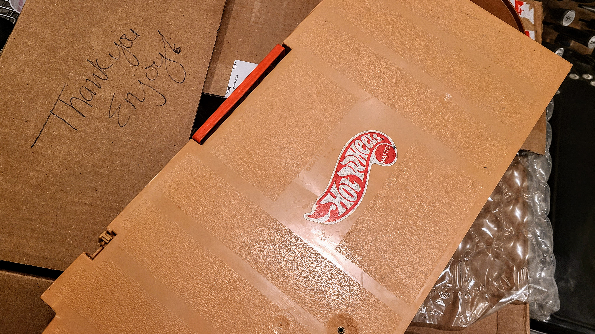

While my plastic-obsessed research took a scenic pitstop (and I'll never hear the bell the same way again), I had an urge. As I packed away my son's Sto & Go Ultra Hots, why not buy my old one on eBay? So I did. When it arrived a few days later, even the beige cardboard box greeted me. When the note "*Thank you - Enjoy!*" appeared, I cried happily without my spouse seeing me break down on the side of the road.

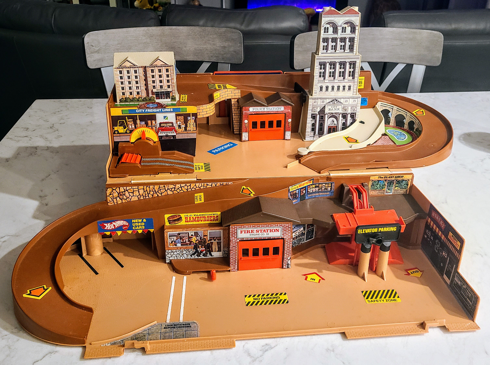

And I did, unstowing car-thatic tears of joy. Unhinging the toy for the first time in thirty-five years was an experience of overpowering emotion. That is the core toymaking target, crafting a passenger for life who smiles in the fumes of sweet polystyrene, [ZAMAC](https://hotwheels.fandom.com/wiki/ZAMAC), and overcoated enamel.

So as I unpacked this Sto & Go, I took out my few remaining diecast cars that didn't meet my Grandfather's hammer and vise. I played with the toy like a child and elevated to *The Plant Shop* as my son dreamed into his Hot Wheels.

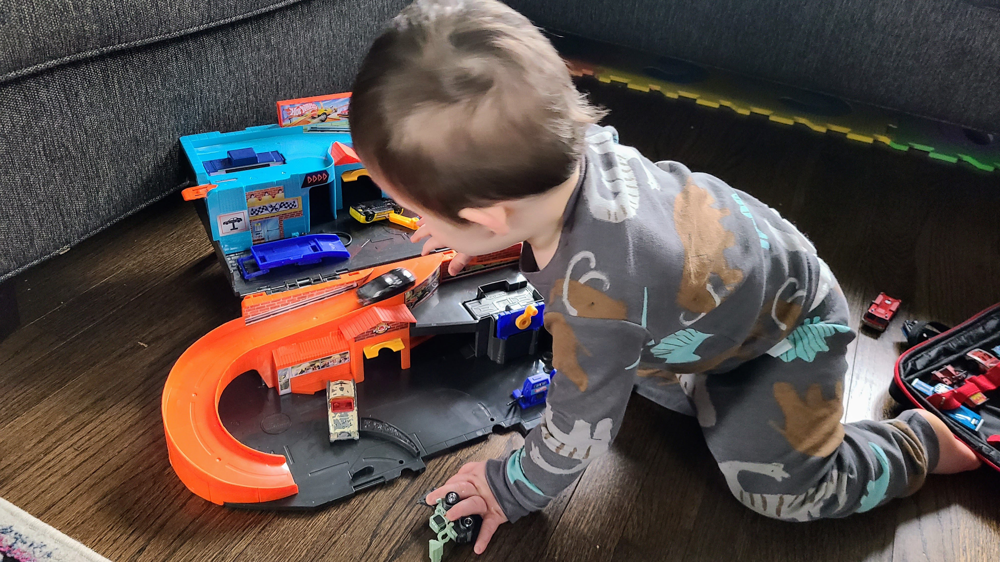

As we drive into the sunset with our [Alpha Generation](https://en.wikipedia.org/wiki/Generation_Alpha) racing their fantastic Hot Wheels on the walls, what's left to say? The Sto & Go is [a toy that drove us](https://screenrant.com/the-toys-that-made-us-toys-want-see-not-see/#we-d-like-hot-wheels). 🏁

---

*Editors note: This story's perspectives remain incomplete. If you have contributed to this fantastic American toy project, contact me or leave a comment below.*

## Social Post

Remember the Hot Wheels Sto & Go playset? It's likely if you were born between 1970 and 1990. This #nostalgic post celebrates its never before told originating #story, sharing past and present work by #Mattel and the people behind it.

[medium](https://medium.com/@solidi/the-toys-that-made-us-the-first-hot-wheels-sto-go-playset-2f051fbd33c3)

Thanks to Mike McKittrick, Derek Gable, Bruce Pascal, and many others.

#HotWheels, #HotWheelsServiceCenter, #80s, #80stoys, #80skid, #80smemories, #toys #retrotoys #people #work #craft
