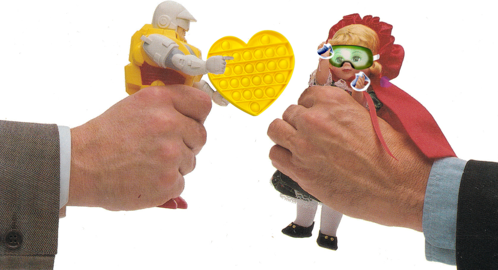

# Memorable Moments in Future Toyland
## Extending the Historical Appendix from the 1990 Book
#Toys, #Books, #Industry, #History, #Consumerism



The book [*Toyland: High-Stakes Game of the Toy Industry*](https://peopleofplay.com/blog/toyland-the-high-stakes-game-of-the-toy-industry) provides fascinating insights into the golden era of toy making. The authors, Stern and Schoenhaus, generously compiled a looking glass of determined business people, the veracious trade, and the insight into developing Tyco's [Dino-Riders](https://en.wikipedia.org/wiki/Dino-Riders) at the height of the 1980s [deregulated](https://www.nytimes.com/1981/10/01/arts/ftc-drops-consideration-of-rule-on-children-s-tv-ads.html) US market.

Toyland captures an advanced industry of yesteryear. At a time before 3D printing and deep Hollywood partnerships, today's impressionable manufacturers admire the late personalities who forged modern toy-making craft. In this century, the industry is supported by high-budget entertainment, an adaptation to keep the business rolling strong.

## Memorable Moments in Toyland

Toyland reveals the story behind the emerging modern toy industry. For a summary at a glance, Stern and Schoenhaus's book contained an appendix titled "Memorable Moments in Toyland." Their list follows.

```
1902 - [Clifford Berryman](https://en.wikipedia.org/wiki/Clifford_K._Berryman) cartoon of Teddy Roosevelt and bear captivates the nation. Ideal's owner [secures permission](https://www.nps.gov/thrb/learn/historyculture/storyofteddybear.htm) to name the teddy bear.
1916 - A. C. Gilbert and others form the first industry association, [Toy Manufacturers of the United States of America](https://toytales.ca/the-toy-manufacturers-of-the-u-s-a).
1917 - First toy industry lobbying expedition saves Christmas for American children.
1921 - Louis Marx and his brother start their own toy business.
1923 - Herman, Henry, and Hillel Hassenfeld form Hassenfeld Brothers.
1934-1939 - In spite of the Depression, Ideal sells 1.5 million Shirley Temple dolls. Handcar with [Mickey and Minnie Mouse](https://d23.com/d23-gold-member-exclusive-disneys-mickey-mouse-minnie-mouse-handcar-pre-sale-by-lionel/) saves Lionel. Monopoly saves Parker Brothers. View-Master 3D Viewer is introduced at the 1939 World's Fair in New York.
1945 - The Handlers form Mattel. [Slinky](https://www.museumofplay.org/toys/slinky/) starts walking down stairs.
1952 - Hassenfeld Brothers advertises first toy, [Mr. Potato Head](https://en.wikipedia.org/wiki/Mr._Potato_Head), on local television.
1955 - Time magazine [features](https://time.com/vault/issue/1955-12-12/page/1/) Louis Marx, "Toy King," in cover story. Mattel becomes first toy manufacturer to [advertise on national television](https://corporate.mattel.com/history). The appearence of its Burp Gun on "The Mickey Mouse Club" launches the promotional toy business.
1956 - Charles Lazarus forms first Children's Super-market, the predecessor of Toys 'R' Us.
1958 - Biggest fad in Toyland history, Hula Hoops sweep the world. Biggest flop in Toyland history, [Christ Child](https://www.weirduniverse.net/blog/comments/baby_jesus_doll) dolls do not enchant the public.
1959 - Barbie is born.
1960 - Etch A Sketch appears.
1961 - First guidelines on TV toy advertising promulgated by the National Association of Broadcasters.
1964 - G.I. Joe marches forward.
1966 - [Twister](https://en.wikipedia.org/wiki/Twister_(game)) ties up the nation.
1969 - [Child Protection and Toy Safety Act](https://www.cpsc.gov/s3fs-public/pdfs/blk_media_cspa.pdf) sweeps through Congress, enabling the FDA to regulate toy safety and ban unsafe toys. Mattel creates television program based on Hot Wheels line of die-cast cars. FCC disallows it, deeming it a "program-length commercial."
1972 - Consumer Product Safety Act establishes the Consumer Protection Safety Commission, which will regulate toy safety instead of FDA.
1973 - [Baby Alive](https://www.fabtintoys.com/baby-alive/) eats-and digests-solids.
1976 - Hand-held electronic games boom begins.
1977 - Star Wars toys' I.O.U.s sell out at Christmas.
1978 - [FTC hearings](https://www.washingtonpost.com/archive/business/1978/02/25/ban-on-tv-ads-to-children-is-proposed/3c1767d3-966d-43d6-96e7-64bb201bbf81/) on television advertising to children.
1980 - Strawberry Shortcake launches licensing boom.
1982 - Video game boom.
1983 - "He-Man and Masters of the Universe" television show launches toy-based program boom. Cabbage Patch Kids create riots. Doll appears on Newsweek cover. Video game bust.
1984 - Hasbro buys Milton Bradley. Trivial Pursuit sales stun industry. Transformable robots boom.
1985 - Worlds of Wonder is founded and produces the hottest Christmas toy, [Teddy Ruxpin](https://en.wikipedia.org/wiki/Teddy_Ruxpin).
1987 - Worlds of Wonder goes bankrupt. Tonka buys Kenner Parker.
1988 - Coleco goes [bankrupt](https://www.latimes.com/archives/la-xpm-1988-07-12-mn-5746-story.html).
1989 - Hasbro [buys](https://www.nytimes.com/1989/07/13/business/company-news-hasbro-s-purchase-of-coleco-s-assets.html) Coleco's assets, including Cabbage Patch Kids. Second video game boom, led by Nintendo.
1990 - *Toyland*, the book, tells all (Almost.)
```

If there is one person's extraordinary impact in the story, it would be [Bernard Loomis](https://www.rebelscum.com/loomis.asp) ("Bernie"). In the second half of the 20th century, the toy industry credits Bernie, who promoted the concept of the expanding toy line and coined the term "toyetic," the natural ability for a property to expand into successful product lines. He learned the craft at Mattel for eleven years, connecting the first major buyer to Hot Wheels by selling fifty million units before exiting to Kenner.

Bernie and associates led successful firsts - marrying media TV to toys in the heat of Hot Wheels success (1969), an iconic movie toy line (Star Wars, 1977), and newfound licensing (Strawberry Shortcake and Care Bears, 1980, 1983). Bernie avoided "driving by looking in the [rear-view mirror](https://www.latimes.com/archives/la-xpm-1985-10-14-fi-14807-story.html)," instead making decisions by instinct. He consulted throughout the industry, reinforcing expandable collectability, and trained upcoming professionals paving the way for the 21st century.

## Addendum to Toyetic Appendix

While kids binge on digital streams and live in virtual worlds, a single-conscious TV promotional world [is of the past](https://mindmatters.ai/2018/09/children-are-watching-much-less-tv/). Commercials [were an invention of this industry](https://www.theatlantic.com/magazine/archive/1986/10/where-toys-come-from/306213/), detailed by essayist David Owen. Children today have endless choices. They consume digital streams or participate in worlds (Minecraft, Roblox) with others on information-age devices.

Since Toyland's release thirty-five years ago, a gap exists in its epilogue. So, a curated physical toy appendix follows. It focuses on North American-headquartered toy manufacturing entities in the spirit of the author's intent.

```
1989 - Tyco acquires [Ideal/View Master](https://www.nytimes.com/1989/07/13/business/company-news-hasbro-s-purchase-of-coleco-s-assets.html).
1990 - Playmates Teenage Mutant Ninja Turtles (TMNT) success from a modern comic book.
1991 - [Rack toy](https://nacellestore.com/products/rack-toys-second-edition) company, Larami, launches Super Soakers. Hasbro [acquires](https://www.nytimes.com/1991/02/01/business/tonka-accepts-offer-from-hasbro.html) Tonka, Kenner Toys and Parker Brothers Games. Lionel Lesiure [goes bankrupt](https://www.nytimes.com/1993/06/03/business/company-news-lionel-will-liquidate-closing-kiddie-city-toy-chain.html), closes.
1992 - K'NEX invented. Child World [goes bankrupt](https://www.nytimes.com/1992/05/08/business/company-news-child-world-files-for-bankruptcy.html), closes.
1993 - Mattel [acquires](https://www.nytimes.com/1993/08/20/business/fisher-price-to-be-bought-by-mattel.html) Fisher-Price. Beanie Babies are born and adopted. Barney craze.
1994 - Mattel completes aquisition of [Kransco](https://www.upi.com/Archives/1994/05/31/Mattel-completes-Kransco-acquisition/7630770356800/) (Scrabble). Spin Master founded. Child Safety Protection Act ("[CSPA](https://www.cpsc.gov/s3fs-public/pdfs/blk_media_cspa.pdf)") enacted, updated choking hazard guidelines.
1995 - Early entertainment boom. Hasbro partners with [Dreamworks](https://www.nytimes.com/1995/08/17/business/hasbro-and-dreamworks-join-to-wed-entertainment-and-toys.html). JAKKS Pacific founded. Pokemon cards and Power Rangers introduced. Toy Story debuts, first animated movie of vintage toys.
1996 - LEGO first to promote on Internet. Hasbro [repels](https://www.nytimes.com/1996/01/25/business/mattel-seeks-hasbro-but-is-rebuffed.html) buy-out from Mattel. [Tickle Me Elmo](https://uproxx.com/life/tickle-me-elmo-craze-history/) crazy reaches Cabbage Patch doll insanity. Elmo appears in same spot in 2008, 2011, and 2013.
1997 - Mattel acquires [Tyco, Matchbox](https://www.nytimes.com/1997/03/21/business/ftc-approves-mattel-s-purchase-of-tyco-toys.html). Tamagotchi, first digital pets craze.
1998 - First toys inducted into [Toy Hall of Fame](https://en.wikipedia.org/wiki/National_Toy_Hall_of_Fame). Mattels acquires [Bluebird Toys](https://www.nytimes.com/1998/03/31/business/company-news-mattel-bids-for-bluebird-toys-maker-of-etch-a-sketch.html) (Polly Pocket). Hasbro acquires [Galoob](https://www.latimes.com/archives/la-xpm-1998-sep-29-fi-27432-story.html) (Micro Machines), OddzOn (Koosh  balls). Furby arrives. Children's Online Privacy Protection (COPPA) [law enacted](https://www.ftc.gov/legal-library/browse/rules/childrens-online-privacy-protection-rule-coppa).
1999 - Toys 'R' Us is no longer the [retail leader](https://apnews.com/article/6e6082b522082a0d782052046c75b0b2), Wal-Mart takes reigns. Pokemon appears on *Time* [magazine](https://time.com/vault/issue/1999-11-22/page/1/). Hasbro acquires Wizards of the Coast (Magic: The Gathering). Furby considered a national security threat.
2000 - Learning tech toy boom. LeapPad sells. Start Razor inline scooter trend.
2001 - [Bratz](https://www.newyorker.com/magazine/2006/12/04/little-hotties) released by MGA Entertainment, rivals Mattel products for numerous years.
2002 - JAKKS Pacific [rises as number 3](https://www.ourmidland.com/news/article/Jakks-Rises-to-No-3-in-Toy-Industry-7151908.php) mutli-brand toy manufacturer.
2003 - Nickelodeon's SpongeBob peak. LEGO close to [bankruptcy](https://knowledge.wharton.upenn.edu/article/innovation-almost-bankrupted-lego-until-it-rebuilt-with-a-better-blueprint/). F.A.O. Schwarz [goes bankrupt](https://www.nytimes.com/2003/12/03/business/fao-to-file-for-bankruptcy-and-break-up-toy-empire.html).
2005 - Learning tech toy bust. Toys 'R' Us fails, agrees to buyout by [Bain Capital](https://www.nytimes.com/2003/12/03/business/fao-to-file-for-bankruptcy-and-break-up-toy-empire.html). Hasbro first to launch [direct to consumer](https://hasbropulse.com/) (DTC) purchases.
2006 - MGA Entertainment acquires [Little Tikes](https://www.dailynews.com/2006/09/12/mga-expands-with-little-tikes/).
2007 - Major entertainment boom. Nintendo Wii becomes top selling video gaming unit for families. TMNT reboot. Hasbro smashes records with Transformers movie.
2008 - [KB Toys](https://www.nbcnews.com/id/wbna28179348) goes bankrupt, closes.
2009 - Disney [buys](https://www.nytimes.com/2009/09/01/business/media/01disney.html) Marvel, starts major movie/product phases. Toys 'R' Us acquires [F.A.O. Schwarz](https://www.nbcnews.com/id/wbna30976981). Consumer Product Safety Improvement Act ("[CPSIA](https://en.wikipedia.org/wiki/Consumer_Product_Safety_Improvement_Act)") enactes toughest toy safety label standards to date. Mattel launches their [DTC](https://www.reuters.com/article/businesspro-us-mattel-interview-idUKTRE59K6CY20091021) option.
2010 - Century old [Playthings](https://en.wikipedia.org/wiki/Playthings_(magazine)) trade magazine issues final publication.
2011 - Mattel acquires rights to [Thomas & Friends](https://www.businesswire.com/news/home/20111024005460/en/Mattel-Announces-Acquisition-of-HIT-Entertainment). Funko vinyl culture collectibles debut.
2012 - Hasbro relaunches Furby.
2013 - Entertainment boom continues. Disney launches successful Frozen toys.
2014 - LEGO boom begins with its movie, now [number one toy company](https://money.cnn.com/2014/09/04/news/companies/lego-biggest-toymaker/index.html). Mattel acquires [MEGA Brands](https://www.businesswire.com/news/home/20140430006967/en/Mattel-Completes-Acquisition-of-MEGA-Brands). Kinetic Sand launch.
2015 - [The Strong](https://www.museumofplay.org/) National Toy Museum expands. First conected artifical intelligent Hello Barbie launched. F.A.O. Schwarz [closes](https://www.nytimes.com/2015/05/16/nyregion/f-a-o-schwarz-to-close-its-doors-on-fifth-avenue.html) flagship store.
2016 - VTech [acquires](https://www.vtech.com/en/press_release/2016/vtech-completes-acquisition-leapfrog/) LeapFrog. MGA Entertainment launches successful L.O.L. Surprise, as online unboxing videos reach height for children.
2017 - Fidget toy boom. Mattel [repels](https://www.reuters.com/article/us-mattel-m-a-hasbro-exclusive/exclusive-mattel-snubs-hasbros-latest-acquisition-approach-sources-idUSKBN1DF32W) [bid](https://www.nytimes.com/2017/11/10/business/dealbook/hasbro-mattel-bid.html) from Hasbro.
2018 - Toys 'R' Us [closes its doors](https://www.theatlantic.com/magazine/archive/2018/07/toys-r-us-bankruptcy-private-equity/561758/), ending the era of warehouse styled shopping.
2020 - Pandemic drives [record sales](https://www.cnbc.com/2021/01/25/us-toy-sales-surged-16percent-in-2020.html) for toy manufacturers, outdoor toys boom. Roblox and Minecraft peaks. Hasbro relaunches Micro Machines. Baby Yoda toy craze generated by a streaming service (Disney+).
2021 - Spin Master acquisitions continue, acquires [Rubik's Cube](https://www.forbes.com/sites/joanverdon/2020/11/15/rubiks-cube-and-spin-master-a-50-million-deal-with-endless-possibilities/). Tens of billions of dollars spent on a [half-century](https://www.bbc.com/news/business-58408570) old idea, [Pop-It!](https://en.wikipedia.org/wiki/Pop_it) like sensory toys.
2022 - "Kidults" drive [toy purchases](https://www.cnbc.com/2022/12/19/kidults-biggest-sales-driver-toy-industry.html), retro and collector lines increase volume. Mattel adds direct to consumer option.
2023 - Mattel debuts Barbie movie in her 64th year. Global toy business industry valued at [152.41 billion dollars](https://www.globenewswire.com/news-release/2023/06/06/2682858/28124/en/Global-Toy-Market-Factbook-Report-2023-A-152-Billion-Industry-by-2028-Historical-Data-Forecasts-2018-2022-2024-2028-with-2023-as-the-Base-Year.html).
```

The exponential threads of Toyland have exploded since the book was written. For example, the choice to play differently branched as the book was published during the "second video gaming boom," led by Nintendo, never letting up. Kid digital game media has become [something of its own](https://en.wikipedia.org/wiki/Console_Wars_(book)).

In the mid-1990s, deeper ties were established to the big screen between the partnership of [Hasbro and Dreamworks](https://www.nytimes.com/1995/08/17/business/hasbro-and-dreamworks-join-to-wed-entertainment-and-toys.html), signaling the dawn of entertainment-first toy-making. Storytelling core brands are critical intellectual property in maturing multimedia entertainment of the 21st century.

Surprisingly, patterns pioneered by Bernie Loomis remain, with teams of people achieving greatness, making Mr. Loomis's [impact unique](https://www.kennercollector.com/2011/03/interview-with-bernard-bernie-loomis-president-of-kenner/). Since his exit, movie promotion (streaming, too) tie-ins have followed the vision of expandable toy lines of perennial brands, offering rebooted retro and collector toylines for children who refuse to grow up.

## Virtual Warehouses Sell Children's Toys and Entertainment

What remains is a toy industry reinventing itself through numerous booms and busts. Each merger and acquisition has consolidated the toy industry, making many companies "multi-brands." For those high-impulse, low-cost toys play a saturated role. The fidget and sensory toy boom has been a significant trend.

The signal of the faulting physical toy warehouse began in the 2000s. Once it gave out in 2018, many walked through a Toys 'R' Us for "one last time," acknowledging how extraordinarily iconic it was to a generation. Now, adults buy children's toys and entertainment prominently housed in virtual equivalents with expanding direct-to-consumer options from manufacturers.

The new leader, LEGO, dominates sales. It is a five-way paradoxical toy line containing both imaginative (build anything) and specific (license anything), supports high tactile play patterns, and targets legions of AFOLs (adult fans of LEGO) with premium products. Flush with movie and game tie-in successes, their fifth is in their name - "Play well" in Danish, "Put together" in Latin, and "Eventually first in the post-modern toy industry" in English.

*Should I read Toyland?* Yes, it's a wide angle on how an industry operated, and it is the best historical read in a chaotic industry at the end of the golden era. While the people and places visited have changed, toys have found a way to thrive. Whether at the big box store, online, or on a theatrical streaming service- these dream makers aim to mint new memorable moments, even if they sometimes generate their own.

## Social Post

Following my #historical fascination with the #toy #industry, I wrote up an appended memorable moments list from the fantastic #book "Toyland: The High Stakes of the Toy Industry." (1990). Enjoy!

[medium](https://medium.com/@solidi/memorable-moments-in-future-toyland-b919fdcbcba6)
