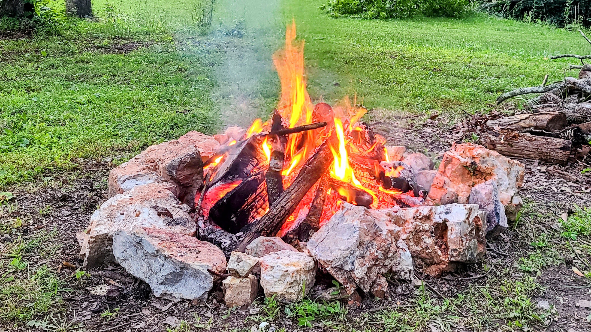

# When to Take a Vacation

As the months flew by, our family's needs became routine. Rituals of [lifeworks](https://medium.com/@solidi/the-world-i-worked-into-no-longer-exists-732659963058) seeped into everyday activities. Trepidations dulled our minds, transforming positive attitudes into resistance. Becoming irritable without knowing, we scoffed at the upcoming travel.

Apprehension set in when we prepared for leisure. Reaching our destination, we slowly uncovered devotion to family. We enjoyed the time together, creating new memories with those we love. And for a brief moment, we had become the doyen of us.

When we returned, the new routine gave way to old conventions. Our home encouraged commonplace activities. But the newly minted halcyon memories were admired, the crisp pictures we shared, and one or two newfound habits changed us forever.

There are opinions on when to take a [vacation](https://dev.to/solidi/10-self-care-tips-for-a-great-vacation-2jgp). If reading this far, we are reminded it's time to take one more.
