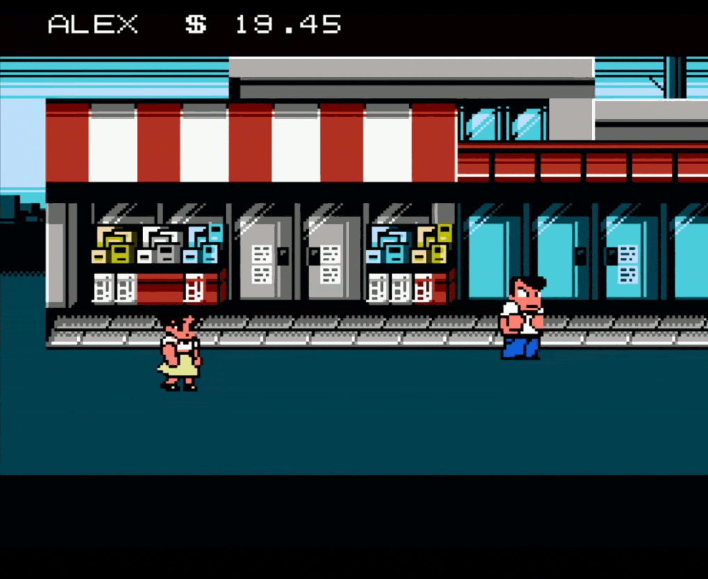

### Video Game Review
# River City Ransom is the Best Beat' Em Up Video Game of All Time
## A Quirky Street Fight on the Mean NES Streets
#Gaming, #Nostalgia, #Nintendo, #Satire, #VideoGameHistory

[River City Ransom](https://en.wikipedia.org/wiki/River_City_Ransom) for the Nintendo Entertainment System (NES) is the best brawler video game ever created. Goofy, charming, and holding up after thirty-five years, it's a genre trailblazer. Let me explain.

## Barfing While in Fight

River City Ransom (RCR) places Alex and friend Ryan on a quest to save Ryan's girlfriend, Cyndi, from Slick, an organized high school thug held up at River City High School. Pitted against rivals, the duo fights through districts, battling Slick's gangs and their commanders. But these tough guys become crying babies during fisticuffs, each losing their lunch.

Since RCR is a beat-em-up [buffet simulator](https://www.youtube.com/watch?v=KRfbnrcTxvc) with role-playing elements, Alex and Ryan collect their foes' loose change. They'll drop quarters as they complain about the wrenching pain of their pummeled stomachs.

Quirky translations like "BARF!" "Mamma" and "BIFF!!" are common responses to this couplet's tight-fisted techniques. The clean-up of the freshly chucked coin is what remains.

## The Co-op Buffet Simulator

While Alex and Ryan fight along the mean streets, they find respite in the district strip malls, spending money they pick up. They take a moment to visit the finest houses of Sushi, Tea, Burgers, Chinese, Candy, and more. Take out or dine-in, the duo buff up their stats to fight harder by participating in this indulgent gastro economy.

RCR has outstanding co-op play with options to smash a partner in the head. While Alex and Ryan grill their beef out in the alleyways and shower themselves in retail food therapy, they crave the best porcelain when dining. They *also* eat the chinaware to grow strong, increasing their potency.

## An Open World Based on Reality

RCR borrows from the reality of its creator, Yoshihisa Kishimoto, who ate lots of delicious food and brawled in his Toyko high schools. Or perhaps he, too, visited New York City in the 1970s and fought his way through the graffiti-covered subways.

Either way, RCR is a spiritual successor from other well-known works - Double Dragon (which RCR includes a cameo of the twins!), Renegade, Super Dodgeball, and other prior related kunio-kun memorabilia. Its artwork and design are unmistakably cute.

RCR is Americanized, with jeans and t-shirts as its focus. Borrowing from the cult movie classic, The Warriors, a rival gang's girlfriend, Mercy, helps the crew escape New York City back to Coney Island. One could draw a line between Mercy and Roxy, who permit information along a mad journey in their open, delicious world.

## Cheesing Their Way Through Comedic Pitfalls

While Alex and Ryan munch on the Cheese Merv at the Waterfront Mall, this food-eating contest simulator includes beating baddies with pipes, rocks, trash cans, crates, chains, and wheels. It's just missing [hockey sticks](https://medium.com/@solidi/blades-of-steel-is-the-greatest-hockey-video-game-of-all-time-9c6de5ab75ab).

To keep miscreants down, they melee over their incapacitated bodies, never to get up again. Spamming A and B buttons is a way to win in this game.

If that doesn't work, Alex and Ryan throw their rival members off a well-placed work area "holes." Simulated murder is the only way to avoid hearing such a member's beloved "BARF!" response. Frankly, both funny and horrific, this is happening in a supposed children's game. To the point, what a waste! The money from this person is now lost forever.

 tribute to River City Ransom.](images/72-09.gif)

## No Libraries, Just Expensive Books, CDs, and Toy Stores

For a game that focuses on a storyline within public education locations, where are the libraries? With no access to information, Alex and Ryan must buy knowledge instead. In toy form, to increase their perception with play. Or listen to compact discs. They read intrigue from a spy novel and relax in saunas, tending to wounds. But most importantly, they learn how to break their rival's face from an instructional book.

In RCR, Alex and Ryan will learn techniques through books to smash and slam their foes faster. Triple punch, kicks, and "Javelin Man." The problem? It's expensive, so the two must become coin herders by grinding mercilessly. Once read, the skills stick until they throw out their books and forget what they learned.

## Boots, Sauna, and a Requested Smile For This Poor Platformer

Continuing their quest of a simplistic but entertaining loop of beating baddies, collecting coins, and then buffing stats, these role-playing mechanics are supreme. Sub-bosses appear along the way. So equip the latest version of Texas Boots, and go for a sauna to freshen up. These indulgences are RCR at their finest.

Alex and Ryan have the option to request a smile. But to get to the district that offers such luxuries, good luck jumping up on boxes in the warehouse. When the duo gets airborne, they feel like large sacks of immovable food disposals.

## Dated Thinking, But Has Held Up on Retrospectives

Once Alex and Ryan destroy the boss's forces of Slick (aka Simon), Cyndi is released. The game's narrator confidently declares that she can "get back to her shopping," which is dated thinking, but if they insist, there are plenty of shops in this world.

.](images/72-13.gif)

RCR is criminally underrated as Alex and Ryan commit acts of breaking the law. This game plays well and is loved by all, spawning remakes. A user-created sequel, [River City Underground](https://store.steampowered.com/app/422810/River_City_Ransom_Underground/) and [River City Ransom Girls](https://en.wikipedia.org/wiki/River_City_Girls) are fabulous. There is even a nod from Scott Pilgrim vs. the World: The Game of Merlin's shop hidden under the Armstrong Thru-way.

While a game may take [under six minutes](https://www.youtube.com/watch?v=yxgjzwr9wcA) to defeat Simon, spend hours causing reckless endangerment. Enjoy the buffet of delicious food and the obsession to max out each of the nine stats.

So grab the smartphone to take photos of complicated sixty-six-character password save states. River City Ransom is timeless, has aged well, and is the greatest beat-em-up video game ever created.
