## On Toy History
# Push, Play, And Put 'Em Away!: The Hot Wheels Kid-Powered Trains and Planes
## Part 1: 1960s-1970s Wheels, Wings, and Electric Space Juice
#Toys, #Mattel #HotWheels, #History, #Trains

 technology. Here is the artwork of Al Andersen.](images/75-01.jpeg)

---

*This draft is part of an American Toy Anthology. For information on the upcoming publication, see this author's announcement, [Undercover Toy Stories](https://medium.com/@solidi/upcoming-book-technical-toy-stories-80d5bfbd76c0): Volume One.*

---

HOT WHEELS IS ABOUT THEIR SPEED — is about their *speed* - engineered performance encased by their futurist automotive artists. These miniature diecast cars define toy culture, invoking the gears of endless childhoods.

Surprisingly, [Mattel](https://en.wikipedia.org/wiki/Mattel), the inventor of [Hot Wheels](https://nypost.com/2018/09/26/how-hot-wheels-became-the-biggest-little-toy-car-in-the-world/) and the world's largest car manufacturer, went into the toy train and plane business numerous times since the nineteen sixties. It was a natural outcome of a successful Hot Wheels launch in 1968, which demanded the brand's expansion.

### Single Engine

This research series focuses on the people and toys behind Mattel's Hot Wheels trains and planes, targeting children above preschool age. Part one covers the mid-1960s to the late 1970s. And in this genre, there wasn't much competition.

Legacy toy companies [Ideal](https://en.wikipedia.org/wiki/Ideal_Toy_Company) and [Schaper](https://en.wikipedia.org/wiki/Schaper_Toys) were, at least in part, present. Their soon-to-be major competitor, [Hasbro](https://en.wikipedia.org/wiki/Hasbro), had no engine in the race, which preceded their avoidance of video game consoles during its boom and bust.

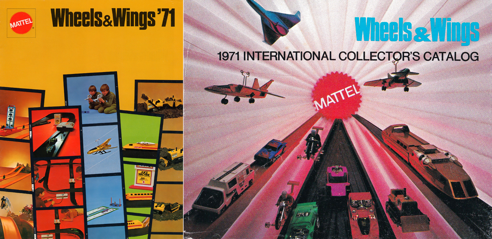

Trains were considered collector grade, where one person would buy two sets (one to tinker and one to collect), protected by advanced tooling and specialized knowledge. With the natural age of collectors in their adult years, toy trains were seen as a one-time buy for the holiday season, placed under a tree for children. Eighty percent of sets were HO scale sold by [Lionel](https://en.wikipedia.org/wiki/Lionel_Corporation).

Train toys seemed impossible to succeed at. [Tyco](http://www.tcawestern.org/tyco.htm) (formally Mantua) was the first to offer [HO-scaled prebuilt train sets](https://tycocollectors.com/history-of-tyco-toys/) in the 1940s. Their brief success would come in the 1980s, developing radical toy trains.

It seemed trains and planes at Hot Wheels were a bet Mattel would lose. They competed against companies flush with US patent protections filed by Lionel, Tyco, and [Marx](https://en.wikipedia.org/wiki/Louis_Marx_and_Company), with critical in-house know-how.

Of interest, Mattel engineered something wild, casing in rechargeable power units never before seen in toy history. This generation had no ballast, rails, or conductor hats.

## Wheels and Short-Lived Space Trains and Planes

THE STORY OF TOY TRAINS AND PLANES at Mattel has been a lock-stock, coupling adventure. Trains could not have persisted without Hot Wheels. In its first attempt, trains followed its 1970 motto, "[Go with the Winner.](https://www.greensburgdailynews.com/opinion/columns/go-with-the-winner-of-the-toy-cars-hot-wheels/article_57df8d43-0b2f-598c-8878-6519a9a50c0c.html)"

Before we get to trains and planes, we must discuss the cars that powered them.

### Elliot Gets Millions of Fantasy Race Cars

[Elliot Handler](https://en.wikipedia.org/wiki/Elliot_Handler), part founder of Mattel, had his eye on Southern California car culture in the 1960s. He developed toy car variations before his "aha" moment.

With his [Dream Car](https://hotwheels.fandom.com/wiki/Mattel_Dream_Mobile) and [XP-1960](https://www.imdb.com/title/tt16364920/) failing to catch on, Elliot could not find the angle on the crowded toy market. Then, one day, he saw his grandson roll a [Matchbox](https://en.wikipedia.org/wiki/Matchbox_(brand)) on the table and realized it *lacked* speed.

Elliot had lots of inventive people at Mattel. In this story, he handed the sluggish Matchbox to their research department to solve the problem. He said, "We need to put some wheels on this."

Enter rocket engineer named [Jack Ryan](https://en.wikipedia.org/wiki/Jack_Ryan_(designer)) and his associate [Jack Malek](https://patents.google.com/?q=assigne%3A%28Mattel%29&inventor=Jack+Malek). Ryan is famous for establishing an internal royalty agreement on everything Mattel produced from his group, presenting every problem as an alluring part equity share.

With Elliot's idea, his team gladly took it on. Ryan led his research and development team, emerging as the first-generation "preliminary group," which increased the Matchbox performance.

While his team improved the speed, others in the design group developed a modular track with phthalate-infused durability by [Denis Bosley](https://patents.google.com/?q=assigne%3A%28Mattel%29&inventor=Denis+Bosley), an up-and-coming British engineer within Jack's group. Its original color, white, borrowed from exterior insulation, would ultimately become orange.

 and [US3510981](https://patents.google.com/patent/US3510981A/en) for the Hot Wheels wheel and chassis.](images/75-04.jpeg)

At the same time, Fred Adickes installed an industrial design discipline at Mattel, while Elliot onboarded ex-Detroit designer [Harry Bradley](https://en.wikipedia.org/wiki/Harry_Bentley_Bradley) to make wild-style bodies.

Then, after tweaking the tooling production to accommodate ten million toy units in California and Hong Kong, Elliot and his sales executive, [Bernie Loomis](https://en.wikipedia.org/wiki/Bernard_Loomis), sold fifty million units in 1968 to [Kmart](https://en.wikipedia.org/wiki/Kmart), which finalized this perfect treaded harmony. A race was on.

With Hot Wheels successful, it was time to increment the business. No toy in the market lasts forever. So that is where Buzzers, later called [Sizzlers](https://hotwheels.fandom.com/wiki/Sizzlers), was born.

Sizzlers contained the genesis of critical technology for Mattel's train toy.

### Rolling Uphill on Plastic

With Hot Wheels an emerging hit, engineers within their Preliminary Design group, which Ryan led, got the word in a product meeting that there was an inquiry for these cars to race.

The problem was how to run Hot Wheels uphill. But no Hot Wheels could defeat gravity on its own. Therefore, experimentation with motors and different ways to power cars began. The car scale was tiny, with limited space.

Then, Mattel performed another first. The conventional [slot-car](https://en.wikipedia.org/wiki/Slot_car) design and the [invisible hand of magnets](https://www.youtube.com/watch?v=-Yhgnro3GRg) were ditched in favor of the free plastic track system. They would tweak the turns, which became "fat," to [accommodate two-lane passing](https://patents.google.com/patent/US3712541A/en).

Sizzlers would independently race and have "passing-action," a thrill not seen in any toy-making.

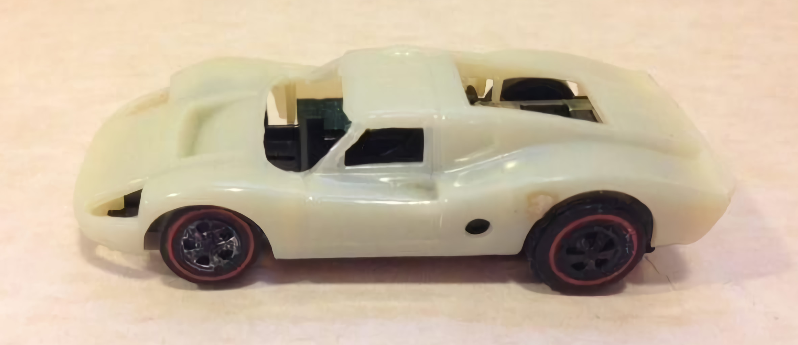

Called Sizzlers by "[professional namer](https://www.fastcompany.com/3028163/what-its-really-like-to-name-products-for-a-living)" Carol Robinson, its tech was conceived within their research and development arm of toy development, where Hot Wheels was invented.

Sizzlers would take two years from research to release. Sizzlers would target the holiday season of 1970, when most toys were sold in Q4, with a majority in the last month.

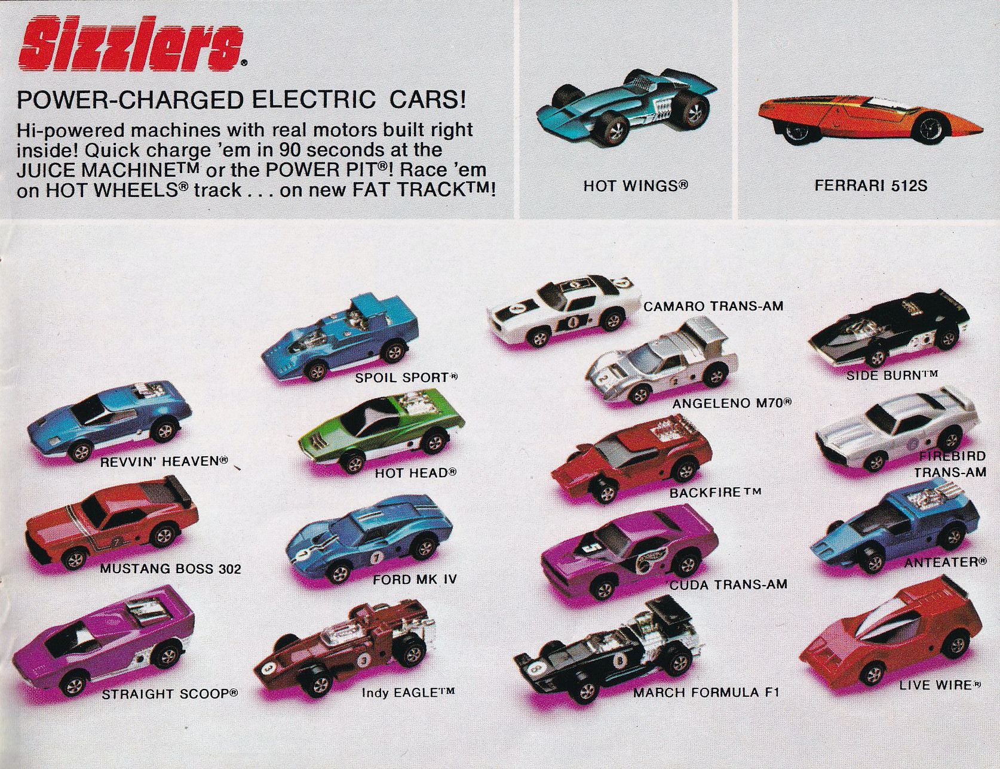

As Mattel moved through the 1960s, they comprised numerous research teams, of which Jack Ryan led "Research and development." Two other groups were also spun up as "Preliminary Design," experimenting in competition, separated by office areas.

There is reason to believe that the company's founders formed these groups to meet Wall Street interests and manage royalties to Ryan's group, as most, if not all, toy invention was happening there.

Mattel would reach a public IPO on the Pacific Exchange in 1960. Then, it was listed on the New York Stock Exchange in 1963, ascending to the Fortune 500 list by 1968.

Ruth Handler, part founder of Mattel, and Bernie Loomis, a marketing polymath, would approve a final sizzler prototype in December 1968. It would take invention to make it production-line ready.

## In Search of... New Age Space Juice

DURING THIS TIME AT MATTEL, America was close to completing the moonshot. Mattel was located in the same place where engineers were needed for such a trial. Detailed toy engineering to power Sizzlers took similar inventiveness, as it was never done before.

### Personnel Powerhouse

With her mega-success of [Barbie](https://en.wikipedia.org/wiki/Barbie), co-founder [Ruth Handler](https://en.wikipedia.org/wiki/Ruth_Handler) would go the distance finding talent around the globe, wherever they worked.

While few came from Euro-tech, and others immigrated from foreign countries, some were poached from space efforts, leaving toy technology efforts technological, which included Ryan's engineering prowess.

Their best engineers came from Aerospace and missile tech. Jack Ryan, [J. Northrop](https://patents.google.com/?q=Assigne%3A%28Mattel%29&inventor=J+Northrop), and others holding aeronautical and astronautical degrees. And, of course, their networks recruited creative engineers from those hangars.

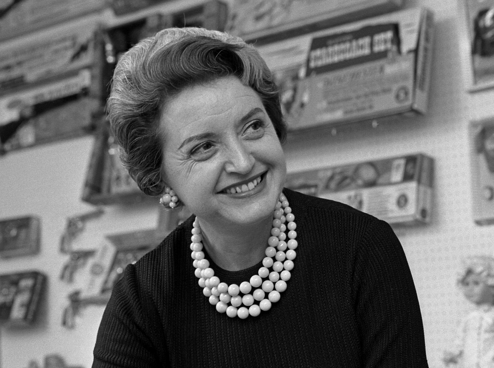

Ryan, joining in 1955, supported the Handlers wholly, bringing in aerospace processes that encouraged engineering creativity, failing forward, prototyping ideas, and demonstrating work quickly.

No person or company exists in a vacuum. Three things surrounded Mattel at this time: the fury of the technological forwardness of aerospace companies, the space race to the moon, and the liberal attitude of southern California, where Mattel was based.

Wild as it was, it is also the place where UFO culture was born.

Mattel's mystique of mysterious people in suits in unmarked trucks comes from this pedigree, which persists today. At initiating toy products, inventive operations were similar to teams like Lockheed's "[Skunk Works](https://en.wikipedia.org/wiki/Skunk_Works)" and McDonnell Douglas's "Phantom Works."

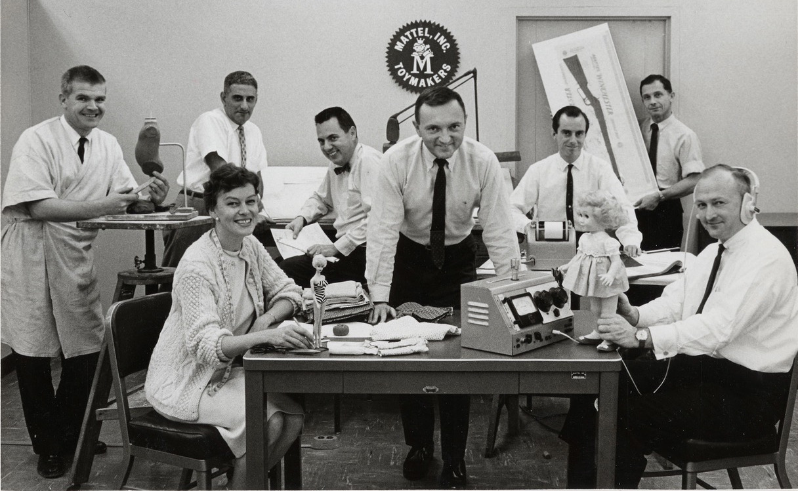

"Skunk Works," an invented culture by [Kelly Johnson](https://en.wikipedia.org/wiki/Kelly_Johnson_(engineer)), a man who could "see air," became known as a creative environment for engineers and protected from uncaring executives (aka "blue-suits") via crushing contract work. It was secretive, guarded, and separated from peering eyes. Engineers played pranks and wore relaxed clothing. The derivative of the very name was an acknowledgment of plastic fumes.

Mattel did the same, with locked doors and a badge system influenced by aerospace culture when it was unknown to the general public. The environment encouraged small teams, individual risk-taking, and leveling engineers with leadership through product demos.

No one knows if Ryan could "see toys," but he was an unmatched principal engineer. He inspired the next generation of toy makers who led Mattel through the following decades, with people appearing on streaming documentaries raised in the inspirational environment.

---

*There is no association between war machine construction and toys, but a process analogy can be drawn.*

*In this era at Mattel, people brought in missile and aerospace influence and skills, Ryan included. Mix in Mattel's employed chemists and physicists; they led a generation of toys in their class. And since Skunk Works was a national secret until the late 1980s, it is unlikely Ryan knew.*

*Mattel's environment had lots of similarities and propelled a weird narrative. It was a different way of toy making, surrounded by an inventive industrial environment and free-thinking attitudes that shaped them, a chiefly American definition.*

*These processes and modes of working defeated their competition and developed branded toys that have persisted for a century.*

---

This inventing environment was unique. So, when wild stories swirled in the mystery of demonstrations for American industry, Ruth said, "*I believe there is enough talent in the room at Mattel to do the same thing. (a moonshot)*" quoted in a book called [*Toyland*](https://medium.com/@solidi/memorable-moments-in-future-toyland-b919fdcbcba6) as she rallied her elite marketers.

And during this time, battery tech desperately needed advancement, a perfect challenge.

Three competing research teams would investigate power sources. A director led one, and his efforts included toy initiatives, split into finding motors that required little space for lots of juice, each partnering with Mattel's chemical lab for results.

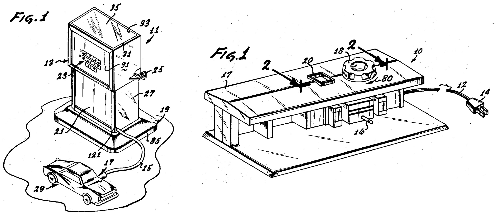

[Jack Barcus](https://patents.google.com/?inventor=J+Barcus&assignee=Mattel&oq=inventor%3A%28J+Barcus%29+assignee%3A%28Mattel%29), mentioned in a Hot Wheels historical book and on podcasts, led another group centered around voice engineering. Barcus absorbed that third team in a reorganization [after a tragic accident](https://medium.com/@solidi/a-tragic-american-toy-story-f0c19e58534e). He invested in Sizzler's invention, which was well underway.

The urban legend of a Hot Wheels-powered car with a gasoline engine came from this research group, perhaps before or after that reorganization. And [it's not a myth](http://redlineprotos.com/Gas%20Proto/gasolinepowered_car_new.htm).

One of their engineers who worked in that group, [Lester T. Stormon](https://patents.google.com/?assignee=T.+Stormon+Lester), crafted the prototype in the race for juice. It was a ridiculous solution for children and it wasn't gasoline-powered, but of [glow fuel](https://en.wikipedia.org/wiki/Glow_fuel), used in model airplane engines.

### Pranks Played

While it will never be known how the motors and batteries that powered our future toy train came to be, pranks were played in their forging, a sign of high creativity.

In such attempts to throw off Barcus or Ryan, pranks were played as if it were a frat house. In this story, a little before or after, the battery juice was concocted from a prank.

In a [classic retelling](https://www.amazon.com/Hot-Wheels-Years-Performance-Attitude/dp/0760315736) from the Hot Wheels anniversary book, there was a small gap above the wall between the two research and development groups, Barcus and Ryan. One of the engineers hung a clear party cup containing a yellow bio-energetic substance. Two wires were dipped into this liquid, connected to a small electric engine, powering a propeller on its shaft.

No one knew how it was powered, throwing the groups into disarray.

It turned for a time, having infinite energy. Mattel's engineers took extensive notes of the liquid for potential patents. It caused lots of disrupted work.

 for numerous years. These coloring books were communication channels for children. Mattel was where lots of multi-media "firsts" occurred from 1955. Cy Schneider and then Bernie Loomis led efforts.](images/75-10.jpeg)

After a leader took it down, it would turn out that a constantly blowing A/C vent powered the fan, and the motor's armature was ripped out as motor carcasses were available around the office.

Of iconic Hot Wheels [Super Rally Case](https://patents.google.com/patent/USD217412S/en) invention, Lenny Moquin, from Ryan's group, pleaded guilty in the hanging contraption.

Since this story includes flying things, engineers would continue with other shenanigans in tow.

Another engineer pranked his colleague with ladybugs. Placed in an enclosed VP's office, he walked in one morning, noting the desk and ceiling moving. It was impossible to clean the situation, as it was unlucky to exterminate them.

Again, Mattel's engineers took extensive notes of the insect's flying capabilities for potential patents as the poor executive collected one bug at a time.

 Sizzlers, and the fat track to accommodate it, [US3712541A](https://patents.google.com/patent/US3712541A/en](images/75-11.jpeg)

After experimentation, Ryans' team settled on a miniaturized and refined [Ni-Cd](https://en.wikipedia.org/wiki/Nickel%E2%80%93cadmium_battery) battery in cooperation with General Electric. The group succeeded at the Sizzler tech and launched in 1970.

[George Soulakis](https://hotwheels.fandom.com/wiki/George_Soulakis) wis credited for following through on Sizzlers. As a gifted engineer, he was promoted to engineering director and later introduced the advanced [TampoPrint](https://hotwheels.fandom.com/wiki/Tampo) process, which placed Hot Wheels in high regard for detail. He would advance Sizzler's production in Hong Kong.

## Marketing Rails: Bernie's Hot Line to Kenner

THAT IS WHERE BERNARD LOOMIS ("Bernie"), a leading sales executive, marketer, and then division vice president at Mattel, stepped in to develop the incremental Line of trains called [Hot Line](https://hotwheels.fandom.com/wiki/Hot_Line) from the same tech.

Bernie was to command the modern children's television media, organizing toys into incremental product lines. He had a knack for discovering "toyetic" toys, a natural ability to forge them into sellable products.

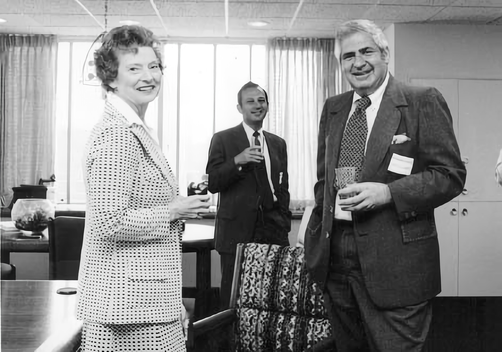

Joining in 1961, he is famous for connecting [Ken Sanger](https://www.oldcarsweekly.com/newproducts/hot-wheels-classics-the-redline-era), buyer for Kmart, to Elliot's sale of fifty million Hot Wheels. With Bernie present, Mattel was the first of three toy companies to become the largest.

When Hot Wheels shot off in 1969, Mattel [divided itself](https://www.rebelscum.com/loomis.asp) into three groups. Ray Wagner would take Barbie, [Josh Denham](https://www.theregister.com/2013/06/10/feature_30_years_old_the_mattel_aquarius?page=4) would take Preschool Toys, and Bernie would take Wheels and Wings.

When Elliot handed Bernie the Hot Wheels keys, he found himself head of boy's toys at the most powerful company on the planet.

Bernie's impact on Mattel throughout the 1960s is iconic. Mattel was known as the first toy company to sign on to a TV promotion with Mickey Mouse Club on ABC TV in 1955, a tie-in from their ad marketing firm Carson/Roberts.

Its initiative was led by [Cy Schneider](https://en.wikipedia.org/wiki/Cy_Schneider), of eventual [Nickelodeon](https://en.wikipedia.org/wiki/Nickelodeon) fame, with [Geraldine Labourne](https://interviews.televisionacademy.com/interviews/geraldine-laybourne) taking the mantle, focusing on kids first, making it an iconic American success.

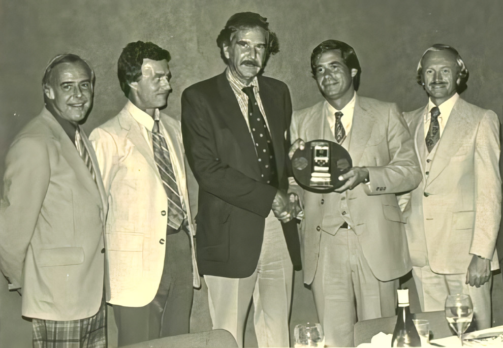

Bernie worked with Cy and was known for his steadfast creativity and for developing [alternative media](https://www.cbr.com/hot-wheels-nearly-changed-tv-forever-cartoon/) to promote children's products, inventing the disputed [Hot Wheels cartoon](https://en.wikipedia.org/wiki/Hot_Wheels_(TV_series)) airing on ABC TV.

The US Federal Communications Commission (FCC) gave it the thumbs down by lobbying efforts of Peggy Charan by [Action for Children](https://en.wikipedia.org/wiki/Action_for_Children%27s_Television). Eventually, the government restricted corporations from marketing toys on TV, putting the 1970s in a regulated environment.

That was until the Reagan administration deregulated restrictions in 1981, opening the door for [gung-ho excess](https://www.youtube.com/watch?v=usdP5c_z9T8) at levels never seen in history.

Bernie had opinions about how toys should be developed, and at this time, was his proving ground for extending toy lines. A novel concept in toy history, the Sizzler line was open, with the option of inventory reuse, available for alteration and reinvention.

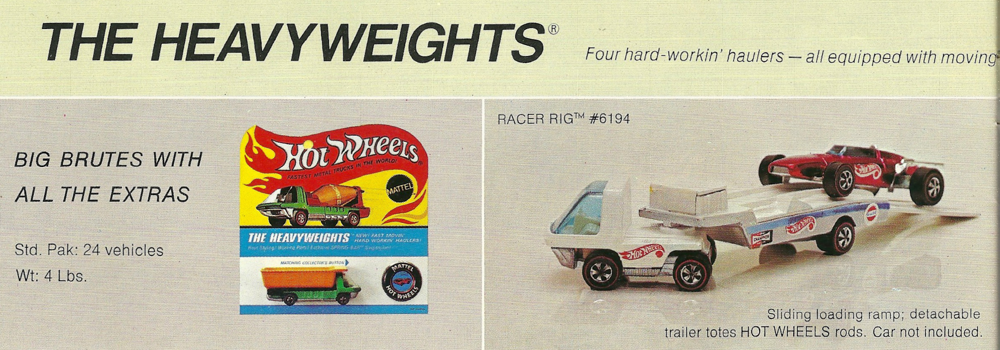

Bernie's team spearheaded the Hot Line trainset within the group. They worked with various engineers to build a core set of re-shelled Sizzlers.

Hot Line was crafted with the aesthetic by [Ira Gilford](https://hotwheels.fandom.com/wiki/Ira_Gilford) in an appeal to [Heavyweights](https://hotwheels.fandom.com/wiki/Heavyweights), with Lester Stormon, and altered-engineered by Janos Beny. George Soulakis cast its motor placement chassis coming off the Sizzler's project.

The train concept was an art piece that targeted civic and space themes, a similar notion from [Bob Gurr's](https://en.wikipedia.org/wiki/Bob_Gurr) utopian [Tomorrowland](https://en.wikipedia.org/wiki/Tomorrowland) at Disneyland, eye candy within the then-space-age aesthetic.

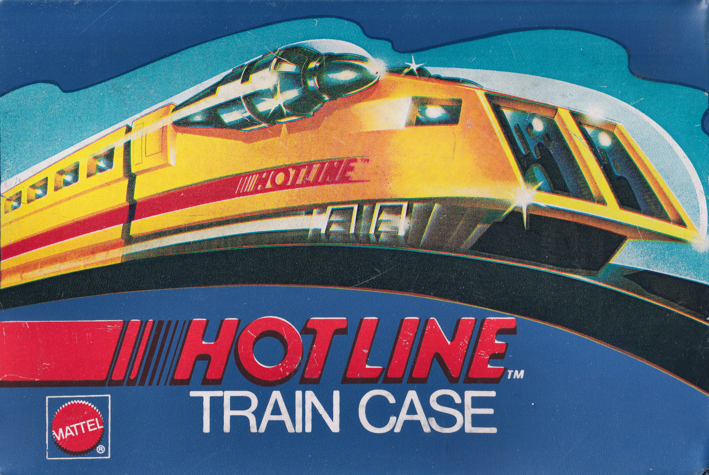

Hot Line products were stark-looking. They locked together but did not act like trains, with no "on-a-rail" sound, and performed like Sizzlers. At speed, they looked extraordinary, flying around a track, aligned to a time in American history when space toys were considered dystopian.

Mattel pushed forward with a vision, with aging product lines like [Major Matt Mason](https://en.wikipedia.org/wiki/Major_Matt_Mason) and the new Hot Line, trying to buck the trend.

Hot Line fit right into movies like "Logan's Run," "Tron," and "Silent Running," possibly making [Douglas Trumball](https://en.wikipedia.org/wiki/Douglas_Trumbull) smile. These movies would come after Hot Line, making the toy line unique.

Their toy designers crafted the sleek look from the Seattle 1962 International World's Fair Monorail, with [Hovertrain and Maglev](https://www.youtube.com/watch?v=qUXEFj0t7Ek) aesthetic.

, [US3694958A](https://patents.google.com/patent/US3694958A/en) Janos Beny's coupling design, and Keith Johnson's wheel bearing design minified the sizzler tech chassis.](images/75-16.jpeg)

As a product analysis revealed, Hot Line proved disappointing, disappearing off the shelves and out of catalogs by 1973.

As a one-year wonder, Hot Line did not meet the toy industry standard of "paying for itself." The thinking was from Bernie, "[bringing out new themes and sub-themes year after year](https://www.battlegrip.com/wp-content/uploads/2015/04/fullarticle.png)" from existing toys.

While these toy lines failed as he exited, it would later suit his next career move.

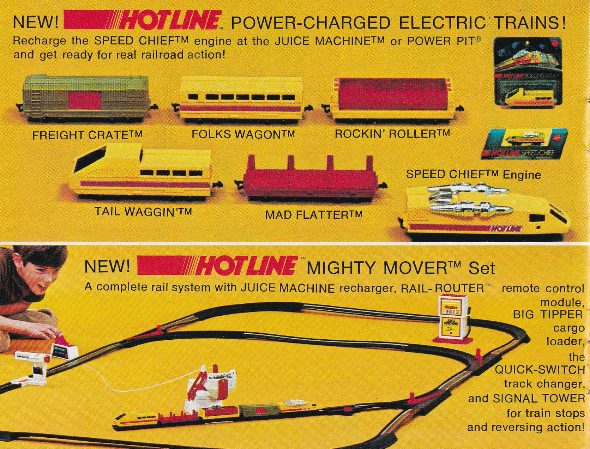

---

*A tumultuous separation ensued after Jack Ryan's exit in 1974 due to missing royalty payments. Naturally, great leaders have pull, and Mattel folks followed Ryan to his new invention company.*

*Important in this story, they invented [Total Control Racing](https://en.wikipedia.org/wiki/Total_Control_Racing) (TCR) for Ideal Corporation, slotless cars that changed lanes. It was an initiative from those who worked on Sizzlers and Hot Line. It was a stellar achievement.*

*[TCR](https://www.youtube.com/watch?v=UmvYg7uYN50) was a spiritual successor to Sizzlers and Hot Line (Ideal and Mattel were competitors then). Taking slot cars without the slots and applying direct control passing was unheard of. It launched in 1977 and the toy line survived with Tyco into the 1990s.*

, later known as Total Control Racing.](images/75-18.jpeg)

*Naturally, due to the industry's consolidation, Mattel owns the property of all the former companies above. They re-released Total Control Racing under Hot Wheels in the 2010s.*

---

## Wings Too: Flying On a Line into Something Soft

FROM BERNIE’S TITLE, his team's other directive was Wings. "[Hot Birds](https://corporate.mattel.com/brand-portfolio/hot-birds)" was a beautifully developed diecast flyer by Bob Lovejoy. Bob, a dreamer, was an avid ultralight pilot.

With a set of six, a lanyard string flight deck, and developed playsets, it was an attempt at extending diecast that flew with gravity.

These toys were "kid-powered," like Hot Wheels. Up-and-coming toy designer Phil Crain was a part of the efforts, developing the flight deck and other concepts of landing these diecast planes.

Kids would load a Hot Bird on the "Flight Deck" and simulate a plane landing into a playset, scoring points.

 Flight Deck and [US3675361A](https://patents.google.com/patent/US3675361A/en) Flight Deck with Sound by Bosley, Philip Crain, and others.](images/75-19.jpeg)

Hot Birds was an incremental business introduced to the Hot Wheels line. But these beautiful pieces of craftwork weren't successful.

These airplanes soft-landed at the clearance aisle shortly after. While one would argue that Hot Line and Hot Birds were not a part of Hot Wheels, the division name influenced each name.

And parents needed to make sure the family dog was kept away; these planes were flying paperweights!

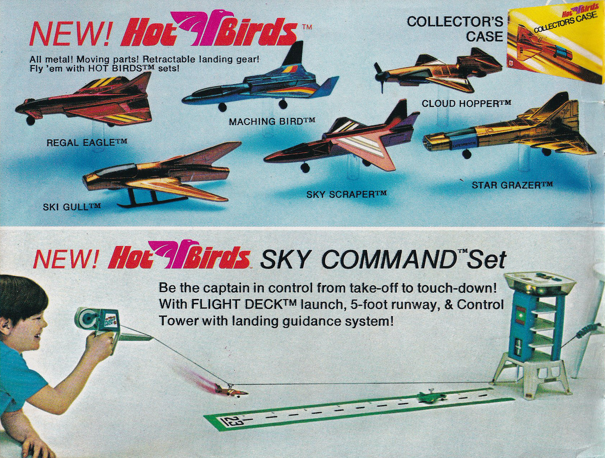

Lensley, who produced Matchbox diecast cars, released [Sky Busters](https://matchbox.fandom.com/wiki/Sky_Busters) in 1973 and trains further on. Neither consumer concept garnered attention in the US toy industry.

---

*While Mattel launched winged boy toys in the 1970s outside Hot Wheels (e.g., [Vertibird](https://www.rchelicopterfun.com/mattel-vertibird.html) and [Flying Aces](https://corporate.mattel.com/brand-portfolio/flying-aces)), their greatest success was [a cargo plane](https://patents.google.com/patent/US4500299A/en) from the brilliant mind of ex-Marine turned inventor Phil Crain, invented in the early 1980s.*

*Aviation expert and master model builder Bill Kelley crafted this plane. Later duplicated by [Galoob](https://en.wikipedia.org/wiki/Galoob) (makers of [Micromachines](https://www.youtube.com/watch?v=_tv8QF8RwNI)), Hess Toy Trucks, and others, the Cargo plane saw five design variations well into the Mattel-Arco era. It sold well and was manufactured in variations.*

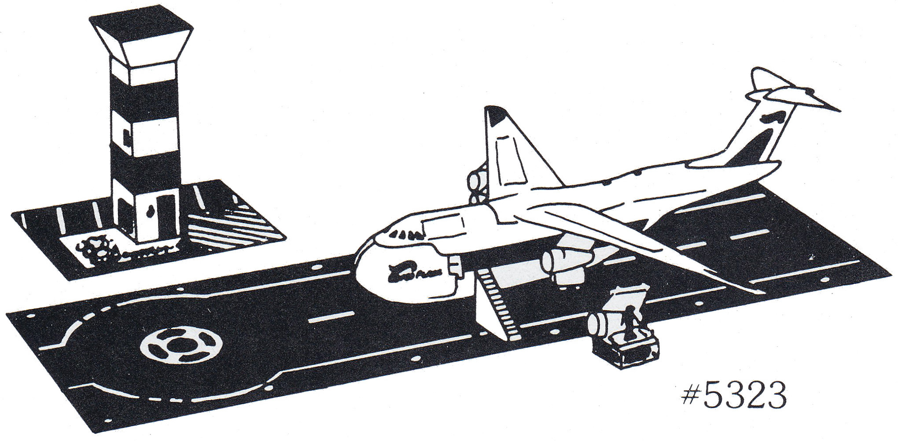

*The cargo plane was a unique toy invention. The aircraft was beloved by children and seen as helpful, dutiful, and non-threatening. It was a rare imaginative playcase with outstanding play value. It followed Ideal's Globemaster Flying Boxcar a generation prior.*

*Mattel would attempt to revive "Wings" as glider/slider [Streex](https://hotwheels.fandom.com/wiki/Streex) (they fly), short-lived in 1992 and Jetz later in 2001.*

*Hot Wheels would produce diecast [airplanes](https://hotwheels.fandom.com/wiki/Category:Aircraft) throughout the years, with the latest pressing of [Top Gun F-14s](https://hotwheels.fandom.com/wiki/Grumman_F-14_Tomcat) in 2021, coming from their acquisition of Matchbox in 1997 via Sky Busters.*

---

## Dreaming into Beautiful Train Sets

ONCE DREAMING INTO his [Lionel catalogs as a child](https://www.nytimes.com/2006/06/06/business/06loomis.html), Bernie was fired from Mattel by Ruth Handler in leave Mattel and settled at [General Mills Kenner](https://en.wikipedia.org/wiki/Kenner_Products), his second toy company, which became the largest for a brief time.

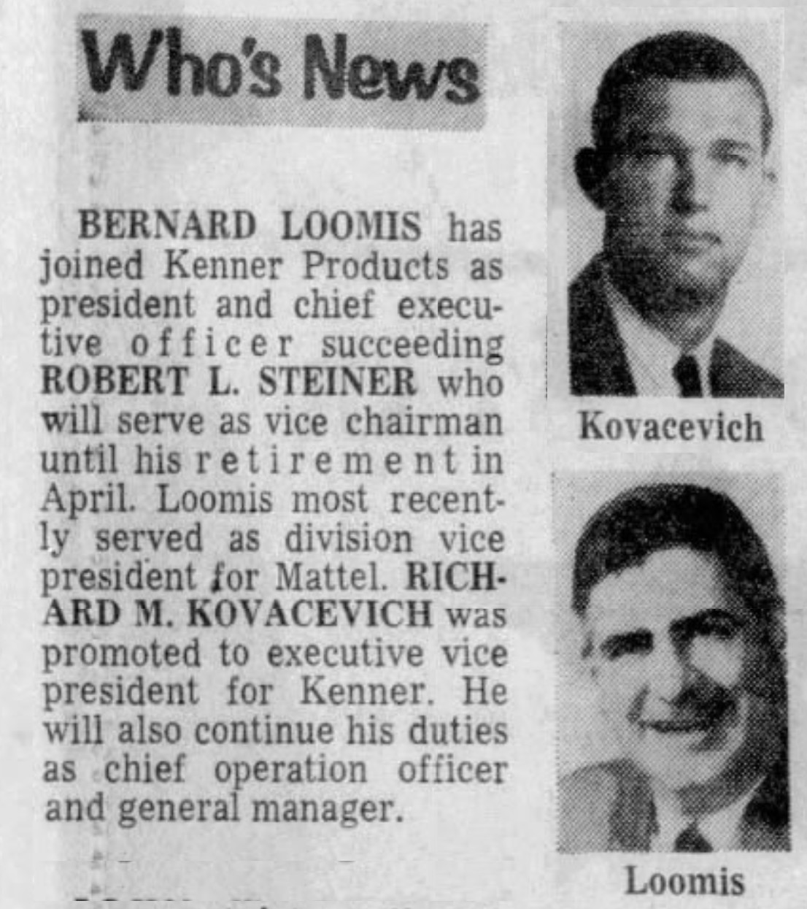

After his exit in 1971, Mattel reorganized as Ray Wagner took the role of the president. From there, the 1970s for Mattel has been described as a "crazy time," being financially disruptive and teams being reduced and reorganized.

This is where Ruth had her "IRS problems," as the Security Exchange Commission historical society has memorialized the [final verdict document](https://www.sechistorical.org/collection/papers/1970/1978_0803_UnitedStatesHandler.pdf). That case was linked to sales practices associated with the toy lines described in this summary.

While this happened, Ray Wagner passed on the Star Wars toy line. Bernie Loomis, who would later become "[The Man Who Invented Saturday Morning TV](https://toytales.ca/bernard-loomis-the-man-who-invented-saturday-morning/)" as a former executive peer to Ray, scooped up the [toyetic](https://en.wikipedia.org/wiki/Toyetic) Star Wars. He had the radical idea to give coupons to children as IOUs for the Holiday in the late 1970s.

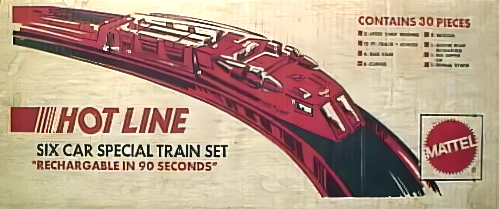

Bernie partnered with [David Okada](https://idsala.wordpress.com/lecture-archive/fall-2012/dec-6-dave-okada/) on Star Wars toy execution. David was present within Mattel, contributing to Major Matt Mason and other efforts, who followed Bernie to Kenner. Both men were documented in [The Toys That Built America](https://www.imdb.com/title/tt14357568/).

Bernie's genius was right on those IOUs, as no child in history would play with their toy at Christmas into the evening. They waited until spring, and to quote Bernie, "*the execution of an idea is as important as the idea itself*," the decision was a lottery hit.

---

*Ruth and Bernie approved the Hot Line toy series in product demos, coupled with a natural understanding of Bernie being head of Wheels and Wings until Fall 1971 when he took his place at Kenner, replacing [Robert L. Steiner](https://www.kennercollector.com/kenner-history/).*

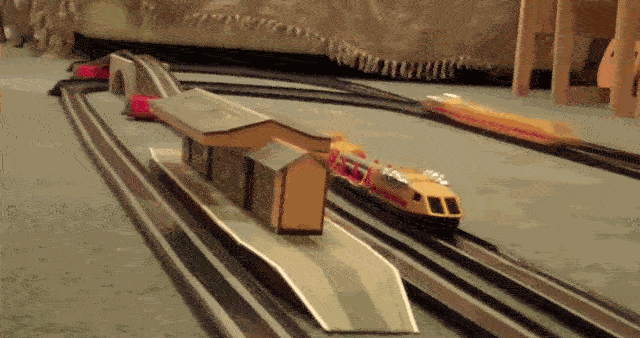

*If trains and planes were to succeed at Mattel, it was Ruth who found the talent and onboarded Loomis. With lines of incredible engineers and modelers, Mattel's second-generation products, like [Hot Wheels Railroad](https://hotwheels.fandom.com/wiki/Hot_Wheels_Railroad), were from the minds of those who survived the instability during the 1970s.*

*Their success fostered a determined pedigree within Mattel's career lines to acquire imaginative intellectual property, Thomas the Train, a half-century later.*

---

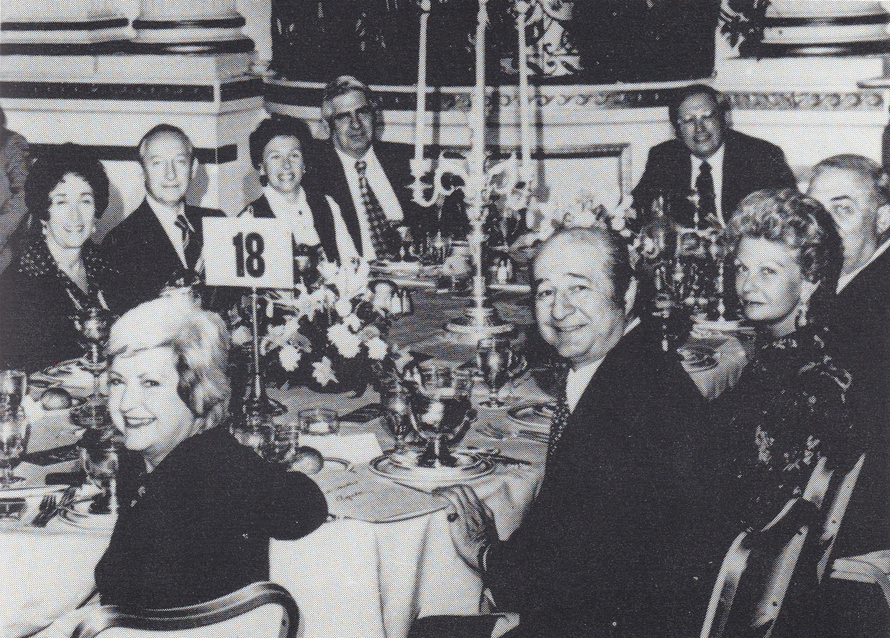

From ToylandOf course, Mattel survived the [Age of Aquarius](https://en.wikipedia.org/wiki/Age_of_Aquarius), and became what it was. Ruth and Elliot Handler were inducted into the [Toy Hall of Fame](https://www.toyassociation.org/ta/events/hof/toys/events/toy-industry-hall-of-fame-home.aspx) in 1989.

Ryan's inventive process propelled Mattel into a toy empire, but he would not recover from the rift of the Handlers, passing away in 1991.

And Bernie's "lonesome decision" Star Wars toy line became legendary. He was conducted into the Toy Hall of Fame in 1992, with famous hits in children's history, including Strawberry Shortcake and Care Bears. He ended his triple-crown at Hasbro and then formed a consultant group.

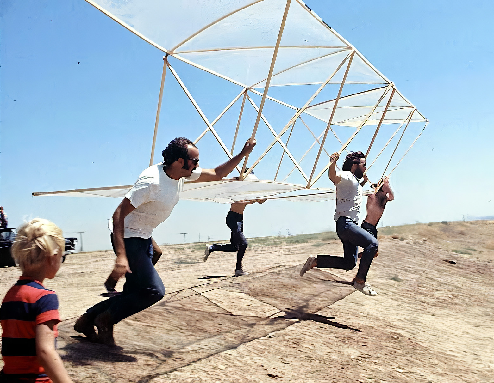

Berine's genius discovered licensing and toy opportunities that everyone else overlooked.

But, Hot Line trains, Hot Bird planes, and later Kenners diecast [Fast 111s](https://www.hobbydb.com/marketplaces/hobbydb/subjects/fast-111-s-series) went the way of the hula hoop. Bernie continued to search for beautiful train sets after his trials at Kenner and Hasbro. As a consultant, he partnered with Golden Books, then [Western Publishing](https://en.wikipedia.org/wiki/Western_Publishing).

Famous for beautifully illustrated Hot Wheels coloring and sticker books, it was evident that "[Little Golden Book Land](https://en.wikipedia.org/wiki/Little_Golden_Book_Land)," Bernie's project, attempted to recapture the imaginative train artistry chugging into the sunset.

 for Hot Line from a private collection.](images/75-27.jpeg)

Today, Mattel lists their past and present [brand portfolios](https://corporate.mattel.com/brand-portfolio), [Hot Birds](https://corporate.mattel.com/brand-portfolio) included. As of November 2023, Hot Line and [Hot Wheels Railroad](https://www.youtube.com/watch?v=yHYCjWOnVXc) are absent from the portfolio, which motivated this obscure research series.

---

*[Part two of this series](https://medium.com/@solidi/push-play-and-put-em-away-the-hot-wheels-kid-powered-trains-and-planes-caefc9c49042) focuses on the next-generation prelim group and explores Mattel's Hot Wheels Railroad. It will include insight into the highly detailed craftwork.*
