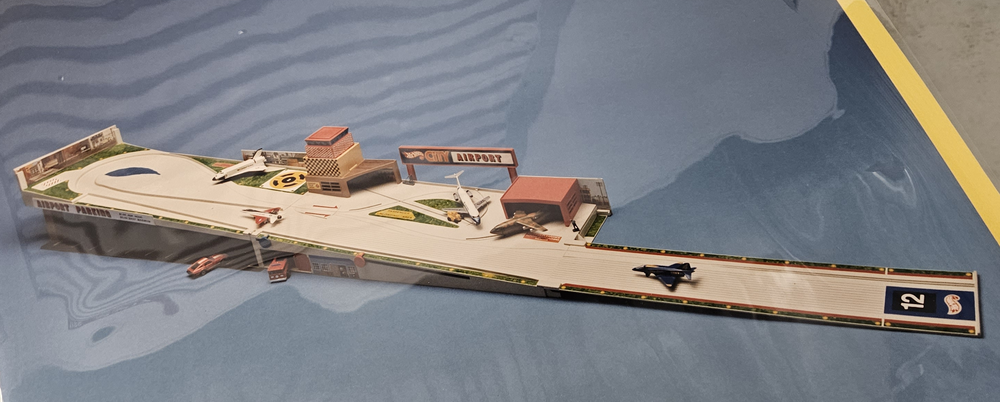

## On Toy History
# Push, Play, And Put' Em Away!: The Hot Wheels Kid-Powered Trains And Planes
## Part 2: 1980s-1990s Golden Era Kid-Powered Trains

*What follows is a multi-part series. Please read Part 1: [1960s-1970s Wheels, Wings, and Electric Space Juice](https://medium.com/@solidi/push-play-and-put-em-away-the-hot-wheels-kid-powered-trains-and-planes-80f6c2edeb40) for an introduction to Hot Line trains.*

---

As we move into the 21st century, hobby-grade trains have waned in modern culture. So have their [brick-and-mortar](https://www.trainorders.com/discussion/read.php?3%2C1223565=) hobby shops. But trains persist in logistics and commuting and for some they are a passionate pastime.

This write-up focuses on Mattel's second-generation imaginative toy trains that were "kid-powered," their pinnacle attempt at an affordable price.

Like all toys, trains "[help you grow into the person you are](https://www.youtube.com/watch?v=itYfZwjm-Mw)." No other play system delivers infrastructure thinking and [STEAM](https://www.invent.org/blog/trends-stem/stem-steam-defined) calibration (with stress on Art). Trains are inherently modular within an interconnected system, providing a perfect learning structure.

At Mattel, constructing Hot Wheels Railroad included visits to a local hobby shop. Eventually, a wonderfully illustrated and crafted product line was released, but it would be short-lived.

## Because It Runs on Imagination, Not Electricity

Years after [Bernie Loomis's](https://en.wikipedia.org/wiki/Bernard_Loomis) exit, Mattel's trains and planes of the 1970s missed the mark. The problem with [Hot Line](https://hotwheels.fandom.com/wiki/Hot_Line) was their appearance. They weren't seen as trains, were too expensive, and did not appeal to children. With these learnings, management, and toy designer Phil Crain believed trains could succeed.

Finalizing his work on [Hot Birds](https://www.youtube.com/watch?v=K565RhoZh04), Phil was inventing on the [preschool team](https://patents.google.com/patent/US4027424A/en) during the slumber of Hot Wheels in the 1970s. He understood children recognize reality.

A second-generation thrust of invention occurred at Mattel, aligned with [deregulation](https://bettermarketing.pub/the-great-marketing-deregulation-2125a0efe094) in the early 1980s. These young professionals contributed to toy-making through the Age of Aquarius. Now, they found themselves in the proverbial engineer's chair.

Mattel's artists returned to the drawing board. Phil was embedded in the combined preliminary group (research & development) after [Jack Ryan's](https://en.wikipedia.org/wiki/Jack_Ryan_(designer)) exit in the mid-1970s, now headed up by Vice President Denis Bosley of [super-charger power-house](https://patents.google.com/patent/US3590524A) fame and and electronics wiz Richard Chang.

With significant talent from Bosley's group, including [Derek Gable](https://easyreadernews.com/fun-at-work-former-mattel-designer-derek-gable-is-being-honored-for-teaching-kids-that-fun-at-work-is-part-of-the-job/), head of male action figures, Derek led [Masters of the Universe](https://en.wikipedia.org/wiki/Masters_of_the_Universe) (MOTU) for Ray Wagner, president of Mattel. It was a masterful response to the missed opportunity of Berine's Star Wars toys, which were lost to [Kenner Products](https://en.wikipedia.org/wiki/Kenner_Products).

Phil was an inventive illustrator with solid ideas that propelled "non-rubber" Hot Wheels. With the liminal playset called the Sto & Go (see the [full write-up](https://medium.com/@solidi/the-toys-that-made-us-the-first-hot-wheels-sto-go-playset-2f051fbd33c3) on how it came together), Phil paired up with a model maker named [James Openshaw](https://patents.google.com/?inventor=James+D.+Openshaw) for the eventual Hot Line spiritual successor.

### Crafting the Mixed Scale Trains

As discussed in the [biography](https://www.amazon.com/Game-Makers-Life-Inventor-Executive/dp/1637584377) of industrial toy designer [Jeffrey Breslow](https://www.chicagotribune.com/entertainment/ct-ent-jeff-breslow-toymaker-kogan-0108-20230105-3nra4wywl5hsxfoplutj4c3sei-story.html) of Marvin Glass Associates (Simon, Operation), the biggest challenge of toy-making is the concept *and* the execution. Crafting a train set takes immense skill, and these model makers pushed incredible work.

As management and marketing sold the idea, Phil, its railroad conceptual designer, had to surround himself with the best model makers and engineers to forge the tangibles.

During this time, the market was saturated with electric train sets. It is inconceivable that Mattel would put money on the table, making a second bet. They had to compete with companies focused solely on pre-assembled railcraft like [Lionel](https://en.wikipedia.org/wiki/Lionel_Corporation) and [Bachmann](https://www.bachmanntrains.com/home-usa/).

However, toymaker adults of this age lived their childhood in the 1940s-1950s, so it was a perfect time to reach *the next generation*. Those model makers, industrial designers, and engineers crafted their dreams with emerging plastic tech. The timing was just before "extreme toys," with ultra-fluorescent pizzazz.

Mattel had money to invest, and a portion went to this product line. So Phil and Jim worked on conceptualizing and modeling an affordable train toy set. The kid's hands would power the trains.

Hand-powered trains have existed since the [19th century](https://www.keyelco.com/blog-details.cfm/keyelco-blog/The-Perfect-Christmas-Gift-A-Quick-History-of-the-Toy-Train/blog_id/44) but were not seen in this time of toy history (to target older children). Most train sets were electrified. But to keep costs low and detail high, the goal was to self-power.

Electric and trains were inseparable, and Mattel would separate the idea. It was to compensate for their lack of advanced train tooling.

Phil was hot off the Sto & Go set and finishing up the Hot Wheels [Cargo Plane](https://patents.google.com/patent/US4500299A/) (later "borrowed" by other manufacturers). He was a talented illustrator and industrial designer trained in Chicagoland, where the best crafters studied in the Midwest. He once crafted furniture, now beautiful toys.

The team re-envisioned the original Sto & Go case as a toy trainset for the soon-to-be trains. Next, Phil focused on "train triples" with James, with a playset that would match, becoming the iconic Hot Wheels Railroad Freight Yard #5758.

### Electric Off: Adult-Powered Teamwork

At this time in history, Mattel staff included people from all trades. From chemists, magicians, industrial designers, watchmakers, pilots, fortune tellers, aeronautical engineers, and the best model makers.

While Phil and James crafted, [Tom Grimm](https://patents.google.com/?inventor=Thomas+Grimm&assignee=Mattel), a mechanical engineer from Stanford, [Nick DeAnda](https://patents.google.com/?inventor=Nicholas+DeAnda&assignee=Mattel), model maker supervisor, and snake-bitten ophiophilist [James Morse](https://patents.google.com/?inventor=James+Morse&assignee=Mattel), joined them.

They started drafting the train layout while Tom and others meticulously reviewed HO-scale trains at a local hobby shop, rumored at be in Redondo Beach on Artesia Boulevard.

And no, that shop no longer exists today.

, Y track, and [alignment bias](https://patents.google.com/patent/US4522607A/). [Mike McKittrick](https://www.mckittrickdesign.com/About/) designed the connectors.](images/76-07.jpeg)

During this time in Mattel, preliminary design merged together with engineering, working as a combined design and engineering team.

As Ray Wagner exited, he and his peers lead vertical toy lines in the design and development group (D&D)-engineers worked on projects as they desired. Gene Kilroy (a co-inventor of Sto & Go) headed up the vertical of interest, "Hot Wheels."

Hot Wheels Railroad demanded close associations with engineering, a test of collaborative efforts. These trains were a fusion of preschool sensibility but a mature take on its aesthetic. It was a rare combination at this time in toy history.

As Tom worked the balance (aka Sto & Go chassis) in the US, he helped coordinate the production run in Hong Kong, coming up with the idea of drop-in-packaging to bring the trains back into the States.

The trains were small and affordable to ship overseas. They were dropped into the packaging in America. This package design (a cut out in the upper left) would persist for a time as "big good things" transitioned away from domestic production in the globalization of toy manufacturing.

The trains were produced in Hong Kong, and the playset in Industry, California. They were designed with mixed-scale dimensions for three practical reasons.

First, they must fit well in a child's hand, so the "[Half an O](https://en.wikipedia.org/wiki/O_scale)" scale was miniaturized. Second, it must stay on the track while being pushed around turns. The HO scale was too "top-heavy." Finally, there was practicality in keeping the trains on the HO track. Prototyping became a breeze, as access to standard tooling was readily available (at that favored hobby shop).

Tom crafted novel engineering elements, such as the self-braking unit, so the trains would not fall off the track at the end of the ramp. He also designed a unique alignment bias mechanism within each train so they would follow smoothly in turn.

[Charlie McHose](https://performance.ford.com/enthusiasts/quick-look/2021/02/charlie-mchose.html) and a person named Miller would join the group and brush the final illustrations of the trains, storefronts, and the expansive cityscape.

[Larry Wood](https://hotwheels.fandom.com/wiki/Larry_Wood) became involved in marketing conversations. For example, Larry and Tom were in a meeting when a question was asked: "Who has a slogan?" Larry responded relaxedly while sketching a design for Hot Wheels over the conference table. Looking up, he said, "Push, Play, and Put Em Away..." or so the legend goes.

That is where Hot Wheels Frieght Yard Sto & Go was born. With the slogan appearing on the box, the set was released in 1984 with the quote "It's Kid-Powered."

---

*Mattel engineering was the hallmark of industry firsts. Surprisingly, Tyco was where new ideas were executed by their former engineers.*

*During the late 1970s into the mid-1980s, train sets were considered receding in engagement by toy companies. Tyco (short for Tyler Corporation) claimed success on pre-assembled HO train sets for the consumer since the 1950s. Lionel and Marx quickly imitated them. Bachmann, Cox, and others continued to hum along in their pocket.*

*As the 1980s wore on, Tyco would grasp at inventive desperation with slot cars and toy trains. An ex-Mattel engineer and inventor, [Mike Hirtle](https://mojo-nation.com/my-career-was-built-on-a-joke-a-candid-chat-with-former-hasbro-inventor-relations-titan-mike-hirtle/), and their team at Tyco pushed cars up a wall and trains over gaps. It was disputed who owned the rights to the concept.*

*[Aurora Plastics Corporation](https://en.wikipedia.org/wiki/Aurora_Plastics_Corporation), a slot car manufacturer, had claimed [the first patent](https://patents.google.com/patent/US4386777A). However, times were tough, and shortly after the dispute began, they went out of business.*

*Tyco would top the toy train and radio control market in its last decade, partnering closely with Taiyo. Tyco picked up [View-Master/Ideal Group](https://www.nytimes.com/1989/05/24/business/company-news-tyco-to-acquire-view-master-ideal.html) in 1989.*

*Ideal had the rights to [Total Control Racing](https://en.wikipedia.org/wiki/Total_Control_Racing) (discussed in [part one](https://medium.com/@solidi/push-play-and-put-em-away-the-hot-wheels-kid-powered-trains-and-planes-80f6c2edeb40).) They were slotless cars that changed lanes. Like the Super Turbo train, it was an inventive initiative by ex-engineers from Mattel who worked on Hot Line.*

*Today, Mattel owns all the intellectual property above.*

---

### Layup Two More Sets to Join Those Beautifully Scaled Trains
When Tom and the team finalized the engineering on the trains, new prototypes were followed by Phil in preliminary design, which included the Hot Wheels Trains-To-Go.

As a straightforward set, the idea was to create variety for the custom-crafted trains played "on the go." Tom, Nick, and others engineered that set quickly. With an emphasis on reducing costs for the consumer, Trains-to-Go #9430 was released in 1985.

With one more go, engineer [Dennis Rich](https://patents.google.com/?inventor=Dennis+Rich&assignee=mattel) developed the follow-up Superails Station #9422. A civilian approach to railroading, it included releases of [Amtrak](https://en.wikipedia.org/wiki/Amtrak) scaled models. The set would unfold differently, horizontally separating. This set was released in 1986.

---

*As discussed in [part 1](https://medium.com/@solidi/push-play-and-put-em-away-the-hot-wheels-kid-powered-trains-and-planes-80f6c2edeb40), Mattel's aviation success was [a cargo plane](https://patents.google.com/patent/US4500299A/en) from the brilliant mind of Phil Crain, invented in the early 1980s.*

*Other attempts to "re-flight" a second-generation Hot Birds would take shape, but none would see the light of day.*

*Below was an attempt at the Sto & Go airport, and the craftwork of diecast military jets is seen. Additionally, note the Space Shuttle, which was in vogue then.*

*Mattel made further attempts in the next decade, including the airplane [Streex line](https://hotwheels.fandom.com/wiki/Streex), which Phil contributed. It was unsuccessful. Mattel reorganized their plane line after the acquisition of Tyco in 1997.*

---

Following the release of the Hot Wheels train sets, they were an average hit commercially. So, the line was refreshed in 1990 under the nod of new CEO [John Amerman](https://thenaf.org/john-w-amerman) and rebranded as the Trucks & Trains line. The packaging matched the blue carded Hot Wheels style and lasted into the mid-1990s.

### Something Wonderful

Phil started his journey at Mattel in 1967. He was surrounded by engineers, modelers, marketers, executives, and corporation apparatus - crafting toys for decades. Numerous sources credited him for his conceptualization and illustration. He passed away in 2021.

These train toy products were unique because they embodied intensive reductive artistry under extreme cost by a dream team of model makers, a brilliant mechanical engineer, and an artistic industrial designer.

These trains were perennially selling products for numerous years. Their artwork invokes a passion as much as the liminal Sto & Go set; even an [Emmy-winning VFX artist](https://twitter.com/1jcmaxwell/status/1648547440298012676) agrees.

The Hot Wheels Railroad of the 1980s was an incredible execution of constraints. A set would cost parents about the same as a pair of video games. Each included four detailed trains, the chassis, and the return track.

However, this line wouldn't last as generational tastes shifted toward video games and extreme electronic toys.

## Deadhead Trains Roll In the Arco Era

In 1986, during the height of the [MOTU](https://en.wikipedia.org/wiki/Masters_of_the_Universe), Mattel [acquired a company called Arco](https://dollsdollsdolls.net/2020/09/28/mattel-and-arco-toys/), an acronym of its founder. Arco produced similarly styled toys, "[Other World](https://www.figurerealm.com/actionfigure?action=seriesitemlist&id=2211&figures=otherworld)," which competed with the MOTU line.

Arco was attractive to Mattel, having the capacity in Hong Kong to manufacture toys and a seasoned market research group on the East Coast.

### Electric On: Polishing Rails Without Knowing

Starting with CEO [Tom Kalinske](https://en.wikipedia.org/wiki/Tom_Kalinske), Arco relicensed toys for incremental business. They sourced playthings that did not meet the definition of premium, flying under the radar of high-profile toy launches.

In the 1990s, Hot Wheels "World" sets were passed to this arm of Mattel. This included pop-ups and boxed sets of Hot Wheels manufactured under license.

Hot Wheels would get a boost from talent and technology with their [acquisition of Tyco in 1997](https://www.washingtonpost.com/archive/business/1996/11/19/mattel-to-buy-tyco-for-755-million/0e1c35c5-7d2a-4a51-831e-faae28a53ef4/), bringing in the beloved [Matchbox](https://en.wikipedia.org/wiki/Matchbox_(brand)) brand. Tyco's remaining tech was now under one hanger, but Mattel was late. Tyco [stopped manufacturing](https://hotraincollector.com/tyco-trains-history/) them in 1993, selling its train tooling to International Hobby Corporation.

Years later, in the [Jill Barad](https://en.wikipedia.org/wiki/Jill_Barad) Era, numerous Hot Wheels World sets included plastic-styled trains in the late 1990s. They produced Hot Wheels Deluxe World Train Set (#65659) and Power Express Train Sets (#65631 / #89836).

As electronic components became cheaper and smaller, these trains were battery-powered, which was impossible to match the cost and performance at scale a decade prior.

Their design quality was not in the premium class of Hot Wheels Railroad. Arco relabeled these train toys from reproduced sets.

Mattel would leave Arco to manage specifications and safety standards. These sets did not contain [Tyco Tech](http://www.tcawestern.org/tyco.htm). This is an excellent example of how the brand line became economized.

The train sets targeted a maturing generation. They existed to give as gifts to children or grandchildren, influenced by their aging parents who once enjoyed their trains.

Arco research division was merged into Mattel in the early 2000s, and manufacturing was aligned. The trains of this era went without notice, leveraging the Hot Wheels brand for those who desired a toy train set.

In 2008, a set was released as a big box store "exclusive," the [Hot Wheels City Train Station Playset](https://www.youtube.com/watch?v=1LWGqchbVtY). This toy ran on a much larger, durable plastic toy track system, which has become commonplace.

---

Today, Mattel lists its past and present [brand portfolios](https://corporate.mattel.com/brand-portfolio) on its website. As of December 2023, Hot Line and [Hot Wheels Railroad](https://www.youtube.com/watch?v=yHYCjWOnVXc) are absent from the portfolio, which motivated this obscure research series. Regardless, the Hot Wheels Railroad ended a generation ago, laid up into permanent nostalgia.

