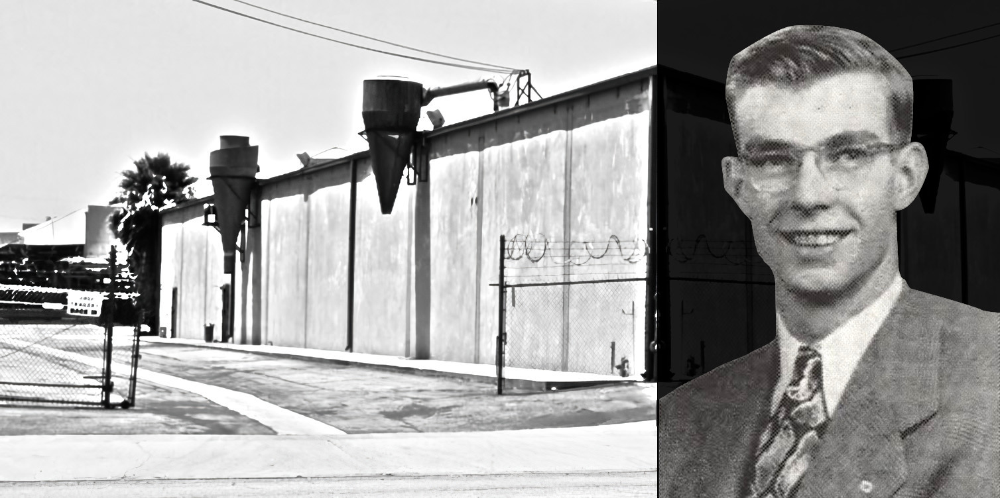

## On Science and Business History
# A Tragic American Toy Story
## The Engine That Killed a Mattel Preliminary Design Director

#History, #Investigation, #Accident, #Mattel, #Toys

*This true story questions the historical separation embodied in the Internet meme [Barbenheimer](https://en.wikipedia.org/wiki/Barbenheimer). A surviving printed record confirms a brief connection between Oppenheimer's first-line contributors (inventors of the atomic bomb) and Mattel’s then-corporate players (makers of Barbie and Hot Wheels).*

---

*In 1968, men of industry met in a California parking lot. Of them, a Mattel toy design leader, TRW and Rockwell aerospace engineers, local media filming the event, and unexpectedly, a former Manhattan Project contributor to the atomic bomb.*

*They watched a press event of an unbelievable automobile engine by American businessman Don Roser and Hungarian inventor Josef Papp, who escaped with an "atomic secret" from behind the expanding Iron Curtain.*

*As the engine ran on a table during the sales pitch, a heated exchange of actions occurred between Papp and an onlooker, leading to an explosion. The result became a tragedy. But with many witnesses, it was swept under the rug, leaving an open hole of safety and for those asking the truth - why?*

*This story follows its three-day aftermath, led by a first-hand account preserved in microfilm. It connects former Los Alamos to toy-making corporation Mattel in a ruinous blast radius from the inventor's engine for only one second in history.*

*The following contains depictions of death written by a press reporter who was injured. Reader discretion is advised.*

---

**"DON'T LET HIM DIE...** I just talked to him a few moments ago… he's a nice guy, God, and young."

John O'Donnell was a newspaperman from Brooklyn, a transplant to the West Coast on his first day at the *Gardena Valley News*. "Johnny O" was writing his account of the tragic event before his typewriter.

"That blasted engine." After an intellectual battle of the minds, Johnny witnessed an unshielded experimental automobile engine explode in front of a crowd.

Johnny was at an event that would go unwanted in American history. It was a post-modern scientific Wild West standoff, juxtaposed research vs. belief, pseudoscience vs. science. He assisted the wounded after a "science by press conference" had gone wrong.

"He's alive... thanks, God... he's alive… my God, it's the guy from the toy company..."

Johnny recalled the scene in a parking lot in Southern California under the leaded contrails. It was filled with men from the aerospace industry, deep in the moonshot efforts of America.

"The other guy began to give him the kiss of life…" Johnny was working with others to keep the toy maker's soul. Men surrounded the inventor, helping stuff the wound with clothes ripped off their backs.

The man was hit with pieces of the engine in his abdomen, bleeding heavily. He began to turn yellow and then pale.

"The reaper is here… this man is dying," as Johnny looked up to the sky - a man of belief. "Air bubbles snapped through the blackened blood of his gaping wound." He took the man's shoes off to relieve pressure.

"I was reacting like this guy in a dream - somewhere else... maybe the land of unreality."

But it wasn't just the toy maker; two other men were seriously wounded. "His leg was hanging off his shin," Johnny recalled another man. "I cannot repair it... dammit."

A rolling fence locked the parking lot after too many people poured in. They were fascinated by a humming engine that sounded like a sewing machine.

Johnny ran to the California Highway Patrol officer and hoisted himself over the fence to unlock it. "Hurry those damned ambulances."

Men in suits wandered in a daze with blood splattered over the asphalt. The engine once sat on a rolling table with its fan attached to its spinning crankshaft, now laid in pieces.

The engine's inventor, Josef Papp, was supported by his investor, Don Roser, who pushed furiously for press coverage and to obtain investment. His media blitz left no interpretation of the engine's capabilities.

"A California firm has announced it has developed a prototype automobile engine which, it says, emits no exhaust, uses no air, and has a self-contained fuel source that will drive a car 60,000 miles," stated the *Redwood City Tribune* a month prior.

"Metal fragments [were] all over the place." Johnny raced over to the second injured man with a hole in his head. "I'm okay he winked. I winked back and squeezed his hand. He winked again."

Johnny would call for help on the third man. "I've got a tourniquet. His arm was hanging loose." Johnny would curse the engine. "Where are those ambulances?" He went back to the wounded toy maker.

"Look out," he yelled, "The angel of mercy!" Another man continued to apply his lips to the dying toy maker. "Pieces of him came up," as they cleared his throat, trying desperately to save him.

News of an engine would reach Iowa, middle America. "[The engine has] a 1 to 1 horsepower to weight ratio," noted the *Kossuth County Advance*. "[The engine] can be recharged quickly for $25 per cylinder."

"I ran then to the guy with the hole in his head." Johnny looked him over. He was in good condition when the first ambulance arrived. They loaded the seriously injured toy man with a hole in his stomach.

He was battling for his life. "God, don't let him die."
His survival instinct continued. Johnny went to a cameraman filming the scene. "I stopped Del Linam, the newscamera man from KHJ-TV9." Johnny looked him over, noting his leg wound. "Del was bleeding but tending to the downed and shooting film all at the same time."

The fragments damaged the video camera, saving his life. The film reel rolled as the others were whisked away in ambulances.

Del nodded to Johnny. "We were newsmen. We both had jobs to do." After assisting others, Del took himself to the KHJ-TV9 van.

*Design News*, a trade magazine ingested by toy inventors, stated, "Produces one-third more horsepower than conventional automobile engines of the same size and weight."

Then things calmed. Emergency crews arrived.

" - the engine would continue to function perfectly in Space, and Cal Tech's Jet Propulsion Laboratory is looking at it with that in mind." The magazine *Private Pilot* had a crystal clear, full-page picture of the engine.

It captured Josef proudly presenting the flasks of secret fuel.

---

The sheriffs started their interviews as firefighters pulled out radiation detectors. They got a tip that the engine worked on an "atomic power principle," defined by the *Redlands Daily Facts*.

" - the firm refused to disclose to officials the chemical composition of the fuel." Josef was separated by an officer wearing a white helmet. The relationship between Don Roser and Papp immediately soured.

As Johnny was tending to another man suffering from a heart attack, he noted, "I helped another guy to a chair… he was from Cal Tech, and his name was Feynman."

Kenneth Huthmaker, an embedded photographer with Johnny, continued to snap photos. One photograph captured a firefighter low to the ground with a Geiger counter. Ken was captured to the right, in hand with a press camera.

Before the explosion, he captured the victims looking at the red engine block, gazing with intense intrigue.

Like out of 1960s science fiction or an episode of *Alcoa Presents: One Step Beyond*, Josef, in front of them, was wearing a white lab coat, shouldered by officers with low-slung pistols. Around them were men in suits. The toy maker wore thick black glasses.

The engine stood firmly in the foreground. "Men had been invited to this press demonstration - we all felt the same way, angry," complained Johnny.

LACoFD fire captain Charles Cornel would respond to the press, "No radiation was found," as reported in the *Independent*. Bruce Pryor, their fire inspector, walked before the engine, taking notes. A UPI photographer snapped a photo.

As Johnny milled around, he reached into his pocket. He pulled out the card from the toy maker he spoke to earlier. "His name was Jack E. Hartman… I looked again at the card he had given me earlier… he worked for the Mattel Toy Company and was director of preliminary design. Dammit - "

"I bumped into Mr. Feynman from Caltech again... we shook hands… like comrades who had been through hell together." He invited Johnny to leave.

The two former New Yorkers met briefly in the parking lot.

Dr. Feynman was a former associate of J. Robert Oppenheimer, who enlisted him in the Manhattan Project. He tended protocol to the uranium mining at Oak Ridge and co-developed the critical enrichment calculation under his watch, which finalized the bomb that ended World War II across the Pacific.

His stance on alcohol was written in *Surely You're Joking, Mr. Feynman!*, "Why do you have such a terribly strong feeling that you have to drink? - and I got scared. I never drank again."

Dr. Richard Feynman confided in Johnny, "I need a stiff drink." The event shook him to the core, revisiting the need for it.

*The Los Angeles Times* calculated that " - about 35 persons watched." One of many, the toy maker pushed the envelope by showing up, costing him everything.

The inventor's four-cylinder modified Volvo engine was a perpetual machine, violating the first and second laws of thermodynamics. " - is it reasonable?" was a lasting imprint of Dr. Feynman's father, who challenged him.

"Witnesses said the man shouted 'this demonstration is a fraud!' and pulled an electric wire loose from a piece of equipment - " the newspaper *Independent* reported. The observer wasn't identified.

Dr. Feynman, now with tenure at Caltech, was awarded a shared Nobel Prize for his mastery of physics and was well-loved for the certainty in his lectures to students, as his former New York accent laid thick.

"According to a chemist at El Camino College, the gas probably used was an inert gas, such as is found in an ordinary electric light bulb. - At the same time, the secret blend of gases turns into a form which allows it to be compressed by an upstroke of the piston," replied the technical analysis of the *Daily Breeze*.

Dr. Feynman's bookends contain misfortune and patriotism. He saw his first wife tragically die before him and reluctantly saved the credibility of the American Space Shuttle program in his final public act.

"I am about the only guy who looked at the damned thing - the first Trinity test." In between, he was an American hero who dared without eclipse goggles in technical situations.

Shortly before, the wires were connected and disconnected numerous times. "He [Papp] quickly reconnected them, but the observer removed them again shortly before the explosion, officers said," replied the *Fresno Bee*.

Coming back down through the Los Angeles smog, Johnny couldn't direct Dr. Feynman to the bar. He was new to the area. It was his first day on the job.

Richard Feynman left with others, in tow with an undergrad, future nuclear physicist Ron Gregg. Ron had experienced a domestic warzone but was too young to drink.

After the interviews ended, an article by the *County Sun* said, "Sheriff's officers said the fuel was being developed as a semi-classified experiment for the Navy."

As the endorphins were absorbed, Johnny found himself injured in the head. "My publisher arrived - he told me that guy with the belly wound was D.O.A." "I looked at the empty shoes - my heart dropped." His editor, Bill Hunt, swiftly took Johnny to the hospital.

"C'mon John, let's go to the hospital... we'll get your glasses and have your head looked at."

Johnny was nearsighted while saving others. It shielded him from the visual carnage.

---

At the hospital, Johnny graciously thanked the ambulance workers and thought about the dead toy man.

A nurse was patching him up. She asked about why he was there. "It's my first day on the new job - " She replied, "What a first day - huh?"

The authority on Formula One and car design chimed in later.

"My own theory is that the engine runs by virtue of a concealed battery pack. Assuming the cylinders were indeed filled with a gas of some sort, it seems plausible that the valve or valves got stuck - Sort of a hydraulic lock," replied John R. Bond of *Road and Track* magazine.

He would dedicate two months leading the editor's reply. "This [engine] of course, is all sheer nonsense. In fact, it's a downright fraud."

As Johnny was tended to, he saw the man with a hole in his skull across the emergency room. "Thank you, God. This one will live. He missed me again. His sharpened scythe just touched me slightly - "

"Secret Fuel Blast Kills 1, Injures 8; Hunt Meddler" was printed in bold letters in the *Press-Telegram*. A brief call to action of the public from the Sheriff's office rolled through the press, but the observer was not named.

It was to invite inquiry to those who knew of the observer's name, not labeling the witness. The following day, the onlooker was found and questioned.

Before Johnny left the parking lot, he hocked facts with the *Daily Breeze* reporter as a bandage hung from his head. They continued to dig.

"We've demonstrated this engine at least 50 times and have never had any trouble," said George Haley, an associate of the inventor who had connected Josef Papp to Don Roser.

"Haley repeated this to County Supervisor Kenneth Hahn, who came to the demonstration site to get first-hand information on what took place."

Hahn asked Papp and Haley if a law about protective shielding should be implemented. It was a time before President Nixon's OSHA worker protections

" - in the case of the Papp engine, such a shield would not normally be necessary," replied George.

---

A day later, it was clear.

"Criminal action ruled out in engine blast - the wire removal caused a pressure buildup which exploded the engine." "[The observer] wanted to assure himself the motor was not working off outside electric power," the *Peninsula Times Tribute* reported.

LASD homicide detective Lt. Harold W. White relayed it to the press. In this investigation, a decision was swift.

White reflected on his unrelated career case later in *The Insulin Murders*, "I could visualize a slide show of different scenes in various stages - I remember telling someone a few years back, "You only remember the unsolved ones."

He was a lieutenant who served justice for his family's victims. He documented his use of bleeding-edge technology to suss out the hidden truths and prove them in court to put down a serial killer.

The *Daily Breeze* relayed, "Born December 25th - he represented Mattel Toys of Hawthorne at the engine test - " Jack was a man who invented toys for children through his loyal engineers.

Hartman had originated from the professional circuit from which other toy makers came: aviation and missile tech. Also a skilled auto mechanic, he exited the industry for the craft of toymaking.

He was more than an engineer. Jack was a director vying to lead the next generation of Mattel inventions, but it was not to be. Adding to the shocking death, he had children.

Born on Christmas, Jack died on the job as a real toy man.

"At press-time [sic], company spokesmen declined comment on Monday disaster." Roser's company, Environetics, stayed silent-newly listed Fortune 500 company Mattel would not say why Hartman was present at such a demonstration.

Mattel would top the stock charts that month. Founders Ruth and Elliot Handler would exceed one billion dollars (adjusted for inflation) on paper.

Johnny concluded, "I thought of the dead toy maker. I felt lousy - a lousy safety factor, a world of sometimes grim reality, and a world of hope."

The story, written by ex-marine Johnny P. O'Donnell, was printed and distributed on Thursday, November 21st, 1968. The *Gardena Valley News* was a weekly newspaper that served its transnational suburb. It was published with eight related photos.

Johnny's eye-witness accounting diverged from the Sheriff's office relays, challenging the media storyline. "The gentleman thus mentioned was Mr. Feynman of Caltech - pointed out to the inventor that his machine was hooked up to an electric cable. The inventor exhibited anger, and disconnected the cable."

"Feynman asked the inventor to let him hold the cable - . The inventor refsued [sic], and reconnected the cable to the socket. At that instant the engine blew up."

The *Daily Breeze* corroborated the injuries of both Johnny and Del Linam, a four-time Golden Mike award-winning CBS cameraman. " - don't curse 'em baby... pray for them," the reporter wrote.

Johnny was one of the heroes in the parking lot and his in harrowing reporting afterward. "I went to my typewriter back at the office, and I began once again... to try to tell it like it is. - "

And so the reporter did. "[but] this was happening. It wasn't Korea or Vietnam. It was a parking lot in Gardena," wrote Johnny.

---

*Johnny P. O’Donnell was an investigative journalist and muckraker before Watergate. He covered Hollywood narcotics, which the Los Angeles Board of Supervisors lauded.*

*Mr. O'Donnell was a freelance journalist for the Los Angeles Evening Citizen, Gardena Valley News, and Los Angeles Times, editor-in-chief of Asian News, and writer for Time Magazine and Penthouse. He was a two-time Pulitzer nominee in 1968 and 1969.*

*Johnny died in August 2024, aged 88, surrounded by family.*

*The newspaper's veracity and existence on microfilm in [which his story appears](https://josephpapp.com/gardena-valley-news-nov-21-1968/) had been confirmed by a Los Angeles civil servant through their resources department. It is the only paper in which Dr. Feynman's name was printed, tying him to the incident in both a third-person summary and a first-person quote.*

![Left: Johnny P. O'Donnell shortly after the blast. Note head injury. Right: Dr. Feynman in 1968. [Composite]](images/77-02a.jpeg)

*Jerry Oppenheimer (unrelated to J. Robert) would write a book, [Toy Monster](https://www.wiley.com/en-ie/Toy+Monster:+The+Big,+Bad+World+of+Mattel-p-9780470371268), covering another preliminary design leader, [Jack Ryan](https://en.wikipedia.org/wiki/Jack_Ryan_(designer)). Hartman shared one patent with him, which [Mattel filed in 1967](https://patents.google.com/patent/US3451160A). Preliminary design was where prototype toy invention occurred. Its setup (compartmentation) and attitude (secrecy) were influenced by aerospace.*

*Jack Hartman was the first to challenge Jack Ryan in Mattel’s legendary research and development department.*

*Hartman's name does not appear in American toymaking literature. His story was unknown to the historians this author spoke to, including a call to the curators at the [Strong Toy Museum](https://www.museumofplay.org/) in New York. However, a hoax toy engine prank coincides with the development timeline of [Hot Wheels](https://en.wikipedia.org/wiki/Hot_Wheels). That story is printed in a book bearing its trademarked logo.*

---

*Josef Papp's noble gas engine (pronounced "pop") [remains a mystery](https://hoaxes.org/comments/papparticle.html). It is classified as an over-unity invention and widely considered a hoax. Perplexingly, Papp was awarded numerous [patents](https://patents.google.com/patent/US4428193A/en) across his inventive journey, including an affidavit of a [dynamometer](https://en.wikipedia.org/wiki/Dynamometer) test, which the [USPTO](https://www.uspto.gov/) accepted. His unbelievable story has attracted ufologists who investigate its lost technology labeled as "free energy."*

![Minutes before the explosion, a capture of victims surrounds Josef Papp in a white lab coat. This photo captures nine people, with one hand unidentified in the lower left corner. Hartman is left rear. [Retouched]](images/77-03.jpeg)

*Following the tragedy, Josef Papp was labeled "emotional and unstable" by FBI internal surveillance responding to a politician's inquiry in 1973. In his next engine demonstration with [Convair](https://en.wikipedia.org/wiki/Convair), Josef was supposedly kidnapped and shot in the left shoulder, disappearing hours before he had to present new engine work. He eventually escaped, receiving aid at a local hospital. No charges were filed, and the kidnappers were never apprehended. It is believed he shot himself.*

*It is not known if Papp secured assignee-classified patent(s). However, the engine in this story is referenced (for "good" or for "hoax") in low-energy nuclear reaction research circles (formerly [cold fusion](https://en.wikipedia.org/wiki/Cold_fusion)) to this day.*

---

*Both Richard Feynman and Josef Papp died of cancer in the late 1980s. A part of Richard Feynman's life story was captured in the Hollywood movie [Infinity](https://www.imdb.com/title/tt0116635/). In 2023, he was portrayed in the film [Oppenheimer](https://www.imdb.com/title/tt15398776/), directed by Christopher Nolan. Serendipitously, a movie of Mattel's toy fashion doll, [Barbie](https://www.imdb.com/title/tt1517268/), premiered at the same time.*

*A search of the Los Angeles Executive Office statement of proceedings found no legislation action after [Kenneth Hahn's](https://en.wikipedia.org/wiki/Kenneth_Hahn) visit. There is no evidence that a similar presentation would be deemed unlawful in California or the county of Los Angeles today.*

---

*See this author’s opinion of how this story ties to [modern toy history](https://medium.com/@solidi/the-ultimate-hot-wheels-legend-0e3b9e2b2d88).*
