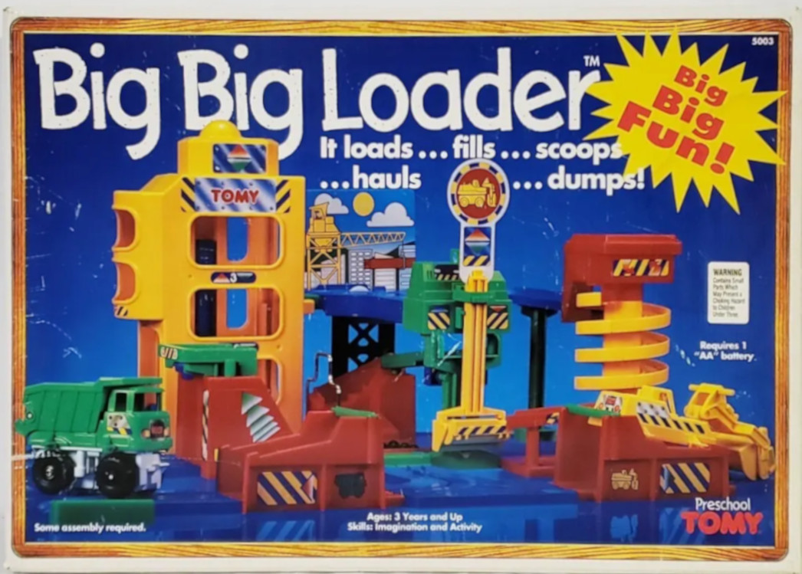
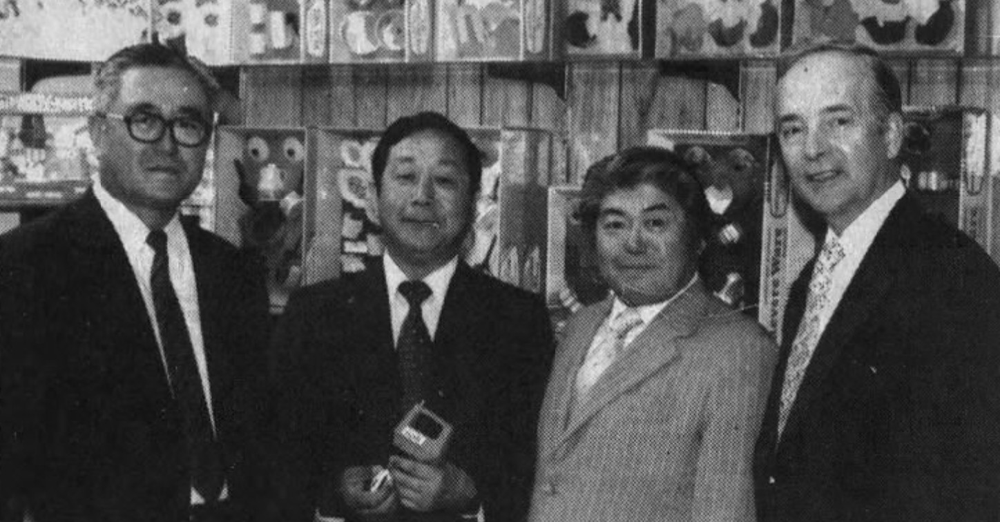
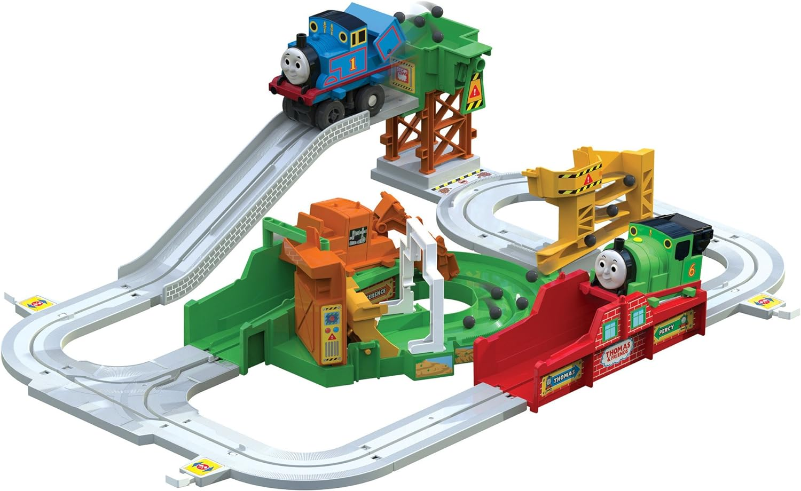

## ON TOY HISTORY
# The TOMY Big Loader
## An Endless Loop of Dump Trucking and Forward Loading
#Toys, #Review, #Play, #Tomy, #Inventions

*In 1977, an elaborate toy* was unleashed in the American market. The plaything garnered reviews in newspapers.

"The car loads small marbles at one station, carries them to others, unloads them at another, moving back and forth along the tracks as needed."

Steve Hicks at a Belk's in North Carolina deservingly gave this Rube Goldberg machine gravitas.

"A lot of retired men like this one. - Their grandchildren may not get much time to play with it," said Hicks in the *Hanes Mall Herald*.

The [Tomy Big Loader](https://toytales.ca/big-loader-construction-set-from-tomy-1977/) contained eight feet of track with twelve sections. It ran for forty-five seconds each cycle, requiring over two square feet of room.

Big Loader was developed in Tokyo, Japan, under their toy mothership, [Tomy Kogyo Co., Ltd.](https://en.wikipedia.org/wiki/Tomy) (Kogyo roughly means to entertain.) In the United States, it appeared alongside their pocket toys, such as the [Tomy Blip](https://en.wikipedia.org/wiki/Blip_(console)), a mechanical pong handheld, and [Waterful Tic-Tac-Toe](https://www.youtube.com/watch?v=YEihOFwGvH0), a portable water game.

Their well-known robots, such as the five hundred dollar [Omnibot](https://www.theoldrobots.com/tomybot.html), had yet to arrive.

Big Loader was the brainchild of their inventor, Makoto Saito. It was a shuttle toy within their [*Plarail* line](https://en.wikipedia.org/wiki/Plarail), given a "big" name for a wide-open America.

 of the Big Loader was filed in December 1977.](images/78-02.jpeg)

The Big Loader's novelty used a single-moving vehicle, transforming into a dump truck or front loader. It was an ingenious mechanic through swappable bodies.

The set was passed through Carson, California, Tomy's then-nascent U.S. offices. It was their fast-growing subsidiary in America, established in 1973 in tow with eventual toy veteran [Bill Carlson](https://simple.wikipedia.org/wiki/Teenage_Mutant_Ninja_Turtles).

As they found domestic buyers in the trade, Big Loader was distributed by [Parker Brothers](https://en.wikipedia.org/wiki/Parker_Brothers).

Adding to its excitement, the Big Loader performed its technical duties without complaint, *in reverse*, a feat not seen in toys. The input was given to the moving vehicle via buttons hanging off the track.

"Even though it wasn't computerized, it seems like the ultimate computer toy, since it can go on forever, playing by itself," wrote *The Los Angeles Times*.

The author, John Pashdag, was not keen on its play value. "Big Loader is the kind of toy [kid-]adults buy because it looks neat. Children might watch it for five minutes and get bored - ."

.](images/78-03.jpeg)

"The Big Loader construction set, a new import of Parker Brothers, promises to be a big seller. - Only 30,000 of the Big Loader are to be imported - ." Canadian children were disappointed in 1978, as reported by the *Montreal Star*.

Wherever Big Loader was offered, it sold out quickly. "Mrs. Stanton says The Big Loader Construction set by Tomy is one of the fastest selling toys in her [toy] shop," reported *Florida Today*.

[Palitoy](https://en.wikipedia.org/wiki/Palitoy) would resell the line in Europe through the mid-1980s, serving the United Kingdom with amazement. [Estrela](https://en.wikipedia.org/wiki/Estrela_(company)) would name it "Maxi-Cargo" for South America. It was known internationally as "Automatic Transport Service," such as in Australia.

The toy was successful in numerous iterations. It appeared in the US from 1977 to 1982, then again from 1989 through 1993.

There was also that time in Holiday 1991 when Tomy could not meet the demand of the Big Loader. "[The Big Loader] will not be available due to the manufacturer's inability to ship," wrote *Newsday*.

---

In 1994, the "Big Big Loader" appeared, as it seemed the toy could not get any... bigger. It was a nod to former employee Mr. Saito. [Hisashi Shiraishi](https://patents.google.com/patent/US5441435A) invented the extended add-on with a working elevator.

"Most of Tomy's toys - are conceived and built in Japan. Many are later renamed and modified for U.S. tastes at the Carlson plant," wrote Mark Gladstone from the *Los Angeles Times*.

 was filed in March 1994.](images/78-04.jpeg)

Color dyes would be injected into the new line as the orange and gray of the 1970s made room for the primary colors of the 1990s. Prices went from twelve to thirty dollars.

Following price inflation, their marketing team piled on the adjectives. Tomy "Big Big Big Loader" was added into the mix, including both the original and the new layout in one box.

Each set could be chained together as their new marketing tune played on the TV. A truck-driving foreman muppet, somewhat fitting into Henson's Fraggle Rock aesthetic, [sang](https://www.youtube.com/watch?v=QurDlKOkpvo), "Big... Big... Loader! Big Big Loader works all day long! So I'll sing this big big song!"

Former advertisement executives at Sachs-Finley were beside themselves.

"There's nothing to do after the Big Loader starts up but look on in wonder," wrote Gary Bouder in *Owatta Citizen*. "For those old enough to talk, [it's] a great conversation piece."

As the 1990s ended, Tomy fused the intellectual property of [Thomas the Train](https://us.tomy.com/brand/big-loader/). It licensed the brand, which was relatable to children growing up on its TV media. But it wasn't all well received.

"Thomas' Big Big Loader doesn't involve much action on the part of the children," wrote John Hayes in *Pittsburgh Post-Gazette*. "[Claire] Green might call it a 'one trick pony.'" Claire was president of the [Parents' Choice Foundation](http://parents-choice.org/).

But there was a skillful utility in the toy.

"At the time I ran across the Big Loader, I was teaching beginners of computer programming. - I set up this device in front of the class and let them watch it repetitively - [to] perceive the steps in writing a computer program", said Robert Morgan, a teacher in Ohio.

In the 2010s, Tomy brilliantly infused [John Deere](https://www.deere.com/en/index.html), a beloved brand of farm equipment.

"In 2010, North America accounted for 6 percent of Tomy's sales - it hopes to boost that to 25 percent by 2014," wrote the *Chicago Tribune*.

After Tomy acquired RC2 Corporation, they excised its license to American hardware alongside its diecast farm vehicles once commanded by [Ertl](https://en.wikipedia.org/wiki/Ertl_Company).

[A personified John Deere play set is manufactured to this day.](images/78-06.jpeg)

Tomy produced the right combination of duty, work, and automatic play.

---

"There's a new Big Loader construction set, by TOMY, for about $18.95, that can keep youngsters and oldsters entranced for hours," wrote Sandra Pesmen in *Chicago Daily News*.

Founding president [Eiichiro Tomiyama](https://www.takaratomy.co.jp/english/company/csr/history1.html), speaking through an interpreter, appeared at the expanding Tomy U.S. offices in Carson, California, in 1978. "Toys know no international boundaries," he said firmly.

As American employees looked on, a reporter from the *News-Pilot* was taking notes as Mr. Tomiyama spoke. "[We will] strive to create a genuine blending of the culture, society, and people of the U.S. and Japan."

"We want to make quality toys. Toys that bring joy and toys that enrich children's lives," said Eiichiro.

"Eiichrio Tomiyama always wanted to make toys in the United States," said Bill Carlson, then vice president of marketing and sales to *The Los Angeles Times*.

But somehow, the Big Loader captured everyone for a moment in time.

"I had one guy come in here and buy it for his bar. See, you don't even have to have a kid to buy a toy at Christmas," said Mr. Kosofsky, owner of a toy store, to reporter Stephaine Sevick of *Record-Journal*.

---

In 2006, Tomy merged with Takara, forming TakaraTomy "with the aim of maximizing their respective strengths and becoming the world's top toy manufacturer," their [corporate website](https://www.takaratomy.co.jp/english/company/company/history.html#anc07) stated.

Takara invented the platform that enabled Americanized [Transformers](https://en.wikipedia.org/wiki/Transformers), which [Hasbro](https://en.wikipedia.org/wiki/Hasbro) licensed in 1984, forever paying royalties.

Eventually, Hasbro acquired Tomy's US assets. In October 1986, Tomy US entered an agreement with [Coleco](https://en.wikipedia.org/wiki/Coleco) after tepid sales. "Tomy is no prize at the moment, but it has an awful lot of potential," said financial analyst Paul Valentine to *Hartford Courant*.

However, Coleco failed soon after. Its assets were bought in 1989 by Hasbro. "Its Playskool division will market some products licensed from TOMY Corp. of Japan - " reported by *UPI*.

Following the shuffling, present-day TOMY International, Inc. was established in Mid-West America. Tomy and their neighbors, [Round 2 LLC](https://en.wikipedia.org/wiki/Round_2_(company)), have a significant stake in American iconic toy tooling.

Today, Tomy's [toy catalog](https://issuu.com/blakegoldenberg/docs/23tomy_catalog_low) lists the Big Loader in John Deere trim. The Thomas the Train version is available [for purchase](https://www.amazon.com/stores/page/F7C5F673-27AB-4C78-878A-1A2C7CB61F17) on Amazon.

While the Big Loader continues selling half a century after its release, some say the gimmick is all the same. Others consider it an enduring kit of mechanical wonder.

"On and on it goes, automatically like perpetual motion," John Pashdag wrote.

Wherever you are, Mr. Saito and team, thank you.

---

*This author is searching for a sealed Big Loader set (1977 edition) or its original market memorabilia (rare print media). Leave a comment below to share your memories.*

 run of the Tomy Big Loader at 10x speed.](images/78-09.gif)
