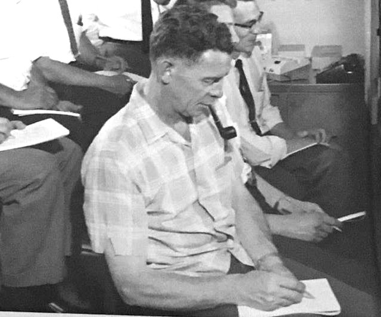
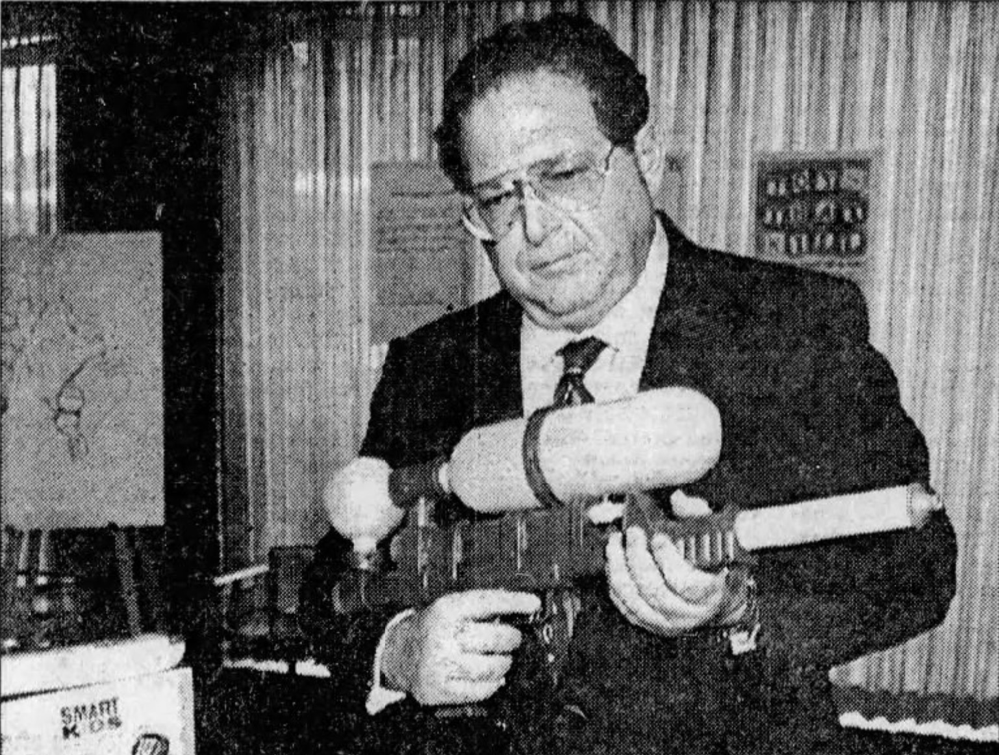

## ON TOY HISTORY
# The Fisher-Price Action Garage
## Crank Up The Elevator To Zoom Down Its Bumpy Nostalgic Ramp
#toys, #history, #fisherprice, #mattel, #legacy

---

*This draft is part of an American Toy Anthology. For information on the upcoming publication, see this author's announcement, [Undercover Toy Stories](https://medium.com/@solidi/upcoming-book-technical-toy-stories-80d5bfbd76c0): Volume One.*

*The following contains true stories of people behind the toys, some of which may be disturbing. This read is not intended for children.*

---

*FISHER-PRICE TOYS OPENED* up its third manufacturing plant in 1970. Vice President Harvey W. Busch inspects the toys coming off the line for the Christmas rush. Behind him are dedicated employees like Mildred F. Malone, who manufactures the [Pull-A-Tune Pony](https://thisoldtoy.com/l_fp_set/toy-pages/100-199/190-pullatuneponymusicbox.html).

Harvey is leading the fabrication of new "Play Family" products. A photo is snapped, forever capturing its then-American production line, serving its [Silent Generation](https://en.wikipedia.org/wiki/Silent_Generation) parents.

It's part of unknowing business history.

Harvey stands before an iconic childhood plaything. The playset is the [#930 Play Family Action Garage](https://thisoldtoy.com/l_fp_set/toy-pages/900-999/930-playfamilyactiongarage.html). Years later, Fisher-Price rebranded "Play Family" as "[The Little People](https://en.wikipedia.org/wiki/Little_People_(toys))."

"Fisher-Price turned the former Heinz plant into a manufacturing center for toys, beginning in 1970. It employed 950 people here at its peak, earning Medina the nickname of 'Toy Town,'" wrote the editor of [Orleanshub.com](https://orleanshub.com/).

Ketchup was in the past. Playthings were its future.

The [Village of Medina](https://villagemedina.org/) produced the first action garages, a playset made with a masonite base. At this time, durable plastic was expensive to manufacture. Initially selling for eight dollars, the design persisted for fifteen years.

"He [Harvey] was instrumental in the planning and construction of a number of new facilities for Fisher-Price in the United States and abroad."

Harvey served as planning director for Fisher-Price's expansion. In his first significant directing operation, he orchestrated as plant manager, forging endless hours of play for children.

Henry W. Coords, then president of Fisher-Price, told a *Newsday* reporter, "There will be more emphasis on toys with which the children can become deeply involved rather than sitting by as spectators - ." "The toy [action garage] encourages imaginative play for both boys and girls."

"It's been described as the American mother is having a love affair with Fisher-Price toys," noted Terry Thompson, their communications director.

Harvey said, "[the Medina factory is] one of the finest toy manufacturing plants anywhere." Their Play Family product line was now cranking.

This toy plant, located on the western edge of New York, was his baby.

---

A year prior, in East Aurora, the engineers Duane "Duke" Spengler and George "Geo" Bartoo crafted the action garage elevator, bringing a ding of the bell in each turn.

Not many people noticed, but its mechanism was an *endless crank*, a novelty for toys. Generations later, a Reddit user said, "That elevator blew our [ - - ] minds man."

They reported to Bob Hicks, vice president of research and development (R&D), taking command from long-time leader Les Sly. Hicks pitched to the decision-makers like founder [Herman Fisher](https://en.wikipedia.org/wiki/Herman_Fisher) as the engineers and artists looked on.

Even in his last years, Herman had greenlit toys for production [at the table of the R&D team](https://www.facebook.com/1441446959444273/photos/pb.100063765855593.-2207520000/1710300085892291).

The action garage's elevator accepted a car that seated the mini-figures. As the child cranked the lever, the vehicle reached the top. The back of the floor moved at an angle, sending it out for a ride down its ramp.

The car zoomed way off the set. The kids loved it as Mr. Spengler took notes in their state-of-the-art "Play Lab" observation nursery, established in 1961.

Duke and Geo designed the green service lift called the "grease rack." It also contained an endless crank. The design had a circular guide that conserved space while performing its mechanical function.

"Simple in design, their general concept is to help develop the child's co-ordination [*sic*]. A good example is the Fisher-Price Play Family action garage," wrote Eleanor Callaghan in the *Montreal Star*.

, has a tilting platform within its cart.](images/79-04.jpeg)

The engineers at Fisher-Price discovered the elevator exit mechanism from the Child Guidance toy, the [Park-A-Matic](https://www.grandoldtoys.com/toydb_Detail.php?id=239). It was listed as "prior art" in the patent.

Jay Becker of *The Lincoln Star* said, "Little people drive the cars and operate various mechanisms which are pure enjoyment for any preschooler."

With engineers present since the 1930s, their research and development group produced toy dreams. Spengler was one of the senior designers in the group, connecting the old guard to its new pretenders.

Duke, an inquisitive individual, was depicted in drawings as a thinker. He passed away in 1989, aged 74.

---

As to the action garage's brilliant engineering, Fisher-Price's design aesthetic was beautiful, a class in all its own. Their commercial "lithos" were unique.

They gave Fisher-Price toys their charm.

Sharp illustrations lined the playsets in various sections. A child could imagine the working garage. The solid color aesthetic perfectly placed in hidden areas was the definition of whimsy.

"As art director, he oversaw a period of rapid expansion and creativity at the company."

[John D. Smith](https://www.eastaurorany.com/articles/spotlight-on-john-d-smith/) is credited with the removable toy figure concept circa 1958, even before he joined Fisher-Price. A surviving [school bus sketch](https://www.facebook.com/1441446959444273/photos/pb.100063765855593.-2207520000/1769470516641914) confirms its history. *

 artwork, 1969.](images/79-05.jpeg)

"Many of the early designs came from Margaret Evans Price." John was the keeper of visual style, taking up the design guide of illustrator [Mrs. Price](https://en.wikipedia.org/wiki/Margaret_Evans_Price). Both worked for former cartographers, one at [Rand McNally](https://en.wikipedia.org/wiki/Rand_McNally) and one for Uncle Sam during World War II, who also received a [Bronze Star](https://en.wikipedia.org/wiki/Bronze_Star_Medal).

John brought his style and infused it into the lithography.

And while these figurines appeared for years in the 1960s, it wasn't until late in the decade that the Play Family sets were devised.

Arguably, Bob Ostrander crafted its first "play activity" platform set, the [Dump Truckers](https://www.thisoldtoy.com/l_fp_set/toy-pages/900-999/979-dumptruckers.html). Then, John worked on the action garage with another artist as Bob custom-engineered the recessed peg into iconic figurines.

The Dump Truckers is one of the earliest examples of a platform playset of the plastics era.

, 1966.](images/79-06.jpeg)

The action garage became one of many sets in the following years. Bob Ostrander crafted its firsts, like the [#915 Farm](https://medium.com/@solidi/the-fisher-price-action-garage-15b6a9556e2a#915). Its box said, "The Big Red Barn That Moo-mooo's."

Then, as team members joined in, several sets were cranked out.

"He came from an artistic family." Later, Paul J. Deinzer managed the artwork for twenty years before retiring in 1990. He studied a real-life Canadian castle north of East Aurora. It became the [#993 Play Family Castle](https://thisoldtoy.com/l_fp_set/toy-pages/900-999/993-castle.html), forged in Fisher-Price plastic.

It was a popular playset.

Two generations later, Fisher-Price released the Fun Sounds Garage, with a deco of castle arches - *lining the elevator* - inspired by the work. Or at least one would suspect that its toy maker grew up playing with the action garage.

"Most people don't have the opportunity to do what I've done. I've done what I love to do, and I feel grateful," said John Smith in a final interview with the *East Aurora Advertiser*.

The Fisher-Price R&D team comprised 20–25 talented people in its golden era between 1958 and 1978. Their distant stories have yet to be told.

John passed away in 2013. His son, Eric, maintains a [Facebook page](https://www.facebook.com/p/John-D-Smith-and-Fisher-Price-Play-Family-People-100063765855593) that features artifacts of their timeless work.

---

"In January of 1971, Iain Cunningham, then only 13 months old, ingested an object which a jury found was a toy manufactured by the defendant." The Canadian child was resuscitated by his parents, albeit he suffered severe brain damage.

He choked on a family play figure. Their family sued.

His tort case received crucial attention in the history of toys. Edward Swartz's firm, who became known in the industry, represented Iain and his family.

Edward, a Boston trial lawyer, championed accountability for kid's safety in toys, writing two books on its grim realities. His second book, "[*Toys That Kill*](https://www.amazon.com/Toys-That-Kill-edward-swartz/dp/0394746074)," featured Fisher-Price's Little People on its cover.

Iain's case was initially filed in 1973. Fisher-Price's President Henry Coord, R&D vice president Bob Hicks, and other senior engineers like Bob Ostrander testified in Iain's case.

After volumes of testimony, a judgment in the plaintiff's favor was decided.

"It's been such a long time. We have waited a long time for this," Mrs. Cummingham, Iain's mother, said on its 1981 verdict of 3.1 million dollars in damages.

The years dragged on, and in 1987, a settlement in Iain's case was reached for 2.25 million dollars. The process lasted seventeen years. Fisher-Price defended its position as it adhered to all compliance laws. And those laws would change.

From his book, *Toys That Kill*, "With its new line of toys for 1986, Fisher-Price has changed the packaging for some of its Play Family items. - A new message appears on this package: Ages: 2–6."

"The company is finally acknowledging the hazard for children - ." At this time, some toys did not have such age labels.

By 1990, New York State ordered Fisher-Price to place a choking hazard label on its packaging nationwide. Months later, it rolled out its "chunky" line, which increased the diameter of the toy figures, reducing choking hazards.

In 1995, all toys sold in the United States had to comply with updated choking hazards and display prompt visual warnings.

Fisher-Price refreshed the "Little People" again to its final form, "articulated," which was impossible to choke on at age one. They released them in 1997.

When Schwarz passed away in 2010, [Health Canada](https://www.canada.ca/en/health-canada.html) released the statement "[to immediately discard](https://scalliwagtoys.wordpress.com/2010/03/27/recall-from-health-canada-on-pre-1991-fisher-price-little-people/) all older Fisher-Price 'Little People' figures manufactured before 1991."

Another child inhaled a figurine and died. †

Four play-family figures were included with the action garage. Even after Fisher-Price launched its "Family Alert Program" in 1992, the problem continues.

Iain's case is now cited in law, Cunningham v. Quaker Oats Co., Fisher-Price Division. The accused Play Family figures and [School Bus](https://www.thisoldtoy.com/l_fp_set/toy-pages/100-199/192-schoolbus.html) are displayed at the [American Museum of Tort Law in Connecticut](https://www.tortmuseum.org/).

In stark contrast, the Play Family [House](https://americanhistory.si.edu/collections/nmah_318248) playset, crafted by [Ralph W. Crawford](https://www.museumofplay.org/toys/fisher-price-corn-popper/), sits in the Smithsonian National Museum of American History. Crawford, a toy designer with Fisher-Price since 1936, contributed to numerous play activity sets that Duke, Bob, and others crafted.

, a comparison of Fisher-Price Little People figures manufactured before 1991 (top) and after 1991 (bottom).](images/79-09.jpeg)

While some considered Mr. Swartz a hysterical nuisance, others hailed him a hero. What is clear is that the continuing injuries and deaths are not officially tallied in an easy-to-find report. If there is one, this author would like to know.

Fisher-Price has never officially admitted fault to the media.

---

Around the time the action garage was developed, Fisher-Price sold itself to Quaker Oats in 1969 due to sales instability. Then Herman Fisher, the "Fisher" in Fisher-Price, one sitting in R&D meetings, never entered his company again.

"After the huge success of the Little People line in 1968, The Quaker Oats Company of Chicago, Illinois saw an opportunity for growth and purchased Fisher-Price -," from *Fisher-Price, 1931–1963: A Historical, Rarity, Value Guide.*

Herman walked away, selling out to "Big Breakfast."

An employee told the *Democrat and Chronicle*, "He [Herman] never returned to the factory after he sold it to Quaker." Fisher-Price was sold for 38 million dollars (320 million in 2024). He passed away in 1975.

From 1970 through 1985, the action garage remained the same, albeit refreshed to comply with safety regulations. After that, numerous iterations were engineered to the ground, eroding its legacy.

It just looks too cheap, bulky, and clumsy compared to the masonite base," wrote the author at [thisoldtoy.com](https://thisoldtoy.com/).

"[The action garage] went through several identity crises - ." Engineers added more plastic. The elevator mechanism was simplified, no longer an endless drive.

As the 1980s ended, Little People's playset grinding faded. The once-breakfast cereal takeovers began to divest their grip on toy manufacturers. Fisher-Price faltered and, in 1990, closed its main outdated plant. "It doesn't have the fabrication, the assembly, and the plastic molding capability - " reported the *Associated Press*.

A year later, the owning company looked for new investors. "The company firm [Quaker Oats] was looking at 'all options' for Fisher-Price."

"[A] $1-billion dollar merger that likely will make the combined company the nation's No. 1 toy maker," stated *The Los Angeles Times*.

In August 1993, Mattel acquired Fisher-Price, making it an operating subsidiary. After that, the Medina plant in New York, which once manufactured the action garage, permanently closed. There was disappointment from dedicated employees.

"Tossing back beers with his colleagues at O'Briens -, Fisher-Price employee [Marshall] Hare said the prevalent emotion following - was bitterness."

Fisher-Price's plastic riveters joined the growing American Rust Belt.

---

As the century turned, the original action garage found life among families. It was a preferred playset for visiting grandchildren. Kids tossed aside other toys in favor of the garage.

In a rare twist, the action garage was considered popular among girls.

"Lydia has the advantage of family favorites such as the Fisher-Price parking garage that her grandparents have saved for her." Jilanine Burley of *The News Journal* made it clear. "Gifts passed down from generation to generation help keep memories and tradition alive."

Long out of production, the action garage sets were sought after in vintage toy stores. They appeared almost everywhere and appealed to everyone.

"Fisher-Price farms, parking garages, and other play set line some of the shelves [were available for sale]," wrote Heidi Prescott, covering an opening of a vintage toy store in The *South Bend Tribune*.

The original Fisher-Price R&D team turned over with the times. They produced at least ten sets in the 1970s, including a House, Farm, and Airport. Then, it continued into the mid-eighties with a Zoo, Jetport, Main Street, and others.

In between, there were abandoned prototypes. These included a [Walt Disney Castle and a Space Station](https://www.facebook.com/photo?fbid=2854883158100639), which appeased the need for Space Shuttle-themed toys of the 80s. Later, a Fisher-Price competitor, [Playmates Toys](https://en.wikipedia.org/wiki/Playmates_Toys), cashed in on the idea with their space stations.

In total, Fisher-Price's sentimental commercial playset run is a significant event in toy history that impacted the lives of countless American children.

, [Barn](https://patents.google.com/patent/USD304219S/en), [Zoo](https://patents.google.com/patent/USD282385S/en), [Airport](https://patents.google.com/patent/USD267570S/en)) from the 1980s.](images/79-13.jpeg)

With Mattel's acquisition, Fisher-Price's manufacturing saga was complete. New toys became a global commodity, and old toys became an American New York legacy.

---

"At long last, a big honor for the Little People." *Associated Press* reported they finally made the [Toy Hall of Fame](https://www.museumofplay.org/) in 2016.

By this time, unsung icons of the original Fisher-Price Research and Development Group who forged the playsets were "late" in its delightful honor.

It was ten years since the massive lead recall affected the Fisher-Price line. [Robert Eckert](https://en.wikipedia.org/wiki/Robert_A._Eckert), then CEO of Mattel, testified before Congress.

"I, like you, am deeply disturbed and disappointed by recent events," said Eckert.

A trail led back to Chinese manufacturing. 52-year-old [Zang Shuhong](https://en.m.wikipedia.org/wiki/Zhang_Shuhong) was a dedicated businessman who ran manufacturing plants for Lee Der. He and his team accepted falsified certificates from a third-party paint trading company as proof of safety.

Zang had testing equipment, but it was unclear why it did not detect the issue.

*New York Times* headlined, "A chain of blame ends in suicide." Living within his manufacturing plant(s), he dedicated himself to business, manufacturing children's toys, and the people who worked for him.

Most likely an unknowing gross error that shattered his credibility, Zang hung himself after losing the company's export license. It destroyed his family and the people who worked for him.

Fisher-Price was at the forefront of the biggest toy recall in business history, which caught the attention of the US Congress. Its yellow paint, mixed with lead and cadmium, was toxic. ‡

While their toys were on their belts, the main line of Little People products, including the Racin' Ramps Car Garage (2007–2011), *did not* appear [on the recall list](https://service.mattel.com/us/recall/39054_IVR.asp).

However, preschool construction vehicles similar in size to garage-compatible vehicles were listed. Toys adorned with recognizable characters threaten the health of preschool children.

The [Consumer Product Safety Commission](https://www.cpsc.gov/) (CPSC) managed Fisher-Price's recall in the United States. "[Mattel and Fisher-Price have] agreed to pay a $2.3 million [civil penalty](https://www.cpsc.gov/Newsroom/News-Releases/2009/Mattel-Fisher-Price-to-Pay-23-Million-Civil-Penalty-for-Violating-Federal-Lead-Paint-Ban-Penalty-is-highest-ever-for-CPSC-regulated-product-violations) for violating the federal lead paint ban," said the CPSC. From there, laws on lead paint were tightened further.

Throughout the 2020s, the CPSC continues to report toys containing lead paint. It's a lingering problem.

---

In its endless mission of play, Mattel released the Fisher-Price Little People [Helpful Neighbor's Garage](https://shop.mattel.com/products/fisher-price-little-people-helpful-neighbors-garage-fhg50-en-ca), its latest iteration. This shift from compliance to today's social responsibility and sustainability is significant.

The updated garage has an elevator that tilts the cars down a ramp, this time a spiral, after exiting the elevator. While the playset line appeared never-ending, the endless crank elevator was long gone, requiring a second hand to hold the playset in place.

The cars sometimes stick, never completing the zoom off the playset. Sadly, there are no hidden lithos kids can dream into. The Little People are permanently fused into the cars.

However, the new playset is compact, durable, and easy to carry, a plus for those [Millennial](https://en.wikipedia.org/wiki/Millennials) parents who look at a screen on the go. And yes, there are hidden molded tools throughout.

Its unknown authors remembered discovery in play-their stories yet to be written.

CNBC [reported](https://www.cnbc.com/2024/03/07/mattel-barbie-strategy-can-revitalize-american-girl-fisher-price-ceo-says.html), "For the company's infant, toddler and preschool segment, which includes Fisher-Price, sales were down 10% [in 2023]." As this article was written, there are headwinds for the brand and pressure of a spin-off from Mattel since it is "hurting shareholder value," an investor said.

But the Fisher-Price brand and the essence of the action garage keep on going.

In 2023, columnist Janet Hommel Mangas [best summarized the playset](https://dailyjournal.net/2023/06/24/janet-hommel-mangas-lessons-from-a-fisher-price-parking-garage/): "It's a miracle that the garage elevator continues to lift cars up to the third parking garage level, and the bell still rings. The set [#930 action garage] provided half a century of fun - ."

With that, the Fisher-Price action garage has been an endless crank of history, reduction, and legacy for fifty-five years. Its R&D team was the first modern toy company to produce volumes of themed playsets, a tradition that continues today.

While Fisher-Price's motto, "Play. Laugh. Grow," persists, the action garage defines "Business. Manufacturing. People." Its artwork and design are a testament to the modern toy age.

---

---

* *The reader can find unique historical artifacts of John D. Smith's time within Fisher-Price R&D on his posthumous [Facebook page](https://www.facebook.com/p/John-D-Smith-and-Fisher-Price-Play-Family-People-100063765855593).*

† *Toy safety attitudes continue to evolve. In America, it is up to adults to decide if vintage toys are in their shared toy box and to be mindful of their developmental age ranges.*

‡ *In 1978, a US federal ban on home lead paint was passed. It also applied to toy goods [based on weight ratio](https://www.cpsc.gov/Newsroom/News-Releases/2009/Nine-Companies-Penalized-for-Selling-Childrens-Products-that-Violated-the-Federal-Lead-Paint-Ban). Prior, the metal was not regulated. In 2017, the yellow plastic in the Action Garage was reported to contain [traces of lead](https://tamararubin.com/2017/11/parking/). This claim and whether the metal is easily absorbed have not been verified.*
