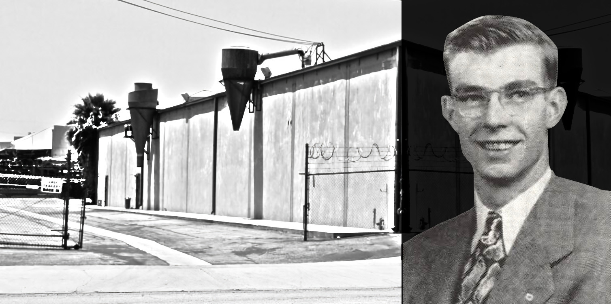

## OPINION ON HISTORY
# The Ultimate Hot Wheels Legend
## Does Evidence Link a Fallen Mattel Toy Inventor to Hot Wheels?
#Opinion, #Investigation, #Accident, #Mattel, #Toys

, a rechargeable motorized 1:64 toy, is a technical feat and a first on the historical toy record. The toy serves as a [story talisman](https://medium.com/go-into-the-story/story-talismans-89b91523e71d) for an unspoken fallen employee.](images/80-01.jpeg)

*Former Mattel artists and engineers tell Hot Wheels collectors this funny prank. Then, they share with others. Everyone laughs. It's perpetual in nature.*

*This author suggests its wild connection to a fallen inventor. Is he the ultimate unspoken Hot Wheels legend?*

*Through the storytelling of people who defined the Hot Wheels brand, this author believes so.*

---

**WHILE BARBIE HAS EXPERIENCED** episodes of personnel drama over the years, Hot Wheels had at least one of its own. Unreported evidence suggests a wild incident occurred in its founding year, 1968.

Since Hot Wheels is about vivid dreams of unlimited horsepower, this story is about a fantastical exploding automobile engine that fell a toy inventor. A man born on Christmas, he was an employee searching for toy technology at [Mattel](https://en.wikipedia.org/wiki/Mattel), leading one of their research teams.

In the drama add a madman inventor the FBI surveilled, a famous scientist who co-invented the bomb and challenged the engine's impossible physics, a TV crew recording the incident, and a photographer who should have been awarded the Pulitzer.

And then the newspaperman who saved people in peril, pouring his admiration and demise for such an inventor in print.

This story holds the gasoline and applies the machismo of never telling. It includes a very long history of media suppression for fifty-five years.

 is shown, which is known to diecast restorers. Mattel is known to have a significant advantage in toy making thanks to its brilliant research teams who patented them. Mattel displays these drawings in documented history.](images/80-02.jpeg)

If the reader looks back in history, critical figures at Mattel have transmitted a story so close to the facts, all of whom contributed to Hot Wheels. The author asks if this tale will cross the finish line for everyone to know.

Since [Mattel Films](https://en.wikipedia.org/wiki/Mattel_Films) is gearing up to create its first live-action movie, what follows reads like its advanced copy. But this story transmits itself, as the author discovered by researching what he loved while sharing the toys with his son.

It started with a question: "Why are the original creators of Hot Wheels repeating this funny joke?" This author believes the prank is a memorial to an inventive leader, a life cut short during a momentous time in America, without ever mentioning his name.

He had fallen in a Southern California parking lot. The timing and location of the information suggest he fell for the Hot Wheels brand.
So, let's start with Hot Wheels printed lore, where the reader can find his connection.

## Derek Gable Tells This Funny Prank, Makes It Canon

Randy Leffingwell, author of the book [*Hot Wheels: 35 Years of Power, Performance, and Attitude*](https://www.amazon.com/Hot-Wheels-Years-Performance-Attitude/dp/0760315736) (*2003*), published a story told by [Derek Gable](https://palosverdesmagazine.com/derek-gable/), a significant contributor to Hot Wheels and a leader of male action figures ([He-Man](https://en.wikipedia.org/wiki/He-Man)) at Mattel into the 1980s.

Joining Mattel in 1968, Mr. Gable is a [decorated toy inventor](https://patents.google.com/?inventor=Derek+Gable&country=US&num=25&sort=old) and media figure. He's appeared in [*Toy Masters*](https://www.imdb.com/title/tt1754780/) (*2012*), [*The Toys That Made Us*](https://www.imdb.com/title/tt7053920/) (*2017*), and [*Barbie Uncovered: A House Divided*](https://www.skygroup.sky/article/-sky-documentaries-unveils-barbie-uncovered) (*2024*).

His story is called the "[Liquid]-air battery," which recalls a prank of the late Mattel engineer [Lenny Moquin](https://patents.google.com/?inventor=Leonard+R.+Moquin). Mr. Moquin was the inventor who developed the tire carrying case for the [Hot Wheels Sweet Sixteen](https://hotwheels.fandom.com/wiki/List_of_1968_Hot_Wheels).

Mr. Gable said, "He had one of the little Mabuchi motors we were developing for the zip cars [later called [Sizzlers](https://hotwheels.fandom.com/wiki/Sizzlers)], and he'd put a propeller on the shaft. He told us he'd come up with a new power source, and it was virtually self-renewing. He called it the [liquid]-air battery."

"We had suspended ceilings in our offices - Lenny climbed a desk and hung the bag where everybody else in other groups could see it."

"Next, he hung the little motor up with the propeller. Then he fed the leads - from the motor down into the liquid - ." The liquid was described as pale yellow.

, based on a modified American Racing rim, symbolizes the iconic toy. Its variation is sold today.](images/80-03.jpeg)

"The propeller started to turn."

Mr. Gable explained that the propeller turned continuously, which excited the engineers since the power source was unknown.

"They started talking about patents-." A patent provides exclusivity to its inventor(s) (or the company they work for) to profit from a novel idea for a time.

"Lenny had to [eventually] tell them. He had gutted the motor." Then, the question arose: how did the propeller spin? "He had cut a hole in the duct and poked another in the ceiling tiles, and so long as the heating or air conditioning was on - his propeller would turn."

The battery was a hoax, as Mr. Moquin filled the bag with urine. At this point, the reader laughs at its reveal.

The original story is called the "urine-air battery."

Uncovered evidence suggests that the gag Mr. Moquin constructed was not a prank but a tribute to the well-liked and fallen leader at Mattel in a California parking lot. He served the toy brand in its opening acts of Hot Wheels.

It is all in the prank's attitude, its "on-display" reveal to attract investment, and its motif of a spinning propeller attached to a motor. But first, let's cover the incident of the fallen inventor.

## An Explosion of a Fantastical Automobile Engine

On Monday, November 18th, 1968, Jack Edward Hartman, a Mattel product director in their preliminary department, died in a parking lot from Josef Papp's [exploding noble gas automobile engine](https://www.infinite-energy.com/iemagazine/issue51/papp.html). It was an unbelievable, perpetual invention.

The event was expunged from the record books, which makes this author interested in discovery. It's an elaborate puzzle being [chipped away](https://www.youtube.com/watch?v=u3rjq8NFd8g) toward truth.

Unlike Mr. Moquin's liquid contraption, Mr. Papp's was [patented](https://patents.google.com/patent/US4428193A/en). It is considered an "over-unity" device, sourcing energy from the unknown.

. It breaks the laws of thermodynamics and energy conservation but was somehow patented with a dyno-test affidavit?](images/80-04.jpeg)

Mr. Papp's engine was claimed perpetual and used a secret fuel whose mixture combination wasn't revealed. The automobile engine ran for 60,000 miles without gasoline. It produced no exhaust.

With white lab coats and a mounted automobile engine in a parking lot surrounded by men in dark suits, it was a science-by-press conference where Mr. Papp's backer, Don Roser, looked for investors.

How did the engine explode? Savant Caltech professor and former Los Alamos team member [Dr. Richard P. Feynman](https://en.wikipedia.org/wiki/Richard_Feynman) confronted engine inventor [Josef Papp](https://en.wikipedia.org/wiki/Josef_Papp).

They had a disputed exchange about the engine's power source via its attached wires. In front of a crowd of at least 35 people, they unplugged and plugged them to prove or disprove fraud, which caused the engine to blow up.

 about Josef Papp, which included a discussion of how he evaded his investors while others believed in him. A prolific quack inventor, he's seen here driving something imaginary to reporters in 1966 (Getty / Rights Licensed to Author).](images/80-05.jpeg)

Mr. Hartman, who represented Mattel in the incident, was the unlucky bystander in the shrapnel's trajectory. Two others from aviation companies were maimed, and a score of others were injured, too, one of whom was a news reporter. A cameraman from a local TV station was injured.

The cameraman, Del Linman, recorded film throughout the demonstration. Johnny P. O'Donnell was the reporter who wrote a story about the fallen man's dying moments at a time when it was taboo.

The Los Angeles Sheriff's Department (LASD) closed Hartman's case without charges after the incident. Detective Harold White is printed in association with the case.

Complete with post-explosion radiation detectors of which the [LaCoFD](https://fire.lacounty.gov/) Hazmat Response Team was concerned, Dr. Feynman's name appeared in [one local newspaper](https://gardenavalleynews.org/), and his allergic reaction to such perpetual devices was written. The injured news reporter wrote its [full accounting](https://medium.com/@solidi/a-tragic-american-toy-story-f0c19e58534e).

The investigation was closed in under 48 hours. This author suspects something amiss because of the incident's complexity, with scores of witnesses and questions of technology, and because it was printed as a "non-professional and amateurish" demonstration.

Mr. Papp and Mr. Roser had many burdens to clear up quickly. Then, evidence of not cooperating fully, "the firm refused to disclose to officials the chemical composition of the fuel." They never revealed the technology when the authorities asked.

Adding to the complexity, Dr. Feynman remained hidden, as news agencies AP, UPI, and The Los Angeles Times failed to mention the Nobel Laureate's name. It included a manhunt that circulated in the news.

Dr. Richard Feynman is "The Great Explainer" of science. In 1942, [J. Robert Oppenheimer](https://en.wikipedia.org/wiki/J._Robert_Oppenheimer) hand-selected him for the [Trinity project](https://en.wikipedia.org/wiki/Trinity_(nuclear_test)). As a team leader, he co-created the atomic bomb. While working at Caltech, he was awarded the Nobel Peace Prize in 1965.

, including Mr. Hartman's and Josef Papp.](images/80-06.jpeg)

Later, author and close confidant [Ralph Leighton](https://en.wikipedia.org/wiki/Ralph_Leighton) captured his delightful stories of merrymaking, including picking locks and breaching security checks at Los Alamos.

The scientist's presence in the parking lot remained unverified for decades, and Dr. Feynman's [accounting](https://hoaxes.org/comments/papparticle2.html), which contained blatant mistakes, has never been corroborated.

That is until a [newspaper print](https://josephpapp.com/gardena-valley-news-nov-21-1968/) appeared online in 2022 by an anonymous tribute site to the engine's inventor. It is believed the paper passed hands underground for a time, but it resisted the Internet's revelation.

Subsequently, this author verified the record on microfilm in 2023. However, Dr. Feynman's accounting remains in question, with the possibility of embellishing his reported actions.

The uncovered newspaper contained written evidence Dr. Feynman had never touched the engine or its wires, only Mr. Papp. That assertion also conflicts with other sources but gives LASD weight in declaring it an accident in combination with reviewing the film in the frame.

Evidence suggests Dr. Feynman's story was written while alive, with mistakes placed to avoid corroboration. Even with placed errors, Dr. Feynman's story was suppressed [where it was intended](https://en.wikipedia.org/wiki/Surely_You%27re_Joking,_Mr._Feynman!) for publication.

A source confirmed that the publisher, [W. W. Norton](https://wwnorton.com/), rejected the story. This author surmises its draft complimented the chapter "Cargo Cult Science."

Instead, Mr. Feynman's telling appeared in low-volume print, becoming an urban legend. Its incorrect [facts](https://en.wikipedia.org/wiki/History_of_perpetual_motion_machines#1951_to_1980) [appear](https://en.wikipedia.org/wiki/Josef_Papp) on Wikipedia and should be corrected with the source.

 is on printed record relaying to press the death of Mr. Hartman. Right: Don L. Roser, who invested in Josef Papp. After the incident, their 50:50 partnership ended. Through [documented court cases](https://josephpapp.com/), Mr. Roser believed that Mr. Papp had the secret. He fought to obtain it until he died in 1998.](images/80-07.jpeg)

Both Mr. Papp and Dr. Feynman have been gone since the late 1980s. Questions surrounding the incident remain (such as the lawsuit due to a lack of corroborated evidence).

This author cannot rule out a strong connection among men (excluding the scientist) in the strain of serving justice or eroding the legendary standoff in a "J. Edgar moment," with vague actions remembered twenty years after.

Printed evidence states that Mr. Roser and Mr. Papp obstructed the investigation, failing to reveal the fuel composition.

Or, the real brow-raiser, everything happened the way history remembers, and authorities ruled an accident by balancing the scales of wrongs - which isn't justice. Still, this author thinks time will answer all.

Yes, this story is real and troubling, but what of the man, Mr. Hartman?

## Mattel Alumni Remembers Jack Hartman

While this author investigated such a fascinating case of technical mystery deep in the space race, numerous Mattel Alumni were generous in answering questions about Hartman-those who remembered him as a respected gentleman.

"He was well-liked and always appeared in nice suits." Another former employee remembered Jack as "smiling, riding his velocipede in the hallways."

"It was a tragedy," a source replied. "He gave me a raise," replied another. "He always ensured his engineers had interesting projects."

While the suspected hijinks at Mattel were fabricated, a source verified Mr. Gable's printed recollection.

They noted the prank involved not a bag but a clear plastic party cup labeled "Urine Battery" being hung in an area between competing research teams at Mattel. They confirmed engineers were free to investigate new tech on the clock outside the office.

. Sharing this is essential to exploring the remaining pieces of this puzzle. Note Mr. Papp's bladed fan, which has an placed mirror above it.](images/80-08.jpeg)

Hartman died on the job in Gardena, California, a short drive from Mattel's then-Hawthorne office. He was captured in numerous photos minutes before his death.

Shockingly, and why suppression is suspected, Mattel Alumni did not know the full circumstances of the incident. However, they remembered Mr. Hartman a half-century later.

Some heard of "his name," and for whatever reason, this author detected hesitation in discussing his memory.

For those who were close, he was well-loved and a respected inventor who held his engineers in the highest regard. For a moment, his dedication made this author pause in tribute. It was [an awful event](https://medium.com/@solidi/a-tragic-american-toy-story-f0c19e58534e).

From what this author can construct, Jack Edward Hartman worked for Mattel for six years. He rose in rank to a preliminary design director, a think-tank pipeline for toy creation. The team served its brands Hot Wheels, Barbie, and others.

Sources said he operated Mattel's adjacent preliminary design group on the 2nd floor in its Hawthorne office. This group competed with [Jack Ryan's](https://en.wikipedia.org/wiki/Jack_Ryan_(designer)) team on the 3rd floor, which had a patent royalty on inventions.

The [Handlers](https://en.wikipedia.org/wiki/Ruth_Handler), founders of Mattel, had set up the group for Mr. Hartman to balance toy research and tap into its competitive nature to supercharge the business invention pipeline. Hartman led Mattel's competing team.

Competing research and development teams are nothing new in corporations. For instance, video game developer Nintendo had at least four teams.

After the tragic event, a source verified engineering director [Jack Barcus](https://www.iheart.com/podcast/269-dream-house-the-real-story-104903034/episode/ep-8-derek-gable-from-104903045/) took over Hartman's remaining group. Mr. Gable described Mr. Barcus as a "Big huge dude" in a 2022 podcast with Jack Ryan's daughter, Ann Ryan, on her podcast [Dream House](https://www.iheart.com/podcast/269-dream-house-the-real-story-104903034/episode/ep-8-derek-gable-from-104903045/).

Mr. Gable said that Mr. Barcus and Mr. Ryan competed, and this is true. However, he was not the only leader to do so - sources confirmed Mr. Hartman.

. A close source confirmed he never spoke about the incident to them for whatever reason, which adds to suppressive tones. A separate UPI photo matches the engine stand in the background. Mr. Huthmaker's work was not awarded, but this author believes it deserves re-evaluation.](images/80-09.jpeg)

Before [OSHA](https://en.wikipedia.org/wiki/Occupational_Safety_and_Health_Administration), it is believed Ruth and Elliot Handler privately moved mountains to support the Hartman family after the tragic accident. Its back story remains unclear until someone comes forward to tell this author.

Then, there is Larry Wood, who tells the story. The attitude, its on-display presentation, and the motif of a spinning propeller are repeated. In this retelling, there is mention of "no gas."

## Larry Wood Tells This Tale Too, Is It Legend?

While we can take Mr. Gable's recounting to Mr. Leffingwell as printed Hot Wheels lore, [Larry Wood](https://hotwheels.fandom.com/wiki/Larry_Wood), who defined the brand, tells the tale that elevates Mr. Hartman to legend status.

Mr. Wood worked for Pratt and Whitney, Lockheed, and Ford. He secured a design job in exchange with [Howard Rees](https://hotwheels.fandom.com/wiki/Howard_Rees), who then produced [Major Matt Mason](https://corporate.mattel.com/brand-portfolio/major-matt-mason) space toys. Mr. Rees left the company in 1975.

 Hot Wheels patent has a novel chassis and suspension.](images/80-10.jpeg)

Starting [in late 1968](https://www.youtube.com/watch?v=hruvV5LYcF0), Mr. Wood infused his concepts into Hot Wheels, like the [Tri Baby](https://hotwheels.fandom.com/wiki/Tri_Baby), as one of his first designs exported from his days in Detroit. He worked with other design artists [Harry Bradley](https://en.wikipedia.org/wiki/Harry_Bentley_Bradley), [Paul Tam](https://hotwheels.fandom.com/wiki/Paul_Tam), and [Bob Lovejoy](https://hotwheels.fandom.com/wiki/Bob_Lovejoy).

Mr. Wood applied his famous Hot Wheels aesthetic, which millions of children and adults recognize. He rose to "super principal" (his words from a [2023 Diecast Media Network interview](https://www.youtube.com/watch?v=2tlqeit2Vi4&t=1663s)) as a prolific Hot Wheels designer for forty years. He retired in 2009 and continues consulting for Mattel into the 2020s.

Larry Wood, known for recognizable designs like the "[Bone Shaker](https://hotwheels.fandom.com/wiki/Bone_Shaker)," expressed the story in a 2012 video at a networking event in Palos Verdes for [Peninsula Seniors](https://pvseniors.org/).

Mr. Wood said, "[Here's] my favorite story from Mattel back in the day. There was all sorts of ideas being kicked around. One day, a guy had a propeller on a wire hanging from a ceiling with a bag underneath it - with yellow fluid in this bag and two wires going into the bag."
"The propeller kept going and going and going, and the rumor was that this was a [liquid]-powered engine."

Mr. Wood continued. "And the big shots thought we were going to make a fortune. Forget gas. We could just, you know, everything will be great."

"Well, when it came time to do the investigation, he reworked the air conditioning duct. With a little hose pointed at that propeller so the air conditioning was blowing at the propeller, and it was spinning by itself."

Larry revealed its air conditioning source. The audience laughed.

Before the story was told, he said, "[This is] my favorite story, which won't go on TV." Instead, [it went on YouTube](https://www.youtube.com/watch?v=P4zlTOc4j0o&t=3123s). As of this publishing in April 2024, the video remains available.

Mr. Wood's assertion is strange. It was urine, yes, but is it something deeper?

In an [interview in 2018](https://www.youtube.com/watch?v=G54J7OYVPOs&t=9s), his introduction to Mattel appeared accurate. Mr. Wood said, "[I] got into Mattel, and there were airplanes flying around, and executives riding bicycles down the hallway, and things exploding, and practical jokes every day."

 was filed when Mr. Wood arrived at Mattel, known as "Redlines."](images/80-11.jpeg)

Larry Wood was conducted into the [Automotive Hall of Fame](https://www.youtube.com/watch?v=HyCvvrPlQCA) in 2023 and is forever "Mr. Hot Wheels."

So, is this wild incident connected to Hot Wheels? Mr. Wood adds significant weight and intrigue, which this author believes is true. It all hangs on the propeller of a motor, blowing air as engineers watched with intrigue.

## A Dream Engine Forever Linked To Hot Wheels

The late Mr. Moquin can no longer tell the conception of such an intricate hoax - unless someone verifies its motivation or if a curator produces records that this author is searching for.

Taking Mr. Gable's positioning on Sizzlers, later being a preliminary director himself, and Mr. Wood's legendary design aesthetic and mention of "no gas," this prank in Hot Wheels lore matches timing, presentation, and attitude.

 filmed the engine press event. Here is a short clip of the suspected engine. Note the spinning fan, the angled mirror above it, and the complicated patch-corded variac control board behind it. This is the engine that exploded.](images/80-12.gif)

Mattel management approved the first Sizzler concept around Mr. Hartman's death, and took over a year to tweak and design. The [Sizzler patent](https://patents.google.com/patent/US3628284A/en) was filed in 1970.

This leaves the right timing for concept research in the fall of 1968 for Sizzlers, as Hot Wheels disappeared from truckloads starting with its launch in May 1968.

Engineers were flown to Hong Kong, a plant acquired from [Dinky](https://en.wikipedia.org/wiki/Dinky_Toys), to produce volume, and others were looking for Hot Wheels' next steps in the [preliminary department](https://www.youtube.com/watch?v=2tlqeit2Vi4&t=1763s) in California. Mr. Hartman led a team in that department.

"There was a department that was in charge of, it was called Prelim and they came up with crazy ideas. A perfect idea concept was Sizzlers - " said Larry Wood in a [2023 interview](https://www.youtube.com/watch?v=2tlqeit2Vi4&t=1760s).

With alignment in both timing and with Hot Wheels insider culture, this author believes it is in memory of a man who was on course to reshape future toymaking in America.

Based on the joke and sources verifying working conditions, the theory is Mr. Hartman was searching for a hint of technology to infuse into toys.

Hot Wheels Sizzlers ("Zip cars" back then) makes total sense as a topic of concern. In late 1968, it was a technological revolution that could generate significant profit. However, Sizzlers had substantial challenges with power and motor miniaturization.

It was a curio with design issues, too. Larry Wood said, "I cannot design around that huge battery. So they would do the research - " (from a [2023 interview](https://www.youtube.com/watch?v=2tlqeit2Vi4&t=1780s)), which extended time in its preliminary investigation.

The official story of powering Sizzlers with a rechargeable battery was a problematic technical lift in the late 1960s, which included dialing mega-corp General Electric for help.

 contained a technological leap that [Matchbox](https://en.wikipedia.org/wiki/Matchbox_(brand)) and [Corgi](https://en.wikipedia.org/wiki/Corgi_Toys) attempted simultaneously. Mattel's invention was a commercial first with a Ni-Cd rechargeable battery in scale.](images/80-13.jpeg)

Wild prototypes were demonstrated during its extended development, of [which we know](http://redlineprotos.com/Gas%20Proto/gasolinepowered_car_new.htm) one.

But others came before it, remembered by one source competing with at least three other approaches in front of [Bernie Loomis](https://medium.com/@solidi/push-play-and-put-em-away-the-hot-wheels-kid-powered-trains-and-planes-80f6c2edeb40), their SVP in sales, and [Ruth Handler](https://en.wikipedia.org/wiki/Ruth_Handler), co-founder of Mattel.

The source noted at least one other prototype "didn't go as fast."

Sizzlers were the first mass-produced toy of its kind, and numerous Mattel engineers, in their preliminary department, spent part of their time researching and crafting them while leaders looked in parallel. The odds are that Mr. Hartman had a concept of Sizzlers in mind.

This author suspects the link because the Sizzlers concept was approved in December 1968 (printed in [Mr. Leffingwell's book](https://www.amazon.com/Hot-Wheels-Years-Performance-Attitude/dp/0760315736)), Mr. Moquin connected the joke with the product, and the approvals at Mattel required prototypes.

There was a precise timing and motivation to shepherd the product after the incident.

---

Putting all of the toy tech aside, the similarities between the incident and the urine-air battery joke are unmistakable and non-coincidental.

Both were filled with unknown liquid(s), contained no gasoline (as noted by Larry Wood in the video), and were claimed perpetual. They suggested alluring engineers with potential patents and riches.

The specific attachment demonstrates both "working" engines are the giveaway. As told, a small propeller was on Mr. Moquin's electric motor.

A bladed fan was connected to Papp's noble gas engine crankshaft (a belt pulling it), demonstrating its work.

Here are the facts: Mr. Papp's engine ran cool without a radiator. Mr. Moquin's joke came after the incident. No other [perpetual motion device](https://en.wikipedia.org/wiki/History_of_perpetual_motion_machines) on record is designed this way, so we are left with the mysterious spinning attachment.

In both cases, the fan had to convince investors and engineers. As the film shows, Mr. Papp mounted at least one protruding mirror above to reflect the rotating fan for an illusionary effect.

The unshrouded fan was to sell. In fact, Mr. Papp's fan appears to spin anti-clockwise with blades pitched so air is forced into the audience, further undermining utility and increasing spectacle.

And with aerospace and aviation experts in the crowd, they were pulled in with propeller-like capability-a double entendre.

Both fans were placed to blow hot air, intended to intrigue, distract, and fool the industry's brightest minds into investing.

In conclusion, Dr. Feynman, Mr. Papp, Mr. Hartman, and Hot Wheels are forever linked in history through this spinning storytelling mechanic of hoax engines that powered dreams.

Either in an office or a parking lot, on display to all.

## Hot Wheels Mythos in a SoCal Parking Lot

This author's views and opinions inevitably shape these words, as he loves Hot Wheels, its designers and shares their beautiful artwork with his son.

Mr. Papp's engine is the craziest suppressed American story about [killer patents and secret science](https://www.youtube.com/watch?v=-ZRwlYtAMps). In his case, the engine killed Mr. Hartman as he was ascending at Mattel. Mr. Papp was then granted the patent fifteen years after the incident.

But this curiosity started not in science but with a joke being told to him, as he was crediting the works of these artists on the Internet. He then questioned the information suppression.

 (1965, left), a respected historical Los Angeles political figure, is no stranger to automobiles and safety. The [Daily Breeze](https://www.dailybreeze.com/) recorded Mr. Hahn visiting the parking lot to ask questions about the tragedy as the engine lay in pieces. This author checked records, but nothing came of it. (LA Times / UCLA deed)](images/80-15.jpeg)

While he was searching for historical information on Mattel's "[Hot Line](https://medium.com/@solidi/push-play-and-put-em-away-the-hot-wheels-kid-powered-trains-and-planes-80f6c2edeb40)" trains, this storytelling occurred unprovoked on multiple occasions, which fueled intense intrigue.

This author asked: What was the backstory everyone laughed about? And then, if connected, why was Mr. Hartman in the parking lot?

This write-up is the author's opinionated conclusion on the matter.

This author presented evidence from the people who made the toys. Yes, the prank is linked, Mr. Hartman was there for toys. If for Hot Wheels, he died by the engine for a toy brand, its ultimate unspoken legend.

Fellow Hot Wheels collectors, artists, and former engineers continue to tell this prank without acknowledgment. It's forever canon.

While the urine-air battery joke is rather crude, the storyteller gets laughs from their audience without ever mentioning the tragic incident of the beloved man.

Those who tell the tale don't know what they relay.

It is rare for a person to die by direct automobile engine failure. Of course, engines blow up. At least [one person was injured](https://www.youtube.com/watch?v=wE2kWLyzQZY&t=40s) through plexiglass in 2024. Sometimes, engine [tragedies happen](https://www.cnn.com/2001/US/07/30/fair.steam.explosion/).

 in information sharing on potential federal charges during his crazed stint in 1973, where he escaped kidnappers attempting to steal his engine technology. [FOIAs](https://www.foia.gov/) were filed over the years, and Papp was confirmed to have a serialized FBI file.](images/80-16.jpeg)

But it is the definition of a historical enigma to die from an engine failure during a disagreement on grounding scientific principles, with a bladed fan attached to show revolutions per minute.

Then, nothing can calculate the infinitesimal odds of officially presenting toymaking for Hot Wheels at the end of 1968, which a press crew captured and recorded on film.

Mr. Hartman's demise was a technical and tragic opera in an American parking lot, but his immortalization will come. If the reader considers these facts above, he already is.

Regardless, this author remains committed to writing Hartman's full story for those who come forward. His story remains untold.

---

While J. Robert Oppenheimer [had his brief moment](https://en.wikipedia.org/wiki/Barbenheimer) with [Barbie](https://en.wikipedia.org/wiki/Barbie_(film)) in 2023 in modern culture, Dr. Richard Feynman had his brief moment with Hot Wheels in 1968 - a century before anyone knew.

Dr. Feynman said, "And, of course, nothing has been heard of Mr. Papp's new engine since," and David Ansley wrote, "Either he [Mr. Papp] perfected his engine - or he perfected his sleight-of-hand."

Both these quotes haven't aged well. Now, we celebrate our toys. We demand all the information and make decisions based on it. We idolize inventors who make things happen.

Mr. Hartman was fallen by an automotive dream machine searching for inventive technology. He was described as a respected leader, a loving father, and an inventor who went all the way.

[Mattel Films](https://en.wikipedia.org/wiki/Mattel_Films) will release a Hot Wheels live-action film sometime in 2025. Whatever it becomes, this author believes it will unlikely match Jack Edward Hartman's gritty, obscure, and wild American legacy to the beloved brand.

Today, Hot Wheels prints "68" on its collector cars, celebrating its aged heritage by the year. To this author, these prints are an incredible reminder of its absolute power and wonder-how each of its inventors crafted beliefs into realities.

This author salutes Mr. Hartman, the ultimate Hot Wheels legend who died by its very engine in 1968.

---

*Since misinformation on the incident circulates, this author wrote its unflinching [modern blended accounting](https://medium.com/@solidi/a-tragic-american-toy-story-f0c19e58534e) without the opinion above, backed by a mosaic of significant sources in the era.*

*This author is open to new evidence or information and can be contacted through the platform.*
