## ON TOY HISTORY
# The Mighty Pair of Tonka Trucks
## A Dump Truck and Front Loader Casted In American Steel

#Toys, History, #Tonka, #Business, #Nostalgia

In the late 1960s, *Minneapolis Star* staff writer Susan Abbasi published [a rhythmic photo](https://www.newspapers.com/image/188320695/) of stamped metal covered in yellow paint with bold plastic wheels. In the frame are toy front loader trucks, known as payloaders.

It was a new plaything designed by [Ronald Pauly](https://www.srperspective.com/post/dump-truck-ride-down-memory-lane#google_vignette), who worked for model maker supervisor [Ted Zbikowski](https://patents.google.com/?inventor=Theodore+H+Zbikowski&country=US&num=100&sort=old). Both men worked for [Tonka Corporation](https://en.wikipedia.org/wiki/Tonka).

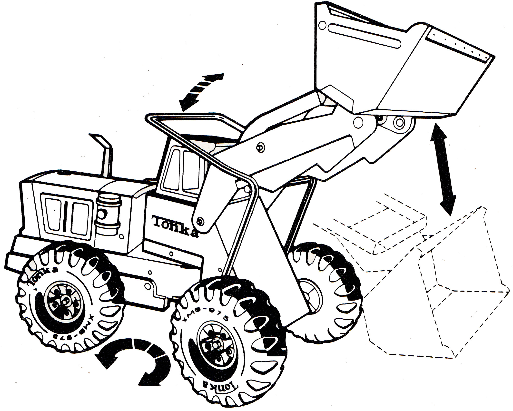

Susan's photo subtitle read "Loader Vehicles Reach Final Stages." This working rig was to be the pairing to its famous dump truck.

Once off the line and into children's hands, these toys would last generations. But it took time to get it right.

## Surplus Origins

Back in 1947, Tonka Toys was known as Mound Metalcraft. Its corporate emblem, drawn by Erling Eklof, depicted [three seagulls](https://www.facebook.com/1654696484768464/photos/a.1654699258101520/2954857318085701) in tribute to its founders.

The business triangulated World War surplus wood from ammo containers and steel. It started with a car salesman, a businessman with cash, and then a [tool-and-die](https://en.wikipedia.org/wiki/Tool_and_die_maker) expert.

A car sale paired the first two, who invited the third to brainstorm lunches that forged the company. A vision of stamped-in steel toy art was born.

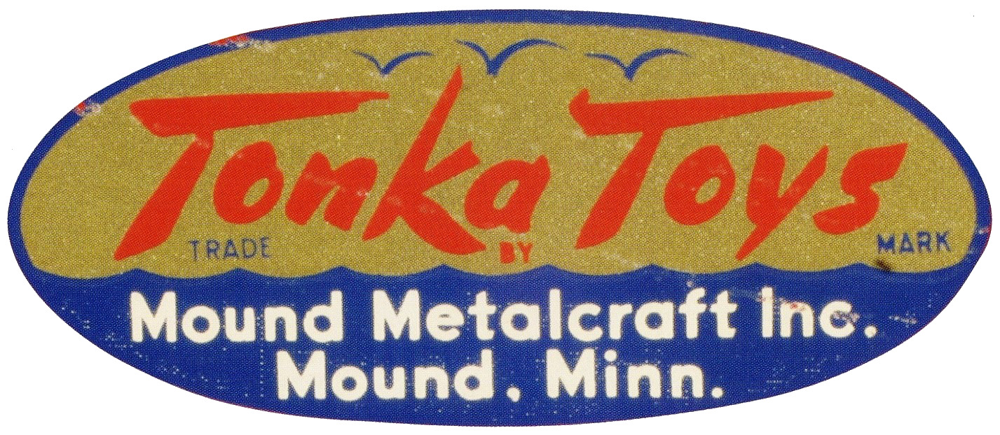

The company was named after its town in Minnesota. It was a mound of developed dirt in [Lake Minnetonka](https://en.wikipedia.org/wiki/Lake_Minnetonka), sectioned by four main roads.

After acquiring a fledging toy company, [Streater](http://www.tonkaclub.nl/TonkaClub/true_stories.htm), located in a schoolhouse, they grew the business within it.

By 1955, they renamed Metalcraft to Tonka, meaning "big" or "great," a nod to its origins and to the lake its toy factory oversaw on Shoreline Road.

Their professional factory was built the same year, with space to come. Not far away, they set up a warehouse distribution center in Spring Lake.

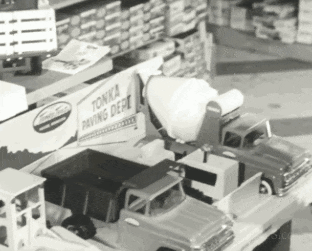

## Incorporated Durable Trucks

It took the founders a while to establish the business. They first produced tie racks, [bathroom fixtures](https://www.youtube.com/watch?v=xEwIpOpzapg), and garden tools. Then, they blast-furnaced iconic American trucks.

Tonka trucks were known to be durable, coining the phrase "Tonka Tough." However, if left outside for too long, they would rust. And no one reported a case of tetanus.

 on July 6th, 1961.](images/82-04.jpeg)

Back then, children would break bones falling off the limbs of trees. They would take heavy scraps from their pretend walnut long rifles as they smashed their Tonka trucks together.

It was a different time. Not so different were all the toy companies going public of the era. Tonka posted stock on July 6th, 1961, at 12 dollars a share.

In 1965, it was renamed Tonka Corp. Their progressive tooling and dies, which bend the steel to form, became extensive. Some were ten feet long, later priced at hundreds of thousands of dollars.

"Detroit [is] far behind Tonka toy trucks." Their firm produced four times as many trucks in America then, becoming the "Truck Capital of the World."

 documentary of Lynn Baker.](images/82-05.jpeg)

Tonka dabbled in barbecues cast in sheet metal acquired from Mell Corporation to keep the plant running during the off-season months and to keep stock investors motivated.

Eventually, it went exclusively to toys, serving its [Baby Boomers](https://en.wikipedia.org/wiki/Baby_boomers).

At first, all their working trucks were "regular" size, one to eighteen scale. Then, the minted public corporation went into overdrive because it had to.

Alongside its "regulars," it introduced "minis" and later "tinys." Somewhere in between, they produced "totes" to compete against [Hot Wheels](https://en.wikipedia.org/wiki/Hot_Wheels), which was a failure.

Unlike the "totes," most associate Tonka with their "mighties," their jumbo trucks. It would become their legacy.

Just a handful of "mighty" vehicles are produced today. Some of the smallest [boutique toy shops](https://www.fstoys.com/) still stock dump trucks, not giving in to the sands of new-aged toy time.

## A Smoking Mighty Dump Truck

"We have adults who think like children," smirked Mr. Ted Zbikowski. "The idea is that the child should be able to use the toy to really move things and accomplish something," said to reporter Susan Abbasi.

[Ron Pauly](https://patents.google.com/?inventor=Ronald+R+Pauly&country=US) was one of those thinking kids, hired in late 1964 and reported to Ted. He later crafted the prototype metal to pair with the dump truck.

.](images/82-07.jpeg)

Some years earlier, Charlie Groshen, Ted's manager, chimed in as their "Mighty" line appeared as a product idea. His boss, Russell L. Wenkstern, was persuaded by its mighty concept after securing the president's seat a year prior.

In America, it was the right time. [Euclid](https://en.wikipedia.org/wiki/Euclid_Trucks) was first known to have invented the primary-purpose "off-highway" dump truck in 1947. In the 1950s, their equipment was used in dam building, mine excavation, and routing the [Eisenhower Interstate System](https://en.wikipedia.org/wiki/Interstate_Highway_System).

By the end of the decade, modern extreme-capacity "off-highway" trucks had begun to emerge thanks to corporations like LeTourneau-Westinghouse (known as WABCO), whose team invented the Haulpak in 1959.

. When people picture mining "off-highway" trucks, they think of their short wheelbase design. They [invented an exhaust diverter](https://patents.google.com/patent/US3039493A/en) that heats loads, so smokestacks are rarely seen on these diesel vehicles.](images/82-08.jpeg)

In 1961, mines in Pennsylvania and Utah reported their 65-ton success. Shortly thereafter, all mining trucks adopted its short wheelbase and hidden exhaust system. Tonnage hauling increased to triple digits.

"Our goal is not to become the biggest toy company in the country, but to become one of the most stable," said Russ to *Star Tribune* in 1962.

 may have been inspired by the [Kenworth-Dart](https://en.wikipedia.org/wiki/Dart_(commercial_vehicle)). However, the vertical lights came from the 1963 [Caterpillar 769](https://www.earthmoversmagazine.co.uk/news/view,iconic-cat-truck-becomes-a-showpiece_1969.htm), the cab was Haulpak, and the [three distinct holes](https://twitter.com/CraneCarrier/status/1167127248748654593) in the bumper were [CCC](https://www.newspapers.com/image/887925476/?match=1&terms=%22Crane+Carrier+Company%22). The Might Dump is an amalgam of many "off-highway" trucks. Designer Lee Pfeilsticker took creative liberties.](images/82-09.jpeg)

To build a stable steel truck business, toy executives would go on-site to see working construction sites to make ideas a reality. The Mighty Dump was no different, a vision of Charlie overlooking trucks in South American pit mines.

It's unknown if Charlie looked at a picture in a brochure, went to a mine pit, or if the story is at all true. One Internet post suggests [the lore](http://www.tonkaclub.nl/TonkaClub/index2.htm), coming from a printed source of a book named "[Tonka](https://www.abebooks.com/9780760318683/Tonka-David-Dennis-0760318689/plp)," direct from Charlie's interview.

Then Gordon E. Batdorf, president, and a few others on their design committee agreed to build the mighty.

Legend says L. E. Baker, the car salesman and last remaining of those three partners, was motivated by a large dump truck before his passing in early 1964.

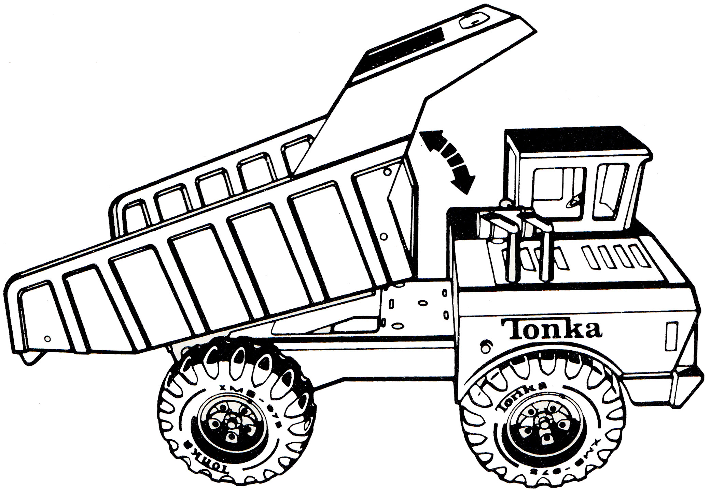

His two other partners left the company a decade prior. They left because Mr. Baker fought hard to keep Tonka where it was. No one was going to Tennessee.

## Built Millions of Times

Mr. Groshen told reporter Randall Hobart in 1963, "Tooling up for these minies [and in the year following, the mighties] has been like launching an entirely new business."

"We had to start from scratch - ." Russ and Charlie forged a division of larger jumbo trucks months later. Subsequently, it was executed by Ted and one of the three steel model makers, [Lee Pfeilsticker](https://patents.google.com/?inventor=Lee+Pfeilsticker&assignee=Tonka&country=US&num=100&sort=old).

With Lee taking creative liberties of mending the metal, the time began to do something "mighty," fast-following their "minis."

In between, Mr. Wenkstern built the business on the dollar line and smashed international borders. This dump truck was shipped to countries with "West" in their names, then smuggled into "East" ones.

.](images/82-11.gif)

While a tiny group of inventors crafted the world for millions of children, the work of two thousand men and women made them tough in a factory a third of a mile long.

The [Mighty Dump Truck](https://www.basicfun.com/product/tonka-steel-classics-dump-truck/) shipped just as Mr. Pauly was onboarding. He then set the pace for its front loader, complimenting the dump truck, a design he's proud of.

No truck nor picture spoken of Charlie has ever been found that matches the Mighty Dump's legacy. The search continues*, and this author suspects it was playful evasion.

Whatever it was modeled after would demand retro-collection of licensing royalties.

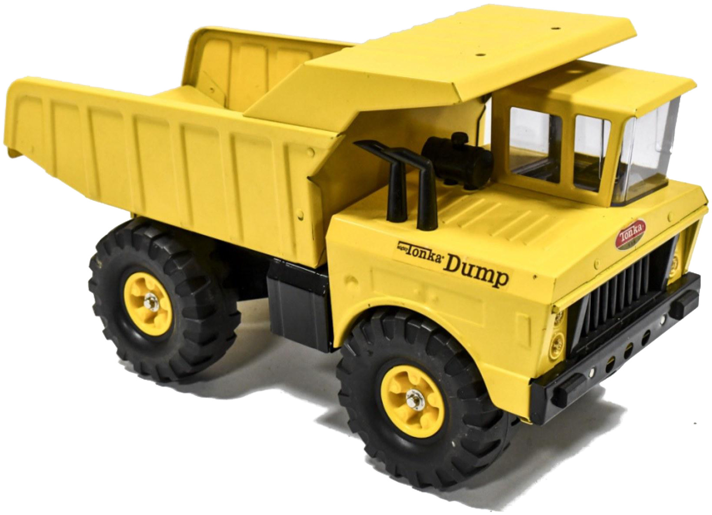

Mystery aside, the Tonka Mighty Dump became an American icon stamped into tons of steel, humming in the 1960s. And it's underestimated how many people the truck impacted - millions?

With respect spoken in Minnesota yooperism, "You betcha."

---

Ron Pauly was [talking](https://www.youtube.com/watch?v=A5xXI9MSp3Q) to Pamela Myers of the [Westonka Historical Society](https://whs.rf.gd/index.html?i=1) in 2021.

"I got stuck designing and redesigning and making barbecue grill cabinets." He lamented being baited into building toy trucks.

Back then, Mr. Charlie Groshen, head of research and development at Tonka, was reeling over the new dump truck and was instrumental in hiring Ron.

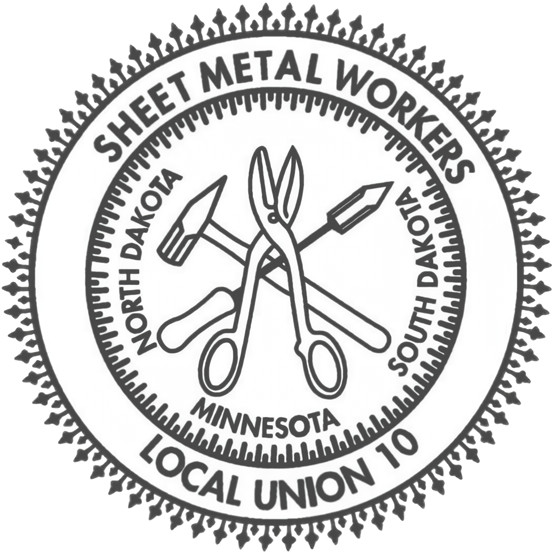

Ron became a sheet metal worker. When the job was done, he used the sheet metal shop to build truck models using the same tools.

In 1964, he was inspired by the large rig while working a job for Sheet Metal Workers Local 34. Through an exchange, Ron's father went to Tonka to collect ten Tonka wheels for the [Lorain crane](https://www.terex.com/tower-cranes/en/about/legacy-brands/lorain) Ron was modeling.

Charlie, also a union member, became impressed with Ron's craftwork. Ron was then onboarded as a model maker apprentice at Tonka, reporting on Saturdays.

Charlie was unlike other executives; he was technical and awarded Tonka's [first-ever U.S. patent](https://patents.google.com/patent/US2916851A/en).

After a few months, Ron was hired full-time, but Mr. Pauly was miffed that his first projects at Tonka were all barbecues, not trucks.

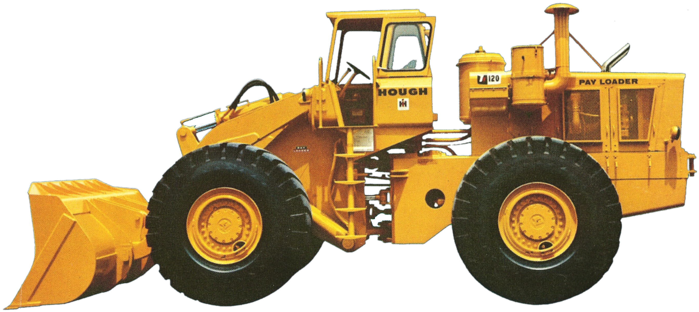

Mr. Lee Pfeilsticker, their first seasoned model craftsman who stamped the dump truck, replied to Ron, "[On being stuck with barbecues], Well, that's the only reason Charlie hired you," as he smirked while tinkering on toy parts on his workbench.

Ron would get to design the White Tonka Jeep, but it would take time for him to get the truck design of a lifetime.

"Charlie said we should have a loader [to compliment the mighty dump truck]," said Mr. Pauly.

## Based on the Hough Front Loader

In 1939, [Frank G. Hough](https://www.aem.org/about/hall-of-fame/frank-g-hough) (pronounced "huff") built the first [payloader](https://en.wikipedia.org/wiki/Loader_(equipment)), patenting [a design in 1944](https://patents.google.com/patent/US2412323A/en).

Incorporating Frank G. Hough Co, they introduced the articulating turning radius. Hough moved the operator from the back to the front; however, the rear wheels steered. That would change in 1961.

[The [Articulated Motor Vehicle](https://patents.google.com/patent/US3101806A/en) was filed in 1961.](images/82-15.jpeg)

Others copied and improved the machine designs. But miniaturizing these real-life machines for two small hands was cumbersome. Payloders were expensive to manufacture all the fiddly bits.

Mr. Pauly investigated how to produce a loader with these realities. Each toy demanded low cost, simplicity of the mechanisms, and, importantly, allowing a child to play well.

Looking over specifications from [Catapiller](https://www.caterpillar.com/) Traxcavators, [International Harvester](https://en.wikipedia.org/wiki/International_Harvester), and other press kits, [Hough's materials](https://www.tractorparts.com/PDFs/HOUGH_H120C_%20WHEEL_LOADER_SALES%20LIT.pdf) jumped out.

"But one of them, Hough - they had a tie-in, I believe, with International Harvester. [They] came out with a new front loader," said Ron.

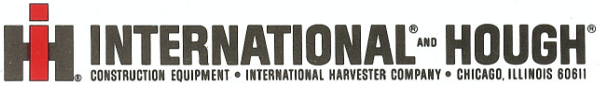

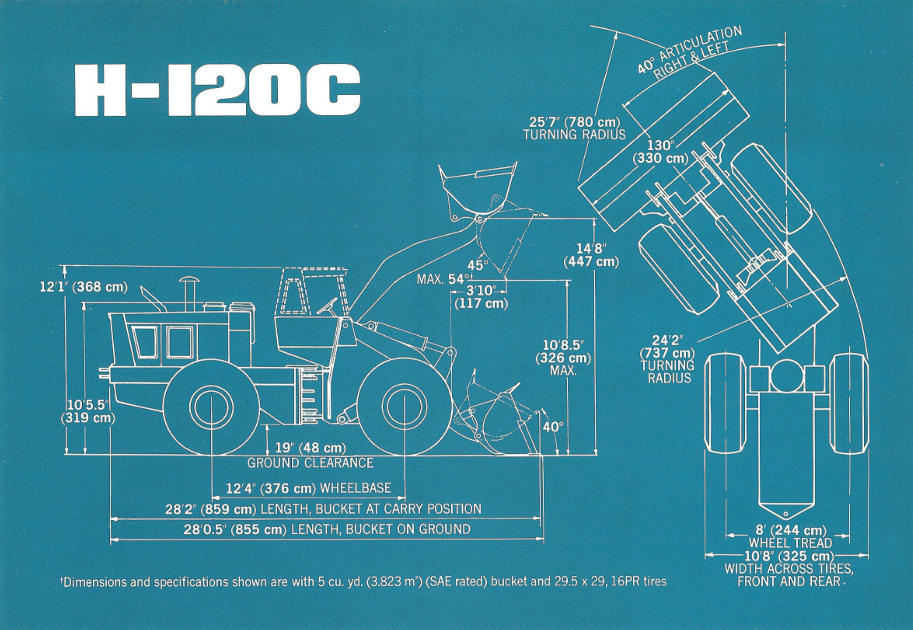

While most of the payloader steering units were in the rear, the new model from the mid-1960s had a cab. With the housing affixed in the front, the unit rotated on the frame's lynchpin, with the motor independent in the rear.

"The operator sits with the loader arms. So right away, we knew that's the toy." Allowing both push and steer with one hand on the cab, it left open the second to dig by a metal handle.

The team of six got busy crafting a wood model. Sales and marketing were brought it.

"As soon as sales and marketing were happy with the concept, it was my job to take that wood model and turn it into metal," said Ron.

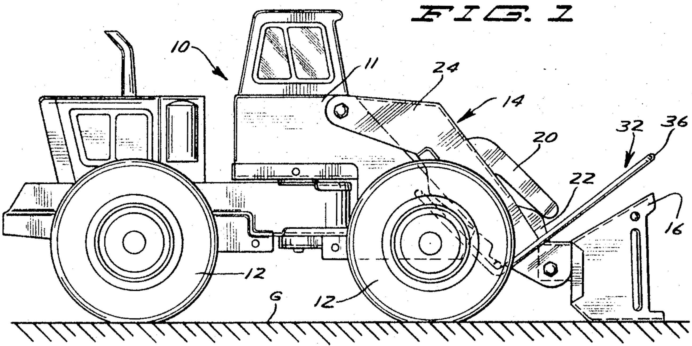

As Mr. Pauly designed the loader, he tested it in his flower bed. "I was a big kid, I guess, playing with toys."

He had children, later inspired by his little while working on Tonka's [toddler plastic pull toys](https://www.ebay.com/b/Tonka-Vintage-Antique-Pull-Toys/728/bn_73883731) in the early 1970s.

## The Boiler Plate Kid

The then-senior craftsmen knew Mr. Pauly as the "boilerplate kid." He was heavy on the steel application, but everything worked out.

As a keen sensing inventor, he would visit the factory floor and debug shoulder to shoulder with the lead factory women as it was produced.

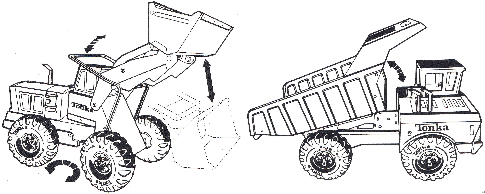

Tonka was one of the first post-war shops to promote women into supervisory roles. No longer striking paper, they were embossing a cultural revolution.

The final version of the [Mighty Loader](https://www.worthpoint.com/worthopedia/vintage-mighty-tonka-front-loader-1798006111) was dipped, spray painted, electrified, and baked at 350F. The plastic parts, decals, and wheels were assembled. Then, it was boxed and shipped to satisfy sales orders.

Finally, it fell into children's hands at the toy store a million times over.

Mr. Pauly later stamped the [Mighty Mixer](https://www.basicfun.com/product/tonka-steel-classics-mighty-cement-mixer/), [Wrecker](https://www.pinterest.com/pin/371054456783618363/), and the famous [T9 Dozer](https://www.basicfun.com/product/tonka-steel-classics-bulldozer/) for the team. And yes, the T-9 was based on the Caterpillar D9, produced in variations today.

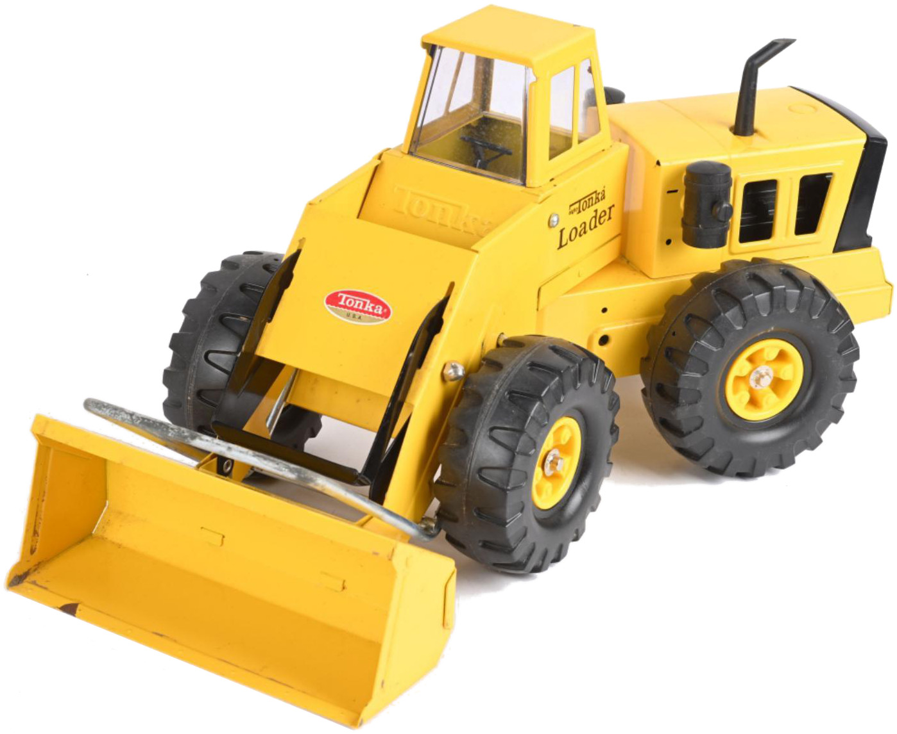

"Tonka aims to make [a] realistic model." The [Mighter Loader](https://www.basicfun.com/product/tonka-steel-classics-front-loader/) is a quiet legacy cast in realism, surpassing a half-century. It hasn't changed... well, with more plastic and less metal.

---

By 1982, the winds of fortune at Tonka had shifted. The instability of the 1970s had taken its toll, and the long procession of saying goodbye to its factory plant had started.

Most, if not all, of the manufacturing was going south.

Russ Wenkstern, an architect visionary to the Mighty line, left his president position a few years prior, and Ron, Charlie, Ted, and others would retire from Tonka.

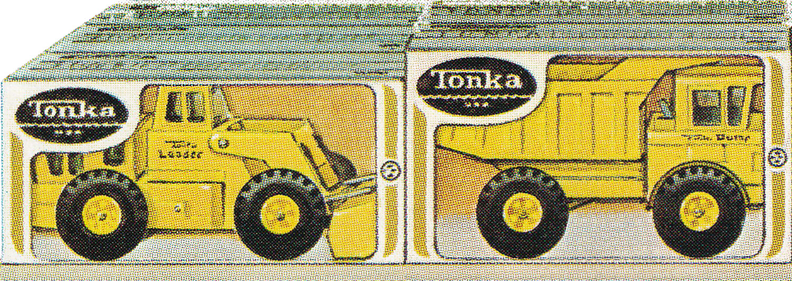

"The company is leaving town, citing taxes, labor costs, distribution costs, and neck-to-neck competition with international toy companies," wrote Diana Gonzalez of the *Star Tribune*.

At this time in Tonka's history, toy trucks were huge, but children wanted more. So, they diversified into cartoons, action figures, plush toys, and other era trends.

Eager [ex-Mattel](https://en.wikipedia.org/wiki/Mattel) executives were hired, and acquisitions took place.

They broke promises left by Mr. Wenkstern. "The scale-model vehicles never will be motorized - they believe a good toy requires children to participate -," printed in *Minneapolis Star* in 1962. "[Children should] not push buttons and watch."

But by the 1980s, they did just that with a growing team of new executives.

## Couldn't Cut Its Ribbon

Tonka underwent significant changes in the 1980s, which included diversification and infusing technology. Importantly, the people who made it on the domestic factory floor were abandoned.

"We had hired a guy from Mattel as vice president of sales and marketing, *he's gonna save the day* -. [The VP said] You've been building your toys too tough. You should be designing toys to last maybe two years."

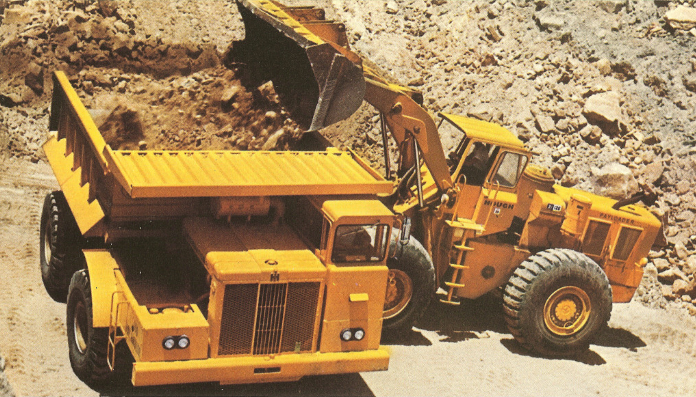

"Do you realize all the repeat sales you've lost because you build the toys [inaudible - tough]?" Mr. Pauly said, reflecting on Tonka's corporate changes [to a senior audience](https://www.youtube.com/watch?v=HdexrpbUrmw).

The local crowd roared before he could finish.

Apart from relocating their labor, they licensed [GoBots](https://en.wikipedia.org/wiki/GoBots) from [Bandai](https://www.bandai.com/) and bought and experimented with stuffed [Pound Puppies](https://en.wikipedia.org/wiki/Pound_Puppies). They chased the Ghostbuster's phantoms from acquiring [Kenner-Parker](https://en.wikipedia.org/wiki/Kenner_Products) and distributed Sega Master video game systems.

They even created a Barbie-like doll called [Aurora](https://www.ghostofthedoll.co.uk/aurora.php), and crafted plush World Wrestling Federation dolls. Tonka fought hard against toy companies like Hasbro with their limited cash reserves. And make mistakes like Rock Lords.

, then, Tonka's CEO, [Mr. Shank](https://tcbmag.com/honors/steve-shank/), holds GoBots to take on [Mr. Hassenfeld's](https://en.wikipedia.org/wiki/Stephen_D._Hassenfeld) Transformers of Hasbro in the Toy Ways of 1984.](images/82-24.jpeg)

If one takes a minute to understand Tonka in the mid to late 1980s, it could be described as an unfirm ground of steel-hardened toy executives building with intellectual property.

It's not to say Tonka had smash hits, which they certainly did. Documentaries of this crazy time are [produced](https://play.history.com/shows/the-toys-that-built-america/season-3/episode-1). "Kids" approaching their 50s have nostalgic tendencies toward what Tonka crafted.

But without rebarring installed, Tonka was a real toy construction site that couldn't cut its ribbon into the future. It cracked.

## Hasbro Wins The Toy War

Then, it all unrolled at the beginning of the 1990s, when a heavy debt secured its fate. Hasbro moved in to acquire Tonka for 500 million dollars.

And for the factory of the north that once built America's best-selling steel trucks, it closed.

"I got my gold watch on Sept 26th of last year. Tonka helped my son put himself through college," said Laura Sohns, who worked for the company for a quarter century.

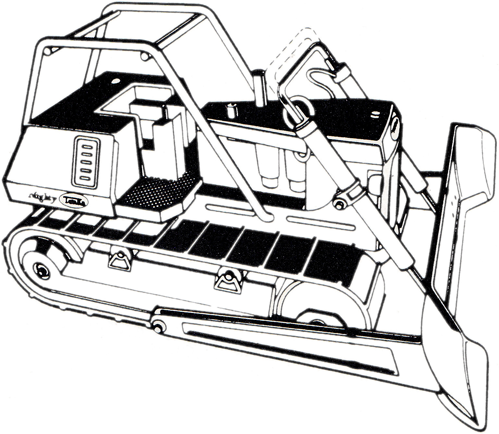

Its headquarters in Spring Lake would remain until Hasbro shuttered it, relocating the remaining executives to Rhode Island.

This was the natural course of business.

Dick Youngblood of the *Star Tribune* summed it up aptly in 1991. "The acquisition means that Tonka's most famous product, the truck that can last a generation, has provided more durable than its maker."

---

Today, Tonka is a subsidiary of Hasbro. Following trends, Hasbro stepped into modern-day toy-making mode, licensing the iconic toy name to a third party called [Funrise](https://en.wikipedia.org/wiki/Funrise_Toys) in 1998.

Like all iconic toys, Tonka was inducted into the [Toy Hall of Fame in 2001](https://www.museumofplay.org/toys/tonka-trucks/), and [so too, Russ](https://www.toyassociation.org/ta/events/hof/toys/events/toy-industry-hall-of-fame-home.aspx?New_ContentCollectionOrganizerCommon=3), credited with expanding Tonka.

Since then, Hasbro has kept the brand fresh with product tie-ins, but there has been little cultural impact of note. They ride high in the operator seat by name.

Being the legacy it is, local news outlets air spot-documentaries about Tonka collectors without fail. These are constant reminders of its company history.

 is the current spokesperson for the brand, which [recently celebrated 75 years](https://www.youtube.com/watch?v=111kw6_rk9Y).](images/82-26.gif)

Recently, the Tonka license was transferred to [BasicFun](https://www.basicfun.com/tonka/) in 2020. They produce the classic steel Tonka trucks [offered](https://www.amazon.com/stores/page/4211C583-8D36-4D88-94A8-283493C18BE4) on Amazon today.

While many US heavy machinery companies are now owned by Japanese corporations, parents can buy similar products at quarter prices in Chinese marketplaces like Temu.

And yes, all manufacturing is now in China. It's all fine because Tonka is an incredible story about toy Americana. The mere mention of its brand is priceless, once stamped in Minnesotan steel reserve.

## Rusting Well

While Tonka lives on as a brand name to millions of American children, adults, grandchildren, and great-grandchildren, one thing is constant: the yellow paint chips and the rust accumulates on the thin-gauged sheet metal.

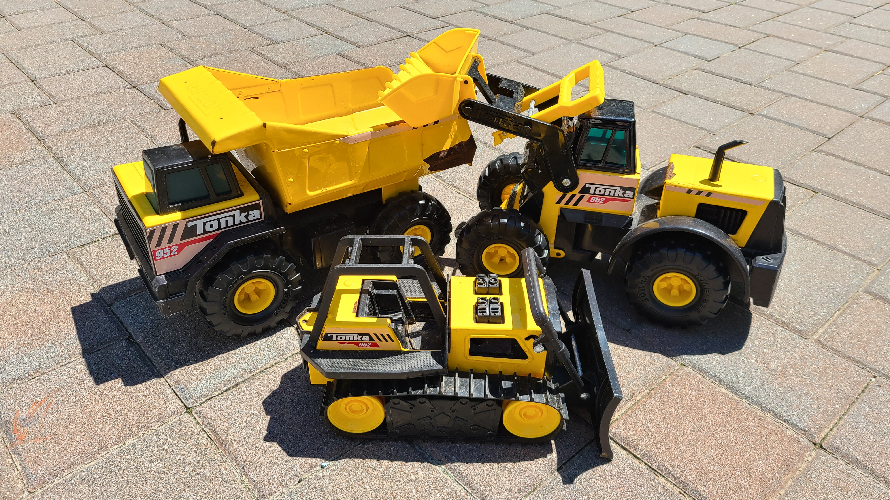

This author can confirm the rust. Concerning the toys he bought for his children, which were left outside, a proud patina is guaranteed to form.

These trucks also retain their value. When this author sold his 1980s Mighty Dump and Loader from the basement of his parent's home, someone paid overprice. It, too, had rust.

But this author regrets the sale.

For the few around, like Ronald Pauly, they have produced a wealth of public information on Tonka. They have gifted time to their community, its [Westonka Historical Society](https://www.youtube.com/@WestonkaHistoricalSociety), and the people who want to know.

## A Vice Present Who Cared

"Of all the businesses that I led, none had positive morale like that of Tonka," said Dale R. Olseth, CEO of Tonka from 1971 to 1976, in a book named "Tonka."

Each employee of note believed in the company, including Lloyd Laumann.

 and [Lloyd Laumann](https://www.youtube.com/watch?v=OkMMm9zylI4), this out-of-print book tells the Tonka story.](images/82-28.jpeg)

Lloyd Laumann worked for Tonka for years, rising to Vice President, and is a special character in its story. In his retirement, he co-wrote that very [book about the good times](https://www.abebooks.com/9780760318683/Tonka-David-Dennis-0760318689/plp).

"It was a fun place to work because people knew what they were doing - bringing joy to a lot of children around the world," said Mr. Laumann in 2006 to *Star Tribune*.

Mr. Laumann donated his entire collection of Tonka toys and one-of-a-kind artifacts before passing in 2015.

This story was inspired by the picture from his book. On the cover are the mighty dump truck and front loader. Both trucks came in toy form at a punctual time in American history.

Of course, they produced countless trucks, and their stories live on. But just one book cover immortalizes Tonka's pair, which the front loader story was missing within.

So, with this short story made possible by the Internet, they are now a paired legacy cast in American steel.

---

 [Allis-Chalmers](https://en.wikipedia.org/wiki/Allis-Chalmers).](images/82-30.jpeg)
